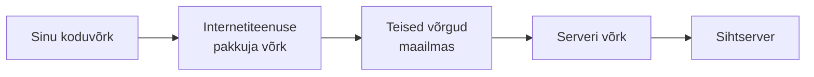
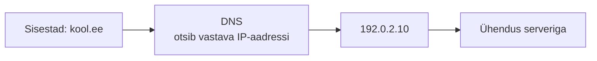
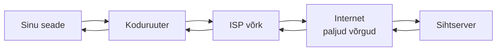

# Kuidas kohalik võrk internetiga ühendub

::: info Õpiväljund
Pärast õppetundi oskad kirjeldada, kuidas sinu koduvõrk on osa suuremast internetist, ning selgitada lihtsustatult, mis rolli mängivad selles TCP/IP ja DNS.
:::

Eelmistes tundides nägime, kuidas seadmed ühes koduvõrgus omavahel suhtlevad ([tund 2](./vorguseadmed-ja-koduvork)) ja kuidas pakett liigub hüppeliselt ühelt ruuterilt teisele ([tund 3](./ip-aadressid-ja-marsruutimine)). Nüüd paneme suurema pildi kokku: kuidas jõuab sinu kodust andmepakett hoopis teisel pool maailma asuva serverini?

## Internet on võrkude võrk

Sinu koduvõrk (tund 2) on vaid üks väike võrk paljude seas. Selleks, et see saaks suhelda mujal asuvate võrkudega, ühendab **internetiteenuse pakkuja** (nt Telia, Elisa) sinu koduvõrgu enda suuremasse võrku. See võrk on omakorda ühendatud teiste, veel suuremate võrkudega — ja nii edasi, kuni tekib üleilmne **võrkude võrk**, mida me kutsume internetiks.

Iga selline üleminek ühelt võrgult teisele käib täpselt samamoodi nagu tund 3 hüpped ruuterite vahel — lihtsalt suuremas mastaabis.

## TCP/IP: ühised reeglid, mis kõike koos hoiavad

Erinevad võrgud üle maailma kuuluvad erinevatele firmadele ja riikidele. Miks nad üldse omavahel suhelda oskavad? Sest kõik nõustuvad kasutama samu ühiseid mängureegleid — protokolle. Kõige põhilisemat protokollide paari kutsutakse **TCP/IP-ks**:

- **IP** (*Internet Protocol*) annab igale seadmele aadressi (tund 3) ja määrab, kuidas pakett leiab tee sihtkohta.
- **TCP** (*Transmission Control Protocol*) tagab, et kõik saadetud paketid ka tegelikult kohale jõuavad, õiges järjekorras — nagu tund 1-s mainitud tähitud kirja analoogia.

Rohkem detaile (nt kuidas TCP-ühendus täpselt luuakse) ei ole selle kursuse fookuses — kui see huvitab, on selleks oma koht [Veebiarenduse](/veebiarendus/sissejuhatus) teemas.

## DNS: nimed IP-aadressideks

Inimesel on lihtsam meeles pidada nime nagu `kool.ee` kui aadressi `192.0.2.10`. **DNS** (*Domain Name System*) töötab nagu telefoniraamat — see muudab domeeninime vastavaks IP-aadressiks.

::: tip Süvitsi
Tegelikult käib DNS-vastuse leidmine mitme serveri kaudu (juurserver → tippdomeeni server → autoriteetne server). See täismahus jada on läbi käidud [Veebiarenduse teema DNS-tunnis](/veebiarendus/url-domeen-ja-dns).
:::

## Kogu pilt kokku

1. Sinu seade tahab jõuda `kool.ee` juurde.
2. **DNS** muudab nime IP-aadressiks.
3. Pakett liigub koduruuterist läbi ISP võrgu ja teiste võrkude, hüpe hüppe haaval (**IP**), sihtserverini.
4. **TCP** tagab, et kõik paketid jõuavad terviklikult ja õiges järjekorras kohale.

## Kust edasi?

- Kui tahad ehitada veebirakendusi ja minna HTTP-protokolli (päringud, vastused, API-d) süvitsi — vaata [Veebiarendus](/veebiarendus/sissejuhatus).
- Kui tahad teada, kuidas seda kõike ka kaitsta — jätka [Küberturvalisuse](/kuberturvalisus/sissejuhatus) osaga.

## Allikad

- [Cloudflare Learning — What is the Internet?](https://www.cloudflare.com/learning/network-layer/what-is-the-internet/)
- [Cloudflare Learning — What is DNS?](https://www.cloudflare.com/learning/dns/what-is-dns/)
