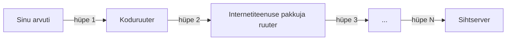

# IP-aadressid, paketid ja marsruutimine

::: info Õpiväljund
Pärast õppetundi oskad selgitada, mis on IP-aadress, ning algtasemel tõlgendada `ping` või `traceroute` väljundit.
:::

## IP-aadress

Iga seade võrgus vajab oma aadressi — nagu majal on postiaadress. Seda aadressi nimetatakse **IP-aadressiks** (*Internet Protocol address*).

Kõige levinum vorm (IPv4) koosneb neljast numbrist, mis on eraldatud punktidega:

```text
192.168.1.10
```

Kaks tuntud ja reaalselt eksisteerivat näidet, mida saab ise järgi proovida:

| IP-aadress | Kuulub | Mida teeb |
| --- | --- | --- |
| `1.1.1.1` | Cloudflare | Avalik DNS-lahendaja |
| `8.8.8.8` | Google | Avalik DNS-lahendaja |

## Kuidas pakett leiab tee?

Pakett ei tea ette kogu teekonda — iga **ruuter**, mille kätte pakett jõuab, vaatab sihtaadressi ja otsustab, millisele **järgmisele** ruuterile see edasi saata. Iga selline "hüpe" ühelt ruuterilt teisele on üks **hüpe** (*hop*).



## Diagnostikavõtted

Kahte lihtsat käsurea tööriista kasutatakse selleks, et uurida, kas ja kuidas server on kättesaadav. Neid tuleb kasutada ainult enda või õpetaja poolt lubatud sihtmärkide peal.

- **`ping`** — saadab sihtkohale väikese päringu ja mõõdab, kas ja kui kiiresti see vastab. Hea esimene test: "kas server üldse elus on?"
- **`traceroute`** (Windowsis `tracert`) — näitab kõiki hüppeid (ruutereid) teekonnal sinu seadmest sihtkohani, koos igal hüppel kuluva ajaga.

::: tip Õpetaja demo
Õpetaja näitab klassi ees `traceroute` väljundit päris veebilehe kohta (nt `traceroute wikipedia.org`) — see teeb hüpete kontseptsiooni nähtavaks ja konkreetseks.
:::

## Kokkuvõte

| Mõiste | Tähendus |
| --- | --- |
| IP-aadress | Seadme unikaalne "aadress" võrgus |
| Hüpe (*hop*) | Üks samm paketi teekonnal, ühelt ruuterilt teisele |
| `ping` | Kontrollib, kas sihtkoht vastab |
| `traceroute` | Näitab kõiki hüppeid teekonnal sihtkohani |

## Allikad

- [Code.org CS Principles — Unit 2: The Internet](https://code.org/en-US/curriculum/computer-science-principles) (Lesson 2: "Building a Network")
- [Cloudflare Learning — Network Layer](https://www.cloudflare.com/learning/network-layer/what-is-the-network-layer/)
