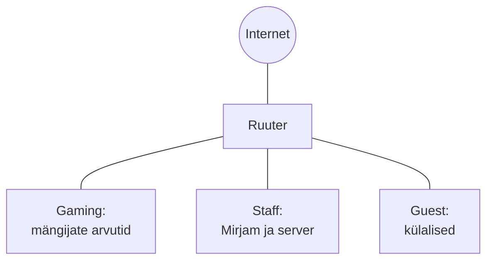

# 1. Mis mängukeskust me ehitame?

::: info Õpiväljund
Pärast kohtumist oskad kirjeldada võrgu vajadusi kasutajate tegevuste kaudu, joonistada esimese skeemi ning nimetada kolm nõuet, sh ühe külaliste ligipääsu piirangu.
:::

## Karli mängurite tuba

Reedeõhtul istuvad **Karl**, **Henri** ja **Kadri** Karli toas. Neil on kolm arvutit ja kõik on ühendatud sama ruuteriga. Nad mängivad sama mängu ja see töötab hästi.

Siis ütleb Karl: "Mul on võimalus rentida väike ruum. Teeme sellest päris mängukeskuse."

Karl kirjutab paberile, kes keskuses tegelikult olema hakkab:

- **Mängijad** (nagu Henri ja Kadri) mängivad koos ja avavad veebilehti.
- **Mirjam** töötab keskuses. Tal on oma arvuti ning ta haldab **serverit**, kus on broneeringute leht. Mängijad vaatavad sealt, milline arvuti on vaba.
- **Külalised** (nagu Oskar) tulevad oma sülearvutiga ja tahavad ainult internetti.

Karl vaatab oma paberit ja küsib: "Kas ma võin lihtsalt kõik arvutid ühte võrku panna, nagu kodus?"

Sellele küsimusele vastame selle kohtumise lõpuks. Kõigepealt mõistame, mida täpselt on vaja.

## Mis on võrk ja miks seda vaja on?

**Arvutivõrk** on kaks või enam seadet, mis on omavahel ühendatud nii, et nad saavad andmeid vahetada. Henri ja Kadri arvutid olid Karli toas juba võrgus: nad nägid üksteist ja said koos mängida.

Võrgus on kaks rolli:

- **klient** on seade, mis midagi küsib. Henri arvuti küsib broneeringute lehte;
- **server** on seade, mis vastab. Mirjami server annab lehe tagasi.

Sama seade võib olla ühes olukorras klient ja teises server. Meie kursusel on server üks eraldi arvuti, mis jääb Mirjami võrku.

**Teenus** on asi, mida server pakub. Karli keskuses on kaks teenust:

| Teenus | Mida see teeb | Näide keskuses |
| --- | --- | --- |
| **Veebileht** | Näitab lehe brauseris | Broneeringute leht |
| **Nimeteenus** | Muudab nime aadressiks, nii et pole vaja numbreid meelde jätta | Kirjutad `gaming.test`, mitte pikka numbrikombinatsiooni |

Nimeteenuse täpsemad selgitused tulevad hiljem. Praegu piisab sellest, et neid kaht teenust on vaja.

## Kes mida vajab?

Karl koostab tabeli. See on **nõuete kaardistamine**: enne kui midagi ehitame, selgitame, mida inimesed vajavad.

| Kasutaja | Mida ta teeb | Mida ta vajab | Mida ta **ei tohiks** nägema |
| --- | --- | --- | --- |
| Mängija | Mängib, vaatab broneeringuid, avab veebilehti | Internet, mängusuhtlus teiste mängijatega, ligipääs broneeringute lehele | Mirjami töödokumendid |
| Töötaja (Mirjam) | Haldab serverit, näeb broneeringuid | Ligipääs serverile, mängijate arvutitele ja internetile | Pole piiranguid, sest ta peab keskust haldama |
| Külaline (Oskar) | Avab veebilehti | Ainult internet | Mängijate arvutid, Mirjami arvuti, server |

Tähelepanu: tabeli viimane veerg ongi esimene turvaküsimus. Külaline ei vaja ligipääsu keskuse seadmetele. Miks me siis tahaksime seda talle anda?

## Mida tuleb kaitsta?

**Kaitstav vara** on kõik, mille kaotamine või rikkumine teeks kellelegi kahju. Karli keskuses on seda mitmesugust:

- **Broneeringute leht ja andmed**: kui keegi muudab seda, ei tea mängijad, kus nad istuvad.
- **Mirjami arvuti**: seal on töö ja tema isiklikud failid.
- **Võrguseadmed**: kui keegi muudab ruuteri sätteid, ei tööta kogu keskus.
- **Mängijate kontod ja arvutid**.

Oskari sülearvuti võib olla ka nakatunud, ilma et Oskar sellest teaks. Kui kõik on ühes võrgus, jõuab pahavara kergemini teistesse seadmetesse.

::: tip Mõte, mida kursuse jooksul uuesti kasutame
Võrgu ülesehitus ei ole ainult kaablite ühendamine. See on ka otsus selle kohta, **kes kellega rääkida tohib**.
:::

## Kas panna kõik ühte võrku?

Nüüd vastame Karli küsimusele. Mõtleme kahele võimalusele:

| Variant | Kirjeldus | Plussid | Miinused |
| --- | --- | --- | --- |
| **Üks võrk** | Mängijad, Mirjam, server ja külalised kõik koos | Lihtne: midagi ei pea eraldama | Oskari sülearvuti saab proovida Mirjami arvutisse ja serverisse jõuda. Kui külalise sülearvutis on pahavara, levib see teistele. |
| **Kolm võrku** | Gaming (mängijad), Staff (Mirjam ja server), Guest (külalised) | Külalise ligipääsu saab piirata. Probleem ühes võrgus ei pruugi teisi mõjutada. | Vaja on rohkem seadmeid ja seadistamist. |

Analoogia: hotellis on külalistele üks osa hoonest (fuajee, restoran, toad) ja töötajatele teine osa (köök, kontor). Mõlemad asuvad samas hoones, aga külalise kaardiga köögi uks ei avane. **Võrkude eraldamine** teeb samamoodi: seadmed on samas keskuses, aga ligipääs on piiratud.

Analoogial on ka piir. Hotellis lukustab ukse tegelik lukk. Võrgus teeb sama tarkvaraline reegel, mille me ise peame seadistama ja kontrollima. Seepärast ei piisa kolme võrgu joonistamisest, vaja on ka ligipääsu reeglit ja selle tõendamist. Seda teeme kohtumistel 9 ja 10.

## Esimene skeem

Skeem on **joonis**, mis näitab, millised seadmed on olemas ja kuidas need on ühendatud. See ei ole veel seadistus.

Karli esimene visand:

See on **üks võimalik** visand, mitte ainus õige. Sinu skeem võib olla teistsugune, kui oskad selle põhjendada.

## Praktiline töö

Töötage paarides. Üks joonistab, teine esitab küsimusi ("miks see seade siin on?", "kuidas Oskar internetti saab?").

**Tööriist:** [Excalidraw](https://excalidraw.com/) või [tldraw](https://www.tldraw.com/).

1. **Joonista mängukeskuse esimene skeem.** Lisa vähemalt: kaks mänguarvutit, Mirjami arvuti, server, külalise sülearvuti ja internet. Veel ei pea teadma, millised seadmed neid ühendavad. Kasuta lihtsaid kaste ja jooni või nooli.
2. **Märgi igale seadmele, mis rolli ta täidab:** mängija, töötaja, server või külaline.
3. **Kirjuta üles kolm nõuet.** Kasuta kuju: "Kasutaja X peab saama teha Y". Näiteks: "Mängija peab saama avada broneeringute lehe." **Vähemalt üks nõue peab piirama külalise ligipääsu.** Näiteks: "Külaline ei tohi jõuda Mirjami arvutisse."
4. **Vasta ühe lausega:** miks me ei pane kõiki seadmeid ühte võrku nii, et kõik näevad kõiki?

**Tõend:** skeem ja kolm nõuet. Salvesta skeem pildina (PNG).

::: warning Turvalisus
Skeemile ei pea panema päris aadresse ega paroole. Piisab seadmetest ja nende rollidest.
:::

## Konto ja e-posti valmisolek

Teisel kohtumisel paigaldame **Cisco Packet Traceri**. Selleks on vaja Cisco kontot ja ligipääsu oma e-postile, sest sisselogimisel võidakse kinnituskood saata e-postiga. Selle kohtumise lõpus kontrollime, kas see on kõigil olemas.

| Küsimus | Vastus |
| --- | --- |
| Kas mul on Cisco konto? | Jah / ei / ei tea |
| Kas pääsen praegu oma e-posti ligi? | Jah / ei |
| Kas olen kasutanud seda e-posti hiljuti sisse logides? | Jah / ei |

Kui vastasid "ei" või "ei tea", ütle seda õpetajale kohe. Konto ja paigaldusprobleemid lahendatakse **enne kolmandat kohtumist**, et sul ei jääks tund vahele.

## Kokkuvõte

| Mõiste | Tähendus |
| --- | --- |
| Võrk | Omavahel ühendatud seadmed, mis vahetavad andmeid |
| Klient / server | Küsija / vastaja |
| Teenus | See, mida server pakub (veebileht, nimeteenus) |
| Kaitstav vara | Kõik, mille kahjustamine teeks kellelegi kahju |
| Nõue | Lause selle kohta, mida kasutaja peab saama teha (või mitte tohtima) |
| Skeem | Joonis seadmetest ja nende ühendustest |

## Mis edasi?

Teisel kohtumisel uurime, **milliste seadmetega** Karl need võrgud tegelikult ühendab ja kuidas andmed ühest seadmest teise liiguvad. Seejärel paigaldad ja kontrollid oma arvutis Packet Traceri.
