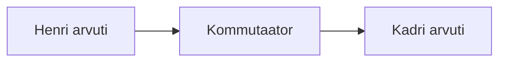
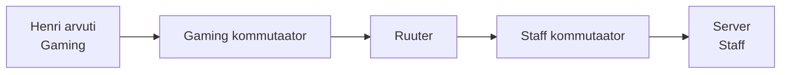

# 2. Seadmed, ühendused ja andmete teekond

::: info Õpiväljund
Pärast kohtumist oskad valida skeemile seadmed ja põhjendada nende rolle, eristada kommutaatorit, ruuterit ja pääsupunkti ning selgitada, kuidas andmed liiguvad samas võrgus ja teise võrku.
:::

## Mis Karli keskuses nüüd juhtub?

Esimesel kohtumisel joonistasid Karli skeemi, kus on mängijad, Mirjam, server ja külalised. Joonisel olid seadmed ja jooned, aga jooned tähendasid kõike korraga. Täna selgitame, **millised seadmed** need jooned päriselt on.

Karl hakkab pärast kooli keskust sisustama. Esimene mõte: "Ostan ühe karbi, kuhu kõik ühendan." Müüja ütleb, et selline karp on olemas, aga see teeb **kolm erinevat tööd** ja need tööd on parem eraldi selgeks teha.

## Andmed liiguvad pakettidena

Kui Henri saadab Kadrile mängus sõnumi, ei liigu see ühe suure tükina. Henri arvuti jagab andmed väikesteks tükkideks ehk **pakettideks**. Iga pakett kannab kaasas **päist**: kellelt see tuleb ja kellele läheb. Päis on nagu ümbrik, mille peale on aadress kirjutatud.

Miks nii? Kui üks suur fail hõivaks kogu kaabli, peaksid teised ootama. Pakettideks jagatult saavad mitme inimese andmed vaheldumisi liikuda ja keegi ei pea kaua ootama.

## Ühendused

Seadmed ühendatakse kas kaabliga või raadiolainetega.

| Ühendus | Mida kasutab | Kus Karli keskuses |
| --- | --- | --- |
| **Keerdpaarkaabel** (Ethernet) | Elektrisignaal vasktraadis. Ühe kaabli maksimaalne pikkus on 100 m. | Mänguarvutid, Mirjami arvuti ja server |
| **Optiline kaabel** | Valguse impulsid klaaskius | Kauged ühendused, nt keskuse ja internetipakkuja vahel |
| **WiFi** | Raadiolained | Külaliste sülearvutid |

Mängijate arvutid on kaabli küljes, sest kaabel on tavaliselt stabiilsem. Külalised kasutavad WiFi-t, sest nende sülearvutitel ei ole kaablit.

## Seadmed ja nende rollid

### Lõppseadmed

**Lõppseade** on seade, kus andmed algavad või lõpevad: mänguarvuti, Mirjami arvuti, Oskari sülearvuti, server. Need on kasutaja poolt nähtavad seadmed.

### Võrguseadmed

**Võrguseade** ei ole andmete lõppsihtkoht. Selle ülesanne on andmeid edasi suunata. Neid on kolme tüüpi:

| Seade | Ingliskeelne nimi | Mida teeb | Karli keskuses |
| --- | --- | --- | --- |
| **Kommutaator** | *switch* | Ühendab seadmeid **ühe võrgu sees** ja saadab paketi ainult sellele pordile, kus sihtseade asub | Ühendab mänguarvutid omavahel |
| **Ruuter** | *router* | Ühendab **erinevaid võrke** omavahel | Ühendab Gaming, Staff ja Guest võrgu ning viib liikluse välja |
| **Pääsupunkt** | *access point* | Annab juhtmevabadele seadmetele ligipääsu kaabelvõrgule | Külaliste WiFi |

::: tip Kommutaator ja ruuter
Kommutaator seob seadmed **ühe võrgu sees** kokku. Ruuter seob **erinevad võrgud** omavahel. Kodune "WiFi-ruuter" on tegelikult kolm seadet ühes karbis: ruuter, kommutaator ja pääsupunkt. Roll on siiski kolm eraldi.
:::

## Kaks teekonda

Nüüd paneme osad kokku. Vaatame, mis juhtub, kui Henri teeb kaks erinevat asja.

### 1. Henri mängib Kadriga: kõik jääb Gaming võrku

Mõlemad arvutid on Gaming võrgus, ühendatud sama kommutaatoriga.

1. Henri arvuti jagab mänguandmed pakettideks.
2. Paketid lähevad kommutaatorisse.
3. Kommutaator saadab need ainult Kadri arvutile.

Siin ruuterit vaja ei ole, sest saatja ja vastuvõtja on **samas võrgus**.

### 2. Henri avab broneeringute lehe: teine võrk

Server asub Staff võrgus, mitte Gaming võrgus. Henri paketid peavad teise võrku jõudma.

1. Henri arvuti koostab päringu "anna mulle broneeringute leht".
2. Gaming kommutaator saab aru, et sihtkoht pole selles võrgus, ja annab paketid ruuterile.
3. Ruuter saadab paketid Staff võrku.
4. Staff kommutaator viib need serverini.
5. Server vastab ja vastus liigub sama teed tagasi.

Siin on ruuter **vajalik**, sest sihtkoht on **teises võrgus**. Kuidas seade teab, kas sihtkoht on samas või teises võrgus, õpid [neljandas kohtumises](./kohtumine-04-ipv4-ja-aadressiplaan).

## LAN ja WAN

**Internet** on miljonite omavahel ühendatud võrkude võrk. Karli keskus on neist üks väike võrk. Kõik need võrgud suhtlevad ühiste kokkulepete ehk **protokollide** järgi.

**LAN** (*Local Area Network*) on kohalik võrk ühe hoone või ala sees. Karli Gaming, Staff ja Guest võrk on kõik LAN-id. **WAN** (*Wide Area Network*) on suur võrk, mis ühendab linnu, riike või kontinente. Internet on WAN. Keskuse ruuter ühendab LAN-id WAN-iga.

## Täiendame skeemi

Esimesel kohtumisel joonistasid skeemi, kus seadmeid ühendasid lihtsalt jooned. Nüüd saad sinna panna **tegelikud seadmed**. Samas ei ehita sa uut skeemi, vaid täiendad oma esimest.

1. Ava oma esimese kohtumise skeem.
2. Lisa **kommutaator** Gaming ja Staff võrgule ning **pääsupunkt** Guest võrgule. Lisa **ruuter**, mis ühendab kolm võrku ja välismaailma.
3. Märgi, millised ühendused on **kaabel** ja millised **WiFi**.
4. Märgi, kus lõpeb LAN ja algab WAN.
5. Joonista nummerdatud nooltega kaks teekonda: (a) Henri → Kadri, (b) Henri → server. Märgi, kumb vajab ruuterit.
6. Kirjuta kolm lauset: milleks on kommutaator, ruuter ja pääsupunkt sinu skeemil?

**Tõend:** täiendatud skeem koos põhjendustega.

## Packet Traceri paigaldus ja kontroll

Selle kohtumise viimane osa (umbes 20 minutit) on **Packet Traceri paigaldamise ja kontrollimise aeg**. Packet Tracer on Cisco tasuta simulaator, kus ehitad võrke arvutis ilma päris seadmeteta.

Õpetaja ja IT on programmi ja juhendi enne tundi ette valmistanud. **Täpse paigaldusviisi ja konto sammud annab õpetaja**, sest need sõltuvad kooli arvutitest. Kooli arvutis ei pruugi sul olla õigust ise programme paigaldada, siis on see juba tehtud või teeb IT.

Mida sa kontrollid:

| Samm | Mida teed | Tulemus |
| --- | --- | --- |
| 1 | Käivita Packet Tracer | Programm avaneb |
| 2 | Logi sisse oma Cisco kontoga | Sisselogimine õnnestub (sisselogimine võib avada brauseri) |
| 3 | Loo tühi uus fail | Töölaud avaneb |
| 4 | Salvesta see nimega `02-kontroll.pkt` | Fail on kaustas olemas |
| 5 | Sulge programm ja ava fail uuesti | Fail avaneb |

::: warning Jagatud arvuti
Kooli jagatud arvutis **ära vali "jäta mind sisse logituks"**. Logi pärast tundi välja, et järgmine kasutaja ei pääseks sinu kontole ligi.
:::

**Kui midagi ei õnnestu:** ära proovi nurka istudes üksi lahendada. Ütle õpetajale, mis sammul jäid toppama (konto, e-post, õigused, allalaadimine, paigaldus, sisselogimine, salvestamine). Probleemid lahendatakse enne kolmandat kohtumist, vajadusel saad **varutöökoha** või teed tööd paarilisega.

**Tõend:** Packet Tracer töötab: programm avaneb, sisselogimine õnnestub ja fail salvestub.

## Kokkuvõte

| Mõiste | Tähendus |
| --- | --- |
| Pakett | Väike andmetükk koos päisega (kellelt, kellele) |
| Lõppseade | Seade, kus andmed algavad või lõpevad |
| Kommutaator | Ühendab seadmeid ühe võrgu sees |
| Ruuter | Ühendab erinevaid võrke |
| Pääsupunkt | Annab juhtmevabadele seadmetele ligipääsu kaabelvõrgule |
| LAN / WAN | Kohalik võrk / ulatuslik võrk |

## Allikad

- [Cloudflare Learning: What is a router?](https://www.cloudflare.com/learning/network-layer/what-is-a-router/)
- [Cloudflare Learning: What is a network switch?](https://www.cloudflare.com/learning/network-layer/what-is-a-network-switch/)
- [Cloudflare Learning: What is a LAN?](https://www.cloudflare.com/learning/network-layer/what-is-a-lan/)
- [Cisco Skills for All: Packet Tracer](https://www.netacad.com/resources/lab-downloads), allalaadimise ametlik koht
