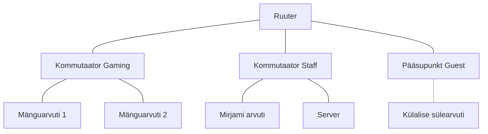
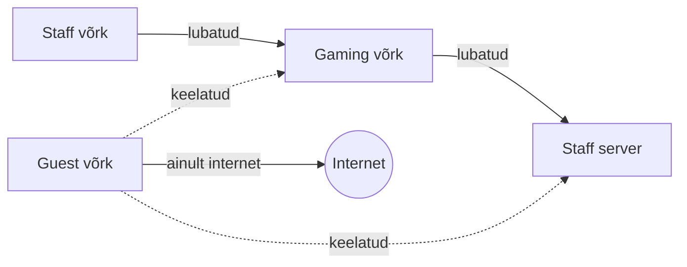

# 3. Võrguplaan, ühenduse maht ja Packet Tracer

::: info Õpiväljund
Pärast kohtumist oskad koostada kasutajate vajaduste põhjal võrguplaani, eristada füüsilist ja loogilist skeemi, koostada ligipääsumaatriksi, teisendada Mbit/s ja MB/s, eristada ribalaiust, edastuskiirust, viivitust ja paketikadu ning leida Packet Traceris seadmeid ja nende rolle.
:::

::: warning Eeltingimus
Selle kohtumise alguseks peab Packet Tracer sinu arvutis **töötama** (vt [kohtumine 2](./kohtumine-02-seadmed-ja-teekonnad#packet-traceri-paigaldus-ja-kontroll)). Selle tunni jooksul paigaldamist ei tehta. Kui sul on probleem, ütle seda tunni alguses õpetajale ja saad varutöökoha.
:::

## Mis Karli keskuses nüüd juhtub?

Karl on skeemid joonistanud ja tahab nüüd alustada. Siis helistab Mirjam: "Kas ma saan oma arvutist serverisse? Ja kas Oskar ei jõua minu arvutisse?" Karl ei oska vastata, sest tal on ainult joonis. Joonis ei ütle, **kes kellega rääkida tohib**.

Täna teeme kolm asja:

1. koostame plaani, mis ütleb, **kes mida võib**;
2. selgitame, **kui suurt internetiühendust** keskus vajab ja mida tähendab "aeglane";
3. avame Packet Traceris valmis skeemi, et näha, kuidas selline plaan ehitatuna välja näeb.

## Miks kolm võrku?

Esimesel kohtumisel nägid, et külaline ei vaja ligipääsu keskuse seadmetele. Nüüd paneme selle plaaniks:

| Võrk | Kes seal on | Milleks see eraldi on |
| --- | --- | --- |
| **Gaming** | Mänguarvutid | Mängijad suhtlevad omavahel ja näevad broneeringute lehte. Nad ei pea nägema Mirjami arvutit. |
| **Staff** | Mirjami arvuti ja server | Siin asub keskuse "töökoht". Seda tuleb kõige rohkem kaitsta. |
| **Guest** | Külaliste sülearvutid (WiFi) | Külaline vajab ainult internetti. Ta ei tohi Gaming ega Staff seadmeid kasutada. |

Üks hea küsimus: **kas WiFi nimi (SSID) piisab võrgu eraldamiseks?** Ei piisa. Kui WiFi nimi on "Guest", aga seade on samas võrgus nagu Staff, saab külaline Staff seadmeid ikka näha. Eraldamine tuleb **seadistusest**, mitte nimest.

## Füüsiline ja loogiline skeem

Karl vajab kahte erinevat joonist, sest need vastavad kahele erinevale küsimusele.

| Skeem | Küsimus | Mida näitab |
| --- | --- | --- |
| **Füüsiline** | Kuhu ma kaabli panen? | Seadmed, kaablid, liidesed, pääsupunkt |
| **Loogiline** | Kes kellega suhtleb? | Võrgud, teenused, ligipääsupiirangud |

Sama võrk, kaks joonist. Füüsiline näide:



Loogiline näide samast võrgust:



Esimene näitab, kuidas kaabel läheb. Teine näitab reegleid. Skeemid ei pea üksteisega sarnanema, aga peavad omavahel kokku sobima.

### Füüsilise paigutuse tüübid

Kaablite ja seadmete paigutust nimetatakse **topoloogiaks**. Levinumad tüübid:

| Topoloogia | Kirjeldus | Märkus |
| --- | --- | --- |
| **Täht** (*star*) | Kõik seadmed on ühendatud ühe keskseadmega (kommutaatoriga) | Tänapäeva kaabelvõrkude tavaline kuju. Ühe kaabli rike mõjutab ainult ühte seadet |
| **Siin** (*bus*) | Kõik seadmed jagavad ühte ühist kaablit | Vana lahendus, tänapäeval harva |
| **Ring** | Iga seade on ühendatud kahe naabriga | Harv |
| **Täisvõrk** (*mesh*) | Seadmed on ühendatud mitme teisega | Annab varuteid. Kasutatakse ruuterite vahel ja WiFi mesh-süsteemides |

Karli keskuse Gaming ja Staff võrk on füüsiliselt **tähed**: iga seade on kaabliga oma kommutaatori küljes.

## Ligipääsumaatriks

**Ligipääsumaatriks** on tabel, mis ütleb, kes tohib millise teenuseni jõuda. See on kõige olulisem dokument, sest hiljem **kontrollime** selle põhjal, kas võrk töötab õigesti.

Karli keskuse esialgne maatriks:

| Kust | Kuhu | Lubatud? |
| --- | --- | --- |
| Gaming | Staff server (veebileht) | Jah |
| Staff | Gaming seadmed | Jah |
| Staff | Server | Jah |
| Guest | Internet | Jah |
| Guest | Gaming seadmed | **Ei** |
| Guest | Staff arvuti ja server | **Ei** |
| Guest | Võrguseadmete haldus | **Ei** |

Viimane rida on tähtis. **Võrguseadme haldus** tähendab ruuteri või pääsupunkti sätete muutmist. Kui külaline saab neid muuta, ei aita ükski teine reegel.

## Kui suurt ühendust keskus vajab?

Karl on kolme võrgu plaaniga rahul. Siis kirjutab Henri: "Tellisin uue mänguuuenduse, 500 MB. Internetileping on **100 Mbit/s**, seega 5 sekundit, eks?" Tegelikult kulub umbes 40 sekundit. Mis läks valesti?

### Bitid ja baidid

Tähed `b` ja `B` ei tähenda sama asja:

- **Bitt** (*bit*, väike `b`) on väikseim andmeühik: 0 või 1.
- **Bait** (*byte*, suur `B`) on 8 bitti.

Võrgu kiirust antakse **bittides** sekundis (Mbit/s), failide suurust **baitides** (MB). Võrdlemiseks tuleb ühik sama teha.

| Ühik | Tähendus |
| --- | --- |
| `Mbit/s` (või `Mbps`) | miljon bitti sekundis |
| `Gbit/s` | miljard bitti sekundis |
| `MB/s` | miljon **baiti** sekundis |

**Teisendus:** `1 MB/s = 8 Mbit/s`. Henri uuenduse arvutus:

```text
100 Mbit/s ÷ 8 = 12,5 MB/s
500 MB ÷ 12,5 MB/s = 40 sekundit
```

Päriselus kulub veel veidi rohkem, sest osa kiirusest läheb pakettide päiste peale ja teised seadmed kasutavad sama ühendust.

### "Mäng lagiseb": kolm eri asja

Karli mängijad kurdavad, et internet on aeglane. See sõna tähendab vähemalt kolme erinevat probleemi:

| Mängija kirjeldus | Tegelik probleem | Mõõdik |
| --- | --- | --- |
| "Uuendus laeb tigu kiirusel" | Andmeid liigub vähe | **Edastuskiirus** |
| "Klõpsan, aga tulistab alles pärast pausi" | Iga pakett on teel kaua | **Viivitus** |
| "Tegelased hüplevad ja mäng jookseb kokku" | Paketid lähevad kaduma | **Paketikadu** |

Enne kui midagi parandad, pead **mõõtma**, milline neist on. Üks sõna, kolm erinevat põhjust ja kolm erinevat lahendust.

### Neli mõõdikut

| Mõõdik | Küsimus | Ühik |
| --- | --- | --- |
| **Ribalaius** (*bandwidth*) | Kui palju oleks maksimaalselt võimalik? | Mbit/s |
| **Edastuskiirus** (*throughput*) | Kui palju tegelikult sekundis liigub? | Mbit/s |
| **Viivitus** (*latency*) | Kui kaua kulub pakettil teekonnale? | ms |
| **Paketikadu** (*packet loss*) | Mitu protsenti pakette ei jõua kohale? | % |

Analoogia: ribalaius on toru jämedus, edastuskiirus on see, kui palju vett toru kaudu tegelikult voolab, ja viivitus on aeg, mis kulub vee jõudmiseks toru teise otsa. Analoogial on piir: toru ei näita paketikadu, ehk seda, et osa vett läheb teel kaduma.

Erinevad tegevused vajavad erinevat:

| Tegevus | Mis on kõige olulisem | Miks |
| --- | --- | --- |
| Mängu uuenduse allalaadimine | Edastuskiirus | Viivitus ei loe, loeb, kui kiiresti fail kohale jõuab |
| Reaalajamäng | Madal viivitus ja peaaegu null paketikadu | Hilinenud andmed rikuvad mängu |
| Video vaatamine | Püsiv kiirus | Kui kiirus kõigub, hakkab pilt seisma |

### Mõõtmine ja selle piirangud

Operatsioonisüsteem näitab ise, kui palju võrku kasutatakse (Windowsis **Task Manager**, macOS-is **Activity Monitor**). Viivituse mõõdab `ping`.

Mõõtmisel tuleb olla ettevaatlik:

- Monitor näitab **kogu arvuti** liiklust, mitte ühe rakenduse oma.
- WiFi kiirus sõltub kaugusest, seintest ja teistest seadmetest. Sama mõõtmine kaks korda võib anda erineva tulemuse.
- Kirjuta iga mõõtmise juurde alati tingimused: kaabel või WiFi, kellaaeg, taustaprogrammid.

Packet Traceris ei saa päris kiirust mõõta, sest simulatsiooniaeg ei kajasta päris võrgu kiirust. Seepärast arvutame kohtumisel 10 ühenduse vajaduse, kasutades just neid mõisteid.

## Packet Traceri tutvustus

Packet Tracer on programm, kus saab joonistada ja seadistada võrgu ning seda **simuleerida**. Täna ehitame veel ei midagi, vaid **avame õpetaja etteantud skeemi** ja vaatame, kuidas see on tehtud.

Pärast kohtumist on sul see sama failitüüp (`.pkt`), mis hiljem on sinu projekt.

### Peamised kohad

Packet Traceri akna põhiosad:

| Koht | Mida seal teha saab |
| --- | --- |
| **Töölaud** (keskel) | Siin näed seadmeid ja ühendusi |
| **Seadmete riba** (alumine vasak nurk) | Siit valid seadmetüübi (ruuterid, kommutaatorid, lõppseadmed jne) ja lisad seadme töölauale |
| **Realtime / Simulation** (alumine parem nurk) | Realtime on tavaline töö. Simulation Mode'is näed pakettide teekonda samm-sammult (kasutame seda kohtumisel 8) |

Kui sinu versioonis on nimed või asukohad teisiti, küsi õpetajalt. Programmi versioonid erinevad.

### Seadme vaated

Kui klõpsad seadmele, avaneb selle aken. Seal on vaated, mida kasutame hiljem:

| Vaade | Mis see on |
| --- | --- |
| **Physical** | Seadme füüsiline pilt, näiteks pordid |
| **Config** | Lihtsad seaded graafilisel kujul |
| **CLI** | Käsurida (ruuteritel ja kommutaatoritel) |
| **Desktop** | Arvuti töölaud (arvutitel), kust saab IP-seadistust, brauserit ja käsurida avada |

Täna **ei muuda** sa midagi. Oluline on, et tead, kust midagi leiad.

## Praktiline töö

1. **Ava etteantud fail.** Õpetaja annab faili `03-vaatlus.pkt`. Ava see Packet Traceris.
2. **Leia seadmed ja nende nimed.** Tee tabel: seadme nimi, tüüp (arvuti, kommutaator, ruuter, pääsupunkt, server), võrk, kuhu ta kuulub (Gaming, Staff, Guest).
3. **Ava vähemalt kolme seadme aken.** Vaata, mis vaated seal on. Ava ruuteri **CLI** vaade ainult vaatamiseks. Käske ei sisesta.
4. **Salvesta koopia** nimega `03-vaatlus-sinunimi.pkt`.
5. **Koosta plaan:**
   - Füüsiline skeem (kaablid ja seadmed). Võid kasutada Packet Traceri skeemi lähtekohana.
   - Loogiline skeem (võrgud ja reeglid).
   - Ligipääsumaatriks (tabel nagu ülal, sinu täienduste või muudatustega).
6. **Vasta:** miks ei saa külaline Mirjami arvutisse minna isegi siis, kui WiFi nimi on "Guest"?
7. **Ühikud:** (a) Kui kaua võtab 250 MB faili allalaadimine 50 Mbit/s ühendusega? (b) Kui kaua võtab 2 GB fail 100 Mbit/s ühendusega? (1 GB = 1000 MB.) Näita arvutuskäik.
8. **Mõisted:** mängija ütleb "mäng lagiseb". Millised kolm eri asja see võib tähendada ja millega sa neid mõõdaksid?

**Tõend:** füüsiline ja loogiline kavand, ligipääsumaatriks, ühikute ülesannete vastused ning salvestatud `.pkt` fail.

::: tip Kui programm ei tööta
Üksik tõrge ei peata tundi. Tee paaris koos, kes saab programmi käima, või kasuta varutöökohta. Plaani koostamise osa tehakse ka paberil.
:::

## Kokkuvõte

| Mõiste | Tähendus |
| --- | --- |
| Gaming / Staff / Guest | Kolm eraldi võrku, igaühel oma roll |
| Füüsiline skeem | Seadmed, kaablid ja pordid |
| Loogiline skeem | Võrgud, teenused ja reeglid |
| Ligipääsumaatriks | Tabel: kust kuhu tohib |
| Topoloogia | Seadmete ja kaablite paigutus (täht, siin, ring, täisvõrk) |
| Mbit/s ja MB/s | 1 MB/s = 8 Mbit/s |
| Ribalaius, edastuskiirus, viivitus, paketikadu | Neli erinevat mõõdikut |
| `.pkt` | Packet Traceri failitüüp |

## Mis edasi?

Neljandas kohtumises anname igale võrgule **aadressid**. Aadress on see, mis võrgule ütleb, kes kuhu kuulub. Ilma selleta ei saa ruuter kolme võrku eristada.
