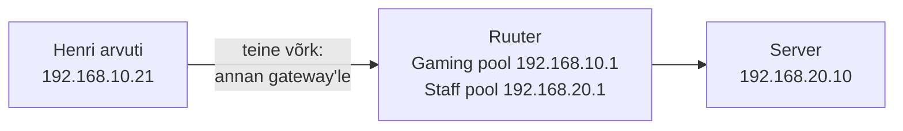

# 4. IPv4 ja aadressiplaan

::: info Õpiväljund
Pärast kohtumist oskad otsustada /24 maski järgi, kas kaks aadressi kuuluvad samasse võrku, eristada seadme aadressi, võrguaadressi, maski ja gateway'd ning koostada mängukeskuse aadressitabeli.
:::

## Mis Karli keskuses nüüd juhtub?

Karl paneb kaks arvutit ühe kommutaatori külge. Henri arvutile annab ta aadressi `192.168.10.21`, Kadri arvutile `192.168.10.22`. Nad näevad üksteist.

Seejärel kirjutab Karl Kadri arvutile kogemata aadressi `192.168.20.22`, sest ta kopeeris selle Mirjami võrgu tabelist. Äkki Henri arvuti **ei leia** Kadri arvutit enam, kuigi kaabel on samas kohas.

Mis juhtus? Kõik tuli aadressist. Täna õpid, kuidas seade aadressi põhjal otsustab, kas sihtkoht on tema enda võrgus või mitte.

## IPv4 aadress

**IP-aadress** on seadme võrguaadress. Nagu postiaadress tänava ja majanumbriga, näitab ka see, millises võrgus seade on ja kes ta selles võrgus on.

**IPv4** aadress on neli arvu 0 kuni 255, mis on eraldatud punktidega:

```text
192.168.10.21
```

Iga neljast arvust on **oktett**. Vahemik 0–255 tuleb sellest, et iga oktett on kirjutatud 8 bitina. Bittidest pole sul seda kursust vaja rohkem mõista.

### Privaataadressid

Mängukeskuse sisevõrgus kasutame aadresse, mis algavad `192.168`. Need on **privaataadressid**: need on mõeldud kohalikeks võrkudeks ega kehti internetis. Sama aadress võib samaaegselt olla tuhandes erinevas kohalikus võrgus, sest need ei ole omavahel nähtavad.

**Avalik IP-aadress** on seevastu internetis ainulaadne. Selle saab ruuter oma internetipakkujalt. Privaataadressi seade pääseb internetti ruuteri kaudu, mis vahendab (seda nimetatakse NAT-iks ja vaatame seda [kohtumisel 8](./kohtumine-08-paringu-vaatlus-ja-valisvork)).

Privaatsed vahemikud on kokku lepitud ([RFC 1918](https://datatracker.ietf.org/doc/html/rfc1918)):

| Vahemik | Kus näed |
| --- | --- |
| `192.168.x.x` | Koduvõrgud, väiksed kontorid, meie mängukeskus |
| `10.x.x.x` | Suured firmad, koolid |
| `172.16.x.x` kuni `172.31.x.x` | Keskmised võrgud |

## Mask: kes on minu võrgus?

Aadress üksi ei ütle, **kus võrk lõpeb**. Selle ütleb **alamvõrgumask** ehk lühemalt **mask**.

Meie kursusel kasutame ainult üht maski: `255.255.255.0`, mida kirjutatakse lühemalt ka **/24**.

### Lihtne test

/24 maski puhul on reegel selline:

> Kui aadresside **kolm esimest arvu on samad**, on seadmed samas võrgus.

Karli näited:

| Seade A | Seade B | Esimesed kolm arvu | Sama võrk? |
| --- | --- | --- | --- |
| 192.168.**10**.21 | 192.168.**10**.22 | 192.168.10 = 192.168.10 | **Jah** |
| 192.168.**10**.21 | 192.168.**20**.10 | 192.168.10 ≠ 192.168.20 | **Ei** |
| 192.168.**30**.50 | 192.168.**30**.51 | 192.168.30 = 192.168.30 | **Jah** |

Nüüd saame vastata Karli probleemile. Henri arvuti on `192.168.10.21` ja Kadri arvuti `192.168.20.22`. Kolm esimest arvu ei ole samad. Henri arvuti **arvab, et Kadri on teises võrgus**, ja saadab paketid mitte otse, vaid ruuterile. Kui ruuterit pole seadistatud või ühendatud, ei jõua pakett kuhugi.

::: warning See on /24 reegel, mitte kõigi maskide reegel
"Kolm esimest arvu" töötab seepärast, et /24 maski puhul on esimesed kolm arvu "võrgu osa". Teiste maskide puhul on reegel keerulisem. Neid selles kursuses ei kasuta. Ära üldista seda reeglit teiste maskide peale.
:::

## Võrguaadress ja leviaadress

/24 võrgus on 256 aadressi, `.0` kuni `.255`. Kaks neist on erilised:

| Aadress | Tähendus | Kas seadmele sobib? |
| --- | --- | --- |
| `192.168.10.0` | **Võrguaadress**: nimi kogu võrgule | Ei |
| `192.168.10.255` | **Leviaadress**: "kõigile selles võrgus" | Ei |

Seetõttu mahub seadmeid ühte /24 võrku **254**. Võrgu kirjutame üles nii: `192.168.10.0/24`.

## Gateway: tee teise võrku

Henri tahab broneeringute lehte, mis asub serveris `192.168.20.10`. Server ei ole Henri võrgus, sest `192.168.10` ≠ `192.168.20`. Henri arvuti ei tea teed.

Siin tuleb mängu **gateway** (*vaikelüüs*, *default gateway*). See on **ruuteri aadress selles võrgus**. Henri arvuti mõtleb: "Sihtkoht on teises võrgus. Annan paketi gateway'le, tema teab edasi."

Selle võrgu gateway Karli keskuses on `192.168.10.1`. Meie kursuse kokkulepe: **gateway on alati võrgu esimene seadmeaadress `.1`**. See on meie kokkulepe, mitte seadus. Võiks olla ka `.254`, aga järjepidevus teeb planeerimise lihtsamaks.



Ruuteril on **iga võrgu jaoks eraldi aadress**: Gaming poolel `.10.1`, Staff poolel `.20.1`. Ruuter on korraga mõlemas võrgus.

Ruuteri seadistamine tuleb viiendal kohtumisel. Täna otsustame ainult, mis aadress on.

## Aadresside konflikt

Mis juhtub, kui Henri ja Kadri arvutitele antakse sama aadress `192.168.10.21`? See on **aadresside konflikt**. Võrk ei oska kahe seadme vahel valida. Tulemus on ebastabiilne: ühendus katkeb vahel, vahel töötab ja vahel mitte. Veaotsing on ebameeldiv, sest iga seade tundub eraldi vaadates korras.

Vältimise viis on **plaan**: igal seadmel on kindel koht aadressitabelis ja iga aadress on ainult ühel seadmel.

## Mängukeskuse aadressiplaan

Nüüd paneme kõik kokku. Mängukeskuse aadressid:

| Võrk | Võrguaadress | Mask | Gateway | Reserveeritud (taristu) | Seadmetele (hiljem DHCP-ga) |
| --- | --- | --- | --- | --- | --- |
| **Gaming** | 192.168.10.0/24 | 255.255.255.0 | 192.168.10.1 | .1–.20 | .21–.200 |
| **Staff** | 192.168.20.0/24 | 255.255.255.0 | 192.168.20.1 | .1–.20 (server `.10`) | .21–.200 |
| **Guest** | 192.168.30.0/24 | 255.255.255.0 | 192.168.30.1 | .1–.20 | .21–.200 |

Mida tabelis tähendab:

- **Reserveeritud .1–.20:** need aadressid on mõeldud võrguseadmetele (ruuter, pääsupunkt) ja serveritele. Neid ei anta mänguarvutitele. Staff serveri aadress on **192.168.20.10**.
- **Seadmetele .21–.200:** need aadressid antakse arvutitele. Täna ei jaga me aadresse käsitsi. Kohtumisel 6 teeb seda automaatselt **DHCP**. Praegu vajad vahemiku teadmist ainult plaanis.
- **.201–.254** jäävad kasutamata, nii et plaanis on varu.

Miks kolm eraldi aadressivahemikku? Ruuter vajab iga võrgu jaoks oma aadressi. Kui kaks võrku kasutaksid sama aadressivahemikku, ei teaks ruuter, kumba pooleni pakett läheb.

## Praktiline töö

Töö on paberil või tabelis. Packet Tracerit ei ole vaja.

**1. Sama või erinev võrk?** Otsusta /24 maski ja "kolme esimese arvu" testi järgi. Kirjuta põhjendus.

| A | B | Sama võrk? | Põhjendus |
| --- | --- | --- | --- |
| 192.168.10.5 | 192.168.10.80 | | |
| 192.168.10.5 | 192.168.20.5 | | |
| 192.168.30.100 | 192.168.30.200 | | |
| 192.168.20.10 | 192.168.10.10 | | |

**2. Leia viga.** Kadri arvuti seadistus on:

- IP: `192.168.10.22`
- Mask: `255.255.255.0`
- Gateway: `192.168.20.1`

Server (`192.168.20.10`) on teises võrgus. Mis on selles seadistuses valesti? Kuidas see Kadrile paistaks ("kas leht avaneb?")?

**3. Aadresside konflikt.** Kaks arvutit saavad sama aadressi. Kirjelda lühidalt, kuidas see **mängijale** paistab ja kuidas selle üldse ära hoiab.

**4. Täida aadressitabel.** Kasuta ülaltoodud vahemikke ja täida tabel, kus on iga seadme aadress. Seadmetele, mida ruuter või server vajab, kasuta reserveeritud vahemikku:

| Seade | Võrk | Aadress | Mask | Gateway |
| --- | --- | --- | --- | --- |
| Keskruuter (Gaming pool) | Gaming | 192.168.10.1 | 255.255.255.0 | tühi |
| Keskruuter (Staff pool) | Staff | | | tühi |
| Keskruuter (Guest pool) | Guest | | | tühi |
| Staff server | Staff | 192.168.20.10 | 255.255.255.0 | |
| Mirjami arvuti | Staff | (DHCP) | 255.255.255.0 | |
| Mänguarvuti | Gaming | (DHCP) | | |
| Külalise sülearvuti | Guest | (DHCP) | | |

**5. Ühe lausega:** mis vahe on seadme aadressil, võrguaadressil, maskil ja gateway'l?

**Tõend:** täidetud aadressitabel ja kahe teadliku vea (ülesanded 2 ja 3) selgitus.

## Kokkuvõte

| Mõiste | Tähendus | Näide |
| --- | --- | --- |
| **IPv4 aadress** | Seadme aadress võrgus | 192.168.10.21 |
| **Mask** | Näitab, kus võrk lõpeb | 255.255.255.0 (/24) |
| **Võrguaadress** | Kogu võrgu "nimi" | 192.168.10.0 |
| **Leviaadress** | "Kõigile selles võrgus" | 192.168.10.255 |
| **Gateway** | Ruuteri aadress selles võrgus, tee teise võrku | 192.168.10.1 |
| **Aadresside konflikt** | Kahel seadmel on sama aadress | Ebastabiilne ühendus |

## Mis edasi?

Viiendal kohtumisel hakkame ehitama. Alustame Gaming võrgust: paneme kaks arvutit kommutaatori taha, anname neile aadressid käsitsi ja kontrollime, kas nad üksteist näevad. Seejärel ühendame Staff võrgu ruuteri kaudu ja kasutame gateway'd, mille täna planeerisime.

## Allikad

- [RFC 1918: Address Allocation for Private Internets](https://datatracker.ietf.org/doc/html/rfc1918), privaataadresside ametlik määratlus
