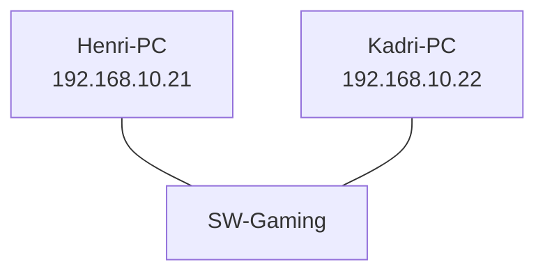
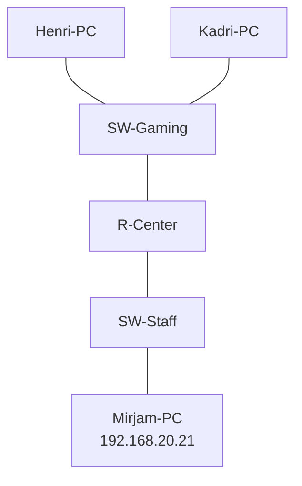
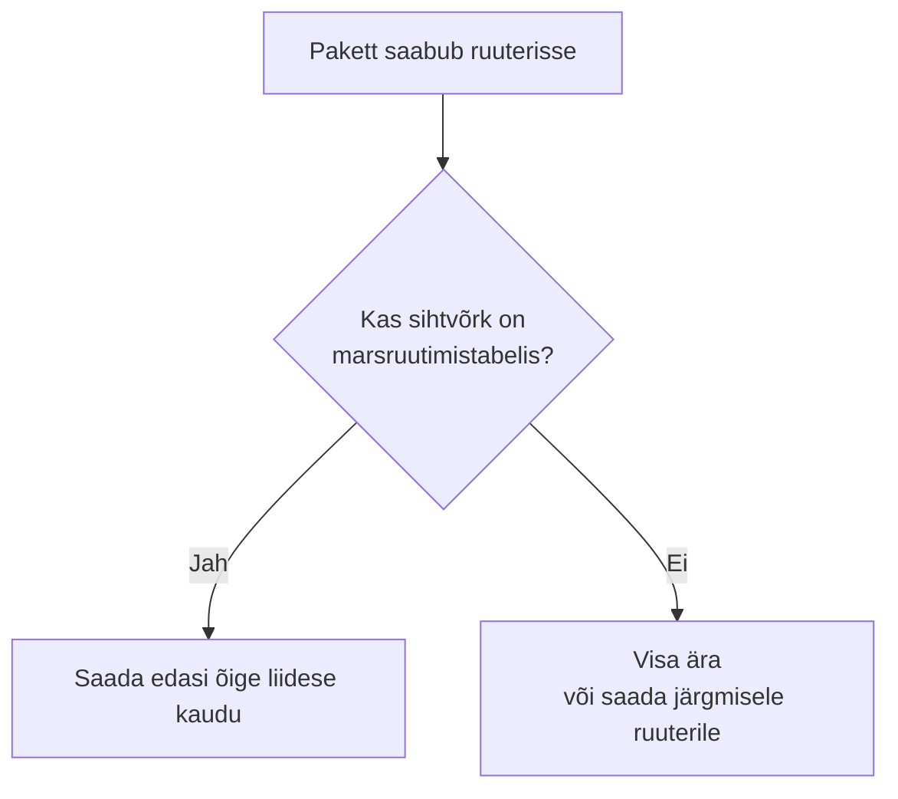

# 5. Esimesed LAN-id ja nende ühendamine

::: info Õpiväljund
Pärast kohtumist oskad ühendada kaks väikest LAN-i ruuteriga, anda arvutitele käsitsi aadressi ja gateway, seadistada ruuteri liidesed ning kontrollida liiklust sama võrgu ja teise võrgu seadmega.
:::

::: warning Kontrollimata käsud
Käsud ja liidesenimed (`GigabitEthernet0/0` jne) on selles juhendis näited tüüpilisest Cisco ruuterist. Täpne ruuteri mudel ja liidesenimed fikseeritakse labori katsetamisel. Kui sinu ruuteril on teised nimed, vaata neid käsuga `show ip interface brief` ja asenda nimed oma omadega.
:::

## Mis Karli keskuses nüüd juhtub?

Neljandal kohtumisel valmis aadressitabel. Nüüd on Karlil esimene päris hetk: ta ehitab võrgu, kus Henri ja Kadri arvuti **tõesti** saavad omavahel rääkida, ja seejärel ühendab need Mirjami võrguga.

Karl teeb seda kahe sammuna:

1. **Gaming LAN:** kaks arvutit ühe kommutaatori taga.
2. **Staff LAN ja ruuter:** Mirjami arvuti oma kommutaatori taga ning ruuter, mis ühendab mõlemad võrgud.

## Töövõtted

- Salvesta fail nimega `05-lan-routing.pkt`.
- Nimeta seadmed arusaadavalt (`Henri-PC`, `Kadri-PC`, `SW-Gaming`, `Mirjam-PC`, `SW-Staff`, `R-Center`). Seadme nimi on seadme akna **Config** vaates või skeemil nime klõpsates muudetav. Hiljem leiad seadmeid nime järgi.
- Töötage paarides: üks seadistab, teine **kontrollib** ja küsib "kuidas sa seda tead?". Vahetage rolle.

## 1. samm: Gaming LAN

### Mida ehitada



### Seadmete lisamine ja ühendamine

1. Seadmete ribalt vali **End Devices** ja lisa töölauale kaks arvutit (PC).
2. Vali **Network Devices → Switches** ja lisa üks kommutaator.
3. Vali **Connections** (välgunoole sarnane ikoon) ja **Copper Straight-Through** kaabel. Ühenda arvuti võrgupesa (*FastEthernet0*) kommutaatori mis tahes vaba pordiga. Tee seda mõlema arvutiga.

**Kaabli valik:** arvuti ja kommutaator on eri tüüpi seadmed, seega kasutatakse **sirget kaablit** (*straight-through*). Kui ühendad kaks sama tüüpi seadet (näiteks kaks arvutit otse), on vaja **ristkaablit** (*crossover*). Kui kasutad valet kaablit, jääb ühenduse tuli punaseks.

**Tuled kaablil:** kui ühendus on loodud, on tuli alguses oranž ja muutub umbes poole minuti pärast roheliseks. Punane tähendab, et ühendust ei ole.

### Aadresside andmine käsitsi

Arvutil ei ole veel õigeid võrguandmeid. Anname need ise.

1. Klõpsa arvutile ja ava **Desktop → IP Configuration**.
2. Vali **Static**.
3. **Henri-PC:** IP `192.168.10.21`, mask `255.255.255.0`. Gateway jäta praegu tühjaks, sest ruuterit veel pole.
4. **Kadri-PC:** IP `192.168.10.22`, mask `255.255.255.0`.

### Kontroll

Ava Henri arvutil **Desktop → Command Prompt** ja kirjuta:

```text
ping 192.168.10.22
```

`ping` saadab Kadri arvutile väikese päringu ja ootab vastust. Oodatav tulemus on neli vastust ("Reply from 192.168.10.22") ja 0% kaotust.

Kontrolli ka oma enda seadistust:

```text
ipconfig
```

Näed IP-aadressi, maski ja gateway'd. See on esimene koht, kust vigu otsida.

::: tip Esimene ping võib ebaõnnestuda
Esimene päring võib olla "Request timed out", järgmised töötavad. Seade ei tea veel, millisele MAC-aadressile paketti saata, ja peab seda eelnevalt küsima. See on normaalne. Kui ebaõnnestuvad kõik neli, on probleem tõeline.
:::

## 2. samm: Staff LAN ja ruuter

### Mida ehitada



1. Lisa teine kommutaator (`SW-Staff`), arvuti (`Mirjam-PC`) ja **ruuter** (Network Devices → Routers). Vali ruuter, millel on vähemalt kolm Etherneti liidest (õpetaja ütleb mudeli).
2. Ühenda `Mirjam-PC` ja `SW-Staff` sirge kaabliga.
3. Ühenda `SW-Gaming` ruuteri esimese liidesega (`GigabitEthernet0/0`) ja `SW-Staff` teise liidesega (`GigabitEthernet0/1`). Kasuta sirget kaablit.

Ruuteri liidesed on tavaliselt alguses **välja lülitatud**, nii et tuled on punased. Nad lähevad roheliseks pärast seadistamist.

### Mirjami arvuti aadress

`Mirjam-PC`: **IP** `192.168.20.21`, **mask** `255.255.255.0`, **gateway** `192.168.20.1`.

Ava ka Henri ja Kadri arvuti **IP Configuration** ja lisa **gateway** `192.168.10.1`.

### Ruuteri seadistamine

Ruuteril ei ole graafilist seadistust nii nagu arvutil. Selle seadistamiseks kasutatakse **käsurida** ehk **CLI**-d (*command line interface*). Ava ruuter ja vali **CLI** vaade.

Kui programm küsib "Continue with configuration dialog? [yes/no]", vasta **no**.

Cisco käsurida töötab **režiimidena**. Mõni käsk töötab ainult õiges režiimis:

| Režiim | Tähis käsureal | Mida seal teha saab |
| --- | --- | --- |
| Kasutaja režiim | `Router>` | Vaid vaatamine |
| Haldaja režiim | `Router#` | Vaatamine ja kontroll (`show` käsud) |
| Üldseadistus | `Router(config)#` | Seadistuste muutmine |
| Liidese seadistus | `Router(config-if)#` | Ühe liidese seadistamine |

Sisesta järjest:

```text
enable
configure terminal
hostname R-Center
interface GigabitEthernet0/0
 ip address 192.168.10.1 255.255.255.0
 no shutdown
 exit
interface GigabitEthernet0/1
 ip address 192.168.20.1 255.255.255.0
 no shutdown
 exit
end
```

Mida iga käsk teeb:

| Käsk | Režiim | Mida teeb | Miks |
| --- | --- | --- | --- |
| `enable` | kasutaja | Läheb haldaja režiimi | Seadistamiseks on vaja kõrgemat õigust |
| `configure terminal` | haldaja | Läheb üldseadistusse | Muudatusi saab teha ainult siin |
| `hostname R-Center` | üldseadistus | Annab ruuterile nime | Käsurealt on näha, millist seadet seadistad |
| `interface GigabitEthernet0/0` | üldseadistus | Valib liidese | Käsud kehtivad ainult sellele liidesele |
| `ip address 192.168.10.1 255.255.255.0` | liides | Annab liidesele aadressi ja maski | See on Gaming võrgu gateway |
| `no shutdown` | liides | Lülitab liidese sisse | Ilma selleta liides ei tööta |
| `end` | mis tahes | Tagasi haldaja režiimi | |

`192.168.10.1` on aadress, mille valisime neljandal kohtumisel Gaming võrgu gateway'ks. Ruuter on nüüd Gaming võrgus seade nr 1.

### Kontroll

Ruuteril:

```text
show ip interface brief
```

Mõlemal liidesel peab olema õige IP ja olek **up / up**.

Henri arvutil Command Prompt:

```text
ping 192.168.10.1
ping 192.168.20.21
```

Esimene kontrollib, kas ruuter vastab, teine, kas Henri jõuab **teise võrku** Mirjami arvutini.

Täiendav kontroll ruuteril: `show ip route` peab näitama mõlemat võrku (`192.168.10.0/24` ja `192.168.20.0/24`).

## Kuidas ruuter otsustab: marsruutimistabel

Henri pakett jõudis Mirjami arvutini. Aga kuidas ruuter teadis, et Staff võrk on **just selle** liidese taga?

Ruuter hoiab **marsruutimistabelit**: nimekirja, millisesse võrku millise liidese kaudu pääseb. Kui seadistasid liidesele aadressi (`192.168.10.1 255.255.255.0`), lisas ruuter tabelisse ise rea "Gaming võrk on selle liidese taga". Sama tegi ta Staff võrguga.

Vaata seda ruuteril:

```text
show ip route
```

Nähtavad read, mille ees on **C**, tähendavad *connected*, ehk "see võrk on otse selle ruuteri külge ühendatud". Näiteks:

```text
C    192.168.10.0/24 is directly connected, GigabitEthernet0/0
C    192.168.20.0/24 is directly connected, GigabitEthernet0/1
```

Sinu väljund võib olla veidi teistsugune (näiteks lisaks read **L** ruuteri enda aadresside jaoks).

Kui pakett saabub, teeb ruuter lihtsa otsuse:



Praegu on keskuse ruuteril ainult otse ühendatud võrgud, seega ta oskab ainult neid. Välisvõrku (mis on meie keskusest väljaspool) lisame kohtumisel 8. Seal ruuter ei tea kogu teed, vaid teab ainult "see suund viib edasi". Päris internetis ei tea ükski ruuter kogu teed: iga ruuter teab, kuhu paketi **järgmiseks** anda. Nii liigub pakett **hüppest hüppesse** (*hop*) sihtkohani.

Marsruutimisprotokolle (mis õpetavad ruutereid tabelit ise täiendama) selles kursuses ei seadistata.

## Mis juhtuks, kui…

Proovi sihilikult kolme viga. Iga vea järel taasta algne seadistus.

| Muudatus | Mida näed | Mida see tähendab |
| --- | --- | --- |
| Henri-PC gateway kustutatud | `ping 192.168.10.22` töötab, `ping 192.168.20.21` ei tööta | Sama võrk töötab, teise võrku minek ei tööta, sest gateway puudub |
| Henri-PC mask vale (`255.255.0.0`) | Käitumine muutub (arvuti hakkab aadresse valesti võrdlema) | Mask otsustab "samas võrgus või mitte" |
| Ruuteri liidesel `shutdown` | Teise võrku ei jõua. Liides on punane | Liides on välja lülitatud |

Mängija jaoks näeks see välja nii: "Mäng töötab ja sõbrad on nähtavad, aga broneeringute leht ei avane". Karl peab leidma, **kus** viga on.

## Tüüpilised vead

- Vale kaabel või vale liides.
- Liides on välja lülitatud (`no shutdown` unustatud).
- Mask või gateway vale.
- Arvutil on valel võrgul õige aadress (`192.168.20.x` Gaming kommutaatori taga).

## Esitatav töö

- Fail `05-lan-routing.pkt`.
- Täidetud aadressitabel.
- Kontroll: ping sama võrgu seadmele ja ping teise võrgu seadmele. Kirjuta kummagi tulemus.

Kui teine LAN jääb pooleli, lõpetatakse see kuuenda kohtumise esimese 15 minuti jooksul.

## Kokkuvõte

| Mõiste | Tähendus |
| --- | --- |
| Liides | Seadme võrgupesa koos seadistusega (aadress, olek) |
| `no shutdown` | Lülitab liidese sisse |
| Gateway | Aadress, kuhu arvuti saadab paketi, kui sihtkoht on teises võrgus |
| `ping` | Saadab päringu ja näitab, kas vastus tuleb |
| `ipconfig` | Näitab arvuti võrguseadistust |
| `show ip interface brief` | Näitab ruuteri liideseid ja nende olekut |
| `show ip route` | Näitab ruuteri marsruutimistabelit |
| Marsruutimistabel | Nimekiri: millise võrgu jaoks millist liidest kasutada |
| Hüpe | Üks samm ruuterist ruuterini |
