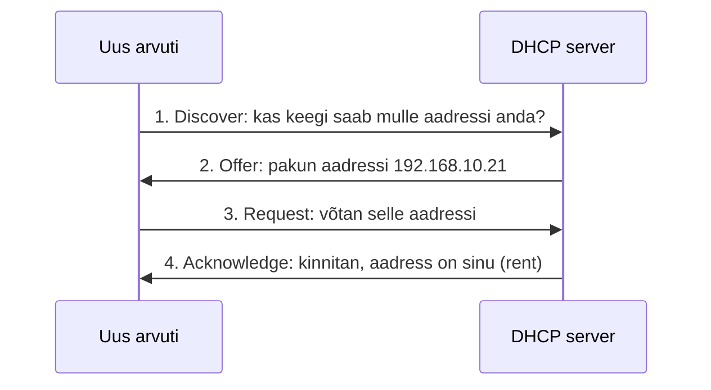

# 6. DHCP: käsitsi seadistamisest automaatikani

::: info Õpiväljund
Pärast kohtumist oskad selgitada, miks DHCP-d vaja on, seadistada ruuteril kahe võrgu aadressipoolid ning kontrollida, et klient sai õige aadressi, maski ja gateway.
:::

::: warning Kontrollimata käsud
Käsud on tüüpilised Cisco IOS käsud. Katseta neid enne õppijatega kasutamist oma Packet Traceri versioonis.
:::

## Mis Karli keskuses nüüd juhtub?

Viiendal kohtumisel andis Karl kolmele arvutile aadressid käsitsi. See oli kerge. Nüüd on keskusesse tulemas **kümme uut arvutit**. Kümme korda sama protseduur:

1. ava arvuti seadistus;
2. kirjuta IP;
3. kirjuta mask;
4. kirjuta gateway;
5. kirjuta DNS.

Kümme arvutit, neli andmetükki, neljakümne sisestuse jooksul on **vea tõenäosus** suur. Üks vale number ja arvuti ei tööta. Karl vajab viisi, kuidas arvutid saaksid need andmed **ise**.

## DHCP

**DHCP** (*Dynamic Host Configuration Protocol*) on teenus, mis annab arvutile võrguandmed automaatselt. Analoogia: hotelli vastuvõtt. Saabuja ei vali ise tuba, vaid vastuvõtt annab talle toa ja võtme. DHCP-s "toa number" on **IP-aadress** ja "võti" on ülejäänud võrguandmed.

Analoogial on piir. Hotelli klient valib tihti toa ise. DHCP-s valib aadressi alati server, kliendil sõnaõigust ei ole.

### Neli andmetükki

DHCP annab kliendile **nelja asja**:

| Andmetükk | Milleks |
| --- | --- |
| **IP-aadress** | Seadme enda aadress |
| **Mask** | Näitab, mis on sama võrk |
| **Gateway** | Tee teise võrku (ruuteri aadress) |
| **DNS-server** | Aadress, kust nimi muudetakse aadressiks (seda kasutame järgmisel kohtumisel) |

### Rent

DHCP annab aadressi **rendile**, mitte igaveseks. Kui seade võrgust lahkub (näiteks sülearvuti suletakse), vabaneb aadress mõne aja pärast teisele. Seetõttu ei jää "igavesti kasutatud" aadresse kuhjuma.

## Kuidas DHCP töötab (lühidalt)

Uus arvuti ei tea veel midagi, ei ka DHCP-serveri aadressi. Seepärast kutsub ta **kõigile**: "Kas keegi saab mulle aadressi anda?" Server vastab aadressiga, arvuti kinnitab ja server märgib aadressi kasutusse võetuks. See on neli sammu:



Neid nelja ingliskeelset sõna (*Discover, Offer, Request, Acknowledge*) näed ka Packet Traceri Simulation Mode'is. Meie laboris on DHCP-serveriks **ruuter**. Päris võrkudes on sageli ka eraldi server, aga põhimõte on sama.

## Poolid, vahemikud ja välistused

**Pool** on aadresside kogum, mida server tohib välja anda. Meie aadressiplaani järgi (vt [kohtumine 4](./kohtumine-04-ipv4-ja-aadressiplaan)):

| Võrk | Pool | Välistada |
| --- | --- | --- |
| Gaming | 192.168.10.0/24 | .1–.20 (taristu) ja .201–.254 |
| Staff | 192.168.20.0/24 | .1–.20 (server `.10`) ja .201–.254 |

**Välistus** tähendab, et server **ei anna** neid aadresse välja. Miks?

- `.1–.20` on reserveeritud ruuterile ja serveritele. Kui DHCP annaks serveri aadressi `192.168.20.10` mõnele arvutile, tekiks **aadresside konflikt**.
- `.201–.254` jätame varuks. Siis väljastatav vahemik on täpselt `.21–.200`, nagu tabelis.

## Seadistamine

Ava `05-lan-routing.pkt`, salvesta uue nimega `06-dhcp.pkt`.

Ruuteri CLI-s:

```text
enable
configure terminal
ip dhcp excluded-address 192.168.10.1 192.168.10.20
ip dhcp excluded-address 192.168.10.201 192.168.10.254
ip dhcp excluded-address 192.168.20.1 192.168.20.20
ip dhcp excluded-address 192.168.20.201 192.168.20.254
ip dhcp pool GAMING
 network 192.168.10.0 255.255.255.0
 default-router 192.168.10.1
 dns-server 192.168.20.10
 exit
ip dhcp pool STAFF
 network 192.168.20.0 255.255.255.0
 default-router 192.168.20.1
 dns-server 192.168.20.10
 exit
end
```

| Käsk | Mida teeb |
| --- | --- |
| `ip dhcp excluded-address A B` | Välistab aadressid A kuni B väljastamisest |
| `ip dhcp pool GAMING` | Loob pooli nimega GAMING |
| `network 192.168.10.0 255.255.255.0` | Mis aadressid kuuluvad poolile |
| `default-router 192.168.10.1` | Mis gateway antakse kliendile |
| `dns-server 192.168.20.10` | Mis DNS antakse kliendile |

Pane tähele: `dns-server` aadress `192.168.20.10` on **serveri aadress**, mida me veel ei ole ehitanud. Nüüd me **kirjutame selle plaani**. Selle kasutamise kontrollime järgmisel kohtumisel.

## Kliendi seadistamine ja kontroll

1. Ava `Henri-PC` → Desktop → **IP Configuration**.
2. Vali **DHCP** (Static asemel).
3. Mõne hetke pärast peaks arvuti saama aadressi.

Kontrolli arvutil:

```text
ipconfig
```

Peab olema aadress vahemikus `192.168.10.21` kuni `.200`, mask `255.255.255.0`, gateway `192.168.10.1` ja DNS `192.168.20.10`.

Kontrolli ruuteril:

```text
show ip dhcp binding
```

Näed, millised aadressid on välja antud ja kellele (MAC-aadress).

Tee sama `Mirjam-PC`-ga ja kontrolli, et ta sai `192.168.20.x` aadressi.

Lõpuks proovi: `ping` Henri arvutist Mirjami arvutisse (nüüd uue aadressiga).

## Mis juhtuks, kui…

Ühe vea harjutamine:

1. Eemalda Henri arvutil DHCP-lt ja pane aadressiks käsitsi `192.168.10.1` (ruuteri aadress). Mis tuleb: aadresside konflikt (`192.168.10.1` on juba ruuteril). Mängijale paistab see nii: võrk **vahelduvalt töötab**.
2. Lisa teadlikult **vale** `default-router`. Mis juhtub: klient saab aadressi, aga **teise võrku** ei pääse.

Kirjuta üles, mida kummagi järel nägid.

## Esitatav töö

- Fail `06-dhcp.pkt`.
- Kliendi saadud IP, mask, gateway (ekraanipilt või kirjutatud `ipconfig` tulemus).
- Üks lause DHCP seadistuse kohta: mis on pool, mis on välistus, miks need vajalikud on.

**Kontroll:** mõlema võrgu klient saab õige aadressi ja suhtleb teise LAN-iga.

## Kokkuvõte

| Mõiste | Tähendus |
| --- | --- |
| DHCP | Teenus, mis annab arvutile võrguandmed automaatselt |
| Pool | Aadresside kogum, mida DHCP väljastab |
| Välistus | Aadressid, mida DHCP **ei** väljasta |
| Rent | Aadress antakse ajutiselt, mitte igaveseks |
| `show ip dhcp binding` | Näitab välja antud aadresse |
