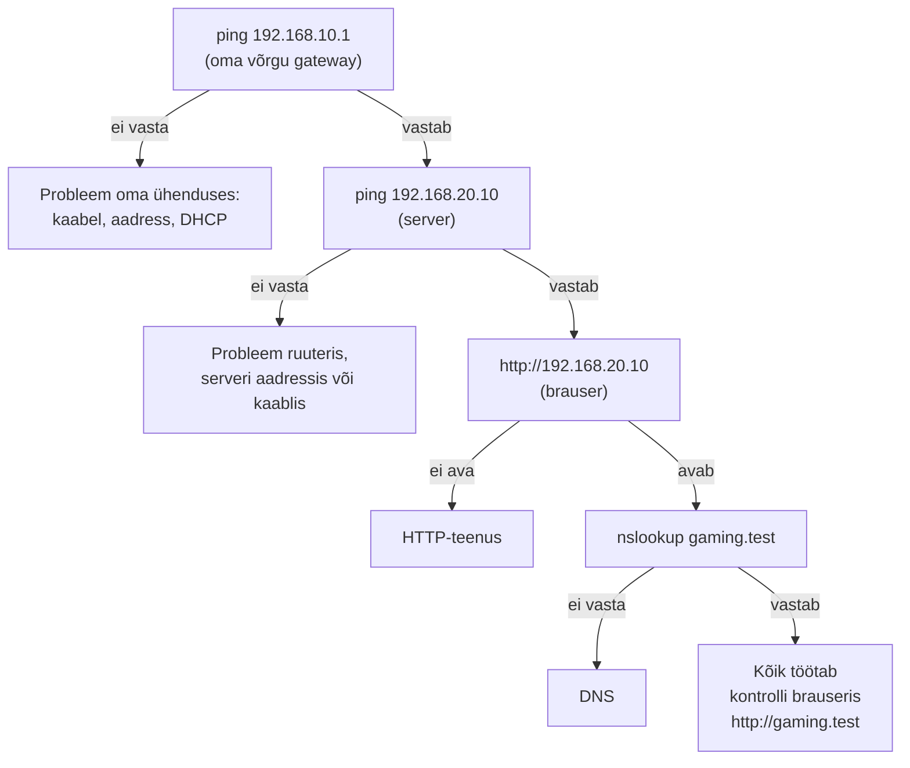

# 7. Sisemine server: HTTP kõigepealt, DNS seejärel

::: info Õpiväljund
Pärast kohtumist oskad seadistada serveri staatilise aadressiga, teha veebilehe kättesaadavaks IP kaudu, seejärel nime kaudu, ning eristada IP-ühenduse, HTTP-teenuse ja DNS-i viga.
:::

::: warning Kontrollimata tegevused
Serveri **Services** vaated ja nupud on kirjutatud Packet Traceri tavapärase kasutajaliidese järgi. Kontrolli neid oma versioonis enne õppijatega kasutamist.
:::

## Mis Karli keskuses nüüd juhtub?

Mirjam tahab, et mängijad näeksid broneeringute lehte. Karl lisab serveri Staff võrku ja paneb sinna lihtsa lehe. Kõigepealt proovitakse seda **numbriga** (IP kaudu). Mängijad aga ei taha numbreid meelde jätta. Nad tahavad kirjutada `gaming.test`. Selleks on vaja kolmandat asja, nimeteenust.

Sellel kohtumisel ehitame mõlemad ja õpime kontrollima, **kumb osa** on katki, kui midagi ei tööta.

## Kolm eri asja

| Asi | Mida see teeb | Kuidas kontrollida |
| --- | --- | --- |
| **IP-ühendus** | Paketid jõuavad seadmeni | `ping 192.168.20.10` |
| **HTTP-teenus** | Server vastab veebilehega | Ava brauseris `http://192.168.20.10` |
| **DNS** | Nimi muudetakse aadressiks | Ava brauseris `http://gaming.test` |

**HTTP** (*HyperText Transfer Protocol*) on veebilehtede keel: brauser küsib ja server vastab lehega. **DNS** (*Domain Name System*) on nimeraamat: mängija kirjutab nime, arvuti küsib DNS-ilt "mis on `gaming.test` aadress?" ja saab vastuseks numbri.

Analoogia: telefoniraamat. Sa tead nime, aga helistamiseks on vaja numbrit. Raamat annab numbri. DNS on see raamat.

Analoogia piir: DNS ei "leia inimest". Ta ütleb ainult aadressi. Kui server on välja lülitatud, annab DNS ikka õige aadressi, aga serverist vastust ei tule.

## 1. samm: serveri lisamine

Ava `06-dhcp.pkt` ja salvesta `07-services.pkt`.

1. Lisa **End Devices → Server**. Nimeta `SRV-Staff`.
2. Ühenda `SW-Staff` kommutaatoriga sirge kaabliga.
3. Serveri aadress **peab olema kindel**, sest kõik teised arvutid peavad seda leidma. Ava **Desktop → IP Configuration**, vali **Static**:
   - IP: `192.168.20.10`
   - Mask: `255.255.255.0`
   - Gateway: `192.168.20.1`
   - DNS: `192.168.20.10` (server on ka ise DNS-server)

Miks mitte DHCP? DHCP võib aadressi hiljem **muuta**, siis ei leia keegi enam serverit. Seepärast on `.10` DHCP-st välistatud (kohtumine 6).

**Kontroll:** Henri arvutist `ping 192.168.20.10`.

## 2. samm: HTTP veebilehe lisamine

1. Ava server → **Services** → **HTTP**.
2. Veendu, et HTTP on **On**.
3. Muuda `index.html` sisu lihtsaks leheks:

```html
<html>
  <body>
    <h1>Karli mängukeskus</h1>
    <p>Broneeringud täna: arvuti 1 (Henri), arvuti 2 (Kadri)</p>
  </body>
</html>
```

Lehe ilu ei ole võrgunduse oluline osa, piisab lihtsast tekstist.

**Kontroll:** Henri arvutil ava **Desktop → Web Browser** ja kirjuta `http://192.168.20.10`. Peab avanema leht.

## 3. samm: DNS-kirje

1. Ava server → **Services** → **DNS**. Veendu, et DNS on **On**.
2. Lisa kirje: **Name** `gaming.test`, **Address** `192.168.20.10`. Vajuta **Add**.

**Kontroll:** Henri arvutil ava brauseris `http://gaming.test`. Peab avanema sama leht.

Kui nimi ei avane, aga IP avaneb, on viga **nimeteenuses**, mitte võrgus.

## 4. samm: uuendame DHCP rendi

Kui arvuti sai DHCP-st aadressi juba enne, kui serveri DNS oli seadistatud, võib tal DNS-aadress puududa. Uuenda arvuti seadistust: lülita **IP Configuration** vaates DHCP-lt Static'ile ja tagasi DHCP-le. Siis küsib arvuti andmed uuesti.

Kontrolli `ipconfig` tulemusest, et DNS on `192.168.20.10`.

## ICMP ja diagnostikakäsud

Kui midagi ei tööta, pead leidma, **kus** ahel katki on. Selleks kasutame käske, mis põhinevad **ICMP**-l (*Internet Control Message Protocol*). See ei kanna kasutaja andmeid. See on võrguseadmete oma teateprotokoll: "kas oled seal?", "sihtkoht ei ole kättesaadav".

| Küsimus | Käsk (arvuti Command Prompt) | Mida näitab |
| --- | --- | --- |
| Kas sihtkoht vastab? | `ping 192.168.20.10` | Vastus ja aeg (ms), kadunud paketid |
| Mis aadress on sellel nimel? | `nslookup gaming.test` | DNS-i vastus ja server, kellelt see tuli |
| Mis teed pakett läheb? | `tracert 192.168.20.10` | Kõik hüpped sihtkohani |

Kasuta neid **alt üles**, nagu ehitasid võrku:



Kui `ping` serveri aadressile töötab, aga `http://gaming.test` ei ava, siis võrk on korras ja viga on **nimeteenuses**.

::: warning Vastuseta ping ei tähenda, et server ei tööta
Mõned seadmed ja tulemüürid on seadistatud ICMP-le **mitte vastama**. `tracert` väljundis näed siis ridu `* * *`. Ainult vastuseta ping ei ole tõend, et seade või veebiteenus ei tööta. Kontrolli ka teisel viisil, näiteks brauseris. Seda mõtet kasutame ka kohtumisel 10, kui tõendame, et Guest ei pääse serverisse: ainult "ping ei vasta" ei tõenda midagi.
:::

## Veaotsing: kus on viga?

Allolev tabel on selle kohtumise kõige tähtsam tööriist.

| Sümptom | Tõenäoline põhjus | Mida teha |
| --- | --- | --- |
| `ping` serverisse ei tööta | IP-ühendus (kaabel, aadress, gateway, ruuter) | Vaata `ipconfig`, kaablite tulesid, ruuteri liideseid |
| `ping` töötab, `http://192.168.20.10` ei avane | HTTP-teenus on välja lülitatud või puudub | Ava serveri **Services → HTTP** |
| `http://192.168.20.10` avaneb, `http://gaming.test` ei avane | DNS | Kontrolli DNS-kirjet ja arvuti DNS-aadressi |
| Töötab Staff arvutil, ei tööta Gaming arvutil | Gateway või ruuter | Kontrolli Gaming arvuti gateway'd |

## Mis juhtuks, kui…

Proovi kolme viga ja kirjuta, mida mängija näeks:

1. DNS-kirje kustutatud. Mängija kirjutab `gaming.test` ja leht ei avane. Aga IP kaudu avaneb. Mängija ei saa aru, miks, kuni Karl selle ära parandab.
2. HTTP välja lülitatud. `ping` töötab, leht ei avane.
3. Serveri aadress muudetud DHCP-ks (nii et ta saab uue aadressi). DNS-kirje viitab nüüd vanale aadressile. Mida mängija näeb?

## Esitatav töö

- Fail `07-services.pkt`.
- Brauserikontroll **mõlemast võrgust** (Gaming ja Staff): ekraanipilt või kirjeldus, et leht avaneb nii IP kui nime kaudu.
- Lühike selgitus oma sõnadega: kuidas eristada IP-ühenduse, HTTP-teenuse ja DNS-i viga.

## Kokkuvõte

| Mõiste | Tähendus |
| --- | --- |
| Server | Seade, mis pakub teenust |
| HTTP | Veebilehtede protokoll |
| DNS | Nimeraamat: nimi → aadress |
| Staatiline aadress | Käsitsi määratud, ei muutu |
| DNS-kirje | Üks rida nimeraamatus: nimi ja aadress |
