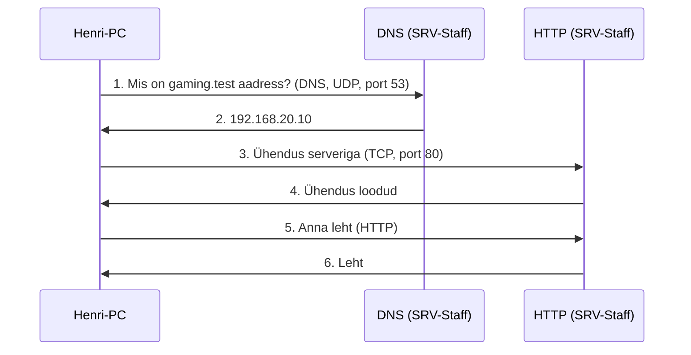
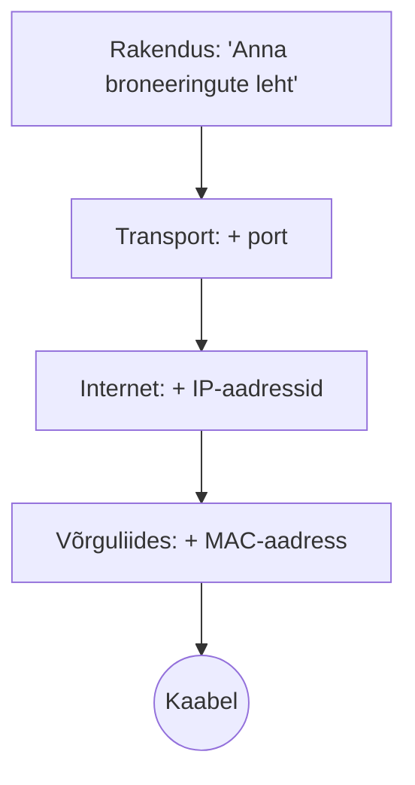
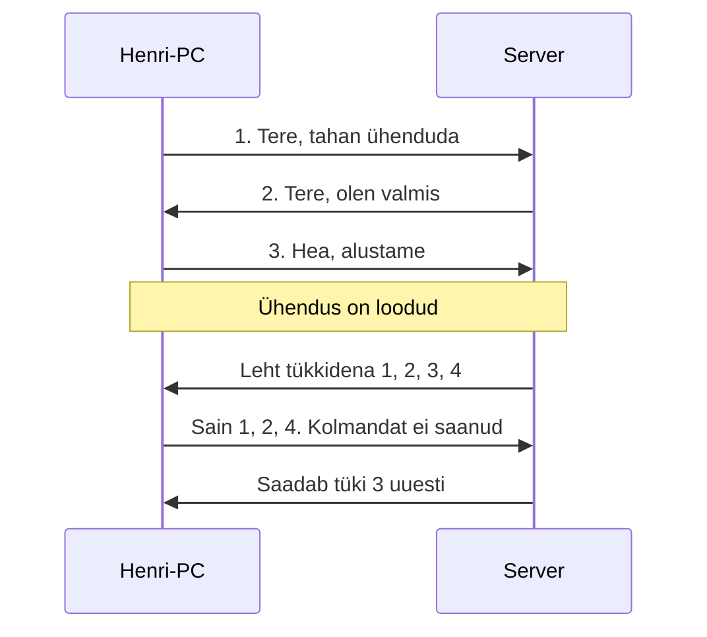
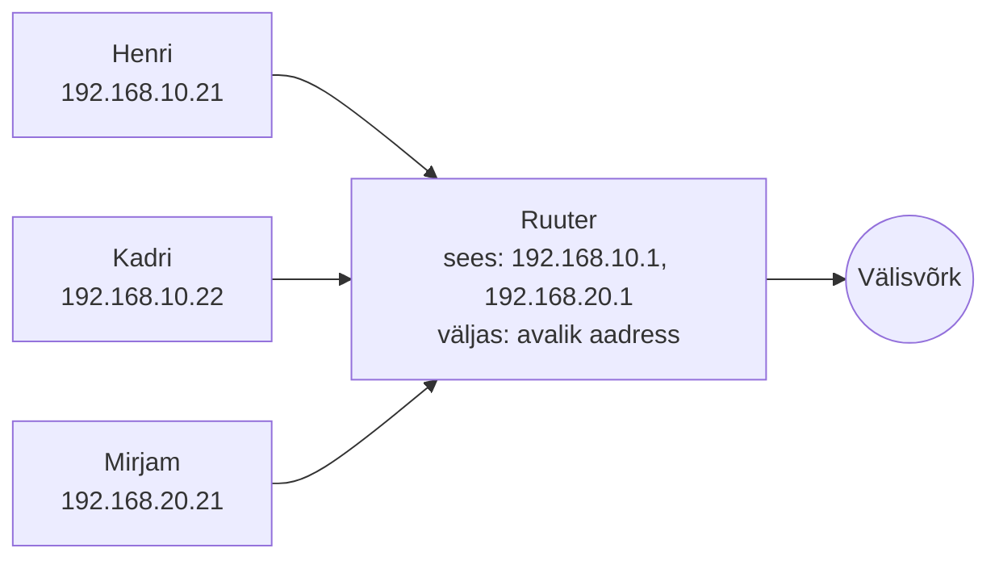

# 8. Päringu vaatlemine ja välisvõrgu lisamine

::: info Õpiväljund
Pärast kohtumist oskad Simulation Mode'is jälgida DNS-i ja HTTP päringut, eristada nime lahendamist ja veebipäringut, seostada teenuse, transpordiprotokolli, pordi, IP ja MAC-aadressi ning selgitada välisvõrgu rolli.
:::

::: warning Kontrollimata osa
Välisvõrgu failid (`08-start.pkt` jne) valmistab ette õpetaja. Selle kohtumise sammud tuleb enne õppijatega kasutamist labori piloodis üle kontrollida. Pakettide kuvamise nimed on kirjutatud tavapärase Packet Traceri kasutajaliidese järgi.
:::

## Mis Karli keskuses nüüd juhtub?

Karli keskuses töötab nüüd leht `gaming.test`. Henri küsib: "Aga mis juhtub, kui ma kirjutan `gaming.test` ja vajutan Enter? Kuidas mu arvuti teab, kuhu minna?"

Täna ei ehita me midagi uut. Me **vaatame**, mis juhtub, ühe päringu kaupa. Seejärel lisame keskuse võrgule **välisvõrgu**.

## Simulation Mode

Packet Traceri paremas alumises nurgas on kaks režiimi. **Realtime** on tavaline töö. **Simulation** aeglustab võrku ja näitab iga paketi teekonda **sündmus sündmuse haaval**. See on nagu aegluubis video.

Kuidas kasutada:

1. Lülitu **Simulation** režiimile.
2. Ava **Edit Filters** (filtrite redigeerimine) ja jäta nähtavale ainult DNS, HTTP, TCP, UDP, ICMP, ARP. Vähem müra.
3. Ava Henri arvutil **Web Browser** ja kirjuta `http://gaming.test`.
4. Vajuta **Auto Capture / Play** või **Capture / Forward** nuppu, et paketid samm-sammult liiguksid.
5. Klõpsa paketile (värviline ümbrik), et näha selle sisu.

Paketi vaates saad vaadata, mida iga kiht (rakendus, transport, võrk, ühendus) paketile lisas.

## Lugu samm-sammult

Henri kirjutab brauserisse `http://gaming.test`. Mis juhtub?



| Samm | Mis juhtub | Protokoll |
| --- | --- | --- |
| 1–2 | Henri arvuti küsib **nimeraamatust** aadressi | **DNS** |
| 3–4 | Arvuti **loob ühenduse** serveriga | **TCP** |
| 5–6 | Brauser küsib lehte ja server saadab selle | **HTTP** |

Nii näed, et "veebilehe avamine" on tegelikult **kaks päringut**: kõigepealt nimi, siis leht. Kui esimene ebaõnnestub, ei jõua arvuti teise sammuni, ja see on nii, nagu kohtumisel 7 harjutasid.

## Kihid: kes mida teeb?

Mõtle, kuidas toimiks suure firma postisaatmine. Direktor kirjutab kirja ega tea, kuidas posti veetakse. Sekretär paneb kirja ümbrikusse ja kirjutab peale aadressi. Postkontor otsustab, milline veoauto kirja viib. Autojuht teab ainult teed. Igaüks teeb **oma ülesande** ja annab töö edasi. Keegi ei pea teadma teiste tööd.

Võrk töötab samamoodi. Iga **kiht** on üks töö. Tänu sellele saab ühe kihi välja vahetada (kaabli WiFi vastu), ilma et teised muutuksid. Brauser ei tea, kas Henri on kaabli või WiFi küljes.

Päris internet töötab nelja kihi järgi (**TCP/IP mudel**). Vaatame, mis juhtub Henri arvutis, kui ta vajutab Enter:

| Samm | Kiht | Kes seda teeb | Henri näites |
| --- | --- | --- | --- |
| 1 | **Rakendus** | Brauser | Koostab päringu "anna broneeringute leht". Siin on HTTP ja DNS |
| 2 | **Transport** | Operatsioonisüsteem | Jagab päringu pakettideks ja lisab **pordi**: mis programm sihtkohas vastab. Siin otsustatakse, kas kadunud paketid saadetakse uuesti (TCP) |
| 3 | **Internet** | Operatsioonisüsteem | Kirjutab paketile **IP-aadressid**: Henri arvuti ja server |
| 4 | **Võrguliides** | Võrgukaart | Paneb paketi kaabli peale. Kasutab **MAC-aadressi**: kes on järgmine seade selles kohalikus võrgus (Henri puhul ruuter) |

Iga kiht paneb andmetele ümber oma **ümbriku** koos oma aadressiga. Sihtkohas võtab iga kiht oma ümbriku maha, kuni veebiserver saab sisu kätte.



**Kihid aitavad vigu leida.** Kui midagi ei tööta, küsi alt üles:

| Küsimus | Kui vastus on "ei" | Kiht |
| --- | --- | --- |
| Kas kaabel on sees ja tuli roheline? | Füüsiline probleem | Võrguliides |
| Kas arvutil on õige IP ja kas `ping` ruuterile töötab? | Aadressi- või ruuteriprobleem | Internet |
| Kas õige teenus kuulab õigel pordil? | Teenus või tulemüür | Transport |
| Kas nimi muutub aadressiks ja leht avaneb? | Rakenduse probleem | Rakendus |

Sama järjekorda kasutasid kohtumisel 7.

## TCP ja UDP

Mõlemad on **transpordiprotokollid**: nad hoolitsevad pakettide kohaletoimetamise eest. Nad töötavad erinevalt.

**TCP** loob enne andmete saatmist **ühenduse**, kolme sammuga, ja kinnitab iga tüki kättesaamist:



Seda näed Simulation Mode'is, kui jälgid TCP pakette.

| | TCP | UDP |
| --- | --- | --- |
| **Võrdlus** | Tähitud kiri: saaja kinnitab kättesaamist | Postkaart: lähed ja loodad parimat |
| **Ühendus** | Luuakse enne andmeid | Ei looda, lihtsalt saadetakse |
| **Kinnitus** | Jah, kaotatud paketid saadetakse uuesti | Ei |
| **Kasutus** | Veebileht, e-post, failid | DNS päring, DHCP, mõned mängud ja videokõned |

**Analoogia piir:** TCP ei ole "kiirem" ega UDP "halvem". TCP annab **usaldusväärsuse** (kõik jõuab kohale õiges järjekorras), UDP annab **väiksema viivituse** (ei oota kinnitust). Reaalajamängus on viivitus tihti olulisem kui ühe kaduma läinud paketi uuesti saatmine: kui sekundi tagune asend jõuaks hilja kohale, ei vaja seda enam keegi.

## Port

Server pakub mitut teenust korraga, aga ta on ainult üks seade ühe IP-ga. **Port** on number, mis ütleb, **milline teenus** pakettidele vastab. Mõtle hoonele (IP-aadress) ja kontori numbritele (pordid).

| Teenus | Transport | Port |
| --- | --- | --- |
| HTTP (veebileht) | TCP | 80 |
| DNS | UDP | 53 |
| DHCP (server / klient) | UDP | 67 / 68 |

Henri päring serverisse näeb välja nii:

```text
Henri arvuti:  192.168.10.21  port 52814   →   Server:  192.168.20.10  port 80
```

- **Sihtport 80** tähendab: "tahan rääkida veebiserveriga".
- **Lähteport 52814** on juhuslik number, mille Henri arvuti selleks päringuks valis. Nii teab arvuti, et vastus kuulub just sellele brauseri vahelehele, mitte mõnele teisele programmile.

(Aadressid ja pordi number on näited. Simulation Mode näitab sinu päris numbreid.)

## Kolm aadressi: MAC, IP ja port

Pakett vajab **kolme erinevat aadressi**, sest igaüks vastab eri küsimusele:

| Aadress | Vastab küsimusele | Henri näites |
| --- | --- | --- |
| **MAC-aadress** | Kes on järgmine seade siin kohalikus võrgus? | Ruuter |
| **IP-aadress** | Kes on lõppsihtkoht? | Server (`192.168.20.10`) |
| **Port** | Milline programm seadmes seda pakki saab? | Veebiserver (port 80) |

Lihtne võrdlus on kuller, kes viib paki suurde büroohoonesse. **IP-aadress** on hoone aadress tänaval. **Port** on kontori number hoones. **MAC-aadress** on uksehoidja nimi, kellele kuller paki esimesena annab.

**MAC-aadress** on võrgukaardi unikaalne aadress, mis on valmistatud kaardi sisse. See on kuus paari tähti ja numbreid, näiteks `3C:22:FB:A1:5E:90`. Esimesed kolm paari näitavad tootjat. MAC-aadress kehtib **ainult kohalikus võrgus**.

**Põhireegel:** **sihtkoha IP-aadress** viitab lõppsihtkohale ja jääb kogu teekonna vältel samaks. **MAC-aadress** viitab järgmisele seadmele ja muutub igal hüppel. Henri paketi teekond serverini:

| Hüpe | Lähte IP | Siht IP | MAC |
| --- | --- | --- | --- |
| Henri-PC → ruuter | 192.168.10.21 | 192.168.20.10 | Henri kaart → ruuteri Gaming liides |
| Ruuter → server | 192.168.10.21 | 192.168.20.10 | Ruuteri Staff liides → serveri kaart |

IP-aadressid on kahel hüppel samad, MAC-aadressid on erinevad. **Proovi seda ise:** klõpsa Simulation Mode'is paketile ruuteri kohal ja võrdle MAC-aadresse enne ja pärast ruuterit. Kirjuta, mida nägid.

**ARP** on teenus, mis küsib "kes on selle IP-aadressi MAC?" kohalikus võrgus. Seetõttu oli kohtumise 5 esimene ping vahel aeglane.

## OSI mudel: sama lugu, rohkem sammudega

::: tip Kui aega napib
Selle osa võid ka kodus läbi lugeda. Tunnis piisab, et leiad Simulation Mode'is paketi vaatest OSI kihid üles.
:::

**OSI-mudel** kirjeldab sama protsessi **seitsme kihina**. Nelja kihi lugu on praktiline, OSI on peenem jaotus, mida kasutatakse võrgust rääkides ja vigade otsimisel. Packet Traceri paketivaates on OSI kihid nimetatud. Kihte ei pea pähe õppima, tuleb tunda seost.

| OSI kiht | Lihtsalt öeldes | Henri näites | TCP/IP kiht |
| --- | --- | --- | --- |
| 7. Rakendus | Programm, mida kasutaja näeb | Brauser küsib lehte (HTTP) | Rakendus |
| 6. Esitus | Andmete vorming ja krüpteerimine | Meie laboris lihtsalt tekst | Rakendus |
| 5. Seanss | Suhtluse alustamine ja lõpetamine | Ühenduse avamine ja sulgemine | Rakendus |
| 4. Transport | Pordid, pakettideks jagamine, uuesti saatmine | Port 80, TCP | Transport |
| 3. Võrk | IP-aadressid ja tee leidmine võrkude vahel | Henri IP ja serveri IP, ruuter valib tee | Internet |
| 2. Andmeside | Kohalik edastus, MAC-aadressid | Henri arvuti → ruuter (MAC) | Võrguliides |
| 1. Füüsiline | Signaal kaablis või õhus | Kaabli elekter | Võrguliides |

OSI kolm ülemist kihti (5, 6, 7) on TCP/IP-s üks "rakendus", kaks alumist (1, 2) üks "võrguliides".

## Mis juhtuks, kui…

Tee Simulation Mode'is kaks katset ja kirjuta, millise sammu juures pakett peatub:

1. Muuda Henri arvutil DNS-serveri aadress valeks (nt `192.168.20.99`) ja ava `http://gaming.test`. DNS-päring läheb teele, vastust ei tule ja HTTP-päringuni ei jõuta. `http://192.168.20.10` avaneb ikka.
2. Lülita serveril HTTP välja ja ava `http://192.168.20.10`. DNS-i selles ei kasutata. TCP ühendus ei õnnestu või leht ei tule.

Vaata mõlemal juhul, **milline pakett kaob** ja kus. Nii näed oma silmaga, miks "leht ei avane" võib tähendada mitut erinevat asja.

## Välisvõrgu lisamine

Seni oli kõik keskuse sees. Nüüd ühendame keskuse **välisvõrguga**.

**Välisvõrk** on keskuse väline osa. Packet Traceris simuleerib seda õpetaja ettevalmistatud osa: internetipakkuja ruuter ja väline test-server, kus on DNS ja veebileht. See **ei ole päris internet**, vaid simulatsioon. Dokumentatsiooni jaoks mõeldud aadressid (näiteks vahemik `203.0.113.0/24`, mis on spetsiaalselt näidete jaoks reserveeritud) ei ole tegelike seadmete aadressid.

Sinu ülesanne ei ole välisvõrku **nullist ehitada**. Pead aru saama:

- mis on välisvõrgu roll ("sinu keskuse võrk jõuab teise võrku");
- kuidas keskuse ruuter seda ühendab (keskuse ruuteril on **neljas liides**, mis viib välja);
- milliseid seadmeid õpetaja on lisanud (märgitud skeemil).

### Privaatne ja avalik aadress: NAT

Keskuse aadressid (`192.168.x.x`) on **privaataadressid**: need kehtivad ainult kohalikus võrgus (vt [kohtumine 4](./kohtumine-04-ipv4-ja-aadressiplaan)). Internetis neid ei marsruudita. Kuidas siis Henri pääseb välisvõrku?

Ruuter töötab vahendajana. Kui Henri päring läheb välja, kirjutab ruuter selle peale **oma avaliku aadressi** ja jätab meelde, kes selle saatis. Vastus tuleb ruuterile ja ruuter annab selle Henrile. Seda nimetatakse **NAT-iks** (*Network Address Translation*). Seepärast paistavad kõik keskuse arvutid välisvõrgus **üheainsa** aadressiga.



Selles laboris on NAT või selle sarnane lahendus **õpetaja poolt ette valmistatud**. Sina pead aru saama, et see on olemas ja miks, ei pea seda nullist seadistama.

### Samm-sammult

Õpetaja annab kas:

- **kontrollitud vahefaili** (`08-start.pkt`), kuhu kantakse sinu senised seadistused õpetaja juhise järgi, või
- **valmis stardifaili** välisvõrguga.

Seejärel kontrollid:

1. Skeemil on välisvõrk märgitud ja eristatud keskuse võrgust.
2. Keskuse ruuteri liides välisvõrgu suunas on **up**.
3. Henri arvutist `ping` välisvõrgu testserverisse.
4. Henri arvutist avaneb brauseris välise teenuse leht nime kaudu (nime annab õpetaja).

## Esitatav töö

- Fail `08-external.pkt`.
- Kommenteeritud päringuteekond: Henri avab `gaming.test`. Kirjuta tabelina sammud (DNS, TCP, HTTP), igal sammul teenus, transpordiprotokoll, port ja IP.
- Töötav väline testleht Henri arvutist.
- Lühike selgitus: mille poolest erineb välisvõrk "päris internetist"?

**Kontroll:** seosta teenus, transpordiprotokoll, port, IP ja MAC.

## Kokkuvõte

| Mõiste | Tähendus |
| --- | --- |
| Simulation Mode | Näitab pakettide teekonda sündmuse haaval |
| TCP | Usaldusväärne, kinnitusega |
| UDP | Kinnituseta, väiksem viivitus |
| Port | Number, mis näitab teenust serveris |
| MAC-aadress | Seadme aadress kohalikus võrgus |
| ARP | "Kes on selle IP-aadress MAC?" |
| NAT | Ruuter tõlgib privaataadressid ühe avaliku alla |
| Kiht | Üks ülesanne võrgus (rakendus, transport, internet, võrguliides) |
| OSI | Seitsmekihiline selgitusmudel, TCP/IP on neljakihiline |
| Välisvõrk | Keskuse välised ühendused (laboris simuleeritud) |
