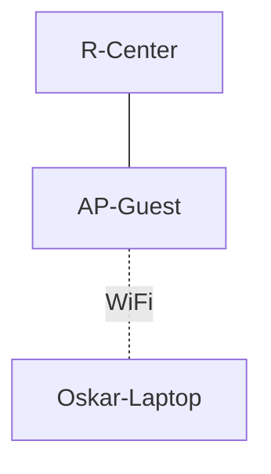

# 9. Guest WiFi ehitamine

::: info Õpiväljund
Pärast kohtumist oskad lisada eraldi aadressivahemikuga juhtmevaba külalisvõrgu, seadistada WiFi kaitse ning kontrollida, et külaline saab aadressi ja jõuab välise teenuseni.
:::

::: danger Kavandatud, mitte läbi proovitud
See kohtumine on kavandatud plaani järgi, kuid ei ole veel konkreetses Packet Traceri failis kontrollitud. Pääsupunkti mudel, sülearvuti WiFi-moodul ja ruuteri liidesed vajavad piloodis kinnitamist. Ära kasuta seda õppijatega enne läbikatsetamist.
:::

## Mis Karli keskuses nüüd juhtub?

Oskar tuleb keskusesse oma sülearvutiga ja küsib: "Mis on WiFi parool?" Karl annab talle Mirjami WiFi parooli, sest ta ei oska muud teha. Mirjam ehmub: nüüd on Oskar Staff võrgus ja näeb serverit.

Karl otsustab: **külalistele oma võrk**. Täna ehitame selle. **Aga:** ehitamine ei ole veel kaitse. Selle kohtumise lõpuks on külalisvõrk eraldi, aga **ligipääsupiirang** tuleb kohtumisel 10. Seda võrku ei nimeta me veel turvaliseks.

## Mida vaja on

| Osa | Mida teeb |
| --- | --- |
| **Pääsupunkt** (*access point*) | Raadiosignaal, mis ühendab külalise sülearvuti kaabelvõrguga |
| **SSID** | WiFi-võrgu nimi, mida külaline näeb |
| **WPA2** | Kaitse: ilma õige paroolita ei saa ühendust. See krüpteerib ka sõnumid |
| **Ruuteri kolmas liides** | Guest võrgu oma ühendus ruuteriga |

SSID nimi **ei eralda** võrku. "Guest" nimega WiFi võib olla samas võrgus Mirjami arvutiga. Eraldab alles see, et pääsupunkt on ühendatud **eraldi ruuteri liidesega** ja sellel on oma aadressivahemik.

## Ehitamine

Ava `08-external.pkt` ja salvesta `09-guest.pkt`.



1. Lisa **Network Devices → Wireless Devices** alt pääsupunkt (nimi `AP-Guest`).
2. Ühenda `AP-Guest` ruuteri **kolmanda liidesega** (`GigabitEthernet0/2`) sirge kaabliga. **Ära** ühenda seda `SW-Staff` kommutaatorisse. See oleks sama võrk.
3. Lisa **End Devices → Laptop**, nimi `Oskar-Laptop`.

### Sülearvuti WiFi-moodul

Packet Traceri vaikimisi sülearvutil ei pruugi olla juhtmevaba moodulit. Kui nii on:

1. Ava sülearvuti → **Physical** vaade.
2. Lülita sülearvuti välja (toitenupp).
3. Eemalda olemasolev võrgumoodul ja lisa **WiFi-moodul** (nt WPC300N).
4. Lülita sülearvuti tagasi sisse.

### Ruuteri Guest liides

```text
enable
configure terminal
interface GigabitEthernet0/2
 ip address 192.168.30.1 255.255.255.0
 no shutdown
 exit
ip dhcp excluded-address 192.168.30.1 192.168.30.20
ip dhcp excluded-address 192.168.30.201 192.168.30.254
ip dhcp pool GUEST
 network 192.168.30.0 255.255.255.0
 default-router 192.168.30.1
 dns-server <välise DNS-serveri aadress>
 exit
end
```

Pane `<välise DNS-serveri aadress>` asemele **õpetaja antud aadress**. Guest kasutab **välist** DNS-i, mitte keskuse omaserverit, et külaline ei vajaks mingit erandit Staff serverisse minekuks.

### Pääsupunkti WiFi

1. Ava `AP-Guest` → **Config** → vali WiFi-port.
2. **SSID**: `Karli-Guest`.
3. **Authentication**: **WPA2-PSK**.
4. **Passphrase**: vali labori jaoks mõeldud parool. Ära kasuta oma päris parooli ega Interneti-teenuse parooli.
5. Kontrolli, et pääsupunkt on sisse lülitatud.

### Külalise sülearvuti

1. Ava `Oskar-Laptop` → **Desktop** → **PC Wireless**.
2. Vali **Connect**, leia `Karli-Guest`, sisesta parool.
3. Veendu, et sülearvuti seadistus on **DHCP**.

## Kontroll

Oskari sülearvutil:

```text
ipconfig
```

- Aadress peab olema `192.168.30.x` (vahemikus `.21–.200`).
- Gateway `192.168.30.1`.
- DNS peab olema välise DNS-serveri aadress.

Siis ava brauseris **välise testlehe** (aadress annab õpetaja). Peab avanema.

**Mida see ei tõenda:** et Oskar **ei pääse** Mirjami võrku. Seda ei ole veel seadistatud. Proovi kirjutada Oskari arvutil `ping 192.168.20.10` (serveri aadress): tulemus oleks tõenäoliselt, et **vastab**. Kirjuta see üles, see on järgmise kohtumise lähtekoht.

## Mis juhtuks, kui…

Proovi kahte viga ja kirjuta, mida Oskar näeks:

| Muudatus | Mida näed | Mida see Oskarile tähendab |
| --- | --- | --- |
| Sülearvutis on vale WiFi parool | Ühendus ei õnnestu, aadressi ei tule | "WiFi ei võta mind vastu" |
| Guest DHCP pool puudub või `default-router` on vale | Sülearvuti ühendub WiFi-ga, aga aadressi ei saa või internetti ei pääse | "WiFi on olemas, aga internet ei tööta" |

Esimene viga on **WiFi kaitse** küsimus, teine **võrgu** küsimus. Mängija, töötaja ja külaline ei eristaks neid, aga Karl peab.

## Esialgne riskikirjeldus

Nüüd, kui külalisvõrk töötab, kirjuta üles **esimene risk**:

| Mis võiks juhtuda | Kes kannatab | Mis on nõrk koht | Mis aitaks |
| --- | --- | --- | --- |
| Külaline pääseb Staff serverisse | Mirjam, mängijad | Guest ja Staff võrgu vahel ei ole piirangut | Piirangu reegel (kohtumine 10) |

## Esitatav töö

- Fail `09-guest.pkt`.
- Guest parameetrite tabel: IP, mask, gateway, DNS, SSID, krüpteering.
- Ekraanipilt või kirjeldus, kuidas külaline avas välise testlehe.
- Esimene risk (tabel ülal).

## Kokkuvõte

| Mõiste | Tähendus |
| --- | --- |
| Pääsupunkt | Juhtmevaba seade, mis ühendab külalised kaabelvõrguga |
| SSID | WiFi võrgu nimi |
| WPA2 | Krüpteering ja parool WiFi kaitseks |
| Guest võrk | Eraldi võrk, oma aadressivahemik (192.168.30.0/24) |
