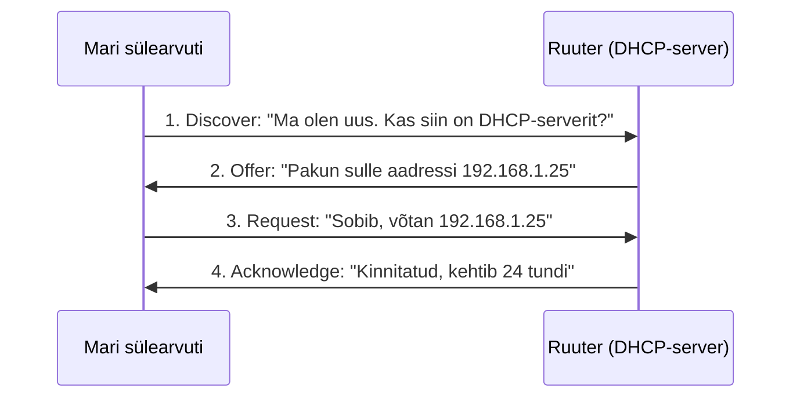
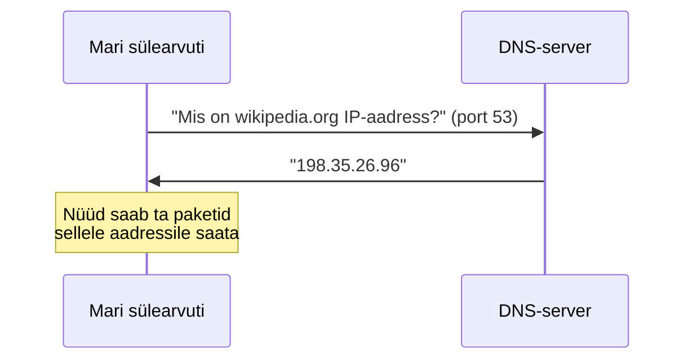
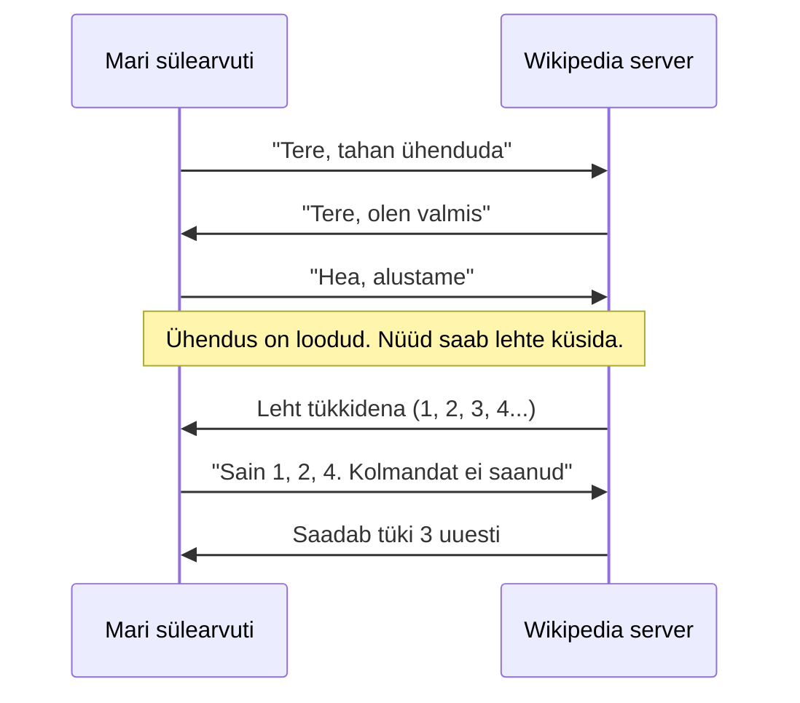
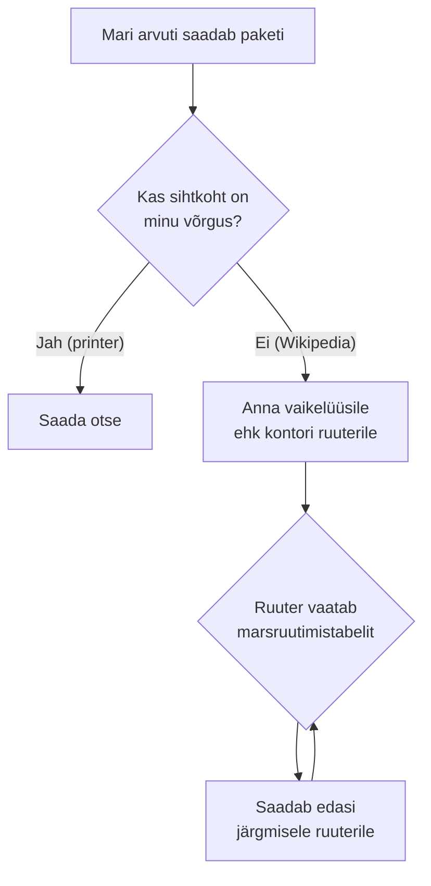
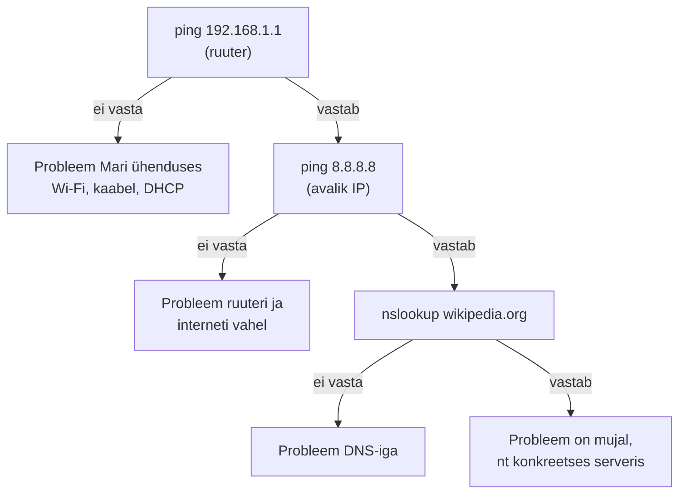

# Protokollid ja marsruutimine

::: info Õpiväljund
Pärast tundi oskad selgitada TCP, UDP, DHCP, DNS ja ICMP ülesandeid, kirjeldada paketi teekonda teise võrku ning tõlgendada `ping`, `nslookup` ja `tracert` / `traceroute` väljundit.
:::

**Protokoll** on kokkulepitud reeglite kogum, mille järgi seadmed omavahel suhtlevad. Nagu inimesed kokku lepivad, et telefonikõne algab sõnaga "tere", on ka seadmetel kokkulepped selle kohta, kuidas ühendus luuakse, andmeid saadetakse ja vigadest teatatakse.

Sellest tunnist saad kõik viis protokolli selgeks ühe päeva jooksul. Jälgime Marit tema tööpäeval ([eelmises tunnis](./vorgumudelid-ja-aadressid) tutvusime temaga). Iga protokoll tuleb mängu hetkel, kus Mari seda vajab.

## 8:30 Mari jõuab tööle: DHCP

Mari avab sülearvuti ja ühendub kontori Wi-Fi-ga. Ta ei kirjuta ühtegi numbrit. Siiski saab arvuti sekunditega kõik, mida võrgus vaja on: IP-aadressi, alamvõrgumaski, vaikelüüsi ja DNS-serveri aadressi. Seda teeb **DHCP** (*Dynamic Host Configuration Protocol*).

Mõtle hotelli vastuvõtule. Sisened uksest, vastuvõtt annab sulle toa numbri (IP-aadressi), ütleb, kus on lift (vaikelüüs), ja kasutamiseks kaardi (DNS-serveri). Sa ei pea ise tuba välja mõtlema.

Päris vestlus Mari sülearvuti ja kontori ruuteri vahel (DHCP-server on tavaliselt ruuteri sees):

Mari sai selle vestluse lõpus nelja asja:

| Mari sai | Väärtus näites | Milleks |
| --- | --- | --- |
| IP-aadress | `192.168.1.25` | Et teised teaks, kuhu talle pakette saata |
| Alamvõrgumask | `255.255.255.0` | Et ta teaks, kes on sama võrgus |
| Vaikelüüs | `192.168.1.1` | Et ta teaks, kuhu saata paketid teise võrku |
| DNS-server | `192.168.1.1` | Et ta saaks domeeninimesid IP-aadressiks tõlkida |

Aadress antakse ajutiselt (**rendile**, siin 24 tunniks). Kui Mari kontorist lahkub ja arvuti ei uuenda renti, vabaneb aadress järgmisele seadmele. DHCP kasutab UDP-d (pordid 67 ja 68).

## 8:35 Mari avab Wikipedia: DNS

Mari kirjutab `wikipedia.org`. Probleem: arvuti ei oska pakette nime järgi saata, ainult IP-aadressi järgi. Esmalt on vaja nimi tõlkida. Seda teeb **DNS** (*Domain Name System*).

DNS on nagu telefoniraamat. Sa tead sõbra nime, aga helistamiseks on vaja numbrit.

DNS-serveri aadressi sai Mari DHCP-lt (eelmine samm). Võrgus sõltuvad asjad üksteisest: kui DHCP ei tööta, siis Mari ei saa DNS-serveri aadressi ja ei saa lehti avada, isegi kui internet on olemas.

Avalikud DNS-serverid on näiteks `1.1.1.1` (Cloudflare) ja `8.8.8.8` (Google). DNS-i sisemisest ehitusest (juurserver, tippdomeen, autoriteetne server) loe [Veebiarenduse teemast](/veebiarendus/url-domeen-ja-dns).

## 8:36 Leht hakkab laadima: TCP

Nüüd teab Mari arvuti aadressi. Enne kui ta lehte küsib, loob ta Wikipedia serveriga **ühenduse**. Seda teeb **TCP** (*Transmission Control Protocol*).

TCP on nagu **tähitud kiri**. Saatja saab kinnituse, et kiri jõudis kohale. Kui midagi läheb kaduma, saadetakse see uuesti. Pealegi jõuavad tükid õiges järjekorras.

Veebilehe, e-posti ja failide puhul on see vajalik. Kui üks tükk jääks puudu, oleks leht katki või fail rikutud.

## 10:00 Mari läheb videokõnele: UDP

Kell 10 on tal Zoomi koosolek. Videokõne puhul oleks TCP kahjulik. Kujutle, et sekundi tagune heliosa kadus ja TCP hakkab seda uuesti küsima. Kogu kõne peatuks, et oodata heli, mida keegi enam ei vaja.

Siin kasutatakse **UDP**-d. UDP on nagu **postkaart**: saadad ja loodad, et jõuab. Kui postkaart kaob, ei saada keegi seda uuesti. Parem on väikese krõbinaga edasi minna kui oodata.

| | **TCP** | **UDP** |
| --- | --- | --- |
| Ühendus | Luuakse enne andmeid | Ei looda, lihtsalt saadetakse |
| Kinnitus | Jah, kadunud tükid saadetakse uuesti | Ei |
| Kiirus | Aeglasem (rohkem kontrolli) | Kiirem |
| Mari päevas | Wikipedia, e-post, failide allalaadimine | Zoomi video ja heli, DNS-päringud, DHCP |

Valik sõltub vajadusest: kui **täpsus** on olulisem kui kiirus, TCP. Kui **kiirus** on olulisem kui täpsus, UDP.

## 11:00 Kuhu Mari pakett läheb: marsruutimine

Vaatame lähemalt, kuidas Mari pakett Wikipediasse jõuab.

Kui Mari arvuti paketti saadab, otsustab ta kõigepealt alamvõrgumaski järgi, kas sihtkoht on samas võrgus (vt [eelmine tund](./vorgumudelid-ja-aadressid)).

- **Printer** `192.168.1.40`: sama võrk, pakett läheb otse.
- **Wikipedia** `198.35.26.96`: teine võrk, pakett läheb vaikelüüsile ehk ruuterile.

**Ruuter** hoiab **marsruutimistabelit**: nimekirja, millisest suunast millistesse võrkudesse pääseb. Mari ruuter ei tea Wikipedia täpset teed. Ta teab ainult: "see võrk on pakkuja suunas" ja saadab paketi järgmisele ruuterile (**hüpe**, ingl *hop*). See ruuter teeb sama otsuse uuesti. Nii liigub pakett hüppest hüppesse sihtkohani. Üldiselt on teel umbes 10–20 ruuterit.

Marsruutimisprotokolle selles kursuses ei seadistata. Oluline on põhimõte: **igal ruuteril on oma otsus järgmise hüppe kohta**, ükski ei tea kogu teed.

## 11:30 Midagi ei tööta: ICMP ja diagnostika

Mari ütleb, et leht ei avane. Sinu kui IT-inimese ülesanne on leida, kus ahel katki on. Sa kasutad **ICMP-d** (*Internet Control Message Protocol*). See ei kanna kasutaja andmeid. See on võrguseadmete oma teateprotokoll: "kas oled seal?", "sihtkoht ei ole kättesaadav", "pakett elas liiga kaua".

Diagnostika käib kolme käsuga, mis kordavad päeva loo samme:

| Küsimus | Windows | macOS / Linux | Mida näitab |
| --- | --- | --- | --- |
| Kas sihtkoht vastab? | `ping wikipedia.org` | `ping -c 4 wikipedia.org` | Vastuse aeg (ms), kadunud paketid |
| Mis IP-aadress sellel nimel on? | `nslookup wikipedia.org` | `nslookup wikipedia.org` | DNS-i vastus, millelt see tuli |
| Mis teed pakett läheb? | `tracert wikipedia.org` | `traceroute wikipedia.org` | Kõik hüpped sihtkohani |

Kuidas leiad Mari probleemi? Küsi alt üles, nagu eelmises tunnis õppisid:

Kui `ping 8.8.8.8` töötab, aga `ping wikipedia.org` mitte, siis internet on olemas ja katki on DNS. Nii väike katse annab kohe vastuse.

::: warning Vastuseta ping ei tähenda, et server ei tööta
Paljud serverid ja tulemüürid on seadistatud ICMP-le mitte vastama. Näide: `* * *` `tracert` väljundis. Ainult vastuseta ping ei ole tõend, et seade või veebiteenus ei tööta. Kontrolli ka teist moodi, näiteks brauseris.
:::

## Praktiline töö: Mari päev sinu arvutis

Tee läbi Mari päeva samad sammud oma arvutis. Kasuta ainult enda või õpetaja lubatud sihtmärke. Soovitatav sihtmärk: `wikipedia.org`.

1. **DHCP:** leia käsuga `ipconfig /all` (Windows), `ip a` (Linux) või `ifconfig` (macOS) oma IP, mask, vaikelüüs ja DNS-server. Märgi üles, kas võrk on sulle need DHCP kaudu andnud (Windowsis rida "DHCP Enabled" ja "Lease Obtained / Expires").
2. **DNS:** käivita `nslookup wikipedia.org`. Mis IP-aadress tuli? Milline DNS-server vastas?
3. **ICMP:** käivita `ping wikipedia.org`. Kui palju aega (ms) kulus? Kas mõni pakett kadus?
4. **Marsruutimine:** käivita `tracert wikipedia.org` (või `traceroute`). Mitu hüpet on teel? Kas esimene hüpe on sinu vaikelüüs?
5. **Diagnostika:** järgi ülaltoodud skeemi ja tee `ping` ruuterile (sinu vaikelüüs), seejärel `ping 8.8.8.8` ja lõpuks `ping wikipedia.org`. Mida iga samm kinnitas?
6. Kirjuta iga käsu juurde 1–2 lauset oma tõlgendusega.

**Esitatav töö:** käskude tulemused koos tõlgendusega.

## Kokkuvõte

| Protokoll | Mari päevas | Ülesanne |
| --- | --- | --- |
| DHCP | 8:30 Wi-Fi-ga ühendus | Annab IP-aadressi, maski, vaikelüüsi ja DNS-i |
| DNS | 8:35 Wikipedia avamine | Tõlgib nime IP-aadressiks |
| TCP | 8:36 Lehe laadimine | Usaldusväärne ühendus, kadunud tükid uuesti |
| UDP | 10:00 Videokõne | Kiire edastus, ei kinnita |
| Marsruutimine | 11:00 Paketi teekond | Iga ruuter valib järgmise hüppe |
| ICMP | 11:30 Probleemi otsimine | Teated ja kontroll (`ping`, `traceroute`) |

## Allikad

- [Cloudflare Learning: TCP vs UDP](https://www.cloudflare.com/learning/ddos/glossary/user-datagram-protocol-udp/)
- [Cloudflare Learning: What is DHCP?](https://www.cloudflare.com/learning/network-layer/what-is-dhcp/)
- [Cloudflare Learning: What is DNS?](https://www.cloudflare.com/learning/dns/what-is-dns/)
- [Cloudflare Learning: What is ICMP?](https://www.cloudflare.com/learning/ddos/glossary/internet-control-message-protocol-icmp/)
