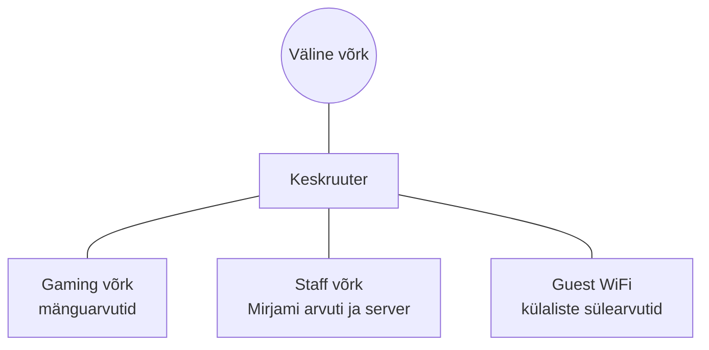

# Arvutivõrgud ja küberturvalisus

::: info Õpiväljund
Selgitad küberturbe riske ja häid tavasid nii tarkvara kui riistvara konfigureerimisel.
:::

| Tähis | Hindamiskriteerium |
| --- | --- |
| **HK 4.1** | Loetled peamised küberturberiskid tarkvara ja riistvara konfigureerimisel ning selgitad nende mõju organisatsioonile. |
| **HK 4.2** | Rakendad lihtsamaid turvameetmeid, nagu paroolipoliitika, tarkvara uuendused ja õiguste piiramine, ning dokumenteerid oma tegevused. |

Kursus koosneb **11 kohtumisest** (11 × 90 minutit). Kogu kursuse jooksul ehitad ühte projekti: **mängukeskuse võrku**. Võrku ehitad simulaatoris, mitte päris seadmetel, nii et midagi ei saa katki minna ja eksida tohib.

## Läbiv lugu: Karli mängurite tuba

**Karl** on aastaid mänginud sõpradega oma toas. Tavaliselt on kohal kaks sõpra, **Henri** ja **Kadri**, ning kolm arvutit on omavahel ühendatud. See töötab, kuni Karl otsustab teha toast päris **mängukeskuse**. Siis tekivad uued vajadused:

- mängijad tahavad **koos mängida** ja internetis surfata;
- **Mirjam** hakkab keskuses töötama. Tema vastutab broneeringute lehe eest, mis on serveris ja mida näevad ka mängijad;
- **Oskar** tuleb külla oma sülearvutiga ja tahab ainult **WiFi-t**. Ta ei tohi Mirjami arvutisse ega serverisse sattuda.

Iga kursuse tund lisab sellele loole ühe osa: kõigepealt on probleem, siis vajalik teadmine, siis ehitamine ja lõpuks kontroll, kas tulemus töötab. Kõik nimed, aadressid ja arvud on väljamõeldud.

See on lõpptulemuse üldpilt. Detailid, nagu aadressid, kaablid ja teenused, lisanduvad kohtumisest kohtumisse.

## Mida sa kursuse lõpuks annad üle

Töötav mängukeskuse võrk, mida saab avada, testida ja dokumentatsiooni järgi edasi arendada:

1. Packet Traceri fail (`.pkt`) nimetatud seadmete, ühenduste ja võrkudega.
2. Füüsiline ühendusskeem ja loogiline skeem.
3. Aadressitabel ja DHCP plaan.
4. Ligipääsumaatriks: kes tohib millise teenuseni jõuda.
5. Kontrolliprotokoll: nii lubatud kui keelatud tegevuste tegelikud tulemused.
6. Vähemalt kolme riski analüüs.
7. Seadmete loend ja põhjendatud koormushinnang.
8. Muudatuste päevik ja taastamise juhis.

::: warning See on lähteplaan, mitte ehitusprojekt
Simulaator ei asenda päris seadmeid. Ruumiplaan, kaablipikkused, WiFi levi ja konkreetsed tooted vajavad kohapealset kontrolli.
:::

## Kohtumised

| Kohtumine | Teema | Tõend |
| --- | --- | --- |
| 1 | [Mis mängukeskust me ehitame?](./kohtumine-01-mis-mangukeskust-ehitame) | Esimene skeem ja kolm nõuet |
| 2 | [Seadmed, ühendused ja andmete teekond](./kohtumine-02-seadmed-ja-teekonnad) | Põhjendatud skeem; töötav Packet Tracer |
| 3 | [Võrguplaan, ühenduse maht ja Packet Tracer](./kohtumine-03-vorguplaan-ja-packet-tracer) | Füüsiline ja loogiline kavand, ligipääsumaatriks, ühikuülesanded |
| 4 | [IPv4 ja aadressiplaan](./kohtumine-04-ipv4-ja-aadressiplaan) | Aadressitabel |
| 5 | [Esimesed LAN-id ja nende ühendamine](./kohtumine-05-esimesed-lanid) | `05-lan-routing.pkt` |
| 6 | [DHCP](./kohtumine-06-dhcp) | `06-dhcp.pkt` |
| 7 | [Sisemine server: HTTP ja DNS](./kohtumine-07-server-http-dns) | `07-services.pkt` |
| 8 | [Päringu vaatlemine ja välisvõrk](./kohtumine-08-paringu-vaatlus-ja-valisvork) | `08-external.pkt` |
| 9 | [Guest WiFi](./kohtumine-09-guest-wifi) | `09-guest.pkt` |
| 10 | [Guest eraldamine ja koormus](./kohtumine-10-guest-eraldamine-ja-koormus) | `10-isolated.pkt`, testmaatriks |
| 11 | [Üleandmine ja individuaalne kontroll](./kohtumine-11-uleandmine) | Projektikomplekt, veaprotokoll |

Esimesed neli kohtumist on **ettevalmistus**: joonistad, kavandad ja arvutad paberil. Võrgu ehitamine algab viiendal kohtumisel.

## Töövahendid

- **Cisco Packet Tracer**: simulaator, kus ehitad võrgu. Paigaldus on teise kohtumise lõpus, vt [kohtumine 2](./kohtumine-02-seadmed-ja-teekonnad#packet-traceri-paigaldus-ja-kontroll).
- **Skeemide joonistamine**: [Excalidraw](https://excalidraw.com/) (käsitsi joonistatud välimus, kiire visand) või [tldraw](https://www.tldraw.com/). Mõlemad töötavad brauseris, neid ei pea installima ega sisse logima. Valmis töö saab salvestada pildina (PNG).

## Kuidas selles kursuses õpime

- Töötame võimalusel **paarides**: üks seadistab, teine kontrollib ja küsib "kuidas sa seda tead?". Rollid vahelduvad.
- Iga tegevus lõpeb **kontrolliga**: kas see töötab, mida näed ja mida see tähendab. Pelgalt "tundub, et töötab" ei ole tõend.
- Dokumentatsioon täieneb tunni jooksul, mitte kodus.
- Viga ei ole ebaõnnestumine. Kui midagi ei tööta, otsime koos põhjuse. See ongi võrgunduse põhitöö.

## Küberturvalisus

Võrguprojektis tekivad turvaküsimused ise: kes tohib kuhu jõuda, mida teeb külaline ja kuidas kaitsta seadme haldust. Küberturvalisuse põhjalikum osa on **eraldiseisev lugemismaterjal**, mille saad kodus iseseisvalt läbi töötada: [Sissejuhatus küberturvalisusesse](/kuberturvalisus/sissejuhatus). Seal on oma lugu (Mari kontor ja uus töötaja Siim), mis ei sõltu Karli mängukeskuse projektist.

## Mida see kursus ei hõlma

Kursus on mõeldud algajale. Süvitsi ei minda:

- OSI kihtide päheõppimine, mudelid on selgitamise tööriist;
- mahukas alamvõrkude arvutamine (kasutame ühte lihtsat maski);
- marsruutimisprotokollide seadistamine;
- päris võrguseadmete konfigureerimine.

## Seos teiste teemadega

HTTP-protokolli, URL-i, küpsiste ja CORS-i kohta loe [Veebiarenduse](/veebiarendus/sissejuhatus) teemast. See eeldab siin õpitud aluseid (seade, IP-aadress, port, DNS).
