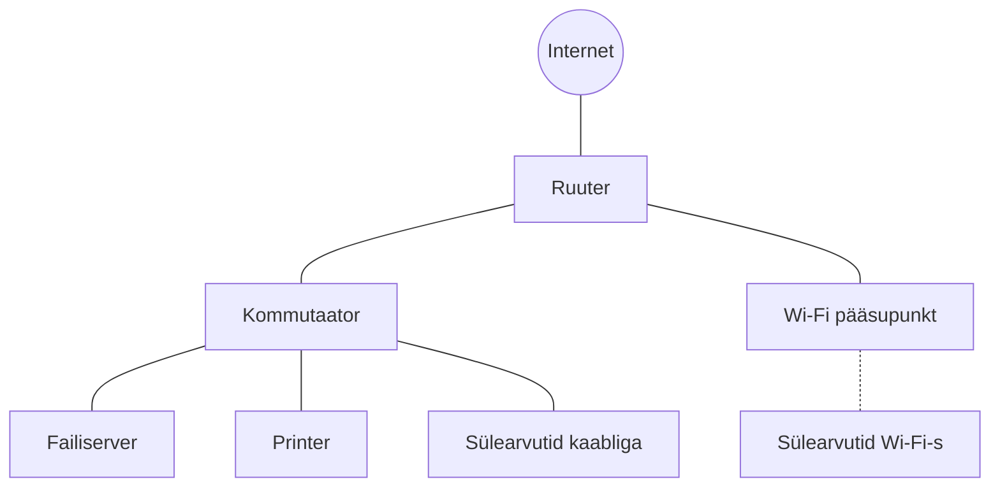

# Arvutivõrgud ja küberturvalisus

::: info Õpiväljund
Selgitad küberturbe riske ja häid tavasid nii tarkvara kui riistvara konfigureerimisel.
:::

| Tähis | Hindamiskriteerium |
| --- | --- |
| **HK 4.1** | Loetled peamised küberturberiskid tarkvara ja riistvara konfigureerimisel ning selgitad nende mõju organisatsioonile. |
| **HK 4.2** | Rakendad lihtsamaid turvameetmeid, nagu paroolipoliitika, tarkvara uuendused ja õiguste piiramine, ning dokumenteerid oma tegevused. |

Kursus koosneb **11 kohtumisest** (11 × 90 minutit) ja kahest osast:

1. **Arvutivõrkude alused** (kohtumised 1–5): see osa.
2. **[Sissejuhatus küberturvalisusesse](/kuberturvalisus/sissejuhatus)** (kohtumised 6–11).

## Läbiv lugu: Mari ja tema kontor

Kogu kursuse jooksul valmistad ette **uue töötaja arvuti ja väikese kontori võrgu turvaliseks kasutamiseks**. Selleks on vaja kõigepealt mõista, kuidas selline võrk töötab. Seepärast on kogu kursusel üks läbiv lugu.

**Mari** töötab väikeses firmas, kus on 20 töötajat ja üks kontor. Kontoris on:

- 20 sülearvutit (osa kaabliga, osa Wi-Fi-s);
- üks printer;
- üks failiserver, kus hoitakse firma dokumente;
- kommutaator, mis ühendab kaabliga seadmed;
- Wi-Fi pääsupunkt;
- ruuter, mis ühendab kontori internetiga.

Tutvud Mariga kõigepealt võrgutundides: iga tund näitab, mida tema tööpäev võrgus päriselt tähendab (printimine, veebilehe avamine, videokoosolek, aeglane internet). Turvatundides tuleb kontorisse uus töötaja **Siim** ja sina oled firma IT-inimene, kes valmistab tema arvuti ette ja kaitseb kontorit. Iga turvamuudatuse juures vastad küsimustele: mis on risk, kuidas see mõjutab organisatsiooni, mida muutsin ja kuidas kontrollisin tulemust?

Mari ja Siimu nimed, aadressid ja arvud on väljamõeldud.

## Tööriistad võrguskeemide joonistamiseks

Mitmes tunnis joonistad skeeme. Soovitame tasuta veebitööriistu, mis ei vaja installimist ega sisselogimist:

- [Excalidraw](https://excalidraw.com/): käsitsi joonistatud välimusega skeemid, sobib kiireks visandiks;
- [tldraw](https://www.tldraw.com/): lõuend nooltega, kuju- ja tekstitööriistadega.

Tööd saab salvestada pildina (PNG) või faili.

## Arvutivõrkude alused

| Kohtumine | Teema | Esitatav töö |
| --- | --- | --- |
| 1 | [Arvutivõrk ja andmeedastus](./vork-ja-andmeedastus) | Kommenteeritud võrguskeem |
| 2 | [Võrgumudelid ja adresseerimine](./vorgumudelid-ja-aadressid) | Aadresside tööleht ja andmevahetuse selgitus |
| 3 | [Protokollid ja marsruutimine](./protokollid-ja-marsruutimine) | Käskude tulemused koos tõlgendusega |
| 4 | [Võrgu koormuse mõõtmine](./vorgu-koormuse-mootmine) | Mõõtmistabel |
| 5 | [Võrgunõuete arvutamine ja hindamine](./vorgunouete-arvutamine) | Arvutuskäik, eeldused ja hinnang |

Ülesannete kokkuvõte on [Ülesannete](./assignments) lehel.

## Mida see osa ei hõlma

Kursus on mõeldud algajale. Süvitsi ei minda:

- OSI kihtide päheõppimine, mudelid on selgitamise tööriist;
- mahukas alamvõrkude arvutamine;
- marsruutimisprotokollide seadistamine.

## Seos teiste teemadega

HTTP-protokolli, URL-i, küpsiste ja CORS-i kohta loe [Veebiarenduse](/veebiarendus/sissejuhatus) teemast. See eeldab siin õpitud aluseid (seade, IP-aadress, port, DNS).
