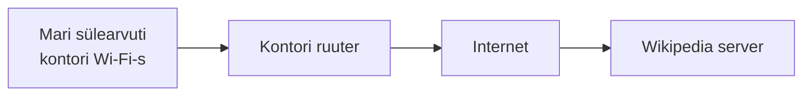
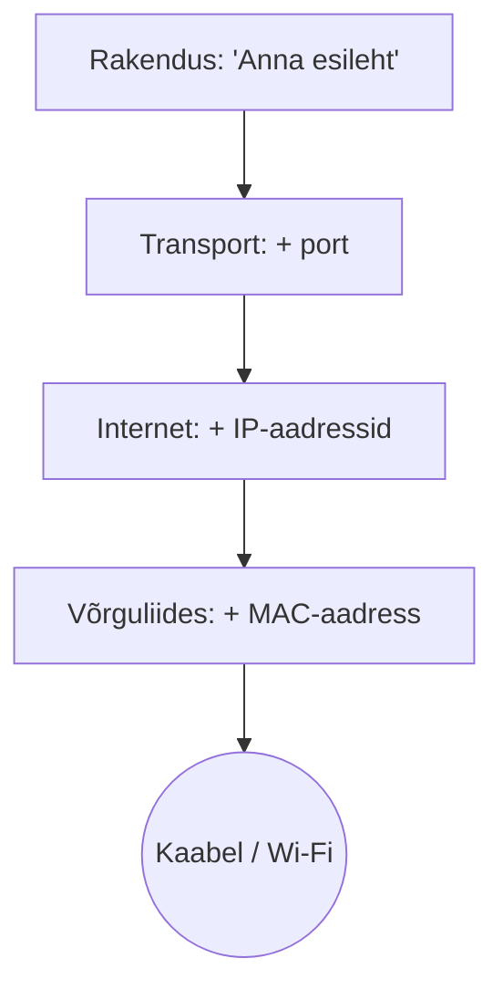
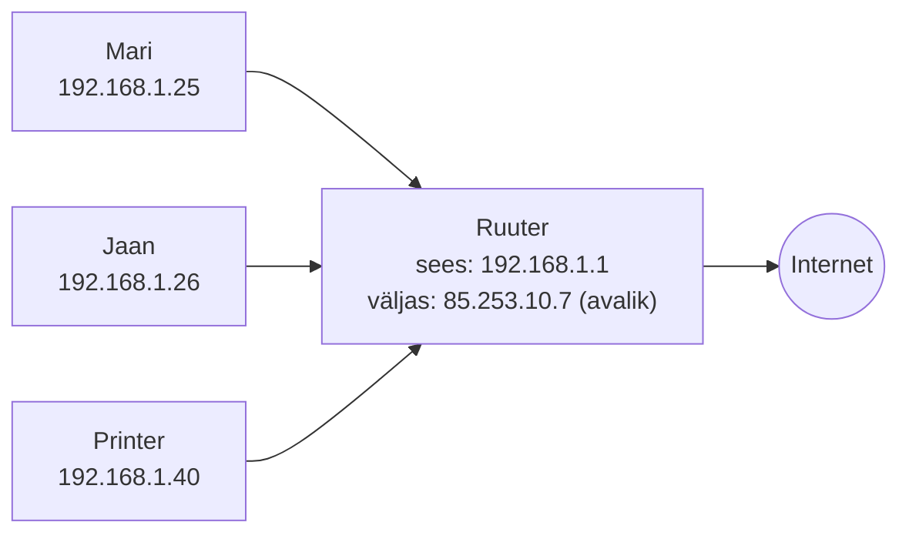
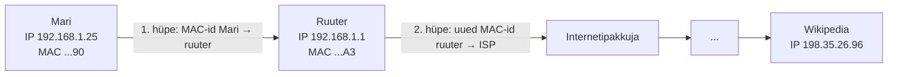

# Võrgumudelid ja adresseerimine

::: info Õpiväljund
Pärast tundi oskad selgitada ühe veebilehe avamise teekonda kihthaaval, eristada MAC-aadressi, IP-aadressi ja porti ning selgitada alamvõrgumaski ja vaikelüüsi rolli.
:::

Selles tunnis on kaks suurt teemat: **kihid** (mis ülesandeid võrgus tehakse) ja **aadressid** (kuidas andmed õige sihtkoha leiavad). Mõlemat selgitame ühe ja sama näitega.

## Näide, mida kasutame kogu tunni

Mari istub kontoris oma sülearvuti taga ja kirjutab brauserisse `wikipedia.org`. Mõne sekundi pärast on leht ees. Mis vahepeal juhtus?



Kõik, mida allpool õpid, vastab ühele küsimusele sellest loost.

## Kihid: kes mida teeb?

### Miks üldse kihid?

Mõtle, kuidas toimiks suure firma postisaatmine. Direktor kirjutab kirja ega tea, kuidas posti veetakse. Sekretär paneb kirja ümbrikusse ja kirjutab peale aadressi. Postkontor otsustab, milline veoauto kirja viib. Autojuht teab ainult teed. Igaüks teeb **oma ülesande** ja annab töö edasi järgmisele. Keegi ei pea teadma teiste tööd: direktor ei pea teadma, kas kiri läheb autoga või lennukiga.

Võrk töötab samamoodi. Iga **kiht** on üks töö. Tänu sellele saab ühe kihi välja vahetada (näiteks kaabli Wi-Fi vastu), ilma et teised muutuksid. Brauser ei tea, kas Mari on kaabli või Wi-Fi küljes.

### Nelja kihi lugu (TCP/IP-mudel)

Päris internet töötab nelja kihi järgi. Vaatame, mis juhtub Mari arvutis, kui ta vajutab Enter.

| Samm | Kiht | Kes seda teeb | Mis juhtub Mari näites |
| --- | --- | --- | --- |
| 1 | **Rakendus** | Brauser | Brauser koostab päringu: "Anna mulle wikipedia.org esileht". Siin on veebilehe ja DNS-i keel (HTTP, DNS) |
| 2 | **Transport** | Operatsioonisüsteem | Päring jagatakse pakettideks. Igale paketile pannakse **port**: mis programm sihtkohas vastab ja mis programm siin vastust ootab. Siin otsustatakse ka, kas kadunud paketid saadetakse uuesti (TCP) |
| 3 | **Internet** | Operatsioonisüsteem | Paketile kirjutatakse peale **IP-aadressid**: Mari arvuti ja Wikipedia server. See on kogu teekonna aadress |
| 4 | **Võrguliides** | Võrgukaart | Pakett pannakse kaabli või raadiolaine peale. Kasutatakse **MAC-aadressi**: kes on järgmine seade selles kohalikus võrgus (Mari puhul ruuter) |

Mõelda saab nii: iga kiht paneb andmetele ümber oma **ümbriku** koos oma aadressiga. Sihtkohas võtab iga kiht oma ümbriku maha, kuni brauser saab sisu kätte.



Vastuvõtja pool toimub sama vastupidises järjekorras: Wikipedia server võtab MAC-ümbriku maha, siis IP-ümbriku, siis pordi ja annab sisu veebiserveri programmile.

### Miks see on kasulik?

Kihid aitavad **viga leida**. Kui midagi ei tööta, küsi alt üles:

| Küsimus | Kui vastus on "ei" | Kiht |
| --- | --- | --- |
| Kas kaabel on sees või Wi-Fi ühendatud? | Füüsiline probleem | Võrguliides |
| Kas arvutil on IP-aadress ja kas `ping` ruuterile töötab? | Aadressi- või ruuteriprobleem | Internet |
| Kas õige teenus kuulab õigel pordil? | Teenus või tulemüür blokeerib | Transport |
| Kas brauser saab domeeninime IP-ks (DNS) ja leht avaneb? | Rakenduse probleem | Rakendus |

### OSI-mudel: sama lugu, rohkem sammudega

**OSI-mudel** kirjeldab sama protsessi **seitsme kihina**. Nelja kihi lugu on praktiline, OSI on peenem jaotus, mida kasutatakse võrgust rääkides ja vigade otsimisel. Kihte ei pea pähe õppima, vaid pead tundma seost.

| OSI kiht | Lihtsalt öeldes | Mari näites | TCP/IP kiht |
| --- | --- | --- | --- |
| 7. Rakendus | Programm, mida kasutaja näeb | Brauser küsib lehte (HTTP) | Rakendus |
| 6. Esitus | Andmete vorming ja krüpteerimine | Liiklus krüpteeritakse (HTTPS) | Rakendus |
| 5. Seanss | Suhtluse alustamine ja lõpetamine | Ühendus Wikipediaga avatakse ja suletakse | Rakendus |
| 4. Transport | Pordid, pakettideks jagamine, kadunud pakettide uuesti saatmine | Port 443, TCP | Transport |
| 3. Võrk | IP-aadressid ja tee leidmine võrkude vahel | Mari IP ja Wikipedia IP, ruuter valib tee | Internet |
| 2. Andmeside | Kohalik edastus, MAC-aadressid | Mari arvuti → ruuter (MAC) | Võrguliides |
| 1. Füüsiline | Signaal kaablis või õhus | Raadiolained, kaabli elekter | Võrguliides |

Seitse kihti jagunevad nelja sisse nii, et OSI kolm ülemist kihti (5, 6, 7) on TCP/IP-s üks "rakendus", kaks alumist (1, 2) üks "võrguliides".

## Aadressid: kuidas pakett õige koha leiab

Pakett vajab **kolme erinevat aadressi**, sest igaüks vastab eri küsimusele:

| Aadress | Vastab küsimusele | Mari näites |
| --- | --- | --- |
| **MAC-aadress** | Kes on järgmine seade siin kohalikus võrgus? | Kontori ruuter |
| **IP-aadress** | Kes on lõppsihtkoht kogu internetis? | Wikipedia server |
| **Port** | Milline programm selles seadmes seda pakki saab? | Wikipedia veebiserver (port 443) |

Lihtne võrdlus on kuller, kes viib paki hiiglaslikku büroohoonesse. **IP-aadress** on hoone aadress tänaval. **Port** on kontori number hoones. **MAC-aadress** on uksehoidja nimi, kellele kuller paki esimesena annab.

### MAC-aadress

Iga võrgukaart (Wi-Fi kaart, Ethernet-pesa) on valmistatud oma **MAC-aadressiga**. See on kuus paari tähti ja numbreid, näiteks:

```text
3C:22:FB:A1:5E:90
```

- Esimesed kolm paari näitavad tootjat, ülejäänud on selle kaardi number.
- MAC-aadress kehtib **ainult kohalikus võrgus**. Kui pakett läheb ruuterist välja, kasutatakse uues võrgus uusi MAC-aadresse.
- Telefonid võivad MAC-aadressi privaatsuse huvides juhuslikuks muuta.

### IP-aadress

**IP-aadress** ütleb, kus seade võrkude maailmas asub. Igal seadmel, mis on võrgus, on oma aadress, näiteks:

```text
192.168.1.25
```

See on neli numbrit (0–255), mis on eraldatud punktidega. Aadressi esimene osa ütleb, millises **võrgus** seade on, ja viimane, milline seade selles võrgus on. Täpsemalt selgitab seda järgmine lõik (alamvõrgumask).

Aadresse on piiratud arv, seepärast jagatakse need kahte rühma:

- **Privaatne IP** kehtib ainult sinu kohalikus võrgus. Kontori sülearvutil on näiteks `192.168.1.25`. Sama aadress võib olla ka sinu kodus, sest need võrgud ei näe teineteist.
- **Avalik IP** on internetis ainulaadne. Selle saab ruuter oma internetipakkujalt ja see on nähtav kogu maailmale.

Privaatsed vahemikud on kokku lepitud ([RFC 1918](https://www.rfc-editor.org/rfc/rfc1918)):

| Vahemik | Kus näed |
| --- | --- |
| `192.168.x.x` | Koduvõrgud, väiksed kontorid |
| `10.x.x.x` | Suured firmad, koolid |
| `172.16.x.x` – `172.31.x.x` | Keskmised võrgud |

**Kuidas siis privaatse aadressiga seade internetti pääseb?** Ruuter töötab vahendajana. Kui Mari päring läheb välja, kirjutab ruuter selle peale oma avaliku aadressi ja jätab meelde, kes selle saatis. Vastus tuleb ruuterile ja ruuter annab selle Marile. Seda nimetatakse **NAT-iks**. Seepärast paistavad kõik sinu kontori arvutid internetis üheainsa avaliku aadressiga.



(Kõik aadressid siin tunnis on näited.)

### Port

Üks arvuti teeb korraga palju asju: brauser laeb lehte, Spotify mängib muusikat, e-post kontrollib kirju. Kõik need kasutavad sama IP-aadressi. **Port** on number, mille järgi arvuti teab, millisele programmile saabuv pakett kuulub.

Mari päring Wikipediasse näeb välja nii:

```text
Mari arvuti:  192.168.1.25  port 52814   →   Wikipedia:  198.35.26.96  port 443
```

- **Sihtport 443** tähendab: "tahan rääkida veebiserveriga HTTPS-i keeles". Seda numbrit kasutab iga veebiserver.
- **Lähteport 52814** on juhuslik number, mille Mari arvuti selleks päringuks valis. Nii teab arvuti, et vastus kuulub just sellele brauseri vahelehele ja mitte Spotifyle.

Levinud pordid:

| Port | Teenus |
| --- | --- |
| 22 | SSH (turvaline kaughaldus) |
| 53 | DNS |
| 80 | HTTP (krüpteerimata veeb) |
| 443 | HTTPS (krüpteeritud veeb) |

Aadress ja port kirjutatakse sageli kokku: `198.35.26.96:443`. Pordi numbrid on 0–65535.

### Alamvõrgumask: kas sihtkoht on minu võrgus?

Enne kui Mari arvuti paketi saadab, peab ta otsustama: kas sihtkoht on **siinsamas kohalikus võrgus** või **kusagil mujal**?

- Kui sihtkoht on samas võrgus (näiteks printer), saab arvuti paketi **otse** sinna saata.
- Kui sihtkoht on teises võrgus (Wikipedia), tuleb pakett anda **ruuterile**.

Selle otsuse aitab teha **alamvõrgumask**. See näitab, **mitu esimest numbrit aadressis tähendavad võrku**.

Kõige tavalisem mask on `255.255.255.0`. See tähendab: **esimesed kolm numbrit on võrgu nimi, viimane number on seadme number**.

```text
192.168.1 . 25
└─ võrk ─┘   └ seade
```

Nüüd on test lihtne: **kui sihtkoha esimesed kolm numbrit on samad, on ta samas võrgus**.

| Mari aadress | Sihtkoht | Esimesed 3 numbrit | Otsus |
| --- | --- | --- | --- |
| `192.168.1.25` | Printer `192.168.1.40` | `192.168.1` ja `192.168.1`: **samad** | Sama võrk, saadan otse |
| `192.168.1.25` | Jaan `192.168.1.26` | **samad** | Sama võrk, saadan otse |
| `192.168.1.25` | Wikipedia `198.35.26.96` | `192.168.1` ja `198.35.26`: **erinevad** | Teine võrk, annan ruuterile |

Mask kirjutatakse mõnikord lühemalt kui **`/24`**. See tähendab sama asja: "esimesed 24 bitti ehk kolm numbrit on võrk". Muid pikkusi (`/16`, `/25` jne) selles kursuses ei arvutata, aga mõte on sama: mask ütleb, kui suur osa aadressist on võrgu nimi.

### Vaikelüüs: värav välismaailma

Kui sihtkoht on teises võrgus, annab arvuti paketi **vaikelüüsile** (*default gateway*). See on kohaliku võrgu ruuteri aadress, tavaliselt midagi sarnast `192.168.1.1`. Ruuter on värav, mille kaudu kõik teised võrgud asuvad.

Mari paketi teekond MAC- ja IP-aadressidega:



| Hüpe | Pakett kirjutatud IP | Kasutatav MAC |
| --- | --- | --- |
| Mari → ruuter | Mari → Wikipedia (`198.35.26.96`) | Mari kaart → ruuteri kaart |
| Ruuter → pakkuja | Sihtkoht sama, lähteaadress asendub ruuteri avaliku aadressiga (NAT) | Ruuteri väline kaart → pakkuja seade |
| Edasi | Sihtkoht sama | Igal hüppel uued MAC-id |

**Põhireegel:** **sihtkoha IP-aadress** viitab lõppsihtkohale ja jääb kogu teekonna vältel samaks. **MAC-aadress** viitab järgmisele seadmele ja muutub igal hüppel.

Kui vaikelüüs on valesti seadistatud, töötab kohalik võrk (printer prindib), aga internetti ei pääse. See on levinud viga, mida oskad nüüd otsida.

## Praktiline töö: oma seadme aadressid

Leia käsurealt oma arvuti andmed.

| Süsteem | Käsk |
| --- | --- |
| Windows | `ipconfig /all` |
| macOS | `ifconfig` või `ipconfig getifaddr en0` |
| Linux | `ip a` ja `ip route` |

1. Pane tabelisse kirja oma seadme **IP-aadress**, **alamvõrgumask**, **vaikelüüs** ja **MAC-aadress**. Märgi ka, kas kasutasid kaabelühendust või Wi-Fi-t.
2. Kas sinu IP on privaatne või avalik? Põhjenda vahemiku tabeli abil.
3. Kasuta alamvõrgumaski testi: kas sinu vaikelüüs on sinuga samas võrgus? Kirjuta, kuidas kontrollisid.
4. Võta kolm aadressi (näiteks klassikaaslase arvuti, õpetaja antud printer, `8.8.8.8`). Otsusta maski järgi iga kohta, kas sa saadaksid paketi otse või ruuterile.
5. Selgita oma sõnadega Mari näite abil: mis juhtub MAC-aadressiga, kui pakett läheb ruuterist välja, ja miks sihtkoha IP-aadress jääb samaks?

::: warning Turvalisus
MAC- ja IP-aadress võivad seadet tuvastada. Ära avalda neid avalikes keskkondades. Tööle võid need lisada, kuid ära jaga tööd väljaspool kooli.
:::

**Esitatav töö:** aadresside tööleht ja andmevahetuse selgitus.

## Kokkuvõte

| Mõiste | Tähendus |
| --- | --- |
| Kiht | Üks ülesanne võrgus (rakendus, transport, internet, võrguliides) |
| TCP/IP / OSI | Neljakihiline praktiline mudel / seitsmekihiline selgitusmudel |
| MAC-aadress | Järgmise seadme aadress kohalikus võrgus, muutub igal hüppel |
| IP-aadress | Lõppsihtkoha aadress, sihtaadress jääb teekonnal samaks |
| Port | Programmi number seadmes |
| Alamvõrgumask | Näitab, kui suur osa aadressist on võrgu nimi |
| Vaikelüüs | Ruuter, kuhu antakse paketid, mis lähevad teise võrku |
| NAT | Ruuter tõlgib privaatsed aadressid ühe avaliku alla |

## Allikad

- [Cloudflare Learning: What is the OSI model?](https://www.cloudflare.com/learning/ddos/glossary/open-systems-interconnection-model-osi/)
- [Cloudflare Learning: What is a MAC address?](https://www.cloudflare.com/learning/network-layer/what-is-a-mac-address/)
- [Cloudflare Learning: What is an IP address?](https://www.cloudflare.com/learning/dns/glossary/what-is-my-ip-address/)
- [RFC 1918: Address Allocation for Private Internets](https://www.rfc-editor.org/rfc/rfc1918)
