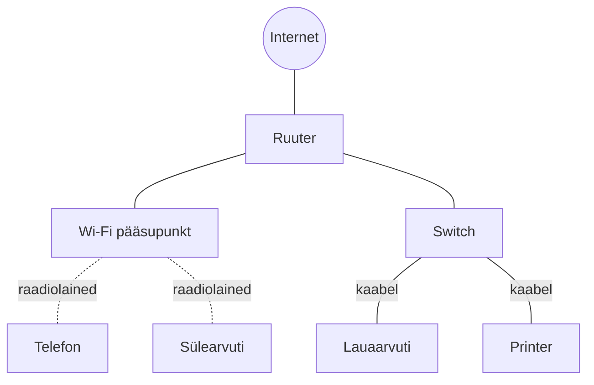

# Võrguseadmed ja koduvõrk

::: info Õpiväljund
Pärast õppetundi oskad joonistada lihtsa kodu- või koolivõrgu skeemi ning nimetada selle põhikomponendid.
:::

Enamik koduvõrke koosneb samadest põhikomponentidest, olgu tegu ühe- või mitmetoalise koduga.

## Põhikomponendid

| Seade | Mida ta teeb |
| --- | --- |
| **Klient** | Seade, mida kasutaja otse kasutab: telefon, sülearvuti, nutiteler |
| **Ruuter** (*router*) | Ühendab koduvõrgu internetiga. Loeb iga paketi sihtaadressi ja otsustab, kuhu see edasi saata — internetiühendus käib alati ruuteri kaudu |
| **Switch** | Ühendab seadmeid **ühe** võrgu sees omavahel (nt mitu lauaarvutit ühes kontoris). Erinevalt ruuterist ei ühenda switch võrku internetiga — ta ainult vahendab seadmete vahelist liiklust kohapeal |
| **Wi-Fi pääsupunkt** (*access point*) | Switchi juhtmevaba vaste — võimaldab seadmetel ühineda võrguga kaabli asemel raadiolainete kaudu |
| **Server** | Arvuti, mis hoiab andmeid ja vastab teiste seadmete päringutele (nt failiserver, veebiserver) |

::: tip Ruuter vs switch — peamine erinevus
**Switch** ühendab seadmeid **ühe võrgu sees**. **Ruuter** ühendab **erinevaid võrke omavahel** — kõige tavalisem näide on koduvõrgu ühendamine internetiga. Enamikus kodudes on need kaks funktsiooni tänapäeval ühendatud ühte "internetikast" seadmesse, aga kontseptuaalselt on tegu kahe erineva ülesandega.
:::

## Tüüpiline koduvõrk

Enamikus kodudes on ruuter, switch ja Wi-Fi pääsupunkt tänapäeval kõik ühe füüsilise "kastikese" (koduruuteri) sees — aga funktsionaalselt on nad ikkagi kolm eraldi rolli.

## Allikad

- [Cloudflare Learning — What is a router?](https://www.cloudflare.com/learning/network-layer/what-is-a-router/)
- [Cloudflare Learning — What is a network switch?](https://www.cloudflare.com/learning/network-layer/what-is-a-network-switch/)
