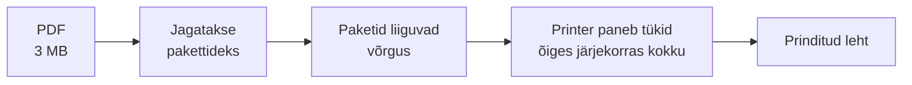
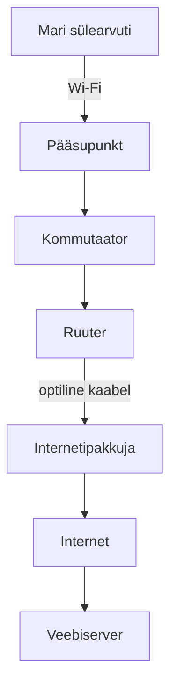
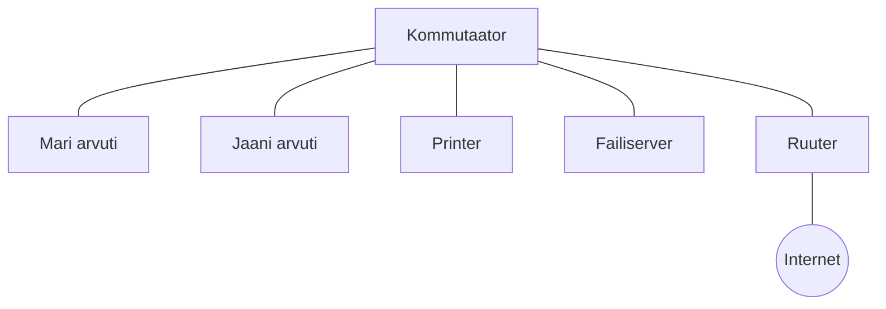

# Arvutivõrk ja andmeedastus

::: info Õpiväljund
Pärast tundi oskad nimetada võrgu põhikomponendid ja nende rollid, eristada LAN-i ja WAN-i ning selgitada, kuidas andmed ühest seadmest teise liiguvad.
:::

## Tutvu Mariga

Mari töötab väikeses firmas, kus on 20 töötajat. Tema kontoris on sülearvutid, printer, failiserver, kommutaator, Wi-Fi pääsupunkt ja ruuter (vt [kursuse sissejuhatus](./sissejuhatus)). Mari ei ole IT-inimene, kuid ta kasutab võrku terve päeva. Täna vaatame kaht asja, mida ta hommikul teeb:

1. Saadab dokumendi **printerisse**, mis on kontoris laua kõrval.
2. Avab brauseris **veebilehe**, mis asub kusagil internetis.

Mõlemal juhul liiguvad andmed Mari arvutist teise seadmesse. Vaatame, kuidas.

## Arvutivõrk ja internet

**Arvutivõrk** on kaks või enam omavahel ühendatud seadet, mis saavad andmeid vahetada. Mari sülearvuti ja printer moodustavad juba võrgu.

**Internet** on võrkude võrk: miljonid väiksemad võrgud, mis on omavahel ühendatud ja kasutavad ühiseid kokkuleppeid ehk **protokolle**. Mari kontori võrk on üks nendest miljonitest.

Kui Mari avab brauseris veebilehe, on suhtlemas vähemalt kaks poolt:

- **klient** on seade, mis andmeid küsib (Mari arvuti);
- **server** on arvuti, mis andmeid hoiab ja päringutele vastab (veebilehe server, aga ka kontori failiserver).

## Andmed liiguvad pakettidena

Mari saadab printerisse 3 MB suuruse PDF-i. See ei liigu võrgus ühe tükina. Sülearvuti jagab selle väikesteks tükkideks ehk **pakettideks**. Iga pakett saadetakse eraldi ja printer paneb tükid õiges järjekorras uuesti kokku.

Miks nii? Kujutle, et Mari firma kolib. Suur kapp ei mahu tervikuna autosse, see tuleb tükeldada ja mitmesse kasti panna. Võrgus on lisaks veel üks põhjus: kui üks suur fail hõivaks kogu kaabli, peaksid teised ootama. Mari kolleeg Jaan tahab samal ajal e-kirja saata. Tükkideks jagatult saavad Mari ja Jaani paketid kaablis vaheldumisi liikuda ning kumbki ei pea ootama.

Iga pakett kannab kaasas oma **päist**: kellelt see tuleb, kellele läheb ja mitmes tükk see on. Päis on nagu ümbrik, mille peale on kirjutatud aadressid. Sisu (andmed) on ümbriku sees.

## Võrgu komponendid Mari kontoris

Iga võrk koosneb kolmest liiki osadest: ühendused, lõppseadmed ja võrguseadmed. Vaatame, mis neist Mari dokumendi teekonnal osaleb.

### Kaablid ja juhtmevaba ühendus

Mari sülearvuti ühendub Wi-Fi kaudu. Printer on ühendatud kaabliga kommutaatorisse.

| Ühendus | Mida kasutab | Kus Mari kontoris |
| --- | --- | --- |
| **Keerdpaarkaabel** (Ethernet, nt Cat5e, Cat6) | Elektrisignaal vasktraadis | Printer, server ja osa arvuteid kommutaatori külge. Ühe kaabli maksimaalne pikkus on 100 m |
| **Optiline kaabel** | Valguse impulsid klaaskius | Kontori ja internetipakkuja vahel. Sobib pikkade vahemaade jaoks |
| **Wi-Fi** | Raadiolained | Mari sülearvuti ja telefonid, kus kaablit ei saa või ei taha vedada |

### Lõppseadmed

**Lõppseade** on seade, kus andmed algavad või lõpevad: arvuti, telefon, server, printer, turvakaamera. Mari sülearvuti (andmete algus) ja printer (andmete lõpp) on mõlemad lõppseadmed.

### Võrguseadmed

**Võrguseade** ei ole andmete lõppsihtkoht. Selle ülesanne on andmeid edasi suunata. Mari dokument läheb läbi neist mitme.

| Seade | Mida teeb | Mari kontoris |
| --- | --- | --- |
| **Pääsupunkt** (*access point*) | Annab juhtmevabadele seadmetele ligipääsu kaabelvõrgule | Mari sülearvuti Wi-Fi-signaal jõuab sinna |
| **Kommutaator** (*switch*) | Ühendab seadmeid **ühe võrgu sees** ja saadab paketi ainult sellele pordile, kus sihtseade asub | Saadab paketid printerile |
| **Ruuter** (*router*) | Ühendab **erinevaid võrke** omavahel, näiteks kontori võrgu internetiga | Viib Mari veebilehe päringu internetti |

::: tip Ruuter ja kommutaator
Kommutaator seob seadmed **ühe võrgu sees** kokku. Ruuter seob **erinevad võrgud** omavahel. Mari printer vajab ainult kommutaatorit. Veebileht vajab ka ruuterit. Koduruuter on tegelikult ruuter, kommutaator ja pääsupunkt ühes karbis, aga rollid on ikka kolm eraldi.
:::

## Kaks teekonda: printer ja veebileht

Nüüd paneme osad kokku. Mari saadab dokumendi printerisse ja avab seejärel veebilehe.

### 1. Mari printeriga: kõik jääb kontori sisse

1. Mari sülearvuti jagab PDF-i pakettideks.
2. Paketid lähevad Wi-Fi kaudu pääsupunkti.
3. Pääsupunkt annab need kommutaatorile.
4. Kommutaator saadab paketid ainult printerile.
5. Printer paneb tükid kokku ja prindib.

Siia ei ole ruuterit vaja, sest saatja ja vastuvõtja on **samas võrgus**.

### 2. Mari veebilehega: väljas internetis

1. Mari sülearvuti koostab päringu "anna mulle see leht" ja jagab selle pakettideks.
2. Paketid lähevad pääsupunkti ja kommutaatorisse.
3. Kommutaator saab aru, et sihtkoht pole selles võrgus, ja annab paketid ruuterile.
4. Ruuter saadab paketid internetipakkuja suunas.
5. Mitme ruuteri kaudu jõuavad paketid veebiserverini.
6. Server vastab ja vastus liigub sama moodi tagasi.

Siin on ruuter vajalik, sest sihtkoht on **teises võrgus**. Kuidas ruuter ja arvuti aru saavad, kas sihtkoht on samas või teises võrgus, õpid [järgmises tunnis](./vorgumudelid-ja-aadressid).

## LAN ja WAN

Mari kontori võrk on **LAN**. Internet on **WAN**. Kujutle, et firma avab Tallinnas teise kontori. Siis on neil kaks LAN-i (üks Kuressaares, üks Tallinnas) ja nende vahel WAN.

| Tüüp | Täisnimi | Ulatus | Näide |
| --- | --- | --- | --- |
| **LAN** | *Local Area Network* | Üks hoone või ala | Mari kontori võrk, kooli arvutiklass, koduvõrk |
| **WAN** | *Wide Area Network* | Linnad, riigid, kontinendid | Kahe kontori ühendus, internet ise |

Teisi tüüpe on veel (nt **MAN** linnavõrk, **PAN** isiklik võrk nagu Bluetooth), kuid selle kursuse jaoks piisab LAN-ist ja WAN-ist.

## Topoloogia: füüsiline ja loogiline

Kujutle, et Mari ülemus palub: "Joonista mulle meie kontori võrk." Siin on kaks erinevat vastust, sõltuvalt sellest, mida ta teada tahab.

- **Füüsiline topoloogia** näitab, kuidas seadmed ja kaablid on **tegelikult** paigutatud ja ühendatud: kus seisab kommutaator, kuhu kaabel läheb. Ülemus vaatab seda, kui ta tahab teada, kuhu uus arvuti ühendada.
- **Loogiline topoloogia** näitab, kuidas andmed võrgus **tegelikult liiguvad** ja kes kellega suhtleb, sõltumata kaablite paigutusest. Ülemus vaatab seda, kui ta tahab teada, kes tohib failiserverit kasutada.

Levinumad füüsilised paigutused:

| Topoloogia | Kirjeldus | Märkus |
| --- | --- | --- |
| **Täht** (*star*) | Kõik seadmed ühendatud ühte keskseadmesse (kommutaatorisse) | Tänapäeva kaabelvõrkude tavaline kuju. Ühe kaabli rike mõjutab ainult ühte seadet |
| **Siin** (*bus*) | Kõik seadmed jagavad ühte ühist kaablit | Vana lahendus, tänapäeval harva |
| **Ring** | Iga seade on ühendatud kahe naabriga | Harv |
| **Täisvõrk** (*mesh*) | Seadmed ühendatud mitme teistega | Annab varuteid. Kasutatakse ruuterite vahel ja Wi-Fi mesh-süsteemides |

Mari kontoris on füüsiliselt **täht**: kõik kaablid lähevad kommutaatorisse.

Loogiliselt võib sama võrk olla jagatud kaheks. Näiteks töötajate ja külaliste võrk: külalised näevad internetti, aga mitte failiserverit, kuigi kaablid ja kommutaator on samad. Füüsiline pilt näitab, kus kaablid asuvad. Loogiline pilt näitab, kes kellega rääkida tohib.

## Praktiline töö: Mari kontori võrguskeem

Nüüd on sinu kord joonistada Mari kontori võrk.

**Kontori andmed:** 6 töölauda koos arvutitega, 1 printer, 1 failiserver, külaliste Wi-Fi ja internetiühendus.

**Tööriist:** joonista veebitööriistas [Excalidraw](https://excalidraw.com/) või [tldraw](https://www.tldraw.com/). Mõlemad töötavad brauseris, neid ei pea installima ega kasutaja registreerima. Valmis skeemi saad salvestada pildina (PNG).

1. Joonista võrguskeem. Märgi kõik komponendid ja nende tüübid: lõppseadmed, võrguseadmed, ühendused.
2. Märgi, millised ühendused on kaabel ja millised Wi-Fi.
3. Märgi, kus lõpeb LAN ja kus algab WAN.
4. Vali üks andmevahetus (nt Mari prindib dokumendi) ja kirjuta skeemile nummerdatud nooltega selle teekond. Kas see vajab ruuterit?
5. Lisa kaks lühikest kommentaari: mis on selle skeemi **füüsiline** ja mis **loogiline** pilt.

::: warning Turvalisus
Ära pane skeemile oma päris Wi-Fi parooli ega võrgu aadresse. Piisab seadmete tüüpidest ja ühendustest.
:::

**Esitatav töö:** kommenteeritud võrguskeem.

## Kokkuvõte

| Mõiste | Tähendus |
| --- | --- |
| Pakett | Väike andmetükk koos päisega (kellelt, kellele) |
| Lõppseade | Seade, kus andmed algavad või lõpevad |
| Kommutaator | Ühendab seadmeid ühe võrgu sees |
| Ruuter | Ühendab erinevaid võrke |
| Pääsupunkt | Juhtmevaba ligipääs kaabelvõrgule |
| LAN / WAN | Kohalik võrk / ulatuslik võrk |
| Füüsiline topoloogia | Kuidas seadmed ja kaablid tegelikult paigas on |
| Loogiline topoloogia | Kuidas andmed ja suhtlus tegelikult liiguvad |

## Allikad

- [Khan Academy: Computers and the Internet, packets and reliability](https://www.khanacademy.org/computing/computers-and-internet/xcae6f4a7ff015e7d:the-internet)
- [Cloudflare Learning: What is a router?](https://www.cloudflare.com/learning/network-layer/what-is-a-router/)
- [Cloudflare Learning: What is a network switch?](https://www.cloudflare.com/learning/network-layer/what-is-a-network-switch/)
- [Cloudflare Learning: What is a LAN?](https://www.cloudflare.com/learning/network-layer/what-is-a-lan/)
