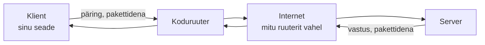

# Mis on võrk ja internet?

::: info Õpiväljund
Pärast õppetundi oskad selgitada, mis on arvutivõrk ja internet, ning kirjeldada, kuidas sõnum liigub sinu seadmest serverini ja tagasi.
:::

## Arvutivõrk

**Arvutivõrk** on kaks või enam omavahel ühendatud seadet, mis suudavad andmeid vahetada. Kaks arvutit koduvõrgus, mis jagavad ühte printerit, moodustavad juba võrgu.

**Internet** on võrkude võrk — miljonite väiksemate võrkude kogum, mis on omavahel ühendatud ja suhtlevad ühiste kokkulepete (protokollide) järgi.

## Klient ja server

Kui avad brauseris veebilehe, osalevad suhtluses vähemalt kaks poolt:

- **Klient** — sinu seade (arvuti, telefon), mis küsib andmeid.
- **Server** — arvuti kusagil mujal, mis hoiab andmeid ja vastab päringutele.

## Andmed liiguvad pakettidena

Fail või sõnum, mida saadad, ei liigu võrgus ühe tükina. See jagatakse väikesteks tükkideks — **pakettideks** — mis saadetakse eraldi ja pannakse sihtkohas uuesti kokku, õiges järjekorras.

Miks nii? Suur fail ei "mahu" korraga ühte "veokisse" — sama moodi nagu suur ese tuleb tükeldada, et see mitmes väiksemas kastis kohale toimetada.

Pakid ei pruugi kõik minna sama teed pidi. **Ruuterid** — võrguseadmed, mis suunavad pakette edasi — valivad iga paketi jaoks parasjagu sobiva tee, natuke nagu autojuht valib erineva tee sõltuvalt liiklusest või teetöödest. Kui üks tee on ummistunud, võib pakett minna teist rada pidi ja ikkagi õigel ajal kohale jõuda.

Selleks, et kõik pakid ka tegelikult kohale jõuaksid — ja kui mõni kaob, uuesti saadetaks — kasutab internet protokolli nimega **TCP**. Seda võib mõelda nagu tähitud kirja teenust: saatja saab kinnituse, et kiri jõudis kohale, ja kui midagi läks kaduma, saadetakse see uuesti.

## Kokkuvõte

| Mõiste | Tähendus |
| --- | --- |
| Võrk | Kaks või enam ühendatud seadet, mis vahetavad andmeid |
| Internet | Üleilmne võrkude võrk |
| Klient | Seade, mis küsib andmeid (nt sinu brauser) |
| Server | Seade, mis hoiab andmeid ja vastab päringutele |
| Pakett | Väike andmetükk, milleks sõnum/fail enne saatmist jagatakse |
| Ruuter | Seade, mis suunab pakette õiges suunas edasi |

## Allikad

- [Khan Academy — Computers and the Internet: Packets, routers, and reliability](https://www.khanacademy.org/computing/computers-and-internet/xcae6f4a7ff015e7d:the-internet)
