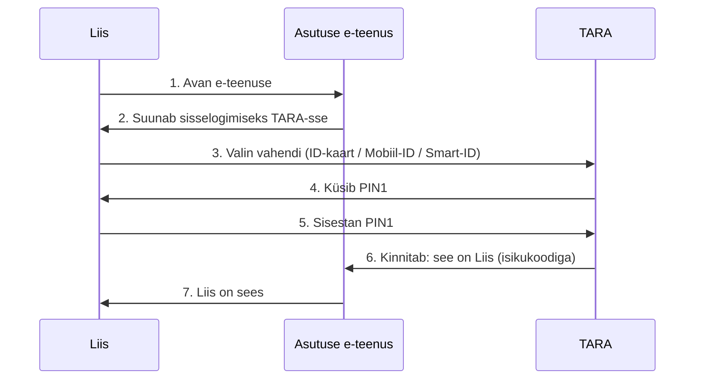

# 1. Digiteenused I: riik ja autentimine

::: info Õpiväljund
Pärast tundi oskad valida olukorrale sobiva e-identimise vahendi, eristad sisselogimist ja allkirjastamist ning kirjeldad, kuidas riigi e-teenusesse sisse logitakse (HK 2.3).
:::

Liis on esimese kursuse õpilane ja töötab osaajaga väikeses veebifirmas. Neljapäeva õhtul saab ta tööandjalt e-kirja: "Saadan töölepingu, palun allkirjasta digitaalselt".

Liisil ei ole printerit ega pliiatsit ja firma asub teises linnas. Küsimused, mis ta endalt esitab:

1. Kuidas ma tõestan, et olen mina?
2. Kuidas ma panen oma allkirja failile, ilma et ma midagi paberil kirjutaks?
3. Kas see on üldse õiguslikult kehtiv?

Selle tunni jooksul vastame neile.

## Kaks eri tegevust: sisse logida ja allkirjastada

Liis läheb hommikul kooli. Uksel näitab ta õpilaspääset ja uks avaneb. Hiljem allkirjastab ta pliiatsiga õppelepingu. Mõlemal juhul tegi ta midagi oma isiku nimel, aga tegevused on erinevad.

| Tegevus | Küsimus | Näide |
| --- | --- | --- |
| **Autentimine** (sisselogimine) | Kes sa oled? | Liis logib riigiportaali |
| **Allkirjastamine** | Mida sa kinnitad ja võtad endale kohustuseks? | Liis allkirjastab töölepingu |

See on sama jaotus, mida nägid kursusel [Kontod, paroolid ja õigused](/kuberturvalisus/kontod-ja-oigused). Sealt tuleb meelde ka: autentimine on "kes sa oled", autoriseerimine on "mida tohid". Siin lisandub kolmas asi, **allkirjastamine**, ja see on sisselogimisest oluliselt tõsisem.

Eestis on selle jaoks kaks eraldi PIN-koodi. Neid kasutavad kõik kolm vahendit, millest kohe räägime:

| Kood | Mille jaoks | Näide |
| --- | --- | --- |
| **PIN1** | Sisselogimine (isiku tuvastamine) | Riigiportaali sisenemine |
| **PIN2** | Digiallkirja andmine ja tehingute kinnitamine | Lepingu allkirjastamine |

Eraldi koodid tähendavad, et sisselogimine ei anna veel õigust allkirja anda. Allkirjastamisel peab sisestama PIN2, ja sellega kinnitad otsuse tahtlikult.

## Kolm vahendit: kumb Liisile sobib?

Liisil on kolm võimalust. Iga vahend on mõeldud tõestama, et sina oled sina.

### ID-kaart

ID-kaart on Eesti kodaniku kohustuslik isikut tõendav dokument. Esimesed kaardid anti välja 2002. aastal. Kaardil on kiip, milles on kaks võtmepaari: üks sisselogimiseks (PIN1) ja teine allkirjastamiseks (PIN2). PIN1 on 4-kohaline ja PIN2 5-kohaline.

Arvutis kasutamiseks vajad kaardilugejat ja ID-tarkvara. Telefonis on mugavam teised kaks vahendit.

### Mobiil-ID

Mobiil-ID on **SIM-kaardil** olev vahend. Kui telefonil on Mobiil-ID SIM, saad sisse logida ja allkirjastada ilma kaardilugejata. PIN-koodid asuvad SIM-kaardil: PIN1 on 4–8 numbrit, PIN2 5–8 numbrit ja PUK 8 numbrit.

PUK on kood, millega avatakse lukustunud PIN-id. Kui unustad PIN1 või PIN2 ega tea PUK-i, tuleb tellida **uus SIM-kaart**, sest Mobiil-ID PIN-e ei saa lihtsalt lähtestada. Mobiil-ID on seotud numbriga: kui telefon varastatakse või SIM-kaart läheb kaotsi, kaotad ka vahendi.

### Smart-ID

Smart-ID on **rakendus** nutitelefonis. Sa ei vaja spetsiaalset SIM-kaarti ega kaardilugejat. Rakenduse allalaadimine ja kasutamine on tasuta. Konto loomisel tuvastatakse sind ID-kaardi või pangakontori kaudu.

Alla 18-aastased saavad Smart-ID konto, aga selleks on vaja vanema luba, mille annab vanem ID-kaardi või Mobiil-IDga. Liisi vanus võib seda mõjutada. Enne kui ta rakenduse seadistab, peab see olema selge.

Ka Smart-IDl on PIN1 (sisselogimine) ja PIN2 (kinnitamine ja allkirjastamine).

### Võrdlus

| | ID-kaart | Mobiil-ID | Smart-ID |
| --- | --- | --- | --- |
| Mis see on | Plastkaart kiibiga | SIM-kaart | Telefoni rakendus |
| Mida vaja | Kaardilugeja arvutis | Mobiil-ID SIM ja levi | Nutitelefon ja internet |
| Kaotatud PIN | PUK või uus kaart | PUK või uus SIM | Uus konto tuvastamisega |

Kõik kolm sobivad eesti.ee sisselogimiseks. ID.ee järgi saab portaali siseneda ID-kaardi, Mobiil-ID, Digi-ID ja Smart-IDga.

### Millal mida valida?

| Olukord | Mõistlik valik | Miks |
| --- | --- | --- |
| Liis istub koolis arvuti taga ja kaardilugeja on olemas | ID-kaart | Ei sõltu telefoni akust |
| Liis on bussis ja vaja kiiresti dokumenti vaadata | Smart-ID või Mobiil-ID | Telefon on käepärast |
| Liisi telefon on tühi | ID-kaart | Ei vaja telefoni |
| Liis reisib välismaale ja vahetab SIM-i | Smart-ID või ID-kaart | Mobiil-ID on SIM-seotud |

Pane tähele: sobivat vahendit ei otsustata ainult mugavuse järgi. Vaata ka, mis võib valesti minna (telefon kaob, aku saab tühjaks, SIM vahetub) ja kas sul on varuvahend.

## eesti.ee ja riigi teenused

Liis soovib vaadata, millised andmed riik temast hoiab, ja kontrollida enda andmeid. Selleks on **eesti.ee** ehk riigiportaal. See on riigi e-teenuste koondvärav: ühest kohast pääseb paljude asutuste teenuste juurde.

Riigiportaal ise ei ole kõigi teenuste omanik. Maksuamet, Politsei- ja Piirivalveamet, Transpordiamet, tervise- ja haridusregistrid ja paljud teised asutused haldavad oma teenuseid. Portaal aitab neid leida ja neisse siseneda.

### Miks ei pea Liis igal asutusel uut parooli looma?

Kujuta ette, et iga asutus lubaks sul sisse logida ainult enda kasutajanime ja parooliga. Liisil oleks kümme parooli ja kümme võimalust, et üks neist lekib.

Sellepärast kasutab riik **ühist autentimisteenust**, mille nimi on **TARA** (riigi autentimisteenus). Selle pakub Riigi Infosüsteemi Amet (RIA). Asutus ei pea ise PIN-koode kontrollima. Ta suunab Liisi TARA-sse, kus Liis valib ID-kaardi, Mobiil-IDga või Smart-IDga. RIA andmetel on TARAga liitunud 112 asutust 582 infosüsteemiga, sh maksuamet, haridusinfosüsteem ja Transpordiameti e-teenused.

Pane tähele sammu 6. E-teenus **ei saa Liisi PIN-koodi**. Ta saab ainult kinnituse "see isik on tuvastatud". PIN-i kontrollimisega tegeleb ainult autentimisteenus.

### Kui teenus küsib PIN2

Liis logis sisse PIN1-ga. Nüüd tahab ta esitada avalduse ja teenus küsib PIN2. See on märk: **nüüd kinnitad midagi**. Enne PIN2 sisestamist loe läbi, mida sa kinnitad. PIN2 sisestamine on nagu pliiatsiga allkirja andmine.

## Digiallkiri: miks Liis ei vaja paberit

Liis avab töölepingu ja allkirjastab selle rakenduses DigiDoc4. Allkirjastatud fail on konteiner (laiendiga `.asice`), mis sisaldab lepingut ja Liisi digiallkirja.

Kas see on päriselt kehtiv? Jah. EL-i e-identimise määruse eIDAS järgi on **kvalifitseeritud elektrooniline allkiri** õiguslikult võrdne omakäelise allkirjaga. Eesti ID-kaardi, Mobiil-ID ja Smart-ID allkirjad on sellised. See kehtib kõigis EL-i liikmesriikides.

Statistika: Wikipedia andmetel oli septembriks 2021 ID-kaardi kasutajad andnud umbes 1,39 miljardit digiallkirja, ehk keskmiselt umbes 50 allkirja kasutaja kohta aastas. See näitab, et digiallkiri on Eestis igapäevane.

Mida kontrollida enne allkirjastamist:

1. Kas see on õige dokument ja õige versioon?
2. Kas ma olen selle lugenud?
3. Kas ma alustasin allkirjastamist ise? (Kui ei, ära sisesta PIN2.)

## Turvareeglid vahendite kasutamisel

| Reegel | Põhjus |
| --- | --- |
| Ära ütle PIN-koode kellelegi ega kirjuta neid kaardi külge | Kes teab PIN-i ja saab kaardi või telefoni kätte, saab sinu nimel tegutseda |
| Sisesta PIN ainult siis, kui **sina** alustasid tegevust | Ründaja võib proovida sind panna kinnitama tema algatatud tehingut |
| Mobiil-IDga võrdle ekraanil olevat **kontrollkoodi** telefonile tulnud koodiga | Kui koodid ei klapi, katkesta |
| Kaotatud kaardi, telefoni või SIM-i korral blokeeri vahend kohe | Vältid, et keegi kasutab seda sinu nimel |
| Ära ava riigiametiks tehtud kahtlase kirja linke | Päris sisselogimine algab sinu enda avatud lehelt |

Täpsemalt tutvume pettustega [kohtumisel 4](./kohtumine-04-identiteedi-kaitse). Selle kohtumise põhisõnum: ükski usaldusväärne teenus ei küsi sinult PIN-koodi e-kirjas ega telefonis.

## Arendaja vaates: kuidas "logi sisse" töötab

Kui sa kirjutad veebirakenduse, ei taha sa ise kasutajate paroole hoida. Põhjused on samad, mis riigil: paroolide hoidmine on risk ja kasutaja ei taha uut parooli.

Lahendus on **OAuth 2.0** ja **OpenID Connect (OIDC)**. OIDC on OAuth 2.0 peale ehitatud sisselogimise protokoll. TARA kasutab täpselt OpenID Connecti.

Sama põhimõte on tuttav "Logi sisse GitHubiga" nupust:

1. Kasutaja vajutab rakenduses nuppu.
2. Rakendus suunab ta autentimisteenusesse (GitHub, TARA).
3. Kasutaja tõestab seal, kes ta on.
4. Teenus saadab rakendusele tagasi tõendi (tokeni), mis ütleb, kes kasutaja on.
5. Rakendus ei näe kunagi kasutaja parooli ega PIN-i.

TARA kirjeldab ise, et selle ühendamine võtab kogenud arendajal umbes kaks päeva ja OIDC-ga alustajal mitu nädalat. See ütleb midagi: sisselogimist ei ole mõtet ise kirjutada, kui on valmis usaldusväärne lahendus.

::: tip Seos hilisemate kohtumistega
Kohtumisel 3 vaatame, miks paroole ei hoita lahtiselt, ja kohtumisel 4 GitHubi kontode turvalisust. Need on sama teema jätk.
:::

## Praktiline töö: Liisi valikud

Töö tehakse **ainult fiktiivsete andmetega**. Ära sisesta oma ID-kaardi andmeid, isikukoodi ega PIN-e. Ära logi klassis päris kontodele.

**A. Vahendi valik**

Vali iga olukorra jaoks Liisile sobiv vahend (ID-kaart, Mobiil-ID või Smart-ID) ja põhjenda. Märgi, kas olukorras on tegu sisselogimise (PIN1) või allkirjastamisega (PIN2).

1. Liis peab õhtul kodus oma arvutis allkirjastama töölepingu. Telefon laeb teises toas.
2. Liis on rongis ja soovib vaadata, millal tema õppetoetus laekub.
3. Liis sõidab nädalaks välismaale ja ostab seal kohaliku SIM-i.
4. Liisi isa tahab Liisi nimel digiallkirjastada lepingu, sest Liisil ei ole aega. Mida Liis peab vastama?
5. Liis on kaotanud oma telefoni.

**B. Skeem**

Joonista (Mermaid, paber või OneNote) Liisi sisselogimise teekond e-teenusesse valitud vahendiga. Skeemil peab olema: Liis, e-teenus, autentimisteenus ja PIN-i küsimise koht. Märgi, kus PIN-i **ei näe** e-teenus.

**C. Pettuse äratundmine**

Liis saab telefonile teate: "Teie Mobiil-ID on blokeeritud, sisestage PIN2 siin lingil." Kirjuta, kuidas Liis tegutseb ja miks. Kasuta tunnis õpitud reegleid.

**D. Avatud teenuste uurimine (ilma sisselogimiseta)**

Ava avalik [eesti.ee](https://www.eesti.ee) ja leia kolm teenust, mida saaks täiskasvanuks saav noor kasutada. Kirjuta iga kohta, mis asutuse teenus see on ja kas selleks on vaja sisse logida.

**Esitatav töö:** portfoolio osa 1 (vahendi valik, skeem, pettuse analüüs, teenuste loend). **Seos: HK 2.3.**

## Kokkuvõte

| Mõiste | Tähendus |
| --- | --- |
| Autentimine | Tõestan, kes ma olen (PIN1) |
| Allkirjastamine | Kinnitan dokumendi või tehingu (PIN2) |
| ID-kaart | Kiibiga plastkaart, vajab kaardilugejat |
| Mobiil-ID | SIM-kaardil, seotud numbriga |
| Smart-ID | Telefoni rakendus, tasuta |
| eesti.ee | Riigi e-teenuste koondportaal |
| TARA | Riigi ühine autentimisteenus (OpenID Connect) |
| Digiallkiri | Kvalifitseeritud allkiri on võrdne omakäelisega |

## Allikad

- [ID.ee: riigiportaal eesti.ee](https://www.id.ee/en/article/state-portal-eesti-ee/)
- [ID.ee: Smart-ID](https://www.id.ee/en/article/smart-id/)
- [ID.ee: Mobile-ID PIN codes](https://www.id.ee/en/article/mobile-id-pin-codes/)
- [RIA: Riigi autentimisteenus (TARA)](https://e-gov.github.io/TARA-Doku/Arikirjeldus)
- [Wikipedia: Estonian identity card](https://en.wikipedia.org/wiki/Estonian_identity_card)
- [EL-i määrus eIDAS (910/2014)](https://eur-lex.europa.eu/legal-content/ET/TXT/?uri=CELEX:32014R0910)
