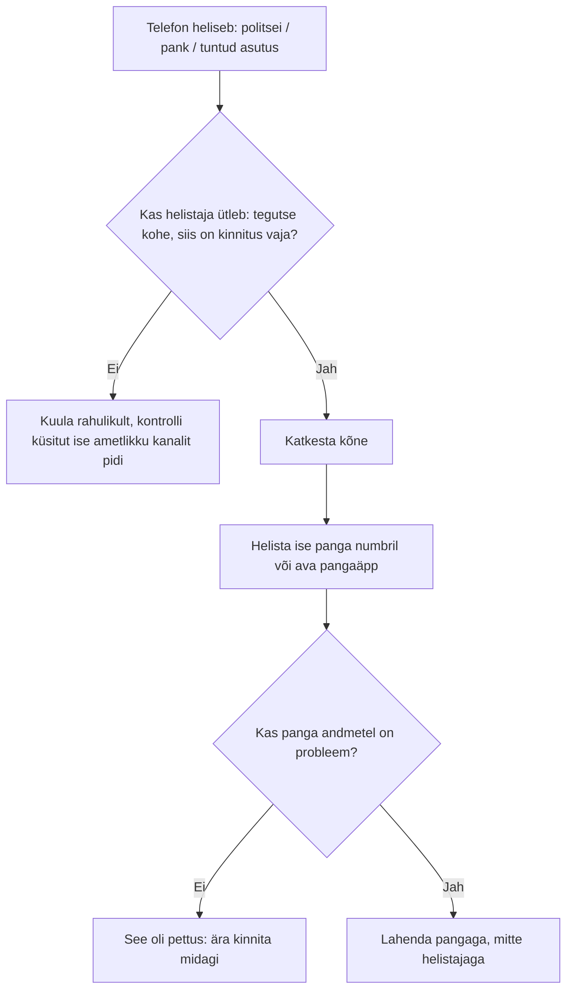

# 2. Digiteenused II: kool, pank ja ettevõte

::: info Õpiväljund
Pärast tundi oskad valida õige keskkonna kooli-, raha-, tervise- ja töö-asjade jaoks, kinnitad makse teadlikult ning tunned ära tüüpilise pangapettuse ja tead, mida siis teha (HK 2.3).
:::

Liisi neljapäev näeb välja nii.

- **08:00.** Ta vaatab bussis, mis ajal algab esimene tund ja kas ta sai eile kodutöö eest hinde.
- **13:00.** Ta peab maksma telefoniarve ja ostma bussikaardi.
- **16:00.** Ta alustab tööd ja logib firma postkasti ning Teamsi.
- **19:00.** Ta saab telefonile kõne: "Kõneleb politsei, teie kontolt toimub kahtlane makse."

Neli keskkonda, neli rolli. Sama inimene, aga igas kohas on teised reeglid ja teised ohud. Selles tunnis vaatame, kuidas nendes hakkama saada.

## Kooli keskkonnad: mis on milleks?

Kuressaare Ametikooli lehe järgi kasutab Liis koolis mitut süsteemi. Esimese hooga tundub neid palju, aga igaühel on oma ülesanne.

| Keskkond | Milleks | Liisi näide |
| --- | --- | --- |
| **HarID** | Haridussüsteemi kasutajakonto. Kooli andmetel on seda vaja nii Tahvli kui Microsoft 365 kasutamiseks | Liis loob selle õppeaasta alguses |
| **Tahvel** | Õppeinfosüsteem: tunniplaan, hinded, puudumised | Liis vaatab, millal algab tund |
| **Moodle** | Õppematerjalid ja ülesanded | Liis avab kursuse ja esitab töö |
| **Microsoft 365** (Outlook, Teams, OneDrive) | Kooli e-post, suhtlus ja failid | Liis saab õpetajalt kirja |
| **eduID** | Õpilaspileti tellimine | Liis tellib õpilaspileti |

Tahvlisse saab sisse logida mitmel viisil: ID-kaardi, Mobiil-IDga, TARA kaudu (kus on ka Smart-ID) või HarID kasutajanime ja parooliga. Kui Liis kasutab ID-kaarti või Smart-ID-d, siis on see sama sisselogimine, mida õppisid [kohtumisel 1](./kohtumine-01-riik-ja-autentimine).

::: tip Mis on hea teada
Tahvel on **kooli enda andmete** koht. Seal on sinu hinded ja puudumised. Ära anna oma sisselogimist kaaslasele "ainult korraks vaadata", sest see on isiklik andmekogu. Kui sõber tahab sinu hinnet teada, ütle see talle ise.
:::

## Pangas: sisenemine ja kinnitamine

Liis peab maksma telefoniarve. Selleks logib ta internetipanka. Siin on kaks eri sammu, sama nagu kohtumisel 1:

1. **Sisselogimine** (PIN1 või pangaäpp). Pank teab, kes sa oled.
2. **Makse kinnitamine** (PIN2 või pangaäpp). Sa kinnitad selle konkreetse tehingu.

Kui ta ostab veebipoest bussikaardi, kasutab ta **pangalinki**. See on lahendus, kus veebipood suunab sind sinu panga enda keskkonda. Raha liigub seal, mitte veebipoes. Veebipood ei näe sinu pangakoode.

### Enne kinnitamist vaata kolme asja

Liis ei vajuta "kinnita" enne, kui ta on kontrollinud:

1. **Summa.** Kas see on õige?
2. **Saaja.** Kas see on see, kellele ma tahan maksta?
3. **Tegevus.** Kas **mina** alustasin seda makset?

Kui üks vastus on "ei", ei kinnita ta. Selle kolme küsimuse mõte on jõuda PIN2-ni mõtlemisega, mitte refleksiga. Pettuste puhul sunnibki petis sind kiirustama.

## Terviseportaal ja muud avalikud teenused

Liis ei ole haige, aga ta peaks teadma, kus tema andmed on. Eestis liiguvad terviseandmed **tervise infosüsteemis** (TIS). Patsient näeb oma andmeid **Terviseportaalis** (terviseportaal.ee), mis asendas varasema Digilugu. Seal saab vaadata oma visiite, analüüse ja diagnoose ning broneerida aegu. Sisse logitakse sama viisiga nagu riigiportaali.

Teised keskkonnad, kus noor inimene varem või hiljem käib:

| Valdkond | Kust otsida |
| --- | --- |
| Riigi teenused | [eesti.ee](https://www.eesti.ee) |
| Tervis | [terviseportaal.ee](https://www.terviseportaal.ee) |
| Kohalik omavalitsus | Oma valla või linna koduleht |
| Töötaja iseteenindus | Tööandja portaal ja e-post |

Kohaliku omavalitsuse teenuste valik on vallati ja linniti erinev. Otsi oma elukoha omavalitsuse kodulehelt jaotist "E-teenused" või "Avaldused".

## Liisi töökoht: ettevõtte digiteenused

Tööl ei ole Liisil valikut, mis keskkonda ta kasutab. Firma otsustab. Küll on Liisi enda otsustada, **kuidas ta seal käitub**.

- Firma e-post ja Teams on **tööasjade** jaoks. Ära kasuta neid isiklikuks suhtluseks, mida sa ei taha tööandjale näidata.
- Firma konto on firma oma. Kui Liis lahkub, kaob ligipääs.
- Parooli ja PIN-e ei jagata ka kolleegiga. Kui kolleeg vajab ligipääsu, taotle talle õigus.

Neid asju tuleb täpsemalt [kohtumisel 6](./kohtumine-06-failide-jagamine) ja [kohtumisel 7](./kohtumine-07-meeskonnatoo).

## Õhtune kõne: pangapettus

Liis saab kell 19 kõne. Hääl ütleb: "Tere, siin politsei. Teie pangakontol on kahtlane tehing, selle peatamiseks on vaja teie kinnitust." Hääl on rahulik ja kindel, kuid kiirustab.

See on petukõne, mis on Eestis kõige kahjulikum pettuse liik.

### Mida numbrid ütlevad?

Eesti Pangaliidu andmetel langes 2025. aastal petuste ohvriks **3685 inimest** ja neilt peteti välja kokku ligikaudu **31 miljonit eurot**.

| Pettuse liik | Kahju 2025 |
| --- | --- |
| Petukõned | ~11,5 miljonit € |
| Investeerimispettused | 6,3 miljonit € |
| Ettevõtetele suunatud pettused | 2,7 miljonit € |
| Müügipettused | 1,7 miljonit € |

Petukõne mõte on lihtne: kurjategija esineb politseina, pangana või muu asutusena ja ütleb, et sinu raha on ohus. Ta tahab, et sa ise kinnitaksid makse või annaksid PIN-i.

### Reeglid, mis kaitsevad

Pangaliit ja pettuseinfo.ee kampaania järgi:

- **Pank ei küsi kunagi sinult PIN-koode** ega autentimisvahendeid. Ka mitte telefonis.
- **Kinnita tehing ainult siis, kui sina selle algatasid**, ja tee seda oma pangarakenduses, mitte helistaja antud lingil.
- **Ära lase end kiirustada.** Pettuse põhitööriist on pinge. Kampaania põhimõte on "võta aega ja kahtle, kontrolli, küsi".
- Küsi nõu lähedastelt.

### Ka SMS võib petta

RIA (CERT-EE) hoiatas 2025. aasta märtsis, et petturid saadavad **SMS-e, mis näivad olevat riigiametilt** (näiteks Transpordiametilt). Link viib võltslehele, mille aadress ei lõpe ametliku domeeniga. Seal küsitakse pangaandmeid ja andmed saadetakse päris panka, kust petis võtab kinnituskoodi.

RIA soovitus: ära kliki SMS-i lingil, võta asutusega ühendust ametlike kontaktandmete kaudu, kustuta kahtlane sõnum ja saada see CERT-EE-le.

### Kui kogemata juhtus

Pettuseinfo.ee soovitab järgmises järjekorras:

1. **Pank.** Teata sellest kohe, et nad saaksid tehingut peatada. Välja petetud raha liigub kiiresti ja hea reaktsioon võib mõnikord makse peatada.
2. **Politsei.** Saada teade aadressile kelmused@politsei.ee või politsei veebilehe kaudu.
3. **Ohvriabi.** Emotsionaalne tugi ja juhendamine.

Hirm või häbi ei ole põhjus vaikida. Mida varem teatad, seda suurem on võimalus kahju vähendada.

## Arendaja vaates: kuidas riigi teenused omavahel räägivad

Kui Liis avab Tahvli, ei tea ta, kus tema andmed asuvad. Arendaja jaoks on see huvitav küsimus: **kuidas eri asutuste süsteemid omavahel andmeid vahetavad?**

Eesti vastus on **X-tee**. See on riigi andmevahetuskiht, mille haldaja on RIA. Selle põhiideed:

- Andmed jäävad asutusele, kes neid peab. Keskset suurt andmebaasi ei ole.
- Kui üks süsteem vajab teise andmeid, küsib ta neid X-tee kaudu. Päring on turvaline ja logitud.
- X-tee tarkvara (X-Road) on **avatud lähtekoodiga** ja seda kasutavad ka teised riigid, näiteks Soome ja Island.

See on sama mõte, mida õppisid veebiarenduses: üks süsteem teeb **päringu**, teine annab **vastuse**. Vaata kordamiseks [HTTP päringut ja vastust](/veebiarendus/http-paring-ja-vastus). Erinevus on selles, et X-tee lisab ümber usalduse: igal päringul on teada, kes küsib ja kellelt.

## Praktiline töö: Liisi neljapäev

Töö tehakse **ainult fiktiivsete andmetega**. Ära kirjuta oma isikukoodi, kontonumbreid ega kooli keskkonna sisu (hindeid, puudumisi).

**A. Keskkonna valik**

Liisil on kuus vajadust. Kirjuta tabelisse: mis keskkond (Tahvel, Moodle, Microsoft 365, internetipank, Terviseportaal, eesti.ee, omavalitsuse leht), mis vahendiga sisse (ID-kaart, Mobiil-ID, Smart-ID, HarID) ja kas tegevus on sisselogimine või kinnitamine.

1. Liis tahab teada, mis ajal algab homme esimene tund.
2. Liis tahab esitada kodutöö.
3. Liis peab tasuma telefoniarve.
4. Liis tahab näha oma viimase analüüsi vastust.
5. Liis tahab saata õpetajale küsimuse.
6. Liis tahab leida, kuidas taotleda lapse sünnitoetust (tema õde kasvatab last ja küsib nõu).

**B. Kolme teenuse võrdlus**

Võrdle fiktiivse stsenaariumi põhjal Tahvlit, internetipanka ja eesti.ee riigiportaali kahe mõõdupuu järgi: **turvalisus** (mis on kaitse sisselogimisel, kinnitamisel) ja **kasutusmugavus**. Kirjuta kaks lauset iga teenuse kohta.

**C. Petukõne**

Loe kolme näidiskõnet ja otsusta, kas see on pettus.

1. "Siin teie pank. Teie kaart blokeeriti, kinnitage PIN2 siin lingil."
2. "Siin teie pank. Soovime kinnitada, et te tegite täna ülekande 800 € kontole, mida te ei tunne. Kui see olite teie, ei pea te midagi tegema. Kui ei, helistage panga numbril, mis on kaardi tagaküljel."
3. "Siin politsei. Olete kahtlustatav. Maksa kohe tagatisraha, muidu tuleme kinni võtma."

Iga kõne juures: kas pettus, mille järgi tuvastasid ja mida Liis teeb.

**Esitatav töö:** portfoolio osa 2 (keskkondade tabel, võrdlus ja kõnede analüüs). **Seos: HK 2.3.**

## Kokkuvõte

| Mõiste | Tähendus |
| --- | --- |
| HarID | Haridussüsteemi kasutajakonto |
| Tahvel | Tunniplaan, hinded, puudumised |
| Moodle | Õppematerjalid ja ülesanded |
| Pangalink | Veebipood suunab sind panga keskkonda maksma |
| Terviseportaal | Patsiendi vaade tervise infosüsteemile |
| Petukõne | Suurima kahjuga pettus: esineb politsei või pangana |
| X-tee | Riigi andmevahetuskiht |

Kolm kontrolli enne kinnitamist: **summa, saaja ja kas mina alustasin**.

## Allikad

- [Kuressaare Ametikool: Tunniplaan jt infosüsteemid](https://www.ametikool.ee/et/oppetoo/tunniplaan-jt-infosusteemid)
- [Eesti Pangaliit: Pettuste ennetamine](https://pangaliit.ee/pettuste-ennetamine)
- [Pettuseinfo.ee](https://pettuseinfo.ee/)
- [RIA: Ettevaatust! Levivad riiklikke e-teenuseid matkivad õngitsused](https://www.ria.ee/blogi/ettevaatust-levivad-riiklikke-e-teenuseid-matkivad-ongitsused)
- [Tahvel: kasutusjuhendid](https://juhendid.hitsa.ee/)
- [Terviseportaal](https://www.terviseportaal.ee)
- [Vikipeedia: X-tee](https://et.wikipedia.org/wiki/X-tee)
