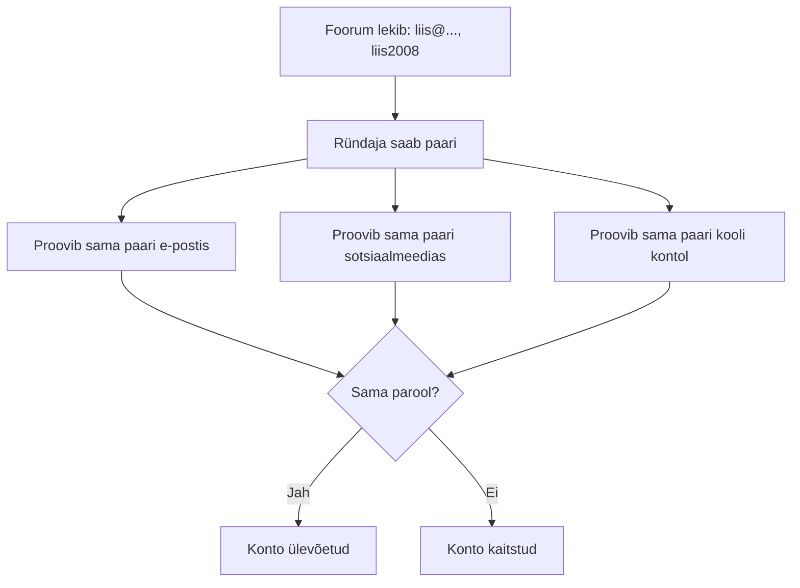
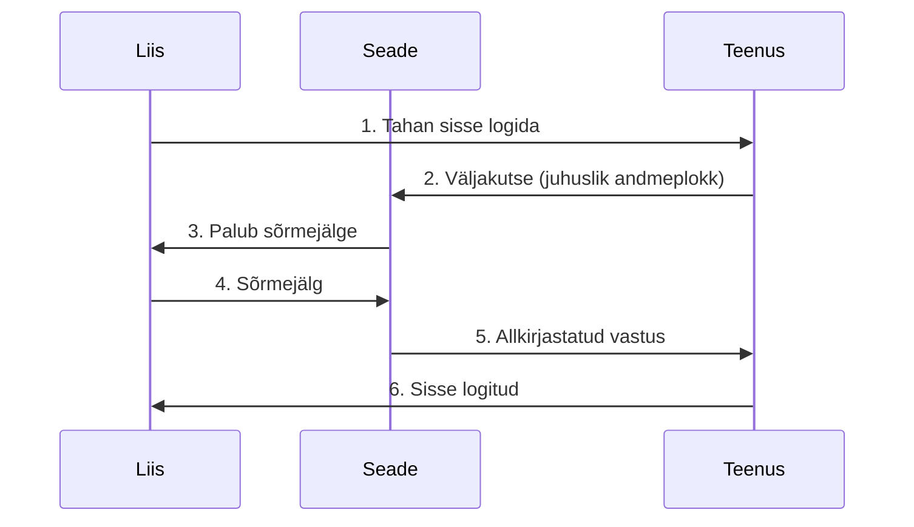

# 3. Digitaalne identiteet I: kes ma võrgus olen

::: info Õpiväljund
Pärast tundi selgitad, mis on digitaalne identiteet, kaitsed oma kontosid tugevate paroolide, paroolihalduri ja mitmeteguriliste meetoditega ning tead, mis on passkey (HK 2.6).
:::

Liisil on 40 veebikontot. Nende hulgas on kooli, töö, mängu, sotsiaalmeedia, poe kliendikaardi ja muud. Kõigi jaoks on tal kolm parooli. Kõige kasutatum neist on `liis2008`.

Ühel päeval saab ta teate, et väike mänguforum, kus tal oli konto, on lekkinud. Liis ei muretse: "See on ju ainult mänguforum." Kas tal on põhjust muretseda?

## Mis on digitaalne identiteet?

**Digitaalne identiteet** on kogu see info ja need vahendid, mis tõestavad internetis, et sina oled sina. Ta ei ole üks asi, vaid kihid.

| Kiht | Mis see on | Liisi näide |
| --- | --- | --- |
| **Riiklik e-identiteet** | Riigi väljastatud vahend | ID-kaart, Mobiil-ID, Smart-ID (vt [kohtumine 1](./kohtumine-01-riik-ja-autentimine)) |
| **Organisatsiooni identiteet** | Kooli või tööandja konto | HarID, kooli Microsoft 365 konto, firma e-post |
| **Isiklikud kontod** | Sinu enda loodud kontod | E-post, sotsiaalmeedia, mängukonto, GitHub |
| **Taastekanalid** | See, mis aitab kontot taastada | Telefoninumber, varu-e-post |

Pane tähele viimast rida. **Taastekanal on sama oluline kui parool.** Kui keegi saab sinu e-posti kätte, saab ta tavaliselt tellida "unustasin parooli" kõigis teistes teenustes. E-post on seega sinu identiteedi võti.

## Miks Liisil on põhjust muretseda?

Liis kasutas mänguforumis sama parooli, mis ta e-postis. Foorum on lekkinud, nii et ründaja nägi tema e-posti aadressi ja parooli.

Mis ründaja järgmiseks teeb? Ta proovib seda sama paari **automaatselt kümnetes teistes teenustes**. Seda nimetatakse **sisselogimisandmete taaskasutuseks** (*credential stuffing*). Ta ei vaja Liisi isiklikult tundma õppida: programm proovib läbi tuhandeid paare.



Üks lekkinud parool on kahjutu ainult siis, kui see parool ei kehti kusagil mujal. Seepärast on kõige tähtsam reegel: **iga konto jaoks oma parool.**

## Hea parool

Parooli tugevust käsitlesime juba kursusel [Kontod, paroolid ja õigused](/kuberturvalisus/kontod-ja-oigused). Siin on põhiasjad Liisi vaatenurgast.

| `liis2008!` | `kollane-kass-sööb-hommikul-kalja` |
| --- | --- |
| Lühike | Pikk |
| Sisaldab nime ja aastat, mida ründaja proovib esimesena | Juhuslike sõnade jada, mis ei ole seotud sinuga |
| Kerge arvata | Raske arvata, aga lihtne meelde jätta |

Soovitus (NIST SP 800-63B-4): **pikkus on olulisem kui keerukus.** Pikk salasõna (mitu sõna) on tugevam kui lühike tähtede, numbrite ja sümbolite segu.

Aga Liisil on 40 kontot. Kes jõuab meelde jätta 40 pikka salasõna? Siin tulebki appi paroolihaldur.

## Paroolihaldur

**Paroolihaldur** on programm, mis:

- loob igale kontole **ainulaadse, pika ja juhusliku** parooli;
- salvestab need krüpteeritud hoidlasse;
- täidab parooli ainult õigel lehel (võltsleht ei saa parooli kätte, sest aadress ei klapi).

Sina pead meeles pidama **ühte peaparooli**, mis on pikk salasõna.

Võimalusi on kaks:

| Tüüp | Näited | Märkused |
| --- | --- | --- |
| Brauseri sisseehitatud haldur | Brauseri enda parooli salvestus | Mugav, aga seotud brauseri ja seadmega |
| Eraldi paroolihaldur | Bitwarden, KeePassXC | Töötab mitmes seadmes, võimalusi rohkem |

Õppetöös kasutatakse paroolihaldurit ainult **testandmetega**. Millist haldurit sa päriselt kasutad, otsusta ise. Tähtis on, et kasutad üht.

::: warning Peaparool
Kui unustad peaparooli, ei saa hoidlat tavaliselt taastada. Kirjuta peaparool paberile ja hoia kindlas kohas, mitte arvutis.
:::

## Mitmeteguriline autentimine

Parool üksi ei ole piisav. Isegi tugev parool võib õngitsuse tõttu kellegi teise kätte sattuda. Seepärast lisandub teine tõend.

Meenutus kolmest tegurist: midagi, mida **tead** (parool), midagi, mis sul **on** (telefon, turvavõti), midagi, mis sa **oled** (sõrmejälg).

| Meetod | Tugevus |
| --- | --- |
| SMS-kood | Parem kui mitte midagi, aga kõige nõrgem |
| Autentimisrakenduse kood | Tugevam |
| Rakenduses kinnitamine | Tugev, kui kontrollid tegevuse enne kinnitamist |
| Riistvaraline turvavõti või passkey | Kõige tugevam, sest vastupidav õngitsusele |

CISA soovitab kasutada **tugevaimat kättesaadavat** meetodit. Kooli Microsoft 365 konto puhul kasuta seda, mida kool pakub, ja ära kinnita küsimusi, mida sa ise ei algatanud. Miks see tähtis on, näed [kohtumisel 4](./kohtumine-04-identiteedi-kaitse).

## Passkey: parool, mida ei saa varastada

Kujuta ette, et sul ei olegi parooli. Sa lihtsalt avad telefoni sõrmejäljega, nagu tavaliselt, ja oled sisse logitud. Täpselt nii töötab **passkey**.

FIDO Alliance'i järgi on passkey FIDO standardil põhinev sisselogimisviis, mis kasutab **võtmepaari**:

- **Avalik võti** asub teenuse serveris. See ei ole saladus.
- **Privaatvõti** jääb sinu seadmesse ega lahku sealt kunagi.

Sisselogimisel saadab server väljakutse, sinu seade allkirjastab selle privaatvõtmega ja server kontrollib allkirja avaliku võtmega. Seadme avamiseks kasutad sõrmejälge, näotuvastust või PIN-i.



Miks see on parem kui parool?

- Teenusel on ainult avalik võti. Kui teenus lekib, pole seal midagi, mida varastada.
- Võti töötab ainult sellel veebilehel, kus see registreeriti. Võltsleht ei saa seda kasutada, seega on passkey **õngitsusele vastupidav**.
- Sa ei pea midagi meelde jätma.

Passkey'sid toetavad üha rohkem teenuseid. Kui sinu teenus seda pakub, kasuta seda.

## Arendaja vaates: kuidas parooli hoitakse

Kui sa ehitad rakenduse, kuhu kasutaja saab sisse logida, tekib küsimus: **kuidas ma parooli hoian?** Vastus: **sa ei hoia seda.**

Selle asemel hoiad sa parooli **räsi** (*hash*). Räsi on parooli ühesuunaline teisendus: parooli saab räsiks, aga räsist ei saa parooli tagasi.

1. Kasutaja valib parooli.
2. Rakendus lisab **soola** (*salt*), mis on juhuslik väärtus, mis on iga kasutaja jaoks eri.
3. Rakendus arvutab räsi aeglase algoritmiga.
4. Räsi ja sool salvestatakse. Parooli ennast mitte.

Sisselogimisel arvutatakse sama parooliga uus räsi ja võrreldakse salvestatuga.

```text
salvestan:  sool + räsi(sool + parool)
kontrollin: räsi(sool + sisestatud parool) == salvestatud räsi ?
```

Miks sool? Kui kaks kasutajat valivad sama parooli, saavad nad sooladega erineva räsi. Ründaja ei saa kasutada valmis tabeleid (*rainbow tables*).

OWASP soovitab paroolide jaoks **Argon2id**, mille minimaalne seadistus on 19 MiB mälu, kaks iteratsiooni ja üks paralleelsus. Teine valik on bcrypt. Ära kunagi kirjuta oma räsifunktsiooni, vaid kasuta valmis teeki.

Sellest tuleb kaks reeglit:

- Kui veebileht saadab "unustasin parooli" peale sulle **sinu vana parooli**, hoitakse seda lahtiselt. See on halb rakendus. Hea rakendus saadab lähtestuslingi.
- **Saladused (API võtmed, andmebaasi paroolid) ei kuulu koodi ega gitti.** Seda vaatame [kohtumisel 4](./kohtumine-04-identiteedi-kaitse) ja [kohtumisel 6](./kohtumine-06-failide-jagamine).

## Praktiline töö: Liisi identiteedikaart

Töö tehakse **fiktiivsete andmetega**. Ära kirjuta oma tegelikke paroole ega kontosid.

**A. Identiteedikaart**

Koosta Liisi jaoks tabel vähemalt kaheksa kontoga: e-post, kooli konto, Teams, sotsiaalmeedia, mängukonto, pood, pank, GitHub. Iga rea kohta kirjuta:

| Konto | Tüüp (riiklik, org., isiklik) | Kui oluline (madal, kõrge, kriitiline) | Kuidas Liis seda kaitseb praegu | Mida soovitad |
| --- | --- | --- | --- | --- |

Märgi, milline konto on **kõige olulisem** (vihje: millega saab teisi taastada) ja põhjenda.

**B. Salasõna**

Koosta Liisile näide tugevast salasõnast (neli juhuslikku sõna, ei seostu temaga). Seleta, miks see on parem kui `liis2008!`. **Ära kasuta oma päris parooli.**

**C. Paroolihaldur**

Kirjelda sammudena, kuidas Liis seadistaks paroolihalduri. Kasuta õpetaja valitud tööriista ja testkontot. Pane kirja: peaparooli reegel, kuidas ta loob uue kirje, kuidas ta kontrollib, et parool täideti õigel lehel.

**D. Mitmeteguriline autentimine**

Vali Liisi kolme konto jaoks kaitse ja põhjenda (SMS, rakendus, turvavõti või passkey). Selgita ühe lausega, miks passkey on õngitsusele vastupidav.

**Esitatav töö:** portfoolio osa 3 (identiteedikaart, salasõna, paroolihalduri sammud, MFA valik). **Seos: HK 2.6.**

## Kokkuvõte

| Mõiste | Tähendus |
| --- | --- |
| Digitaalne identiteet | Kihid: riiklik, organisatsiooni, isiklik, taaste |
| Sisselogimisandmete taaskasutus | Lekkinud paari proovitakse teistes teenustes |
| Paroolihaldur | Loob ja hoiab ainulaadsed paroolid |
| MFA | Parool ja veel teine tõend |
| Passkey | Võtmepaar, õngitsusele vastupidav |
| Räsi ja sool | Rakendus hoiab räsi, mitte parooli |

Reegel: **iga konto jaoks oma parool ja kõige olulisemate kontode jaoks teine tegur.**

## Allikad

- [NIST SP 800-63B-4: Digital Identity Guidelines](https://pages.nist.gov/800-63-4/sp800-63b.html)
- [CISA: Secure Our World, More than a password](https://www.cisa.gov/secure-our-world/turn-mfa)
- [FIDO Alliance: Passkeys](https://fidoalliance.org/passkeys/)
- [OWASP: Password Storage Cheat Sheet](https://cheatsheetseries.owasp.org/cheatsheets/Password_Storage_Cheat_Sheet.html)
