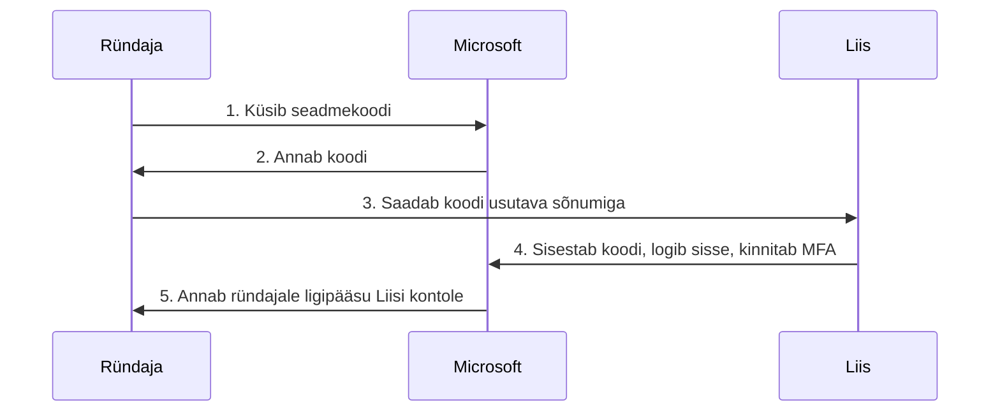

# 4. Digitaalne identiteet II: kaitse

::: info Õpiväljund
Pärast tundi tunned ära õngitsuse, kontrollid andmelekkeid, tead, mida teha kui konto on ülevõetud, ning kaitsed oma kontosid privaatsusseadete ja kasutamata kontode sulgemisega (HK 2.6).
:::

Reede hommikul avab Liis kooli postkasti. Üleval on kiri.

> **Teema:** Teie kooli konto aegub 24 tunni jooksul
> **Saatja:** Kooli IT tugi
>
> Austatud kasutaja,
> teie konto aegub. Konto säilitamiseks logige kohe sisse lingil allpool, muidu kaotate ligipääsu kõigile oma failidele.
>
> **Logi sisse**

Liisil on kiire. Ta peab kohe minema tundi ja ta ei taha oma faile kaotada. Mida ta teeb?

## Õngitsus: kuidas ära tunda

**Õngitsus** (*phishing*) on kirjas, SMS-is või sõnumis tehtud katse panna sind ise andma oma parool, PIN või kood, või vajutama lingil.

RIA (CERT-EE) toob õngitsuse tunnustena välja:

| Tunnus | Liisi kirjas |
| --- | --- |
| Kehv keel või ebaloogiline lause | "Austatud kasutaja" ja kohmakas sõnastus |
| Kahtlane saatja või number | Aadress ei ole kooli oma |
| **Kiireloomulisus** | "24 tunni jooksul", "kohe" |
| Link, mis viitab organisatsioonile, keda matkitakse | "Logi sisse" nupp |
| Hirm või kaotuse oht | "Kaotate ligipääsu failidele" |

Seni on räägitud tunnustest. Aga kaasaegsed õngitsused võivad olla vigadeta. Seepärast peab Liis lisaks tunnuste otsimisele järgima **reeglit**:

> **Ära logi sisse kirja lingi kaudu. Ava keskkond ise (kirjuta aadress või kasuta järjehoidjat) ja vaata, kas seal on teade.**

Kui kooli IT tõesti vajab sinult midagi, on see ka kooli keskkonnas näha. Päris teenus ei karista sind, kui kontrollid enne.

### Õngitsuse väljaspool e-posti

Õngitsus on ka SMS-is, sotsiaalmeedia sõnumites ja kõnedes. 2025. aastal hoiatas RIA SMS-ide eest, mis matkivad riigiasutusi: link viib võltslehele, kus küsitakse pangaandmeid, ja ründaja kasutab sisestatud andmeid päris panga lehel, et saada kinnituskood. Hoiatuse märk oli aadressi lõpp (ametliku asutuse asemel `.com`).

## Seadmekoodi õngitsus Microsoft 365-s

Liis arvab: "Mul on mitmeteguriline autentimine, seega ma olen kaitstud." Enamasti on see tõsi. Aga RIA on dokumenteerinud õngitsuse, mis **MFA-d ja parooli ei varasta, kuid võtab konto ikkagi üle.** See on **seadmekoodi õngitsus** (*device code phishing*).

Kuidas see käib?

1. Ründaja küsib Microsoftilt **seadmekoodi**, nagu teeks ta sisselogimist nutiteleril.
2. Ta saadab koodi Liisile usutava sõnumiga (koosolekukutse, turvakontroll jne).
3. Liis avab `microsoft.com/devicelogin` ja sisestab koodi.
4. Liis logib **ise** sisse ja kinnitab MFA, mis tundub täiesti tavaline.
5. Ründaja saab ligipääsu Liisi kontole.

Liis ei sisestanud parooli ründaja lehele. Ta ei andnud ründajale MFA-koodi. Ründaja sai ligipääsu ikkagi, sest **Liis ise tegi sisselogimise ründaja eest**.

RIA soovitus kasutajale: **ära sisesta seadmekoodi ega logi sisse, kui sa ei algatanud seda ise.** Organisatsioonid saavad selle sisselogimisviisi blokeerida, aga see on IT-töötaja ülesanne.

See õppetund on laiem: ükski tehniline kaitse ei aita, kui kasutaja kinnitab midagi, mida ta ei algatanud. Sama reegel kehtis [kohtumisel 1](./kohtumine-01-riik-ja-autentimine) PIN2 puhul: **kinnita ainult siis, kui sina alustasid.**

## Andmelekked

Eelmine kord kuulis Liis mänguforumi lekkest. Kuidas ta saab teada, mis tema kohta on lekkinud?

**Have I Been Pwned** (HIBP) on veebileht, mille on loonud Troy Hunt. See kogub avalikke andmelekkeid ja ütleb, kas sinu e-posti aadress on mõnes neist. Kui aadress on leitud, näed, millisest teenusest ja mis andmeid leke sisaldas (parool, telefon, nimi).

::: warning Klassiruumis
Õpetaja näitab HIBP kasutamist **demonstratsiooniaadressiga**. Ära sisesta klassis oma isiklikku e-posti aadressi. Tee see kodus, privaatselt.
:::

Kui oled lekkes:

1. Vaheta selle teenuse parool. Kui sama parooli kasutasid mujal, vaheta ka seal. Paroolihaldur teeb selle lihtsaks.
2. Lülita sisse mitmeteguriline autentimine.
3. Ole kahtlane järgmiste õngitsuste suhtes: lekkinud kontaktandmeid kasutatakse sihitud kirjade saatmiseks.

## Kui konto on ülevõetud

Oletame, et Liis siiski sattus lõksu: ta sisestas oma andmed õngitsuslehele, ja nüüd saadab tema konto sõpradele kummalisi linke. Mida ta teeb?

| Samm | Tegevus | Miks |
| --- | --- | --- |
| 1 | Ära paanitse, aga tegutse kohe | Iga minut loeb |
| 2 | Vaheta parool **teisest, puhtast seadmest** | Rünnatud seadmel võib olla pahavara |
| 3 | Logi kõik seansid välja ja kontrolli seadeid | Ründaja võib olla ikka sees |
| 4 | Kontrolli MFA meetodeid ja taastekanaleid | Ründaja võib olla lisanud oma |
| 5 | Vaheta paroolid kõigis teenustes, kus kasutasid sama parooli | Ründaja proovib neid |
| 6 | Teata kooli IT-le või tööandjale | Nad kaitsevad teisi |
| 7 | Kui kasutaja andis pangaandmeid, võta kohe ühendust pangaga | Vt [kohtumine 2](./kohtumine-02-kool-pank-ettevote) |
| 8 | Kahtlane õngitsuskiri saada CERT-EE-le (cert@cert.ee) | Aitab teisi hoiatada |

CERT-EE andmetel töötab teenus ööpäevaringselt ja ütleb, kas tegu on õngitsusega.

## Privaatsusseaded ja kontode koristamine

Liisil on 40 kontot, millest ta kasutab 12. Ülejäänud 28 on **rünnakupind**: iga konto on potentsiaalne leke.

Reeglid:

- **Kustuta kontod, mida sa ei kasuta.** Kui teenus lekib, ei ole seal sinu andmeid.
- **Vaata üle privaatsusseaded.** Kes näeb sinu postitusi, sinu telefoninumbrit, sinu asukohta?
- **Vaata üle, millistele rakendustele oled andnud ligipääsu** oma kontole (näiteks "Logi sisse Facebookiga" ja muud).
- **Ära kasuta sama e-posti kõikjal.** Ühe e-posti kaotamine annab ligipääsu paljudele.

## Arendaja vaates: GitHubi konto ja lekkinud saladused

Arendaja konto ei ole tavakonto. Kui keegi võtab üle sinu GitHubi konto, saab ta teha muudatusi koodis, mida teised kasutavad. Seepärast on GitHubi turvalisus eriti oluline.

**Mitmeteguriline autentimine.** GitHub teatas 2022. aastal, et nõuab 2023. aasta lõpuks mitmeteguriline autentimist **kõigilt kasutajatelt, kes lisavad GitHubi koodi**. Toetatud on turvavõtmed, autentimisrakendused ja SMS. Kui oled GitHubis, lülita see sisse.

**SSH-võtmed ja tokenid.** Git-tegevuste jaoks ei pea sa GitHubi parooli sisestama. Võid kasutada SSH-võtit (sama avaliku ja privaatvõtme põhimõte nagu passkey puhul) või isiklikku juurdepääsutokenit. Mõlemad on piiratavad ja tühistatavad.

### Lekkinud saladus repos

Üks levinumaid arendaja vigu on **panna parool, API võti või token otse koodi** ja pushida see GitHubi.

GitGuardiani 2026. aasta aruande järgi lisati 2025. aastal avalikesse GitHubi commit'idesse **28,65 miljonit uut koodi kirjutatud saladust**, mis on 34% rohkem kui aasta varem. Aruande andmetel oli 64% 2022. aastal lekkinud ja kehtivatest saladustest veel 2026. aasta jaanuaris kasutuskõlblikud.

See viimane arv annab olulise õppetunni: **saladuse kustutamine koodist ei aita.** Git hoiab ajalugu, nii et vana commit sisaldab seda ikka. Õige tegevus:

1. **Tühista (rotate) saladus.** Tee uus ja keela vana. See on kõige olulisem.
2. Siis alles puhasta kood ja ajalugu.
3. Kontrolli, kas keegi on vana saladust kasutanud.

GitHubil on selle jaoks kaitse: **secret scanning push protection** blokeerib pushi, kui see sisaldab tuvastatavat saladust. Avalike repode puhul on see kasutajale vaikimisi sisse lülitatud. Kuid see tuvastab ainult tuntud vorminguid. Parim kaitse on harjumus: saladused kuuluvad keskkonnamuutujatesse või `.env` faili, mis on `.gitignore`'is. Rohkem vaatame [kohtumisel 6](./kohtumine-06-failide-jagamine).

## Praktiline töö: Liisi kaitseplaan

Töö tehakse **fiktiivsete andmetega**. Ära kasuta oma kontosid, sõnumeid ega lekkeinfot.

**A. Näidiskirjade analüüs**

Loe kolme sõnumit ja otsusta, kas see on õngitsus. Iga kohta kirjuta: otsus, tunnused, mida Liis teeb.

1. E-kiri saatjalt "Microsoft Teams": "Sind kutsuti koosolekule. Ava `microsoft.com/devicelogin` ja sisesta kood `ABCD-1234`."
2. SMS: "Transpordiamet: teil on tasumata trahv 38 €. Maksa 24 h jooksul: `trahv-tasumine.com`"
3. Kooli õpetaja saadab Teamsis kirja: "Tere kõigile, homme tund algab kell 10 ruumis 214. Ootan kõiki! Õp. T."

**B. Konto ülevõtmise tegevusplaan**

Liis avastab, et tema kooli konto on ülevõetud. Koosta tegevusplaan vähemalt kuue sammuga järjekorras ja põhjenda iga järjekorda.

**C. Kontode koristamine**

Võta oma eelmise tunni identiteedikaardi tabel. Märgi, millised kontod Liis peaks **kustutama**, ja põhjenda.

**D. Arendajale**

Liis pushis kogemata GitHubi avalikku repositooriumi faili, kus on API võti. Kirjuta, mida ta teeb ja millises järjekorras. Selgita, miks "ma kustutan faili" ei ole piisav.

**Esitatav töö:** portfoolio osa 4 (õngitsuste analüüs, tegevusplaan, kontode koristamine, API võtme juhtum). **Seos: HK 2.6.**

## Kokkuvõte

| Mõiste | Tähendus |
| --- | --- |
| Õngitsus | Sõnum, mis tahab, et sa ise annaksid saladuse või vajutaksid |
| Seadmekoodi õngitsus | Sa logid sisse ründaja eest, MFA ei aita |
| HIBP | Kontrollib, kas e-post on lekkinud |
| Rünnakupind | Mida rohkem kontosid, seda rohkem võimalusi lekkeks |
| Saladuse tühistamine | Lekkinud saladust tuleb tühistada, mitte ainult kustutada |

Reegel: **kinnita ja sisesta ainult siis, kui sina alustasid. Kahtluse korral ava keskkond ise.**

## Allikad

- [RIA: CERT-EE hoiatab SMS õngitsuste eest](https://www.ria.ee/uudised/cert-ee-hoiatab-sms-ongitsuste-eest)
- [RIA: Seadmekoodi õngitsus võtab Microsoft 365 konto üle](https://www.ria.ee/blogi/seadmekoodi-ongitsus-votab-microsoft-365-konto-ule-ilma-parooli-ja-mfa-koodi-varastamata)
- [RIA: Riiklikke e-teenuseid matkivad õngitsused](https://www.ria.ee/blogi/ettevaatust-levivad-riiklikke-e-teenuseid-matkivad-ongitsused)
- [Have I Been Pwned](https://haveibeenpwned.com/About)
- [GitHub Blog: GitHub 2FA](https://github.blog/news-insights/product-news/raising-the-bar-for-software-security-github-2fa-begins-march-13/)
- [GitGuardian: State of Secrets Sprawl 2026](https://www.gitguardian.com/state-of-secrets-sprawl-report-2026)
- [GitHub Docs: Secret scanning push protection](https://docs.github.com/en/code-security/secret-scanning/introduction/about-push-protection)
