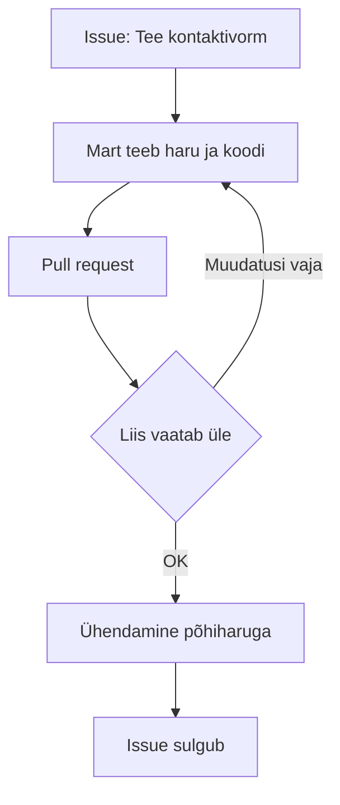

# 7. Digisuhtlus ja meeskonnatöö vahendid

::: info Õpiväljund
Pärast tundi seadistad meeskonnatööks Teamsi ja Planneri, juhid koosolekut, jagad ülesandeid ning teed oma panuse meeskonnas nähtavaks (HK 2.1).
:::

Firma saab kliendilt tellimuse: väike veebileht kahe nädala jooksul. Töörühm on neljane: Karl (ülem), Liis, Mart ja Kadri. Esimesel päeval toimub järgmine.

- Karl saadab ülesande **e-postiga**.
- Mart küsib täpsustusi **Teamsi vestluses**.
- Kadri lisab oma osa **ühisesse Wordi dokumenti**, aga keegi ei tea.
- Liis saadab oma osa **mälupulgal**.

Kolme päeva pärast on kolm versiooni sama lehe tekstist. Kaks inimest on teinud sama töö. Keegi ei tea, mis on valmis.

Probleem ei ole inimestes. Probleem on selles, et **meeskonnal puudub üks koht, kus on näha, kes mida teeb.**

## Teams: meeskonna koduleht

Microsoft Teams on selleks loodud. Kui luua Teamsis **meeskond** (*team*), tekib selle taga:

- **Microsoft 365 grupp**;
- **SharePointi sait** ja dokumendikogu failide jaoks;
- ühine **e-posti postkast ja kalender**;
- **OneNote'i märkmik**;
- ühendus teiste rakendustega, nt Planner.

Seega ei ole Teams ainult vestlus. See on koht, kus meeskonna kõik asjad on koos.

| Teamsi osa | Milleks |
| --- | --- |
| **Meeskond ja kanalid** | Teemade kaupa vestlused. Näiteks kanal "Kliendiprojekt", "Üldine" |
| **Vestlus** | Kiire, kahe- või väikese grupi vestlus |
| **Failid** | Meeskonna ühised failid (tegelikult SharePointis) |
| **Koosolekud** | Videokõned ja kalender |
| **Rakendused (tabs)** | Planner, OneNote ja muud lisatud rakendused |

### Kanal või vestlus?

| Kui | Siis |
| --- | --- |
| Küsimus puudutab kogu meeskonda | **Kanal.** Kõik näevad, vastus jääb ajalukku |
| Küsimus on ainult ühe inimesega | **Vestlus** |
| Teema on pikem ja sellel on oma failid | **Kanal** oma teemaga |

Põhimõte: **vestlus on kiire ja kaduv, kanal on ühine ja leitav.** Kui info huvitab hiljem uut liiget, kirjuta see kanalisse.

Liis oleks pidanud oma küsimuse ülesande kohta kirjutama kanalisse "Kliendiprojekt", mitte Mardile eraldi.

## Planner: kes mida teeb?

**Planner** on Microsoft 365 ülesannete tahvel. See lahendab Liisi meeskonna põhiprobleemi: näha, kes mida teeb.

Plannerile on põhiosad:

| Osa | Mida see on |
| --- | --- |
| **Plaan** | Kogu projekt, näiteks "Kliendi veebileht" |
| **Kopp** (*bucket*) | Veerg ülesannetele, nt "Tegemata", "Pooleli", "Valmis" |
| **Ülesanne** | Üks tööosa. Sellel on vastutaja, tähtaeg ja olek |

Näide Liisi meeskonnas:

| Ülesanne | Vastutaja | Tähtaeg | Kopp |
| --- | --- | --- | --- |
| Kirjuta avalehe tekst | Kadri | Teisipäev | Pooleli |
| Tee kontaktivorm | Mart | Kolmapäev | Tegemata |
| Leia pildid (vabad litsentsid) | Liis | Esmaspäev | Valmis |
| Kontrolli lõpptulemus | Karl | Reede | Tegemata |

Heal ülesandel on kolm omadust:

1. **Üks vastutaja.** Kui vastutaja on "me kõik", ei vastuta keegi.
2. **Tähtaeg.**
3. **Selge valmis-kriteerium.** Teised teavad, millal ülesanne on tehtud.

## Koosolek

Liisi meeskond kohtub kolm korda nädalas Teamsi koosolekul, 15 minutit. Mõnikord on need tulemuslikud ja mõnikord mitte.

Hea koosoleku reeglid:

| Enne | Koosolekul | Pärast |
| --- | --- | --- |
| Päevakord (3 punkti) | Alusta õigel ajal | Kirjuta kokkuvõte ja **tegevuspunktid** |
| Kutse õigetele inimestele | Mikrofon välja, kui ei räägi | Postita see kanalisse |
| Määra juht ja märkmik | Kaamera sisse, kui on võimalik | Lisa ülesanded Plannerisse |

Kõige olulisem on **tegevuspunkt**: kes teeb mida ja millal. Koosolek, mis lõpeb ilma tegevuspunktideta, oli jutuajamine.

Näide kokkuvõttest, mille Liis postitab kanalisse:

```text
Koosolek 14.10, kell 14:00-14:15

Otsused:
- Kontaktivorm lisatakse avalehele (mitte eraldi lehele)

Tegevuspunktid:
- Mart: vorm valmis kolmapäevaks
- Kadri: avalehe tekst reedeks
- Liis: pildid ja litsentside loend esmaspäevaks
```

## Kuidas oma panust nähtavaks teha?

Meeskonnatöös ei piisa sellest, et sa teed oma osa. Teised peavad seda **nägema**. See ei ole eputamine, vaid usalduse küsimus.

| Tegevus | Miks |
| --- | --- |
| **Võta ülesanne enda nimele** Plannerist | Teised ei hakka sama tegema |
| **Uuenda oleku** (pooleli, valmis) | Meeskond näeb edenemist |
| **Kirjuta kanalisse, kui oled takerdunud** | Aitab varakult |
| **Märgi valmis** ja ütle, kus tulemus on | Teised leiavad selle |
| **Kommenteeri teiste tööd** sõbralikult ja täpselt | Parandab kvaliteeti |

### Kui keegi ei tee oma osa

Mart pole kaks päeva midagi teinud. Mida Liis teeb?

1. **Küsi privaatselt ja viisakalt**: "Tere Mart, kuidas kontaktivormiga läheb? Kas vajad abi?" Võib-olla on tal põhjust.
2. **Kui see ei aita**, tõsta teema meeskonna koosolekule. Tegevuspunktid on selged ja kõigile nähtavad.
3. **Kui ka see ei aita**, teata ülemale (Karlile) või õpetajale faktidega, mitte süüdistustega: "Ülesanne oli tähtajaga teisipäev, hetkeseis on tegemata."

Kolmandast sammust ei ole vaja häbeneda. Kui kõik näevad Plannerit, on faktid selged.

## Arendaja vaates: GitHub kui meeskonnatöö koht

Tarkvaraarenduses toimivad samad põhimõtted, aga tööriistad on teised.

### GitHub Issues

GitHubi dokumentatsiooni järgi saab **issue'ga** jälgida veateateid, uusi funktsioone ja kõike muud, mida tahad kirja panna või meeskonnaga arutada. Issue'l on:

- **Assignee** (vastutaja): kes seda teeb.
- **Label** (silt): tüüp (bug, uus funktsioon, dokumentatsioon).
- **Milestone** (verstapost): mis etapiga seotud.
- **Seotud pull request**. Kui pull request kirjeldab "Fixes #12", suletakse issue automaatselt, kui pull request ühendatakse.

**Projects** koondab need kokku tahvlina, sarnaselt Plannerile.

| Planner | GitHub |
| --- | --- |
| Ülesanne | Issue |
| Vastutaja | Assignee |
| Kopp ("Pooleli") | Projects'i veerg |
| Kommentaar | Issue'i kommentaar |

### Code review

Arendustöö keskne meeskonnatöö vorm on **code review**. Töö kulgeb nii:



Review reeglid on netiketiga kooskõlas ([kohtumine 5](./kohtumine-05-netikett)): kommenteeri koodi, mitte inimest. Küsi, ära käsuta. Kiida seda, mis on hästi.

### Muud kanalid

Arendajate meeskondades kasutatakse ka **Discordi** ja **Slacki**. Põhimõtted on samad: kanalid teemade kaupa, vestlus kiireks, ühine koht ülesannetele. Koolis ja Microsoft 365 keskkonnas kasutad Teamsi.

## Praktiline töö: Liisi meeskonna miniprojekt

Töö tehakse **3–4-liikmelises rühmas**. Projekti teema on väljamõeldud (nt kooli klubi veebileht). **Ära kasuta päris inimeste andmeid ja ära tee ekraanipilte, kus on nähtavad kaaslaste nimed.**

**A. Teams**

Looge Teamsis meeskond (või kasutage õpetaja loodut), kus on vähemalt kaks kanalit. Pange üles failide kaust.

**B. Planner**

Looge Plannerisse plaan vähemalt kuue ülesandega. Igal ülesandel on vastutaja, tähtaeg ja kopp. Üks inimene ei tohi olla vastutaja kõigil.

**C. Kaks koosolekut**

Pidage kaks lühikest koosolekut (10–15 minutit). Iga koosoleku kohta kirjutage lühike kokkuvõte otsuste ja tegevuspunktidega.

**D. Arendajatele (kui rühm on arendusprojektis)**

Looge GitHubis repo ja kolm issue'd. Üks neist peab olema seotud pull requestiga. Tehke üks code review kommentaar, mis järgib netiketti.

**E. Individuaalne panus**

Iga õpilane kirjutab 5–8 lausega: mis oli minu ülesanne, mida ma tegin, kuidas ma oma panuse nähtavaks tegin, mida ma järgmine kord teeksin teisiti.

**Esitatav töö:** portfoolio osa 7 (kirjeldus meeskonna korraldusest, kaks koosolekute kokkuvõtet ja individuaalne panus). **Seos: HK 2.1.**

## Kokkuvõte

| Mõiste | Tähendus |
| --- | --- |
| Meeskond (Teams) | Grupp, millega kaasnevad kanalid, failid, kalender ja märkmik |
| Kanal vs vestlus | Kanal on ühine ja leitav, vestlus kiire |
| Planner | Ülesannete tahvel: plaan, kopp, ülesanne |
| Tegevuspunkt | Kes teeb mida ja millal |
| Issue / Pull request | Arendusülesanne ja muudatus, mida üle vaadatakse |
| Code review | Kolleegi koodi üle vaatamine |

Reegel: **kui meeskond ei näe, mida sa teed, siis meeskonna jaoks seda ei ole.**

## Allikad

- [Microsoft Learn: Introduction to Microsoft Teams](https://learn.microsoft.com/en-us/microsoftteams/teams-overview)
- [GitHub Docs: About issues](https://docs.github.com/en/issues/tracking-your-work-with-issues/learning-about-issues/about-issues)
- [RFC 1855: Netiquette Guidelines](https://www.rfc-editor.org/rfc/rfc1855)
