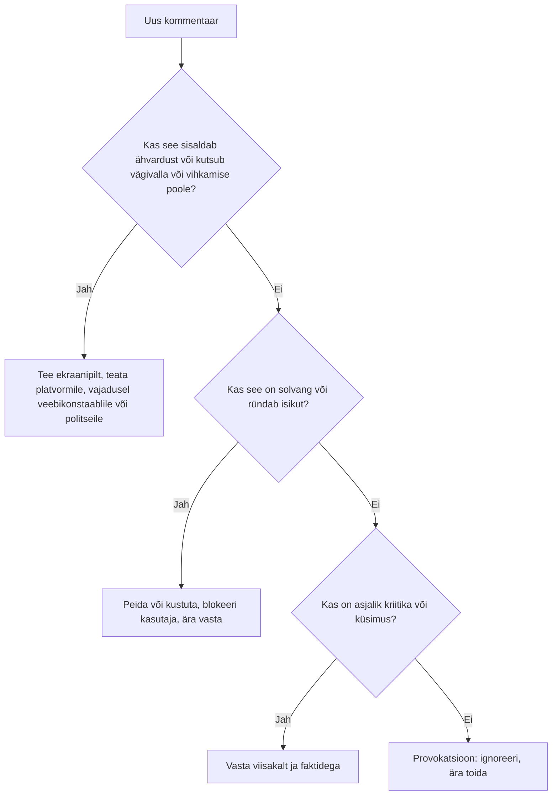
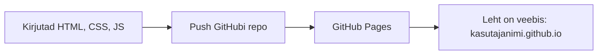

# 9. Ühismeedia ja sisu loomine II: loomine

::: info Õpiväljund
Pärast tundi koostad postituse või ajaveebi sissekande, kaasad teisi, reageerid kommentaaridele sobivalt, tunned ära vaenukõne ja valeinfo ning tead, kuhu pöörduda (HK 2.4, 2.5).
:::

Liis on Koodikohviku plaani valmis teinud ([kohtumine 8](./kohtumine-08-uhismeedia-planeerimine)). Ta postitab kooli Teamsi ja klubi Instagrami kontole esimese kuulutuse. Tund hiljem on seal kolm meeldimist ja üks kommentaar:

> "Jälle mingi nohikute klubi. Täiesti mõttetu, aga ei imesta, et sa selle peale tulid."

Liis tunneb, et süda läks külmaks. Mis nüüd saab?

Enne, kui vaatame vastust, vaatame, kuidas postitus üldse luuakse.

## Hea postituse ülesehitus

Liis kirjutas esimese postituse nii: "Tulge Koodikohvikusse!!! Kolmapäeval!!!" Parem on:

| Osa | Küsimus | Näide |
| --- | --- | --- |
| **Konks** | Miks peaks lugeja edasi lugema? | "Kas sa oled tahtnud ise veebilehe teha, aga ei tea, kust alustada?" |
| **Sisu** | Mis, millal, kus, kellele? | "Koodikohvik on algajate klubi. Kohtume kolmapäeviti kell 16, ruum 214." |
| **Kasu** | Mis mul sellest on? | "Iga kord ehitame midagi väikest, mida saab kohe proovida." |
| **Tegevusele kutsumine** | Mida ma nüüd teen? | "Tule esimesele kohtumisele 15. oktoobril. Võta kaasa oma sülearvuti." |

Mõned reeglid, mis kehtivad kõigil kanalitel:

- **Üks postitus, üks mõte.**
- **Kirjuta lugejale, mitte endale.** "Sina" on parem kui "meie".
- **Tuleta meelde sihtrühm.** Kui kirjutad 14-aastastele, ei kirjuta sa nagu ettevõtte juhatusele.
- **Lisa pilt või video.** Aga pilt peab olema õige litsentsiga ([kohtumine 8](./kohtumine-08-uhismeedia-planeerimine)).
- **Kontrolli üle** enne avaldamist: õigekiri, link, kuupäev ja kellaaeg.

## Ajaveeb ja video

### Ajaveeb

Ajaveeb (blogi) sobib, kui tahad kirjutada pikemalt ja soovid, et tekst oleks hiljem leitav. Erinevalt sotsiaalmeedia postitusest, mis kaob voogu, jääb ajaveeb otsingus leitavaks.

Hea ajaveebi sissekanne:

| Osa | Märkused |
| --- | --- |
| Selge pealkiri | Ütleb, millest postitus räägib |
| Lühike sissejuhatus | Miks see huvitab |
| Jaotatud tekst | Vahepealkirjad, lühikesed lõigud |
| Näited või pildid | Muudavad teksti elavaks |
| Lõpetus | Kokkuvõte või kutse tegutseda |

### Video

Video (YouTube, TikTok, Instagram Reels) on tugev, kui tahad näidata, mitte ainult rääkida.

| Küsimus | Soovitus |
| --- | --- |
| Kui pikk? | Lühike. Pane kõige olulisem alguses |
| Heli | Heli on sageli tähtsam kui pilt. Kontrolli, et räägitu on arusaadav |
| Subtiitrid | Paljud vaatavad ilma helita. Subtiitrid aitavad ka kuulmispuudega vaatajat |
| Taust | Vaata, mis on kaadris: kaaslased, ekraanid, dokumendid, aadressid |
| Muusika | Autoriõigus kehtib ka muusikale. Kasuta vaba muusikat |

Kui videos on teisi inimesi, kehtib sama nõue nagu fotodel: **küsi luba**.

## Teiste kaasamine

Algatus ei ole monoloog. Liis tahab, et inimesed tuleksid klubisse ja kaasa teeksid. Kaasamise võtted:

| Võte | Näide |
| --- | --- |
| **Küsimus** | "Mida sina tahaksid ehitada?" |
| **Vastamine** | Vasta kommentaaridele, ka lühidalt |
| **Kaasautorid** | Palu kaaslasel kirjutada postitus |
| **Tänu** | Tänada neid, kes aitasid või tulid |
| **Lihtne järgmine samm** | "Kirjuta kommentaari, kas tuled" on lihtsam kui "registreeru" |

## Kommentaarid: mida teha, kui keegi kirjutab halvasti?

Tagasi Liisi kommentaari juurde. Esimene mõte on vastata kohe, aga siis tuleb meelde [netiketi reegel](./kohtumine-05-netikett): oota öö üle. Siin on struktureeritum viis, kuidas otsustada.

Liisi kommentaar "nohikute klubi, mõttetu" on **provokatsioon ja pisut solvav**, kuid ei ole ähvardus ega vihkamise õhutamine. Soovitus: ära vasta vihaselt. Ta võib vastata lühidalt ("Tule vaata, mis seal tehakse") või jätta vastamata.

### Vaenukõne

Mõnikord läheb asi kaugemale. Eesti karistusseadustiku § 151 järgi on kuritegu **avalikult vihkamise või vägivalla õhutamine** rahvuse, rassi, nahavärvi, soo, keele, päritolu, usutunnistuse, poliitiliste veendumuste, varalise või sotsiaalse seisundi alusel. Karistuseks on rahatrahv või kuni kolm aastat vangistust.

See on **teine asi kui ebameeldiv arvamus**. Vabadust arvamust väljendada kaitseb põhiseadus. Piir on seal, kus tegemist on avaliku õhutamisega.

Mida teha, kui tegemist on tõsise sisuga (ähvardus, vihkamise õhutamine):

1. **Tee ekraanipilt** koos kuupäeva ja kasutajanimega. Tõend jääb alles ka siis, kui kommentaar kustutatakse.
2. **Teata platvormile** (igal platvormil on "Report"/"Teata" nupp).
3. **Võta ühendust politsei veebikonstaabliga** või esita avaldus politseile. Veebikonstaablid annavad nõu ja nõustavad, kuid ise kuritegusid ei uuri.
4. **Räägi kellegi täiskasvanuga**, õpetajaga või lähedasega. Sa ei pea sellega üksi olema.

### Desinformatsioon ehk valeinfo

Liis näeb sotsiaalmeedias postitust: "Kool sulgeb programmeerimisklubi ja kogu IT-õppekava, jaga edasi!" Kas ta jagab?

Enne jagamist küsi kolme asja.

| Küsimus | Miks |
| --- | --- |
| **Kes on allikas?** | Kas see on tuntud asutus, ajakirjanik või tundmatu konto? |
| **Kas keegi teine kinnitab?** | Kas sama info on mõnes teises usaldusväärses kohas? |
| **Mis on kuupäev ja kontekst?** | Vana uudis või pilt võib olla esitatud uuena |

Lisaks: kui postitus **tekitab tugeva emotsiooni** (viha, hirm) ja kutsub **kiirelt jagama**, on see märk, et sellega tahetakse midagi saavutada. Sama muster on pettuses ([kohtumine 2](./kohtumine-02-kool-pank-ettevote)).

Kui info ei kontrolli õnnestu, **ära jaga**. Edasi jagamine tähendab, et sina muutud selle levitajaks.

## Arendaja vaates: oma portfoolio ja ajaveeb

Arendaja tutvustab ennast lisaks sotsiaalmeediale ka oma **koodi ja projektidega**. Kõige lihtsam koht selleks on **GitHub Pages**.

GitHubi dokumentatsiooni järgi on GitHub Pages **staatiliste lehtede majutusteenus**, mis võtab HTML-i, CSS-i ja JavaScripti otse GitHubi repost ja avaldab need veebilehena. Isikliku portfoolio saab teha repos nimega `<kasutajanimi>.github.io`.

Piirangud:

- Ainult **staatiline** sisu. Serveripoolset koodi ei saa käivitada.
- Ühe kasutaja kohta üks isiklik sait.
- GitHub logib külastajate IP-aadressid turvalisuse eesmärgil.

Mida portfoolio sisaldab?

| Osa | Märkused |
| --- | --- |
| Lühike tutvustus | Kes sa oled ja mida teed |
| 2–3 projekti | Iga kohta kirjeldus, pilt ja link repo'le |
| Kontakt | E-post, mis ei ole kooli konto (kooli konto lõpeb õpingutega) |
| Tehnoloogiad | Mida oled kasutanud |

::: warning Enne avaldamist
Kontrolli, et repo ja leht ei sisalda saladusi (API võtmeid, paroole), isikuandmeid ega teiste inimeste pilte ilma loata. Avalik repo on avalik **kõigile**, ka tööandjatele ([kohtumine 10](./kohtumine-10-jalajalg-ja-kokkuvote)).
:::

Muud kanalid, kus arendajad ennast tutvustavad: **LinkedIn** (karjäär) ja tehnilised ajaveebid. Kehtivad samad reeglid: üks selge sõnum, õiged litsentsid ja turvalised kontod.

## Praktiline töö: Liisi esimene postitus

Töö tehakse **väljamõeldud algatusega**. Postitus jääb **avaldamata**: esitad selle mustandina.

**A. Postitus**

Kirjuta oma algatuse jaoks üks postitus (sotsiaalmeedia) või ajaveebi sissekanne (150–250 sõna). Postituses peab olema konks, sisu, kasu ja tegevusele kutsumine. Pane juurde pildi kirjeldus ja TASL-viide (vaba litsentsiga pildi jaoks).

**B. Kaasamine**

Kirjuta kolm kaasamise ideed oma algatuse jaoks (küsimus, kaasautor, tänu või midagi muud).

**C. Kommentaaride plaan**

Koosta tabel, kus on viis väljamõeldud kommentaari ja sinu reageering. Kommentaarid:

1. "Väga huvitav, kus see toimub?"
2. "Jälle mingi mõttetu asi."
3. "Selliseid nagu teie tuleks välja visata."
4. "Kuulsin, et klubi suletakse, kas tõsi?" (ja allikas on tundmatu)
5. Kommentaar, mis sisaldab ähvardust kellegi pihta.

Iga kommentaari juures: millist kategooriat see esindab, mida teed (vasta, peida, blokeeri, teata) ja miks.

**D. Valeinfo kontroll**

Võta Liisi näide ("Kool sulgeb programmeerimisklubi...") ja kirjuta, kuidas sa seda kontrolliksid (vähemalt kolm sammu).

**E. Arendajatele**

Joonista portfoolio saidi struktuur (lehed ja nende sisu) või kirjuta README sellele. **Ära avalda päris saiti ega sisesta oma isikuandmeid.**

**Esitatav töö:** portfoolio osa 9 (postituse mustand, kaasamise ideed, kommentaaride plaan, valeinfo kontroll). **Seos: HK 2.4 ja 2.5.**

## Kokkuvõte

| Mõiste | Tähendus |
| --- | --- |
| Konks, sisu, kasu, kutse | Hea postituse neli osa |
| Provokatsioon | Ignoreeri või vasta lühidalt |
| Solvang | Peida, blokeeri, ära vasta |
| Vaenukõne (KarS § 151) | Avalik vihkamise või vägivalla õhutamine; teata |
| Veebikonstaabel | Politsei nõustaja internetis |
| Desinformatsioon | Kontrolli allikat, kinnitust ja kuupäeva enne jagamist |
| GitHub Pages | Staatiliste saitide majutus GitHubis |

Reegel: **ära vasta vihaga, säilita tõend, teata tõsisest ja kontrolli enne jagamist.**

## Allikad

- [Karistusseadustik (Riigi Teataja)](https://www.riigiteataja.ee/akt/184411)
- [Justiitsministeerium: Vaenukõne karistusõiguslik regulatsioon Eestis](https://www.kriminaalpoliitika.ee/sites/krimipoliitika/files/elfinder/dokumendid/vaenukone_karistusoiguslik_regulatsioon_eestis.pdf)
- [Targalt Internetis](https://www.targaltinternetis.ee/)
- [GitHub Docs: What is GitHub Pages?](https://docs.github.com/en/pages/getting-started-with-github-pages/what-is-github-pages)
- [Andmekaitse Inspektsioon: Lapsel on samuti õigus oma isikuandmete üle otsustada sotsiaalmeedias](https://www.aki.ee/uudised/lapsel-samuti-oigus-oma-isikuandmete-ule-otsustada-sotsiaalmeedias)
