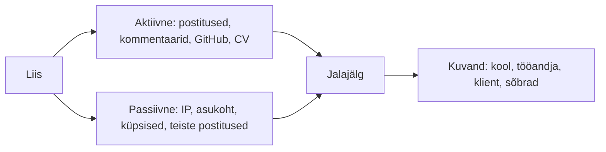

# 10. Digitaalne jalajälg ja kokkuvõte

::: info Õpiväljund
Pärast tundi eristad aktiivset ja passiivset digitaalset jalajälge, analüüsid juhendamisel enda jalajälge ja selle mõju kuvandile ning oskad seda korrastada (HK 2.7). Lisaks esitad kogu mooduli portfoolio.
:::

Liis kandideerib suvepraktikale ühte tarkvarafirmasse. Ta saadab CV ja motivatsioonikirja. Paar päeva hiljem istub firma personalitöötaja arvuti taha ja kirjutab otsingusse: **Liis Tamm, Kuressaare**.

Mida ta leiab?

- Liisi GitHubi profiili, kus on kolm projekti ja ilus README.
- Klubi Koodikohvik postituse.
- Vana TikToki video, kus Liis 14-aastaselt teeb nalja õpetaja arvelt.
- Foorumipostituse, kus Liis kirjutas vihaselt ühe mängu tootja kohta.
- Pildi, kus ta on sõbra sünnipäeval ja midagi muud ei ole näha.

Liis ise ei mäleta enam pooltest, et need on olemas. Aga **internet mäletab.**

## Mis on digitaalne jalajälg?

**Digitaalne jalajälg** on kogu andmejälg, mille sa internetis maha jätad. Targalt Internetis (Eesti turvalise interneti keskus) järgi kuuluvad sinna sisse- ja väljalogimised, ajaveebi postitused, vestlused, pangaülekanded, ostud, fotode üleslaadimine ja veebilehtede külastamine.

Jalajälg jaguneb kaheks.

| Liik | Mis see on | Liisi näide |
| --- | --- | --- |
| **Aktiivne jalajälg** | Andmed, mida **sa ise** avaldad | Postitus, foto, kommentaar, GitHubi repo, foorumipostitus |
| **Passiivne jalajälg** | Andmed, mida kogutakse sinu kohta **sinu teadmata** | IP-aadress, asukohaandmed, brauseriajalugu, küpsised, kellegi teise postitatud foto sinust |

Viimane näide on oluline: jalajälge teevad ka **teised**. Sõber, kes postitab pildi, kus oled sina, lisab sinu jalajälge.



## Miks see on oluline? Mõju kuvandile

Personalitöötaja otsib Liisit. Ta ei otsi pahatahtlikult. Ta püüab teada saada, **kes see inimene on**, sest ta tahab teha otsust.

Jalajälg moodustab sinu **kuvandi** (mainet), mis mõjutab:

| Kes | Miks ta vaatab |
| --- | --- |
| **Tööandja või praktikakoht** | Kas sobib meie meeskonda? |
| **Kool** | Kuidas ta käitub avalikult? |
| **Klient** | Kas ma usaldan teda? |
| **Uus tuttav** | Kes ta on? |

Kolm asja, mida mäletada:

1. **Kontekst kaob.** Naljakas vestlus sõpradega võib teise inimese jaoks tunduda kurjana, kui seda näeb ilma taustata.
2. **Ekraanipilt jääb.** Kui postituse kustutad, on keegi võinud sellest juba pildi teha.
3. **Jalajälg on ka positiivne.** Hea GitHubi profiil, selge projekt ja viisakas kommentaar töötavad sinu kasuks.

Eesmärk ei ole **kaduda internetist**, vaid **juhtida seda, mis sinust leitav on**.

## Kuidas oma jalajälge analüüsida?

Siin tuleb teha tähtis kokkulepe: **analüüs on privaatne.** Sa ei näita klassis oma otsingutulemusi, nimesid ega ekraanipilte. Sa teed seda kodus või vaikselt klassis ja kirjutad ainult üldistatud kokkuvõtte.

### Kolm sammu

1. **Otsi ennast otsingumootoris.** Kirjuta oma nimi, nimi koos linnaga, kasutajanimi ja e-posti aadress. Vaata esimest paari lehekülge.
2. **Otsi pilte.** Vaata, millised pildid sinust on leitavad.
3. **Vaata oma kontosid.** Millised on avalikud? Mida sisaldab profiil, mida teised ilma sisse logimata näevad?

### Mida sealt otsida?

| Küsimus | Miks |
| --- | --- |
| Mida leidsin? | Kas olin üllatunud? |
| Mis on **vana ja ebasobiv**? | Mida tahaksin eemaldada? |
| Mis on **kasulik**? | Mida tahaksin rohkem näidata? |
| Mis on **ootamatu**? | Mis tuli teiste kaudu? |
| Mida see **minust ütleb** võõrale? | Kas see on see, mida tahan? |

## Korrastamine

Kui leidsid midagi, mis ei meeldi, on mitu viisi.

| Samm | Tegevus |
| --- | --- |
| 1 | **Kustuta** oma postitus või konto, kui see on sinu oma |
| 2 | **Muuda privaatsusseaded** nii, et ainult sõbrad näevad |
| 3 | **Palu teisel kustutada**, kui postitas keegi teine (sõber, grupp) |
| 4 | **Eemalda märgistus** fotolt |
| 5 | **Sulge kasutamata kontod** (vt [kohtumine 4](./kohtumine-04-identiteedi-kaitse)) |
| 6 | **Esita nõue**, kui keegi ei eemalda |

### Õigus andmete kustutamisele

EL-i andmekaitsereeglite järgi on sul õigus nõuda oma isikuandmete **kustutamist**, kui neid ei ole enam vaja või neid töödeldakse ebaseaduslikult. See kehtib ka **otsingumootoritele**: võid nõuda linkide eemaldamist otsingutulemustest, kui andmed on ebatäpsed, ebapiisavad, ebaolulised või ülemäärased.

Lisaks:

- Sul on õigus saada **tasuta koopia** oma andmetest.
- Ettevõte peab vastama **ühe kuu jooksul**.
- Võid nõuda ebatäpsete andmete **parandamist**.

Seega ei ole sa jalajälje ees abitu. Aga see on **tagantjärele** ja ei taga alati tulemust, seega parim kaitse on mõelda enne postitamist.

### Enne postitamist: kolm küsimust

1. **Kas ma tahan, et seda näeks tööandja, õpetaja ja vanaema?**
2. **Kas see jääb alles ka siis, kui ma kustutan?**
3. **Kas keegi teine kannatab selle all?**

Kui vastus on "ei" või "ei tea", ära postita.

## Arendaja vaates: GitHubi profiil kui CV

Tarkvaraarendaja jalajälg on suuresti GitHubis. Personalitöötaja, kes vaatab Liisi, vaatab ka seda.

| Osa | Mida näitab |
| --- | --- |
| **Profiili kirjeldus** | Kes sa oled, ühe-kahe lausega |
| **Pinned (esiletõstetud) repod** | Parimad projektid, README-dega |
| **Commit'ide ajalugu** | Kui järjepidevalt ja kuidas sa töötad |
| **Pull requestid ja issue'd** | Kuidas sa teistega suhtled |
| **Vanad repod** | Kõik, mida sa kunagi avalikuks tegid |

Kolm praktilist asja:

**1. Commit'i e-posti aadress on avalik.** GitHubi dokumentatsiooni järgi on commit'i metaandmed GitHubis avalikult nähtavad. Kui kasutad oma isiklikku e-posti, näeb seda igaüks. Lahendus: lülita GitHubi seadetes sisse **"Keep my email addresses private"** ja kasuta GitHubi pakutavat `noreply` aadressi.

```bash
git config --global user.email "sinu-noreply-aadress@users.noreply.github.com"
```

Noreply-aadress annab **pseudonüümsuse, mitte anonüümsuse**: see ei ole sinu päris e-post, aga on seotud sinu GitHubi kontoga.

**2. Vana kood on avalik.** Kui sul on repo, mis on kuus aastat vana ja halb, saad selle peita (muuta privaatseks) või kustutada.

**3. Ära jäta saladusi.** Isegi vanas commit'is olev API võti on avalik (vt [kohtumine 4](./kohtumine-04-identiteedi-kaitse)).

## Kokkuvõte: portfoolio esitamine

Selle kohtumisega on moodul läbi. Sinu **digiportfoolio** koosneb kümnest tööst.

| # | Töö | HK |
| --- | --- | --- |
| 1 | Vahendi valik ja sisselogimise skeem | 2.3 |
| 2 | Keskkondade tabel, võrdlus, petukõnede analüüs | 2.3 |
| 3 | Identiteedikaart, salasõna, paroolihalduri sammud | 2.6 |
| 4 | Õngitsuste analüüs, tegevusplaan, API võtme juhtum | 2.6 |
| 5 | Sõnumid kolmele sihtrühmale, bugiraport | 2.1, 2.5 |
| 6 | Jagamise protokoll, õigused, `.gitignore` | 2.2 |
| 7 | Meeskonnatöö kirjeldus ja individuaalne panus | 2.1 |
| 8 | Algatuse plaan, sisukalender, piltide viited | 2.4 |
| 9 | Postituse mustand, kommentaaride plaan | 2.4, 2.5 |
| 10 | Jalajälje refleksioon | 2.7 |

### Hindamiskriteeriumide katvus

| HK | Sisu | Tõendid |
| --- | --- | --- |
| **2.1** | Sobivad digitehnoloogiad suhtluseks ja meeskonnatööks | 5, 7 |
| **2.2** | Info ja failide jagamine | 6 |
| **2.3** | Kooli, riigi ja ettevõtete digiteenused | 1, 2 |
| **2.4** | Ühismeedia, ajaveeb, video | 8, 9 |
| **2.5** | Suhtlus- ja käitumisnormid | 5, 9 |
| **2.6** | Digitaalne identiteet | 3, 4 |
| **2.7** | Digitaalne jalajälg | 10 |

Moodul on **arvestatud**, kui portfoolio sisaldab kõiki kümmet tööd ja need vastavad kontrollloenditele. Töö, mis ei vasta, tehakse ümber.

## Praktiline töö: jalajälje refleksioon

**Töö on privaatne ja esitad ainult üldistatud kokkuvõtte.** Sa **ei esita** oma nime, kasutajanimesid, otsingutulemusi, linke ega ekraanipilte oma kontodest. Selle põhjuseks on sinu enda privaatsus, ja see on sama, mida õppisid selles moodulis.

**A. Analüüs (privaatselt)**

Tee läbi kolm sammu (otsingumootor, pildid, kontod). Tee endale märkmed. **Märkmeid ei esitata.**

**B. Refleksioon (esitatav)**

Vasta kirjalikult järgmistele küsimustele. Kasuta üldisi sõnu ("leidsin kaks vana konto", mitte "leidsin konto nimega X").

1. Mitu erinevat kohta leidsin, kus ma olen nähtav? (Number või ligikaudne vahemik.)
2. Millised kategooriad need olid? (Nt sotsiaalmeedia, mängukontod, koolitööd, teiste postitused.)
3. Mis oli **ootamatu**?
4. Mida ma **ei soovi** enam avalikult näidata ja mida teen sellega?
5. Mida ma **tahaksin** rohkem näidata (positiivne jalajälg) ja kuidas?
6. Mida ma teen **enne postitamist** teisiti?

**C. Tegevusplaan**

Kirjuta kolm konkreetset sammu, mida teed järgmise kuu jooksul oma jalajälje korrastamiseks (nt "sulgen kaks kasutamata kontot", "vaatan üle privaatsusseaded", "teen GitHubi profiilile kirjelduse").

**D. Liisi lugu**

Võta tunni alguse Liisi leid (GitHubi profiil, TikToki video, foorumi postitus). Kirjuta Liisile soovitus: mida ta peaks enne praktikale kandideerimist tegema ja mida mitte.

**E. Arendajatele**

Kirjuta tegevuskava oma GitHubi profiili jaoks (kirjeldus, esiletõstetavad repod, e-posti seade, vanade repode puhastus). Ära esita ekraanipilte oma profiilist.

**F. Portfoolio kogumine**

Kontrolli üle kõik kümme tööd. Täida enesehindamise tabel: iga HK jaoks pane kirja, milline töö seda tõendab ja kas oled rahul.

**Esitatav töö:** portfoolio osa 10 (refleksioon, tegevusplaan, Liisi soovitus) ja kogu portfoolio. **Seos: HK 2.7 ja kõik HK-d.**

## Kokkuvõte

| Mõiste | Tähendus |
| --- | --- |
| Aktiivne jalajälg | Mida sa ise avaldad |
| Passiivne jalajälg | Mida sinu kohta kogutakse sinu teadmata või mida teised postitavad |
| Kuvand | Mulje, mille jalajälg sinust jätab |
| Õigus kustutada | Võid nõuda andmete ja otsingulinkide eemaldamist |
| Noreply-aadress | GitHubi pakutav e-post, mis peidab sinu päris aadressi |

Reegel: **sa ei saa jalajälge täielikult kustutada, aga sa saad seda juhtida: mõtle enne postitamist, korrasta regulaarselt ja ehita meelega positiivset jälge.**

## Allikad

- [Targalt Internetis: Jalajäljed digitaalses ookeanis](https://www.targaltinternetis.ee/uudised/2013/02/jalajaljed-digitaalses-ookeanis/)
- [Euroopa Liit: Õigus andmete kustutamisele ja juurdepääsule (Your Europe)](https://europa.eu/youreurope/citizens/consumers/internet-telecoms/data-protection-online-privacy/index_et.htm)
- [GitHub Docs: Setting your commit email address](https://docs.github.com/en/account-and-profile/how-tos/email-preferences/setting-your-commit-email-address)
- [Andmekaitse Inspektsioon](https://www.aki.ee/)
