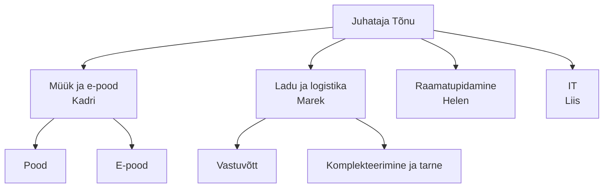
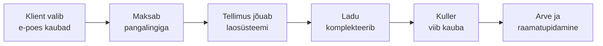

# 1. Organisatsioon ja IT roll äriprotsessides

::: info Õpiväljund
Pärast tundi oskad selgitada organisatsiooni eesmärke ja ülesehitust ning näidata, millist äriprotsessi iga IT-süsteem toetab (HK 1.1).
:::

Liisi esimene päev Pihlakas Ehituspoes. Juhataja Tõnu viib ta ringi: kontor, ladu, pood. Lõpuks ütleb ta: "Sinu töö on, et arvutid töötaksid." Liis noogutab. Kolme tunni pärast helistab laojuht Marek: "Skänner ei tööta. Veokid seisavad hoovis ja ootavad lasti." Liis läheb vaatama. See pole "arvuti probleem". Kolm veoautojuhti maksavad tunnis raha, kuni lasti ei saa.

Selles hetkes saab Liis aru, mida tema töö tegelikult tähendab: **IT ei ole eesmärk, vaid vahend, mis hoiab ettevõtte tööd käimas.**

## Mida ettevõte tahab?

Enne kui IT-d mõista, peab mõistma, mida organisatsioon üldse saavutada tahab. Seda nimetatakse **eesmärkideks**.

Tõnu räägib Liisile Pihlaka eesmärgid (väljamõeldud):

| Eesmärk | Mõõdik |
| --- | --- |
| Kasv | E-poe käive 1 460 000 € aastas, sihiks +20% |
| Kliendi rahulolu | Tarne lubatud päeval vähemalt 95% tellimustest |
| Kasumlikkus | Kasumimarginaal vähemalt 8% |
| Töökindlus | Mitte ühtegi töötajat ei jää ilma töövahenditeta |

Iga eesmärk vajab IT-d. Kasv vajab e-poodi, tarne lubadus vajab laosüsteemi ja tellimuste jälgimist, marginaal vajab täpseid arveid.

## Organisatsiooni ülesehitus

Organisatsioon jaotab töö osadeks, et igaüks teaks, mida tema teeb. Pihlakas on **funktsionaalne**: inimesed on rühmitatud tegevuse järgi.

Siit tuleb tähtis tähelepanek: **IT on Pihlakas ühe inimese osakond, aga teenindab kõiki teisi.** Seda nimetatakse **tugifunktsiooniks**. Kui IT-d pole, ei saa ükski teine osakond oma tööd teha.

Lisaks funktsionaalsele struktuurile leiab teistsuguseid:

| Tüüp | Kuidas töö jaguneb | Näide |
| --- | --- | --- |
| Funktsionaalne | Tegevuse järgi (müük, ladu, IT) | Pihlakas |
| Projektipõhine | Projekti järgi, meeskond kokku | Tarkvarafirma, mis teeb kliendile rakendust |
| Maatriks | Mõlemad korraga: inimene kuulub osakonda ja projekti | Suur tarkvarafirma |

## Mis on äriprotsess?

**Äriprotsess** on tegevuste jada, mis tekitab kliendile väärtust. Alguses on sisend (tellimus), lõpus tulemus (kaup kliendi juures).

Liis küsib Kadrilt: "Mis juhtub, kui klient e-poes tellimuse teeb?" Kadri joonistab:

Iga nool selles joonisel on **IT-süsteem**. Kui üks katkeb, katkeb kogu protsess.

### Kolm protsessiliiki

| Liik | Mida see teeb | Pihlaka näide |
| --- | --- | --- |
| **Põhiprotsess** | Loob otse väärtust kliendile | Müük, komplekteerimine, tarne |
| **Tugiprotsess** | Võimaldab põhiprotsessil töötada | IT, raamatupidamine, personal |
| **Juhtimisprotsess** | Seab eesmärke ja jälgib neid | Planeerimine, aruandlus, riskide juhtimine |

IT on **tugiprotsess**. Klient ei osta IT-d, aga ilma selleta ei saa ta midagi osta.

## IT-süsteemid ja äriprotsessid kokku

Liis teeb oma esimesel nädalal tabeli. Ta kirjutab iga süsteemi kõrvale, **millist äriprotsessi see toetab** ja **mis juhtub, kui see seisab**.

| IT-süsteem | Toetatav äriprotsess | Kui seisab |
| --- | --- | --- |
| E-poe veebileht ja maksed | Müük | Klient ei saa osta. Käive peatub |
| Laosüsteem ja skännerid | Komplekteerimine, tarne | Veokid ootavad, tarned hilinevad |
| Raamatupidamisprogramm | Arved, palgad | Arveid ei saa väljastada. Hiljem viivis |
| E-post | Kliendisuhtlus, tellimused hankijale | Tellimused jäävad saatmata |
| Kassasüsteem poes | Poemüük | Poes ei saa maksta |
| Töökohtade arvutid ja võrk | Kõik | Inimesed ei saa töötada |

::: tip Üks lause, mis kõik kokku võtab
Hea IT-töötaja ei küsi "kas server töötab?", vaid "**mis protsess selle serveri taga on ja kui kaua see võib seista?**"
:::

## IT-strateegia ja ettevõtte strateegia

Kui Tõnu tahab e-poe käivet 20% kasvatada, siis IT-ga peab midagi tegema: kiirem leht, uued maksevõimalused, parem laoseis. IT ei tohi ise endale eesmärke välja mõelda. Seda nimetatakse **IT ja äri joondamiseks** (ingl *business-IT alignment*).

| Halb | Hea |
| --- | --- |
| "Ostame uusima serveri, sest see on kiire" | "E-pood aeglustub õhtuti. Kadri kaotab 20 tellimust nädalas. Server asendatakse" |
| "Uuendame kõik arvutid" | "Laotöötajate skännerid on vanad ja rikked maksavad iga kuu aega" |

IT-d ei vaadelda kuluna, vaid **investeeringuna**, mis peab tooma tagasi raha, aega või riski vähenemist.

## Töönäide: millal IT seisak on tõsine?

Marek ütleb, et skänner ei tööta kaks tundi. Liis arvutab:

- Kolm veokijuhti ootavad, igaühe tunnikulu on 35 €: 3 × 35 × 2 = **210 €**.
- Tarne hilineb, kliendile lubati täna. Risk: kliendi rahulolu langeb.
- Marek ja kaks abilist ei saa komplekteerida: 3 × 18 € × 2 h = **108 €** palka tööta.

Kokku vähemalt **318 €**, enne kui arvestada kliendi usaldust. Liis näitab arvutust Tõnule. Tõnu ütleb: "Selle pärast tasubki varuskänner osta."

## Päris juhtum: miks IT mõju ei ole väike

2024. aasta juulis tõi ühe turvatarkvara vigane uuendus kümned tuhanded organisatsioonid peatumisele. Microsofti hinnangul mõjutas see umbes 8,5 miljonit Windowsi seadet. Lennufirmadel jäid lennud ära, haiglatel ja pankadel katkes töö. Kõik see oli **IT-süsteem, mis seisis ja peatas äriprotsessi**. Täpsemalt vaatame seda [kohtumisel 9](./kohtumine-09-mittevastavus).

## Kokkuvõte

| Mõiste | Tähendus |
| --- | --- |
| Eesmärk | Mida organisatsioon tahab saavutada |
| Organisatsiooni struktuur | Kuidas töö ja vastutus on jaotatud |
| Äriprotsess | Tegevuste jada, mis annab kliendile väärtust |
| Põhi-, tugi-, juhtimisprotsess | Kolm protsessiliiki. IT on tugiprotsess |
| IT ja äri joondamine | IT eesmärgid tulevad ettevõtte eesmärkidest |

Kolm mõtet:

- **IT toetab, mitte ei asenda äri.** Iga süsteemi taga on protsess.
- **Seisak ei ole alati sama kallis.** Hinda, mis protsessi see peatab.
- **Räägi ärikeeles.** Tõnu ei küsi "mis server", vaid "kui kaua ja kui palju maksab".

## Lisa oma IT-teenuse kaardile

1. Vali ettevõte (Pihlakas või oma väljamõeldud) ja üks teenus (nt e-pood).
2. Kirjuta 3 organisatsiooni eesmärki.
3. Joonista **põhiprotsess** (5–7 sammu) ja märgi igale sammule IT-süsteem.
4. Tee tabel: süsteem, protsess, mis juhtub seisakuga.

## Allikad

- Microsofti hinnang CrowdStrike'i mõjule: [Wikipedia: 2024 CrowdStrike-related IT outages](https://en.wikipedia.org/wiki/2024_CrowdStrike-related_IT_outages)
- Äriprotsesside mõiste ja protsessiliigid on üldine juhtimisõpetus. Pihlaka andmed on väljamõeldud.
