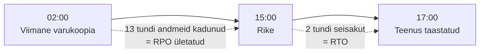

# 2. Teenusekvaliteedi parameetrid

::: info Õpiväljund
Pärast tundi oskad nimetada peamised teenusekvaliteedi parameetrid, arvutada lubatud seisaku ja seostada parameetrid äriprotsessi vajadusega (HK 1.2).
:::

Kolmapäeva õhtul kell 19:30 kirjutab Kadri Liisile: "E-pood on aeglane. Kolm klienti helistasid, et leht ei lae." Liis vaatab: leht töötab, aga igale lehele laadimiseks kulub 9 sekundit.

Kas e-pood "töötab"? Tehniliselt jah. Kliendi jaoks ei. See ongi küsimus, millega teenusekvaliteedi parameetrid tegelevad: **kuidas öelda numbritega, kas teenus on piisavalt hea.**

## Miks "töötab" ei piisa

Kui Liis ütleb Tõnule "server töötab", ei ütle see Tõnule midagi. Kui ta ütleb "e-pood oli sel kuul kättesaadav 99,95% ja lehe laadimine oli keskmiselt 1,8 s", saab Tõnu aru, kas see on hea.

**Teenusekvaliteedi parameeter** on mõõdetav number, mis kirjeldab, kui hästi teenus kliendi vajadust täidab.

## Peamised parameetrid

| Parameeter | Küsimus, millele vastab | Näide (e-pood) |
| --- | --- | --- |
| **Kättesaadavus** (*availability*) | Kas teenus on kasutatav? | 99,9% kuus |
| **Jõudlus**: reageerimisaeg (*latency*) | Kui kiiresti vastab? | Leht laeb alla 2 s |
| **Jõudlus**: läbilaskevõime (*throughput*) | Kui palju suudab korraga teenindada? | 200 kasutajat üheaegselt |
| **Usaldusväärsus**: MTBF | Kui kaua keskmiselt töötab rikkeni? | 2 000 h |
| **Taastamisaeg**: MTTR | Kui kaua kulub keskmiselt parandamiseks? | 30 min |
| **RTO** (*Recovery Time Objective*) | Kui kaua võib teenus seista? | 2 h |
| **RPO** (*Recovery Point Objective*) | Kui palju andmeid võib kaduda? | 15 min |
| **Toe reageerimisaeg** | Kui kiiresti võetakse viga töösse? | 30 min tööajal |
| **Toe lahendusaeg** | Kui kiiresti viga parandatakse? | Kriitiline: 4 h |
| **Turvalisus** | Kas andmed on kaitstud? | Andmeleket 0 |

Kõiki parameetreid ei vaja iga teenus. Valid need, mis klienti või protsessi tegelikult mõjutavad.

## Kättesaadavus ja "üheksad"

Kättesaadavust väljendatakse protsendina ja räägitakse "üheksatest". Iga lisa üheksa on suur samm.

Aasta (8760 h) ja kuu (30 päeva, 43 200 min) lubatud seisak:

| Kättesaadavus | Lubatud seisak aastas | Lubatud seisak kuus |
| --- | --- | --- |
| 99% | 3 päeva 15 h 36 min | 7 h 12 min |
| 99,9% | 8 h 45 min 36 s | 43 min 12 s |
| 99,95% | 4 h 22 min 48 s | 21 min 36 s |
| 99,99% | 52 min 34 s | 4 min 19 s |
| 99,999% | 5 min 15 s | 26 s |

Valem: **lubatud seisak = (100% − kättesaadavus) × periood.** Näiteks 99,9% kuus: 0,001 × 43 200 min = 43,2 min.

### Kui palju maksab iga üheksa?

Pihlaka e-poe käive on 1 460 000 € aastas, keskmiselt 4000 € päevas ehk umbes **167 € tunnis**. Seisak maksab käivet:

| Kättesaadavus | Seisak aastas | Kaotatud käive (keskmiselt) |
| --- | --- | --- |
| 99% | 87,6 h | 14 600 € |
| 99,9% | 8,76 h | 1 460 € |
| 99,99% | 0,88 h | 146 € |

Esmapilgul tundub 99,99% ilmselt parem. Aga Liis saab pakkumise: 99,99% kättesaadavuse tagamine maksab aastas 6000 € rohkem (varuserver, kahekordne internet). Ta võrdleb:

- 99,9% → 99,99% säästab **1314 €** kaotatud käivet.
- Kulu on **6000 €**.

Selle e-poe jaoks pole see mõttekas. Google'i SRE raamat ütleb selle välja: *"100% is probably never the right reliability target"*, sest iga lisa üheksa maksab palju ja kasutaja ei pruugi vahet märgata. Parim number ei ole kõrgeim, vaid see, mis **sobib äriprotsessi vajadusega**.

::: warning Peidetud tegur
Keskmine käive tunnis eksitab. E-poe müük on õhtuti 17:00–21:00 umbes **400 € tunnis**, öösel peaaegu null. Seisak kell 19:00 maksab ligi kolm korda rohkem kui seisak kell 03:00. Seetõttu sõltub parameeter ka **ajast**: lepitakse kokku, millal on kättesaadavus kõige olulisem.
:::

## Taastamine: RTO ja RPO

Need kaks parameetrit lähevad tihti segamini. Seletame Liisi sündmusega.

Reedel kell 15:00 rikneb e-poe andmebaasiserver. Varukoopia tehakse iga öö kell 02:00.

| Mõiste | Küsimus | Siin |
| --- | --- | --- |
| **RPO** | Kui palju andmeid võime kaotada? | Kõik tellimused 02:00–15:00. Sihiks seatud 15 min |
| **RTO** | Kui kaua võime olla seisakus? | 2 tundi. Sihiks seatud 2 h |

Selle juhtumi õppetund: RTO oli täidetud, aga **RPO mitte**. Tellimusi on e-poes päevas umbes 50, nii et 13 tunniga kadus ligi 25 tellimust, mille kliendid on juba maksnud. Parandus: varukoopia iga 15 minuti järel (või andmebaasi replikatsioon). See maksab rohkem, aga on kooskõlas RPO-ga. Varunduse praktikat vaata [Serverid ja võrgud](/serverid-ja-vorgud/varunduse-pohimotted-ja-cli-dump) all.

**Meelespea:**
- **RPO** vaatab **tagasi** (kui palju minevikku kaotan).
- **RTO** vaatab **edasi** (kui kaua ootan taastamist).

## MTBF ja MTTR

- **MTBF** (*Mean Time Between Failures*): keskmine aeg rikete vahel.
- **MTTR** (*Mean Time To Repair*): keskmine aeg rikke parandamiseks.

Neist saab kättesaadavuse lihtsa hinnangu: **kättesaadavus ≈ MTBF / (MTBF + MTTR)**.

Näide: MTBF 1000 h, MTTR 1 h → 1000 / 1001 = **99,9%**. Kui MTTR langeb 6 minutini (0,1 h): 1000 / 1000,1 = **99,99%**.

See on tähtis järeldus: **kättesaadavust saab tõsta kahte moodi, harvem rikkuda (MTBF) või kiiremini parandada (MTTR)**. Tihti on kiiremini parandamine odavam kui rikete vältimine, sest hea seire, selge juhend ja varuosa lühendavad parandusaega.

## Parameeter ei ole sama mis soov

Kadri ütleb: "Tahan, et e-pood oleks alati kiire." See on soov. Parameeter on:

| Soov | Mõõdetav parameeter |
| --- | --- |
| "Alati kiire" | 95% lehepäringutest vastus alla 2 s |
| "Ei tohi seista" | Kättesaadavus 99,9% kuus, mõõdetuna iga minut |
| "Andmed ei tohi kaduda" | RPO 15 min |
| "Viga parandatakse kiiresti" | Kriitilise vea reageerimisaeg 30 min, lahendus 4 h |

Heal parameetril on neli omadust: **mõõdetav, kokku lepitud, mõõdetud kindlal viisil ja seotud äriprotsessiga.** Kuidas see lepinguks saab, vaatame [järgmisel kohtumisel](./kohtumine-03-teenustaseme-lepingud).

## Kuidas protsess määrab parameetri

Liis küsib Kadrilt ja Marekilt: "Kui kaua võite ilma selle süsteemita olla?"

| Süsteem | Protsess | Kui kaua võib seista | Sihtväärtus |
| --- | --- | --- | --- |
| E-pood | Müük | 2 h | Kättesaadavus 99,9%, RTO 2 h, RPO 15 min |
| Laosüsteem | Komplekteerimine | 1 h | Kättesaadavus 99,9%, RTO 1 h |
| Raamatupidamine | Arved | 1 tööpäev | Kättesaadavus 99%, RTO 8 h |
| Poe kassa | Poemüük | 30 min | Varu-kassaseade, RTO 30 min |

Siit on näha, et **kõik süsteemid ei vaja sama taset**. Raamatupidamine võib seista päeva, kassa mitte. Seda analüüsi nimetatakse **mõjuanalüüsiks** (*Business Impact Analysis*, BIA). Liis tegi sõna otseses mõttes selle esimese lihtsa versiooni.

## Kokkuvõte

| Mõiste | Tähendus |
| --- | --- |
| Kättesaadavus | Protsent ajast, mil teenus on kasutatav |
| Latency / throughput | Reageerimisaeg ja läbilaskevõime |
| MTBF / MTTR | Keskmine aeg rikete vahel ja parandamiseks |
| RTO | Kui kaua võib teenus seista |
| RPO | Kui palju andmeid võib kaduda |
| BIA | Analüüs, mis näitab, kui kaua protsess seisaku üle elab |

Kolm mõtet:

- **Numbrid, mitte tunded.** "Aeglane" ei ole parameeter. "Üle 2 s" on.
- **Iga üheksa maksab.** Valid selle, mis äriprotsessile sobib.
- **RTO ja RPO on erinevad.** Üks mõõdab aega, teine andmeid.

## Lisa oma IT-teenuse kaardile

1. Vali teenusele 4–6 parameetrit.
2. Anna igaühele sihtväärtus ja põhjendus protsessi kaudu.
3. Arvuta kättesaadavuse lubatud seisak aastas ja kuus.
4. Arvuta, kui palju üks tund seisakut ettevõttele maksab.

## Allikad

- Google SRE raamat: [Embracing Risk](https://sre.google/sre-book/embracing-risk/). Sealt on tsitaat 100% kohta ja lubatud seisaku arvutus (99,99% aastas ≈ 52,56 min).
- MTBF/MTTR valem on standardne usaldusväärsusteooria lihtsustus. Pihlaka arvud on väljamõeldud.
