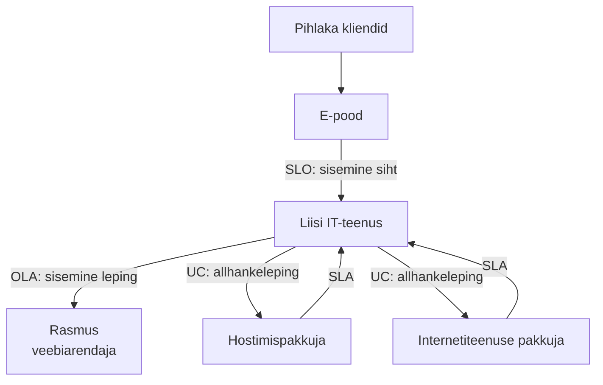
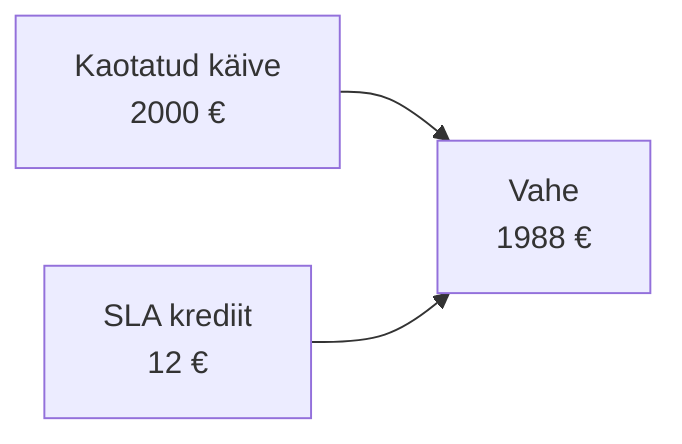

# 3. Teenustaseme lepingud (SLA)

::: info Õpiväljund
Pärast tundi oskad eristada SLI, SLO, SLA, OLA ja UC, lugeda SLA-d ning hinnata, kas lepingu lubadus katab äriprotsessi vajaduse (HK 1.2).
:::

Liis peab valima e-poele uue hostimispakkuja. Üks pakkuja ütleb reklaamis: "99,9% kättesaadavus!" Liis küsib: "Kus see lubadus kirjas on ja mis juhtub, kui te seda ei täida?" Müügimees vastab: "Vaadake lepingut." Lepingus on neli lehekülge. Liis hakkab lugema.

Tulemus on üllatav. Lubadus on tõesti 99,9%. Aga rikkumise korral saab Pihlakas **tagasi mõne euro** ja seda ainult siis, kui ta **ise** selle kahe nädala jooksul nõuab.

Nii õpibki Liis esimese SLA põhitõe: **lubadus ilma tagajärjeta on ainult soov.**

## Mis on teenustaseme leping?

**SLA** (*Service Level Agreement*, teenustaseme leping) on kirjalik kokkulepe teenuse osutaja ja kliendi vahel. See ütleb:

- mida teenuse osutaja lubab (parameetrid, nagu [eelmisel kohtumisel](./kohtumine-02-teenusekvaliteet));
- kuidas seda mõõdetakse;
- mis juhtub, kui lubadust ei täideta.

## Kolm sõna, mis lähevad segamini: SLI, SLO, SLA

Google'i SRE raamat annab neile selge jaotuse:

| Lühend | Täisnimi | Tähendus | Pihlaka näide |
| --- | --- | --- | --- |
| **SLI** | Service Level Indicator | **Mõõdik**: mida mõõdame | Edukate päringute osakaal |
| **SLO** | Service Level Objective | **Siht**: milline väärtus peab olema | 99,9% päringutest õnnestub kuus |
| **SLA** | Service Level Agreement | **Leping**: mis juhtub, kui siht jääb saavutamata | Alla 99,9% → 10% krediiti |

Lihtne meeldejätmise viis: **SLI on kiirusmõõtja, SLO on lubatud kiirus, SLA on trahv, kui kiirust ületad.** SLA-d ei ole ilma SLO-ta ja SLO-d ei saa ilma SLI-ta.

## Sisemine ja väline: OLA ja UC

SLA ei ole ainus leping, mis teenust toetab.

| Leping | Kes kellega | Näide |
| --- | --- | --- |
| **SLA** | Teenuse osutaja ja klient | Hostimispakkuja ↔ Pihlakas |
| **OLA** (*Operational Level Agreement*) | Sama organisatsiooni kaks osa | IT ↔ Rasmus: veateatele vastus 1 h jooksul |
| **UC** (*Underpinning Contract*) | Organisatsioon ja väline allhankija | Pihlakas ↔ internetipakkuja |

**Tähtis reegel:** teenus on nii tugev kui tema nõrgim lüli. Kui Pihlakas lubab oma kliendile 99,9% kuus, aga internetipakkuja lubab ainult 99%, ei ole Pihlaka lubadus tagatud. Allhankijate lubadused peavad olema **vähemalt sama head** kui see, mida ise lubad.

## Mida SLA peab sisaldama?

Liis teeb kontrollnimekirja, mille järgi hindab iga lepingut:

| Osa | Küsimus | Miks tähtis |
| --- | --- | --- |
| Teenuse kirjeldus | Mida täpselt lubatakse? | Vältib vaidlust, mis kuulub teenuse alla |
| Parameetrid | Millised numbrid? | Kättesaadavus, reageerimis- ja lahendusaeg, RTO, RPO |
| Mõõtmine | Kes ja kuidas mõõdab? | Kui mõõdab ainult pakkuja, on usaldus kitsas |
| Mõõtmisperiood | Kuu, kvartal, aasta? | 99,9% kuus on rangem kui aastas |
| Välistused | Mis ei lähe arvesse? | Planeeritud hooldus, "vääramatu jõud" |
| Hüvitis | Mis juhtub rikkumisel? | Krediit, trahv, lepingu lõpetamine |
| Nõudmise kord | Kuidas ja kui kiiresti nõuda? | Tähtaeg ületatakse kergesti |
| Aruandlus | Kas kuupõhine aruanne tuleb? | Ilma aruandeta ei tea sa tegelikku taset |
| Lõpetamine | Millal võin lepingu lõpetada? | Korduv rikkumine peab andma väljapääsu |

## Päris SLA näide: Amazon EC2

Amazon Web Services (AWS) avaldab oma virtuaalserveri teenuse SLA avalikult. Põhiasjad (allikas lõpus):

| Kuu kättesaadavus (regiooni tasemel) | Teenusekrediit |
| --- | --- |
| 99,99% või rohkem | Krediiti ei ole |
| 99,0% kuni alla 99,99% | 10% |
| 95,0% kuni alla 99,0% | 30% |
| Alla 95,0% | 100% |

Kolm olulist detaili samas lepingus:

1. **Krediit, mitte raha tagasi.** Tulevase arve vähendus.
2. **Nõuda tuleb ise.** Klient esitab nõude toe kaudu **kahe arveldustsükli jooksul** ja lisab logid, mis rikke tõestavad.
3. **See on ainus hüvitis.** Leping ütleb, et SLA on kliendi *"sole and exclusive remedies"* ehk ainus õiguskaitsevahend. Kaotatud käivet AWS ei hüvita.

## Töönäide: kui palju SLA tegelikult hüvitab?

Pihlakas maksab hostimise eest **120 € kuus**. Pakkuja SLA (väljamõeldud, AWS-i eeskujul):

| Kuu kättesaadavus | Krediit |
| --- | --- |
| 99,9% või rohkem | 0% |
| 99,0% kuni alla 99,9% | 10% |
| Alla 99,0% | 25% |

Kuus juhtub 5 tundi seisakut reedeõhtul. Liis arvutab:

1. 5 h = 300 min. Kuus on 43 200 min.
2. Kättesaadavus = (43 200 − 300) / 43 200 = **99,31%**.
3. See on alla 99,9%, aga üle 99,0% → krediit **10%** = **12 €**.
4. Kaotatud käive: 5 h × 400 €/h (õhtune tipp) = **2000 €**.

**SLA ei hüvita kahju. SLA motiveerib pakkujat.** Seetõttu peab Liis:

- tagama oma varuplaani, mitte lootma ainult SLA-le;
- hindama, kas pakkuja **lubadus ise** on piisav, sest ainult krediit ei päästa;
- võib küsida lepingusse **suurema trahvi**, mis on tavaliselt kallim.

## SLO ja veaeelarve

Kaasaegses IT-s on SLA kõrval levinud **veaeelarve** (*error budget*). Mõte on lihtne: kui sihtväärtus on 99,9%, siis **0,1% ajast tohib viga olla**. See on "eelarve", mida võib kulutada.

Pihlaka e-poe SLO 99,9% kuus → eelarve **43,2 min kuus**.

| Olukord | Mida teeme |
| --- | --- |
| Eelarvet on järel | Rasmus võib uusi funktsioone avaldada (uuendus võib midagi purustada) |
| Eelarve on otsas | Uuendused peatatakse, tegeletakse töökindlusega |

Google'i SRE raamatu sõnul **kooskõlastab veaeelarve arendajad ja töökindluse inimesed**: mõlemal on sama number, mille üle vaielda. Vaidlus "avaldame või ei avalda" muutub arvutuseks.

## SLA vead, mida tasub vältida

| Viga | Tagajärg |
| --- | --- |
| Lubadus liiga ambitsioonikas ("100%") | Rikkumine on garanteeritud |
| Lubadus on mõõtmatu ("kiire teenus") | Vaidlus, kes oli õige |
| Kasutaja seisukohast mõttetu mõõdik | Server töötab, aga klient ei saa osta |
| Allhankijad nõrgemad kui lubadus | Lubadus on tühi |
| Ei kontrollita tegelikku taset | Ei tea, kas lubadust täidetakse |

## Kokkuvõte

| Mõiste | Tähendus |
| --- | --- |
| SLI | Mida mõõdame |
| SLO | Milline peab number olema |
| SLA | Leping koos tagajärjega rikkumisel |
| OLA | Sisemine leping organisatsiooni osade vahel |
| UC | Leping välise allhankijaga |
| Teenusekrediit | Hüvitis rikkumise korral, tavaliselt arve vähendus |
| Veaeelarve | Lubatud seisaku hulk sihi piires |

Kolm mõtet:

- **Leping ilma tagajärjeta ei ole garantii.** Loe alati hüvitise osa.
- **SLA ei asenda varuplaani.** Hüvitis on tavaliselt väiksem kui kahju.
- **Allhankijad määravad sinu lubaduse.** Võrdle neid enne lubamist.

## Lisa oma IT-teenuse kaardile

Kirjuta **SLA mustand** oma teenusele. Kasuta kontrollnimekirja (tabel "Mida SLA peab sisaldama?"). Lisa hüvitiste tabel ja arvuta ühe juhtumi (nt 5 h seisak) hüvitis ja tegelik kahju.

## Allikad

- [Amazon EC2 SLA (AWS)](https://aws.amazon.com/compute/sla/): krediiditasemed, nõude kord, ainus õiguskaitsevahend.
- [Google SRE raamat: Service Level Objectives](https://sre.google/sre-book/service-level-objectives/) ja [Embracing Risk](https://sre.google/sre-book/embracing-risk/): SLI/SLO/SLA ja veaeelarve.
- OLA ja UC mõisted pärinevad ITIL-i teenusetaseme halduse terminoloogiast. Pihlaka hostimispakkuja ja arvud on väljamõeldud.
