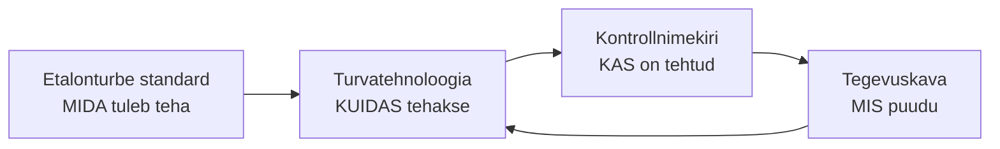

# 5. Etalonturve, turvatehnoloogiad ja kontrollnimekiri

::: info Õpiväljund
Pärast tundi oskad selgitada, mis on etalonturbe standard ja miks seda vaja on, nimetada peamisi turvatehnoloogiaid ning kasutada kontrollnimekirja, et hinnata enda teenuse turvalisust (HK 1.2).
:::

Tõnu tuleb Liisi juurde heas tujus. Pihlakas sai pakkumise suure ehitusfirma e-poe tarnetele. Kaks nädalat hiljem tuleb kliendi hankijalt kiri: "Palun saatke oma infoturbepoliitika ja vastused 25 küsimusele: kas kasutate mitmefaktorilist autentimist? Kas varukoopiaid testitakse? Kuidas toimub töötaja lahkumisel õiguste äravõtmine?"

Tõnu küsib: "Liis, mida me neile vastame?" Liis vaatab küsimusi. Mõnele teab ta vastust. Teistele **ei tea**. See hetk ongi etalonturbe standardite mõte: **keegi on juba kirja pannud, mida üks korralik organisatsioon turvalisuse heaks tegema peaks.**

## Mis on etalonturve?

Kujutle, et sul on 300 võimalikku turvameedet (paroolid, tulemüürid, varukoopiad, ruumi lukk). Kuidas otsustada, millised sinu organisatsioonile vaja on? Kui ise välja mõelda, jäävad auke.

**Etalonturbe standard** on valmis, kontrollitud meetmete kogum, mille organisatsioon valib oma vajaduse järgi. "Etalon" tähendab **võrdlusalust**: sul on selge võrdlus, kas oled piisaval tasemel.

See kopeerib mõtte, mida sa juba tead teisest valdkonnast: toidukäitlejal on hügieeninõuded, ehitajal ehitusnormid. Infoturbe puhul on need standardid.

## Eesti oma: E-ITS

**E-ITS** (Eesti infoturbestandard) on Eestis kasutatav infoturbe etalon. Riigi Infosüsteemi Amet (RIA) on selle haldaja ja omanik.

Mida peab teadma (allikas: RIA, vt allikad):

- E-ITS põhineb Saksa **BSI IT-Grundschutz** standardil ja rahvusvahelisel standardil **ISO/IEC 27001** (RIA nimetab ISO/IEC 27001:2014).
- See on kohustuslik **kõigile organisatsioonidele, kes täidavad avalikke ülesandeid** (sh riigiasutused, kohalikud omavalitsused ja elutähtsate teenuste osutajad). Erasektor võib seda vabatahtlikult kasutada.
- RIA uuendab standardit igal sügisel.
- Standard käsitleb organisatsiooni **tervikuna**, sealhulgas äriprotsesse, mitte ainult üksikuid andmebaase.

### ISKE: eelkäija

Enne E-ITS-i oli Eestis **ISKE** (infosüsteemide kolmeastmeline etalonturbe süsteem). Selle põhimõte oli kaitsta **andmekogusid** (andmebaase) ja tase (kolm astet) määrati andmete tundlikkuse järgi. RIA andmetel kehtis ISKE kuni 31. detsembrini 2022 ja alates 1. jaanuarist 2023 kehtib E-ITS.

| | ISKE | E-ITS |
| --- | --- | --- |
| Mida kaitseb | Andmekogu | Kogu organisatsioon ja äriprotsessid |
| Aluseks | Eesti oma süsteem | Saksa IT-Grundschutz ja ISO 27001 |
| Staatus | Kehtis kuni 2022. a lõpuni | Kehtib 2023. aastast |

Sinu jaoks on tähtis ainult, et **etalonturve on hästi tuntud ja olemas**. ISKE nime võid kohata vanemates dokumentides.

### Kuidas see Pihlakat puudutab? NIS2 ja küberturvalisuse seadus

Eestis jõustus **1. jaanuaril 2026** küberturvalisuse seaduse muudatus, millega võeti üle Euroopa Liidu **NIS2 direktiiv**. RIA andmetel kasvas nende Eesti ettevõtete arv, kes peavad küberturvalisuse nõudeid järgima, umbes 3000 võrra, kokku kuni **6500-ni**. Uued sektorid on näiteks lennufirmad, raudtee, sadamad, pilveteenuse pakkujad, haiglad, toiduainetööstus, postiteenus ja jäätmekäitlus, kui nad ületavad suuruse piirid.

Kohustused (RIA kokkuvõtte põhjal):

- regulaarselt hinnata küberriske ja rakendada kaitsemeetmeid;
- suuta tuvastada intsidente ja teavitada RIA-t olulise mõjuga intsidentidest;
- juhtkond vastutab, personali tuleb koolitada;
- üleminekuaeg on **3 aastat** (elutähtsate teenuste puhul 5).

Trahvid võivad olla kuni **10 miljonit eurot või 2% käibest** (oluliste üksuste puhul) ja kuni **7 miljonit eurot või 1,4% käibest** (tähtsate üksuste puhul).

Pihlakas (ehituspood, 40 töötajat) tõenäoliselt otse selle alla ei kuulu. Aga Pihlaka **kliendid** ja **tarnijad** võivad kuuluda, ja nemad hakkavad oma tarneahelalt turvanõudeid küsima. Seda juhtub Tõnuga: suur klient tahab teada, kas Pihlakas on usaldusväärne partner.

## Turvatehnoloogiad: mida etalon tegelikult nõuab

Standard on loetelu **mida tuleb teha**. Tehnoloogia on **kuidas**. Liis kirjutab Pihlaka jaoks tabeli. Põhimõisted (CIA, ohud, kontod) leiad [Küberturvalisuse](/kuberturvalisus/sissejuhatus) teemast, siin seotakse need teenusega.

| Tehnoloogia | Mida kaitseb | Pihlaka näide |
| --- | --- | --- |
| **Mitmefaktoriline autentimine (MFA)** | Kontode kuritarvitamine | E-posti ja e-poe halduse sisselogimine |
| **Parooli haldur** | Nõrgad ja korduvad paroolid | Kõik töötajad kasutavad ühte |
| **Krüpteerimine** (liikumisel ja salvestatuna) | Andmete lugemine pealtkuulajale või varga käes | HTTPS e-poes, krüpteeritud sülearvuti ketas |
| **Tulemüür** | Soovimatu võrguliiklus | Kontori ruuter ja serveri tulemüür |
| **Viirusetõrje / EDR** | Pahavara töökohal | Kõik arvutid ja serverid |
| **Uuenduste haldus** (*patching*) | Teadaolevad haavatavused | Igakuine uuendus + kriitilised kohe |
| **Varundus** (*3-2-1*) | Andmete kadu | Kolm koopiat, kaks kandjat, üks väljaspool |
| **Pääsuõiguste haldus** (vähim vajalik õigus) | Liiga suured õigused | Laotöötaja ei näe palgaandmeid |
| **Logid ja seire** | Rünnaku märkamine | Ebatavalised sisselogimised |
| **Füüsiline turve** | Varguste ja loata sisenemise vastu | Serveriruumi lukk |

### 3-2-1 reegel

**3-2-1 varundus**: **3** koopiat andmetest, **2** erinevat kandjat, **1** koopia asub **väljaspool** organisatsiooni (nt teises asukohas või pilves). Pihlakas hoiab e-poe andmebaasi koopiat serveris, välisel kettal ja pilves.

## Kontrollnimekiri

Nüüd tuleb küsimus, millega Liis alustas: kuidas vastata 25 küsimusele? Vastus on **kontrollnimekiri** (*checklist*).

**Kontrollnimekiri** on loetelu küsimustest või nõuetest, mille igaühe kohta märgid "jah", "osaliselt" või "ei". See töötab nii:

1. Kirjuta nõuded.
2. Käi iga läbi ja märgi seis. Iga "jah" vajab **tõendit** (nt ekraanipilt, dokument, logi).
3. "Osaliselt" ja "ei" saavad **tegevuse**, vastutaja ja tähtaja.
4. Korda perioodiliselt.

### Pihlaka IT-turbe kontrollnimekiri

::: warning Märkus
See nimekiri on selle õppematerjali **enda koostatud lihtsustatud näide**, mille ideed tulevad üldisest heast tavast (nt CIS Controls ja E-ITS-i põhimeetmed). See **ei ole ametlik standard** ega asenda E-ITS-i või ISO 27001 kontrolli.
:::

| # | Nõue | Jah | Osaliselt | Ei | Tõend |
| --- | --- | --- | --- | --- | --- |
| 1 | Meil on nimekiri kõigist arvutitest ja serveritest | | | | |
| 2 | Meil on nimekiri kõigist kasutatavatest programmidest ja litsentsidest | | | | |
| 3 | Kõigil kontodel on isiklik kasutaja (ei jagata kontosid) | | | | |
| 4 | MFA on sees e-postil ja kõigil haldusliidestel | | | | |
| 5 | Administraatori kontot ei kasutata igapäevaseks tööks | | | | |
| 6 | Töötaja lahkumisel eemaldatakse õigused samal päeval | | | | |
| 7 | Uuendused paigaldatakse kokkulepitud ajaga | | | | |
| 8 | Igal arvutil on viirusetõrje | | | | |
| 9 | Varukoopiad tehakse automaatselt | | | | |
| 10 | Varukoopiast taastamist on viimase aasta jooksul **proovitud** | | | | |
| 11 | Üks varukoopia on organisatsioonist väljaspool | | | | |
| 12 | Tulemüür on sees ja ligipääs serverile on piiratud | | | | |
| 13 | Andmesidet krüpteeritakse (HTTPS) | | | | |
| 14 | Sülearvutite kettad on krüpteeritud | | | | |
| 15 | Serveri logisid säilitatakse ja vaadatakse | | | | |
| 16 | Serveriruum on lukus ja ligipääs on kirjas | | | | |
| 17 | Töötajad on turvaõppust läbinud viimase aasta jooksul | | | | |
| 18 | Intsidendi korral on kirjas, kellele helistada | | | | |
| 19 | Kriitilistel teenustel on sihtväärtused (RTO ja RPO) | | | | |
| 20 | Turvapoliitika on kirjutatud ja töötajatele tutvustatud | | | | |

### Liisi esimene tulemus

Liis läheb nimekirja läbi ja leiab:

- 9 punkti "jah";
- 7 punkti "osaliselt" (nt MFA on e-postil, aga mitte e-poe haldusliideses);
- 4 punkti "ei" (sh punkt 10: varukoopiast taastamist pole kunagi proovitud).

Ta tõstab esile punkti 10 ja punkti 4. Tõnule ütleb ta: "Meil on varukoopiad, aga me ei tea, kas need toimivad. See on suurim risk." Tõnu otsustab, et esimese kuu töö on **taastamise katse**.

See on kontrollnimekirja suur väärtus: **ta teeb nähtavaks, mida sa ei tea.** Kliendi küsimustele vastamine muutub ka lihtsaks, sest iga vastus tugineb tõendile.

## Standard, tehnoloogia ja kontrollnimekiri koos

## Kokkuvõte

| Mõiste | Tähendus |
| --- | --- |
| Etalonturve | Valmis meetmete kogum, mille põhjal turvataset hinnata |
| E-ITS | Eesti infoturbestandard (RIA). Asendas ISKE |
| ISKE | Eelmine Eesti etalonturbe süsteem |
| NIS2 | EL-i küberturvalisuse direktiiv, Eestis seaduses 2026. aastast |
| MFA | Mitmefaktoriline autentimine |
| 3-2-1 | Varunduse reegel: 3 koopiat, 2 kandjat, 1 väljaspool |
| Kontrollnimekiri | Nõuete loetelu, mille vastu seisu hinnatakse |

Kolm mõtet:

- **Etalon säästab leiutamist.** Keegi on juba kirjutanud, mida üks organisatsioon peab tegema.
- **Tehnoloogia ilma kontrollita ei tõesta midagi.** "On varukoopia" ja "varukoopia töötab" on eri asjad.
- **Kontrollnimekiri tõestab ja kuvab puudused.** Iga "jah" vajab tõendit.

## Lisa oma IT-teenuse kaardile

1. Võta Pihlaka nimekiri ja täida see **oma teenuse** kohta (võid väljamõeldud vastused kasutada, aga põhjenda neid).
2. Vali **3 puudust** ja kirjuta igaühele tegevus, vastutaja ja tähtaeg.
3. Seosta vähemalt 3 turvatehnoloogiat teenuse äriprotsessiga: mida see kaitseb?

## Allikad

- [RIA: Uuest aastast laienes küberturvalisuse seadus](https://www.ria.ee/uudised/uuest-aastast-laienes-kuberturvalisuse-seadus): NIS2 jõustumine, ettevõtete arv, üleminekuaeg, trahvid. Kontrollitud selle materjali koostamisel.
- [RIA: Estonian information security standard (E-ITS)](https://www.ria.ee/en/cyber-security/management-state-information-security-measures): ISKE kehtivus kuni 31.12.2022, E-ITS alused (BSI IT-Grundschutz ja ISO/IEC 27001:2014), kohustuslikkus avalikke ülesandeid täitvatele organisatsioonidele. Kontrollitud.
- [E-ITS portaal](https://eits.ria.ee/): standardi tekst. Portaal on dünaamiline ja selle sisu ei saanud automaatselt lugeda.
- [CIS Critical Security Controls](https://www.cisecurity.org/controls): üldine hea tava, millest kontrollnimekirja mõte pärineb.
