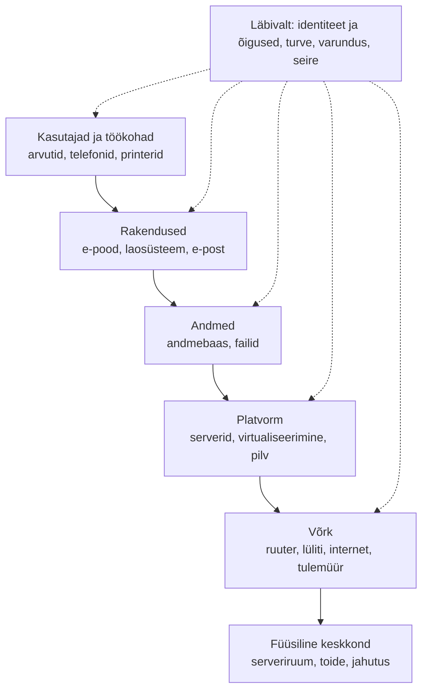
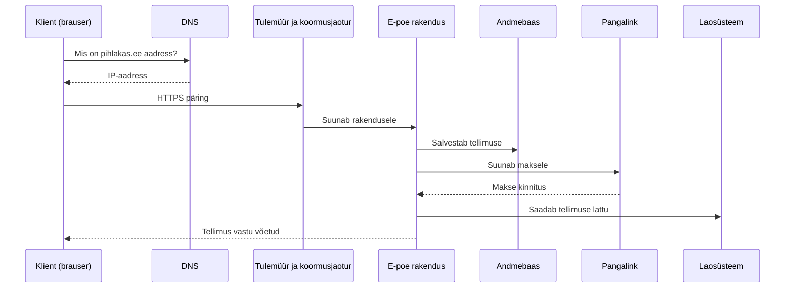
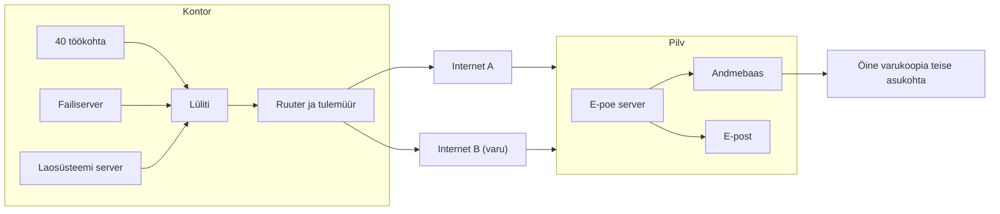

# 6. Teenuste osutamise taristu ülesehitus

::: info Õpiväljund
Pärast tundi oskad kirjeldada IT-taristu kihte, näidata teenuse töö teekonda läbi taristu ja tuvastada ühe rikkepunkti (HK 1.3).
:::

Esmaspäeval alustab Pihlakas uus müügitöötaja Mihkel. Liisil on nimekiri: arvuti, kasutajakonto, e-post, ligipääs e-poe haldusele, ligipääs laoseisule, printer, telefon. Mihkel istub maha, avab brauseri ja kirjutab e-poe haldusaadressi. Leht ei lae.

Liis küsib endalt: **mis kõik peab töötama, et üks leht laeks?** Ta hakkab tagant järgi lugema: arvuti töötab. Kontori võrk töötab. Internet töötab. DNS... töötab. Server... Serveri ketas on täis. Probleem on kõige all kihis, aga Mihkel näeb ainult tühja lehte.

Selles loos on selge, mis taristu on: **kõik need kihid, mis peavad töötama, et kasutaja saaks oma asja tehtud.**

## Mis on IT-taristu?

**IT-taristu** on kõik seadmed, tarkvara, võrk ja teenused, mis võimaldavad rakendustel töötada ja inimestel neid kasutada. See on äriprotsessi **alus**. Kasutaja näeb tavaliselt ainult rakendust, aga selle all on mitu kihti.

## Taristu kihid

| Kiht | Mida sisaldab | Pihlaka näide |
| --- | --- | --- |
| **Töökohad** | Arvutid, telefonid, skännerid, printerid | 40 töökohta, 6 laoskännerit |
| **Rakendused** | Programmid, mida inimesed kasutavad | E-pood, laosüsteem, raamatupidamine, e-post |
| **Andmed** | Andmebaasid ja failid | Tellimuste andmebaas, dokumendid |
| **Platvorm** | Serverid, virtualiseerimine, pilveteenused | E-poe server pilves, kontoris failiserver |
| **Võrk** | Ruuter, lüliti, WiFi, tulemüür, internet | Kontori võrk, kaks internetiühendust |
| **Füüsiline keskkond** | Ruum, elekter, jahutus | Väike serveriruum, UPS |
| **Läbivad teenused** | Kasutajakontod, turve, varundus, seire | Konto ja MFA, varukoopiad, seire |

## Päringu teekond: mis juhtub, kui klient ostab

Mihkli ebaõnnestunud lehe asemel vaatame kliendi tellimust. Kui klient vajutab "Maksa", läbib päring kogu taristu.

Selles teekonnas on **kaheksa kohta, kus saab viga juhtuda**: DNS, internet, tulemüür, rakendus, andmebaas, pangalink, laosüsteem ja server ise. Tihti on kasutajale viga sama: "leht ei toimi". Liisi töö on teada, **kus** viga on, ja see eeldab, et ta teab skeemi.

Võrgu, DNS-i ja HTTP detailid leiad teemadest [Arvutivõrgud](/arvutivorgud/sissejuhatus) ja [Veebiarendus](/veebiarendus/paringuteekond). Siin vaatame, kuidas need kokku moodustavad **teenuse**.

## Ühe rikkepunkti probleem

Liis märgib skeemil iga koha, mille rikkega **kogu teenus seisab**. Seda nimetatakse **ühe rikkepunktiks** (*Single Point of Failure*, SPOF).

Pihlaka e-poe praegune seis:

| Komponent | Mitu on | Kui rikneb |
| --- | --- | --- |
| Internetiühendus | 1 | E-pood ei ole kontoris kättesaadav |
| Ruuter | 1 | Kogu kontor ilma võrguta |
| E-poe server | 1 | Müük peatub |
| Andmebaas | 1, samal serveril | Müük peatub **ja** andmed võivad kaduda |
| Toide | 1 (UPS 20 min) | Elektrikatkestusel seiskub kõik |
| Liis ise | 1 | Keegi ei oska midagi parandada |

Viimane rida on tõsine ja seda ei maksa naeruvääristada. **Inimene võib samuti olla ühe rikkepunkt.** Dokumentatsioon aitab.

### Redundantsus: kuidas SPOF-i vältida

**Redundantsus** tähendab, et kriitilisest osast on olemas **varu**, mis võtab töö üle.

| Meetod | Mida teeb | Pihlaka näide |
| --- | --- | --- |
| **Varukomponent** | Kaks ühesugust, ühe rikke korral töötab teine | Teine internetiühendus eri pakkujalt |
| **Koormusjaotus** | Päringud jagatakse mitme serveri vahel | Kaks e-poe serverit |
| **Replikatsioon** | Andmed kopeeritakse pidevalt teise kohta | Andmebaasi koopia teises serveris |
| **Failover** | Rikke korral lülitub süsteem automaatselt varule | Põhiserveri rikke korral võtab teine üle |
| **Toitevarustus** | UPS ja generaator | UPS 20 min, lülitusaeg suunab kriitilised süsteemid alla |
| **Varukoopia** | Andmed eraldi hoidlas | Öine koopia pilve |

::: warning Redundantsus maksab
Iga varu tähendab lisakulu ja lisaseadistust. [Kohtumisel 2](./kohtumine-02-teenusekvaliteet) arvutasime: 99,9% → 99,99% maksis 6000 € aastas, aga säästis 1314 €. Seetõttu ei tehta kõike kahekordseks, vaid **ainult seda, mis äriprotsessi vajadusega põhjendatud on**. E-poe server ja andmebaas vajavad varu enne, kui arveldusprogramm.
:::

## Taristu tüübid: kus see asub?

| Tüüp | Kus taristu asub | Plussid | Miinused |
| --- | --- | --- | --- |
| **Kohalik** (*on-premises*) | Oma serveriruum | Täielik kontroll | Oma kulu hooldusele, elektrile, turvale |
| **Pilv** (*cloud*) | Teenusepakkuja andmekeskus | Kiire laiendus, makstakse kasutuse eest | Sõltuvus pakkujast, pidev kulu |
| **Hübriid** | Osa kohapeal, osa pilves | Sobitab mõlema | Keerulisem hallata |

Pihlakas on **hübriid**: laosüsteem ja failiserver on kontoris (skännerid peavad kiiresti vastama), e-pood ja e-post on pilves. Nende tööst räägime [järgmisel kohtumisel](./kohtumine-07-taristu-toimimine).

## Liisi taristu skeem

Mihkli esimese päeva järel teeb Liis Pihlaka esimese taristu skeemi. Ta leiab, et dokumenteeritud ei olnud mitte midagi, ja kõik teadmised olid tema peas.

Skeem on **kõige odavam turvameede**. Tema järgi saab uus inimene aru, kuidas asjad töötavad, ning tema järgi näeb, kus on SPOF.

## Kokkuvõte

| Mõiste | Tähendus |
| --- | --- |
| Taristu | Seadmed, tarkvara ja võrk, millel rakendused töötavad |
| Kihid | Töökohad, rakendused, andmed, platvorm, võrk, füüsiline keskkond |
| SPOF | Ühe rikkepunkt: osa, mille rike seisab terve teenuse |
| Redundantsus | Varu, mis võtab töö üle |
| Failover | Automaatne üleminek varule |
| Kohalik / pilv / hübriid | Kus taristu asub |

Kolm mõtet:

- **Kasutaja näeb rakendust, aga taristu on selle all.** Tea kihte, et rikke leida.
- **Otsi SPOF-e.** Iga komponent, millel pole varu, on risk.
- **Varu maksab.** Tee seda seal, kus äriprotsess vajab.

## Lisa oma IT-teenuse kaardile

1. Joonista oma teenuse **taristu skeem** (Excalidraw, tldraw või Mermaid).
2. Märgi kihid.
3. Tee tabel SPOF-idest: komponent, mitu on, mis juhtub rikkel.
4. Vali **kaks** SPOF-i, mille eest kaitsta, ja põhjenda, miks just need.

## Allikad

- Taristu kihtide jaotus on üldine IT-arhitektuuri õpetus. Mõisted SPOF, redundantsus ja failover on standardne töökindlusinseneeria sõnavara.
- Seotud sisu: [Serverid ja võrgud](/serverid-ja-vorgud/sissejuhatus), [Arvutivõrgud](/arvutivorgud/sissejuhatus), [Veebipäringu teekond](/veebiarendus/paringuteekond).
- Pihlaka taristu on väljamõeldud.
