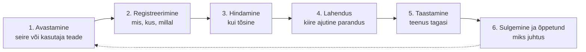

# 7. Taristu toimimine: pilv, monitooring ja intsident

::: info Õpiväljund
Pärast tundi oskad selgitada, kuidas pilveteenuste vastutus jaguneb, mida seire teeb ja kuidas intsident käib avastamisest sulgemiseni (HK 1.3).
:::

Teisipäeva öösel kell 02:47 vibreerib Liisi telefon. Seire saatis hoiatuse: "Failiserveri ketas 92% täis." Liis ei ärka kohe. Hommikul kell 7 vaatab ta: ketas on 97%. Kell 8:15 ei saa Helen enam raamatupidamise faile salvestada.

Mis läks valesti? **Seire töötas, aga hoiatusega ei tegeletud.** Ja miks oli ketas täis? Keegi oli eelmisel päeval pannud sinna 80 GB videomaterjali. Keegi ei teadnud, et see ei tohi.

Selles loos on kolm teemat: **kes mille eest vastutab, kuidas probleemist teada saada ja kuidas probleemiga tegeleda.**

## Pilveteenuse kolm taset

Pihlaka e-pood on pilves. Aga "pilves" tähendab mitut asja. Kolm põhimudelit:

| Mudel | Mida pakkuja annab | Mida sina hooldad | Pihlaka näide |
| --- | --- | --- | --- |
| **IaaS** (*Infrastructure as a Service*) | Virtuaalserveri, võrgu, ketta | Operatsioonisüsteem, uuendused, rakendus, andmed | E-poe server pilves |
| **PaaS** (*Platform as a Service*) | Platvormi, kuhu paned oma koodi | Rakendus ja andmed | Hallatav andmebaas |
| **SaaS** (*Software as a Service*) | Valmis rakenduse | Kasutajad ja andmed | E-posti teenus, kontoritarkvara |

### Jagatud vastutus

Kõige olulisem pilve põhimõte: **pakkuja vastutab osa eest, sina teise osa eest.** Seda nimetatakse **jagatud vastutuse mudeliks**.

| Kiht | Kohalik | IaaS | PaaS | SaaS |
| --- | --- | --- | --- | --- |
| Andmed ja kasutajad | Sina | Sina | Sina | Sina |
| Rakendus | Sina | Sina | Sina | Pakkuja |
| Operatsioonisüsteem | Sina | Sina | Pakkuja | Pakkuja |
| Virtualiseerimine, server | Sina | Pakkuja | Pakkuja | Pakkuja |
| Füüsiline andmekeskus | Sina | Pakkuja | Pakkuja | Pakkuja |

**Märka:** olenemata mudelist, **andmed ja kasutajad on alati sinu vastutus.** Kui töötaja kasutab nõrka parooli ja konto murtakse, ei ole see pilvepakkuja viga. Täpne vastutuse jaotus erineb pakkujate vahel, seega vaata iga teenuse lepingut.

Pihlakas: Rasmus vastutab e-poe rakenduse ja Liis serveri uuenduste eest (IaaS). Hallatava andmebaasi uuendab pakkuja (PaaS), aga varukoopiate toimimist peab ikka Liis kontrollima.

## Seire: kuidas probleemist teada saada

**Seire** (*monitoring*) tähendab teenuse seisundi pidevat mõõtmist, et märgata probleemi enne, kui klient seda teeb.

Kolm asja, mida seirata:

| Mida | Näide | Küsimus |
| --- | --- | --- |
| **Mõõdikud** (*metrics*) | Protsessori koormus, ketta täituvus, päringu aeg | Kuidas süsteem hetkel töötab? |
| **Logid** | Veateated, sisselogimised | Mis juhtus? |
| **Tegevuskontroll** (*health check*) | Pihlakas.ee vastab 200 OK iga minut | Kas teenus tegelikult vastab? |

Seire seob eelmise kohtumise parameetritega: **SLI-d tulevad seirest**. Ilma seireta ei saa kättesaadavust mõõta.

### Hoiatused: et ei oleks nii nagu Liisil

Selle teisipäeva õppetund on, et seire ei kaitse, kui hoiatus ei jõua õige inimeseni õigel ajal õige tähtsusega. Head hoiatuse reeglid:

| Reegel | Halb | Hea |
| --- | --- | --- |
| Hoiatus peab nõudma tegevust | "Protsessor 70%" (ei tähenda midagi) | "E-pood ei vasta 3 minutit" |
| Tähtsus vastab mõjule | Kõik hoiatused kell 02:47 | Kriitiline = telefon, väike = hommikune ülevaade |
| Hoiatus ennetab | Alarm 97% juures | Hoiatus 80% juures ja kriitiline 90% juures |
| Selge, kes vastutab | "Keegi vaatab" | Valvegraafik ja asendaja |

Liis muudab: 80% annab tavalise teate, 90% saadab öösel telefoni, ja ta lisab kettaruumi kvoodi videofailidele.

## Intsidendi elukäik

**Intsident** on ootamatu sündmus, mis vähendab teenuse kvaliteeti või seab selle ohtu. Kettaruumi lugu oli intsident. Hea intsidendi käsitlus järgib kindlat jada:

### Tähtsuse hindamine

Mitte kõik intsidendid pole võrdsed. Liis kasutab lihtsat tabelit:

| Tase | Kirjeldus | Näide | Reageerimine |
| --- | --- | --- | --- |
| **Kriitiline** | Põhiprotsess seisab | E-pood ei tööta | Kohe, ööpäev läbi. RTO 2 h |
| **Kõrge** | Oluline osa toimib halvasti | E-pood aeglane, maksed mõnikord ebaõnnestuvad | 30 min tööajal |
| **Keskmine** | Üks kasutaja või väike funktsioon | Üks töötaja ei pääse e-postile | 4 h |
| **Madal** | Ei mõjuta tööd | Printeri seadistus | 2 tööpäeva |

Need ajad on **SLA parameetrid** [3. kohtumisest](./kohtumine-03-teenustaseme-lepingud). Ilma tähtsuse tasemeta ei saa SLA-d täita.

### Tagantjärele analüüs

Pärast tõsist intsidenti kirjutab Liis lühikese kokkuvõtte (*post-mortem*):

| Osa | Liisi vastus |
| --- | --- |
| Mis juhtus? | Failiserveri ketas sai täis, Helen ei saanud töötada 08:15–09:40 |
| Mis oli mõju? | Raamatupidamine seisis 85 min, 1 töötaja |
| Miks juhtus? | Kuhjus suur fail, hoiatus saadeti öösel ja keegi ei märganud |
| Mis parandati? | Kustutati fail, vabastati 120 GB |
| Mida muudame? | Hoiatuste tasemed, kvoodid, valvekord |

Hea analüüs **ei otsi süüdlast**, vaid **süsteemi viga**. Kui küsid "kes pani faili", ei saa sa õppida. Kui küsid "miks ei takistanud süsteem faili panemist", saad.

## Muudatuste haldus

Palju intsidente tekib sellest, et **keegi muutis midagi**. Server seiskub pärast uuendust, leht ei laadi pärast uue funktsiooni avaldamist.

**Muudatuste haldus** (*change management*) tähendab, et muudatused tehakse läbimõeldult:

| Samm | Küsimus |
| --- | --- |
| Kirjelda | Mis muutub ja miks? |
| Hinda riski | Mis läheb valesti? |
| Plaani | Millal? (mitte reedel õhtul) |
| Varuplaan | Kuidas tagasi pöörata? |
| Tee ja kontrolli | Kas töötab? |
| Dokumenteeri | Mis tehti? |

Pihlakas on reegel: **e-poe uuendused ei tehta reedeti ega õhtuti 17:00–21:00**, sest need on tipptunnid. Rasmus avaldab uuendused teisipäeva hommikul.

## Kokkuvõte

| Mõiste | Tähendus |
| --- | --- |
| IaaS / PaaS / SaaS | Pilveteenuse kolm taset |
| Jagatud vastutus | Pakkuja ja klient vastutavad erinevate kihtide eest |
| Seire | Pidev mõõtmine, et probleemi märgata |
| Hoiatus | Teade, kui väärtus ületab piiri. Peab nõudma tegevust |
| Intsident | Ootamatu sündmus, mis kahjustab teenust |
| Post-mortem | Tagantjärele analüüs, mis otsib põhjust, mitte süüdlast |
| Muudatuste haldus | Muudatuste läbimõeldud tegemine |

Kolm mõtet:

- **Andmed ja kasutajad on alati sinu vastutus**, ka pilves.
- **Hoiatus ilma tegevuseta on müra.** Pane iga hoiatus õigele inimesele õigel ajal.
- **Õpi intsidendist.** Küsi "miks süsteem seda lubas", mitte "kes eksis".

## Lisa oma IT-teenuse kaardile

1. Märgi, kas teenus on IaaS, PaaS või SaaS, ja kirjuta, **mille eest sina vastutad**.
2. Vali 3 seiratavat näitajat ja lisa hoiatuse piir ning tähtsus.
3. Tee **intsidendi tegevusplaan**: tähtsuse tasemed, reageerimisajad, kes helistab kellele.
4. Kirjuta üks väljamõeldud intsidendi lühianalüüs.

## Allikad

- Pilve mudelid (IaaS/PaaS/SaaS) ja jagatud vastutuse põhimõte on pilvepakkujate (AWS, Microsoft, Google) avalikes dokumentides kirjeldatud standardne mõiste. Täpne vastutuse jaotus erineb teenuse kaupa. Üldpõhimõte (pakkuja vastutab "pilve turvalisuse", klient "turvalisuse pilves"; andmed, kasutajad ja identiteet jäävad alati kliendile) on kontrollitud AWS-i ja Azure'i mudelite kokkuvõtetest. Tabel on üldistatud, täpne jaotus erineb teenuse kaupa.
- Intsidendi elukäik ja tagantjärele analüüs: [Google SRE raamat, Postmortem Culture](https://sre.google/sre-book/postmortem-culture/) (süüdlase otsimata analüüs, kontrollitud: "blameless" postmortem keskendub põhjustele, ei süüdista isikut ega meeskonda).
- Pihlaka juhtum on väljamõeldud.
