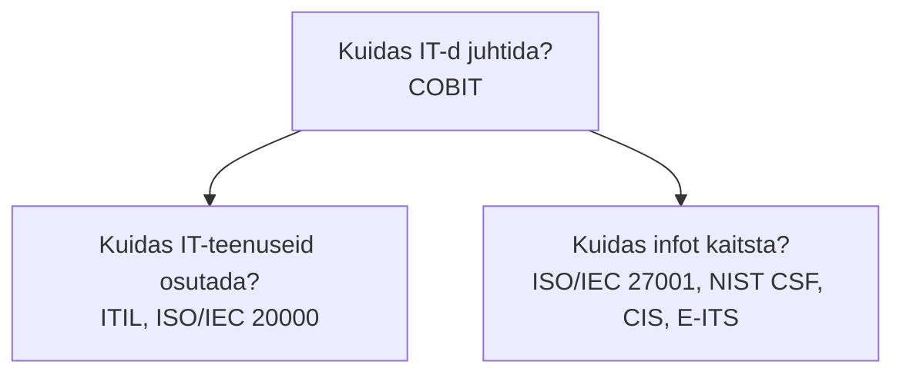
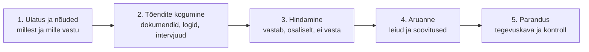

# 8. Haldus- ja auditeerimisraamistikud

::: info Õpiväljund
Pärast tundi oskad eristada peamisi IT-haldamise ja auditeerimise standardeid ning raamistikke ja öelda, millise küsimuse igaüks lahendab (HK 1.4).
:::

Suur klient saadab Tõnule uue kirja: "Kas teil on ISO 27001 sertifikaat? Kas teie IT-teenus järgib ITIL-i? Mis raamistikule teie turvapoliitika toetub?" Tõnu pöördub Liisi poole: "Liis, mis need kõik on? Kas me vajame neid kõiki?"

Liis ei tea samuti. Ta hakkab uurima ja saab kiiresti aru, et **tähtede kuhi** (ITIL, COBIT, ISO, NIST, CIS) pole sama asi. Igaüks vastab **erinevale küsimusele**.

## Standard, raamistik, hea tava

Kõigepealt kolm sõna, mis lähevad segamini:

| Mõiste | Tähendus | Näide |
| --- | --- | --- |
| **Standard** | Täpsed nõuded, mille täitmist saab kontrollida ja sertifitseerida | ISO/IEC 27001 |
| **Raamistik** (*framework*) | Soovituste ja struktuuri kogum, mida kohandad oma vajadusele | ITIL, NIST CSF |
| **Hea tava** (*good practice*) | Kogemusest kasvanud soovitused | CIS Controls |

Standardi vastu saab **sertifitseeruda** (sõltumatu audiitor kinnitab). Raamistiku vastu **kohandad** oma tegevust ja hindad enda vastavust.

## Kolm erinevat küsimust

Tihti arvavad inimesed, et kõik need dokumendid lahendavad sama probleemi. Tegelikult jagunevad nad kolme rühma:

| Küsimus | Raamistik või standard |
| --- | --- |
| **Kuidas IT-d ja selle eesmärke organisatsioonis juhtida?** (juhtimine) | COBIT |
| **Kuidas IT-teenuseid hästi osutada ja hallata?** (teenused) | ITIL, ISO/IEC 20000-1 |
| **Kuidas infot ja süsteeme kaitsta?** (turve) | ISO/IEC 27001, NIST CSF, CIS Controls, E-ITS |

## Peamised neist ükshaaval

### ITIL 4

**Mis see on:** IT-teenuste haldamise hea tava raamistik. Töötati välja Ühendkuningriigis ja on maailmas laialt kasutusel.

**Mida see lahendab:** kuidas teenust ettevõtte vajadusest **tarbimiseni** juhtida: kuidas pidada intsidente, probleeme, muudatusi, teenuse taotlusi, teenusetaseme lepinguid.

**Põhiidee:** teenus loob **väärtust**. ITIL 4 kirjeldab **teenuse väärtusahelat** (kuus tegevust: planeeri, paranda, kaasa, kavanda ja üleviimine, hangi/ehita, osuta ja toeta) ning **34 praktikat** (nt intsidendi haldus, muudatuste lubamine, teenusetaseme haldus). Teenuse haldamisel vaadatakse neljast küljest: organisatsioon ja inimesed, info ja tehnoloogia, partnerid ja tarnijad, väärtusvood ja protsessid.

**Liisi näide:** see, mida Liis kohtumisel 7 tegi (intsidendi jada, muudatuste haldus, tähtsuse tasemed), on **ITIL-i praktikate** lihtsustatud versioon.

### ISO/IEC 20000-1

**Mis see on:** rahvusvaheline **standard** (ISO/IEC 20000-1:2018) IT-teenuste haldussüsteemile. Seda saab **sertifitseerida**. Erinevalt ISO 27001-st peavad kõik nõuded olema täidetud, ühtegi ei saa sertifitseerimisalast välja jätta.

**Mida see lahendab:** tõestab klientidele, et organisatsioon haldab IT-teenuseid süsteemselt. ITIL on "kuidas hästi teha", ISO 20000-1 on "nõuded, mille vastu sind auditeeritakse".

### ISO/IEC 27001

**Mis see on:** rahvusvaheline **standard** **infoturbe halduse süsteemile** (ISMS). Sertifitseeritav.

**Mida see lahendab:** kuidas organisatsioon süsteemselt hindab riske, valib meetmed, rakendab neid ja parandab. Standardi 2022. aasta versiooni lisas (Annex A) on 93 meedet neljas rühmas: organisatsioonilised (37), inimeste (8), füüsilised (14) ja tehnoloogilised (34). Eelmises versioonis (2013) oli 114 meedet.

**Liisi näide:** kui kliendile on vaja tõestust, et Pihlakas hoiab andmeid turvaliselt, võiks sertifikaat olla vastus. See on aga kallis ja aeganõudev, seega väike ettevõte alustab tavaliselt lihtsama etalonturbe või kontrollnimekirjaga.

### E-ITS

Nagu [kohtumisel 5](./kohtumine-05-etalonturve-ja-turvatehnoloogiad) õppisime, on **E-ITS** Eesti infoturbe etalon, mis põhineb Saksa IT-Grundschutz'il ja on kooskõlas ISO 27001-ga. Kohustuslik avalikule sektorile ja elutähtsate teenuste osutajatele.

### NIST Cybersecurity Framework (CSF) 2.0

**Mis see on:** USA riikliku standardite instituudi (NIST) küberturvalisuse **raamistik**, vabatahtlik ja tasuta.

**Mida see lahendab:** annab lihtsa struktuuri, kuidas turvalisusele läheneda. 2.0 versioon (2024) jaotab töö kuueks funktsiooniks:

| Funktsioon | Küsimus | Pihlaka näide |
| --- | --- | --- |
| **Govern** (juhtimine) | Kes vastutab, mis on reeglid? | Turvapoliitika, juhatuse otsus |
| **Identify** (tuvasta) | Mis meil on ja mis risk? | Seadmete ja litsentside nimekiri |
| **Protect** (kaitse) | Kuidas kaitseme? | MFA, uuendused, varukoopia |
| **Detect** (avasta) | Kuidas märkame rünnakut? | Seire ja logid |
| **Respond** (reageeri) | Mida teeme intsidendi korral? | Intsidendi plaan |
| **Recover** (taasta) | Kuidas taastume? | Varukoopiast taastamine |

Need kuus sõna on hea **mõtlemisraam** ka väikesele ettevõttele.

### CIS Critical Security Controls

**Mis see on:** praktiline, prioriseeritud **turvameetmete loend** (hea tava). Mõeldud, et teaksid, **millega alustada**.

**Mida see lahendab:** ütleb, mida teha **kõigepealt** (nt seadmete ja tarkvara inventuur, kontohaldus, uuendused). Sobib väikesele organisatsioonile, kellel puudub aega lugeda 100-leheküljelisi standardeid.

### COBIT

**Mis see on:** IT-juhtimise ja -halduse **raamistik**, mille on välja töötanud ISACA.

**Mida see lahendab:** seostab IT eesmärgid ettevõtte eesmärkidega ja ütleb, kuidas IT-d **juhtkonna tasandil** juhtida, mõõta ja auditeerida. COBIT 2019 määratleb 40 juhtimis- ja haldamiseesmärki viies valdkonnas. See on suurte organisatsioonide ja audiitorite sõnavara ning asub tavaliselt teiste raamistike (nt ITIL) kohal.

## Võrdlustabel

| | Peamine küsimus | Tüüp | Sertifitseeritav? | Kellele sobib |
| --- | --- | --- | --- | --- |
| **ITIL 4** | Kuidas teenuseid hallata? | Raamistik | Inimesed saavad kvalifikatsiooni, organisatsioon mitte | IT-teenuste osakonnad |
| **ISO/IEC 20000-1** | Kas teenuste haldus vastab nõuetele? | Standard | Jah | Teenusepakkujad, kes tahavad tõestada |
| **ISO/IEC 27001** | Kas infoturve on süsteemselt juhitud? | Standard | Jah | Kõik, kellelt kliendid tõestust nõuavad |
| **E-ITS** | Mis turvameetmed on Eesti kontekstis vajalikud? | Standard (etalon) | Auditeeritav | Avalik sektor, elutähtsad teenused |
| **NIST CSF 2.0** | Kuidas turvalisust struktureerida? | Raamistik | Ei | Igaüks, eriti alustajad |
| **CIS Controls** | Millega turvalisuses alustada? | Hea tava | Ei | Väikesed ja keskmised organisatsioonid |
| **COBIT** | Kuidas IT-d juhtida ja kontrollida? | Raamistik | Ei | Suured organisatsioonid, audiitorid |

Praktika: **organisatsioon ei vali ühte, vaid kombineerib**. Näiteks ITIL-i põhimõtted teenuste haldamiseks, ISO 27001 turve jaoks ja COBIT juhtkonna aruandluseks.

## Mis on audit?

**Audit** on sõltumatu hindamine, kas organisatsiooni tegevus vastab sätestatud nõuetele. Sisuliselt on see **kontrollnimekirja täitmine kolmanda osapoole poolt**.

| Audititüüp | Kes teeb | Milleks |
| --- | --- | --- |
| **Siseaudit** | Oma organisatsiooni töötaja | Enesekontroll, ettevalmistus |
| **Välisaudit (kliendi)** | Klient või tema esindaja | Kliendi usalduse kontroll |
| **Sertifitseerimisaudit** | Sõltumatu sertifitseerija | Standardile vastavuse tõend |

Audiitor ei küsi "kas sa arvad, et oled turvaline", vaid **"näita tõendit"**. Seetõttu tuli Liisil [kohtumisel 5](./kohtumine-05-etalonturve-ja-turvatehnoloogiad) tõendi veerg kontrollnimekirjas.

### Auditi leid ehk mittevastavus

Audit annab **leide** ja need jaotatakse tavaliselt kaheks:

| Leid | Tähendus | Näide |
| --- | --- | --- |
| **Suur mittevastavus** | Nõue ei ole täidetud, süsteem ei toimi | Varukoopiaid ei tehta |
| **Väike mittevastavus** | Nõue täidetud osaliselt | Varukoopiad tehakse, aga taastamist pole testitud |
| **Tähelepanek / soovitus** | Parandusvõimalus | Dokumentatsioon vananenud |

## Töönäide: Liis vastab kliendile

Liis kogub kokku ja vastab:

| Kliendi küsimus | Liisi vastus |
| --- | --- |
| Kas teil on ISO 27001? | Ei ole sertifikaati. Kasutame NIST CSF kuut funktsiooni ja CIS Controls põhimeetmeid, kontrollnimekirja viimane tulemus 17/20 |
| Kas teenust hallatakse ITIL-i põhimõtete järgi? | Meil on kirjeldatud intsidendi tähtsuse tasemed, muudatuste reegel ja SLA. Ametlikku ITIL-i sertifikaati pole |
| Kas varukoopiaid testitakse? | Jah, viimane taastamiskatse oli märtsis, tõend lisatud |

Selline vastus on aus. Klient eelistab ausat "ei ole sertifikaati, aga tegeleme nii" suvalisele "jah, kõik on korras".

## Kokkuvõte

| Mõiste | Tähendus |
| --- | --- |
| Standard | Täpsed, sertifitseeritavad nõuded |
| Raamistik | Kohandatav soovituste ja struktuuri kogum |
| ITIL / ISO 20000 | IT-teenuste haldus |
| ISO 27001 / E-ITS / NIST CSF / CIS | Infoturve |
| COBIT | IT juhtimine ja kontroll |
| Audit | Sõltumatu hinnang, kas tegevus vastab nõuetele |
| Mittevastavus | Auditi leid, kus nõue ei ole täidetud |

Kolm mõtet:

- **Iga dokument vastab eri küsimusele.** Teenused, turve ja juhtimine on eri asjad.
- **Standard sertifitseeritakse, raamistikku kohandatakse.**
- **Audiitor tahab tõendit.** Dokumenteeri, mida teed.

## Lisa oma IT-teenuse kaardile

1. Tee tabel: vähemalt **kolm** raamistikku või standardit, mida sinu teenus võiks vajada, ja põhjenda, **millise küsimuse** igaüks lahendab.
2. Vali üks (nt NIST CSF) ja seosta oma teenuse meetmed selle funktsioonidega.
3. Kirjuta **mini-auditi aruanne**: võta kontrollnimekiri [kohtumisest 5](./kohtumine-05-etalonturve-ja-turvatehnoloogiad), vali 5 punkti, märgi tõend ja leid (suur/väike/tähelepanek).

## Allikad

- [NIST Cybersecurity Framework](https://www.nist.gov/cyberframework): kuus funktsiooni (CSF 2.0, 2024).
- [ISO/IEC 27001](https://www.iso.org/standard/27001): standardi ametlik leht (täistekst on tasuline).
- [ISACA COBIT](https://www.isaca.org/resources/cobit): COBIT ametlik leht.
- [CIS Critical Security Controls](https://www.cisecurity.org/controls)
- ITIL 4 (neli dimensiooni, kuus väärtusahela tegevust, 34 praktikat), ISO/IEC 20000-1:2018 (nõuete ülesehitus, sertifitseeritavus) ja COBIT 2019 (40 eesmärki) on kontrollitud mitme sõltumatu kokkuvõtte põhjal. Ametlikud ITIL-i (PeopleCert) ja ISO 20000 lehed on tasulised või kinnised.

