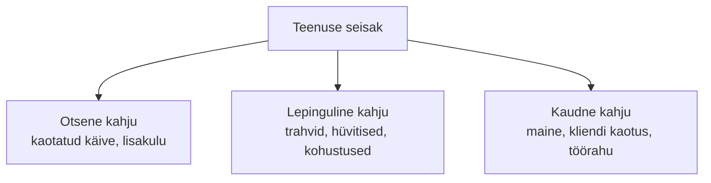
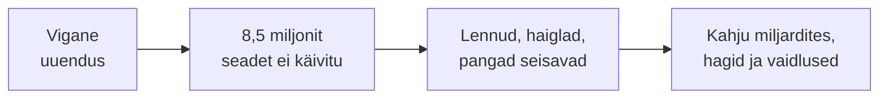
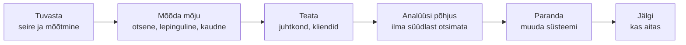

# 9. Teenusetaseme mittevastavuse mõju

::: info Õpiväljund
Pärast tundi oskad kirjeldada, mida teenusetaseme mittevastavus organisatsiooni tulemustele tähendab, ja arvutada ühe katkestuse kogukahju (HK 1.5).
:::

Reede õhtul kell 18:10 lõpetab Pihlaka e-pood töö. Rasmus oli paar tundi varem avaldanud uuenduse, mille kohta kinnitas: "See on väike muudatus." Liis kõrvaldab vea kell 21:40. Seisak oli **3 tundi 30 minutit**, täpselt tipptunnil.

Esmaspäeval on koosolek. Tõnu küsib: "Mis see meile maksis?" Liis ei tea veel vastata. Ta mõistab, et kahju ei ole ainult "kaotatud müük". Tema ülesanne on nüüd see **välja arvutada**.

## Mis on teenusetaseme mittevastavus?

Pihlaka e-poe sihtväärtus oli **99,9% kuus ehk 43,2 min seisakut**. Reedene seisak oli 210 min. See on **teenusetaseme mittevastavus**: tegelik tase jäi sihist allapoole.

210 min kuus (43 200 min):
- kättesaadavus = (43 200 − 210) / 43 200 = **99,51%**;
- see on alla 99,9% sihi, ka veaeelarve (43,2 min) on 4,9 korda ületatud.

## Kolm kahju kihti

Kahju ei ole ainult number kassas. Seda aitab mõista kolm kihti.

| Kiht | Mis see on | Pihlaka näide |
| --- | --- | --- |
| **Otsene** | Kohe mõõdetav raha | Kaotatud müük, ületunnitöö, parandustöö |
| **Lepinguline** | Lepingust tulenev nõue | Kliendile antud lubaduse rikkumise trahv |
| **Kaudne** | Raskemini mõõdetav, aga sageli suurim | Klient läheb konkurendi juurde, halvad arvustused |

### Otsene kahju: Liisi arvutus

| Rida | Arvutus | Summa |
| --- | --- | --- |
| Kaotatud müük | 3,5 h × 400 €/h (reedene õhtu tipp) | 1400 € |
| Liisi ületunnitöö | 3 h × 25 € | 75 € |
| Rasmuse ületunnitöö (veaparandus) | 2 h × 30 € | 60 € |
| Kadri aeg klientidele vastamiseks | 2 h × 20 € | 40 € |
| **Otsene kahju kokku** | | **1575 €** |

Aga see on ainult algus.

### Lepinguline kahju

E-poe kaudu müüb Pihlakas ka suurele ehitusfirmale, kellele on lubatud tellimuse kinnitus **30 minutiga**. Seisaku ajal ei saanud ta kinnitusi saata. Lepingus on kirjas: iga rikutud kinnitus = 50 € leppetrahv. Nii juhtus 6 tellimusega: **300 €**.

Oma hostimispakkuja SLA krediit oli [kohtumise 3 arvutuse](./kohtumine-03-teenustaseme-lepingud) kohaselt **12 €**. Siin aga seisak ei olnud pakkuja süü, vaid Rasmuse uuendus, seega **hüvitist ei saa üldse**.

### Kaudne kahju

Seda on raske täpselt mõõta, aga Liis proovib:

- 12 klienti, kes üritasid tellida, vaatasid mujal. Neist 3 ei tulnud tagasi. Elukestev väärtus 3 × 400 € = **1200 €**, hinnang.
- 5 negatiivset arvustust. Mõju müügile pole numbriga.
- Meeskonna stress ja usaldus: Kadri küsib, kas e-pood on üldse töökindel.

**Kokku (hinnanguliselt):** 1575 + 300 + 1200 = **~3075 €** ühe reedeõhtu eest. See on **üle kahe korra rohkem**, kui lihtsalt kaotatud müük. Keskmine tunnikäive annaks 3,5 × 167 = vaid 585 €, aga tegelik oli palju suurem, sest seisak oli **tipptunnil**.

## Mis mõjutab kahju suurust?

| Tegur | Küsimus | Mõju |
| --- | --- | --- |
| **Aeg** | Millal seisak toimus? | Tipp vs. öö võib erineda mitu korda |
| **Kestus** | Kui kaua? | Iga tund lisab kahju |
| **Ulatus** | Kui paljusid mõjutab? | Üks kasutaja vs. kogu e-pood |
| **Andmekadu** | Kas andmeid läks kaotsi? | RPO ületamine on tavaliselt kallim kui seisak |
| **Taastumine** | Kui kaua kulub tagasi normaalsele? | Tellimuste kuhi, järelkaja |
| **Avalikkus** | Kas see jõudis uudistesse? | Maine mõju |

## Päris juhtum: CrowdStrike, 19. juuli 2024

Väike muudatus võib teha suurt kahju. 19. juulil 2024 levitas turvatarkvara tootja CrowdStrike oma Windowsi seadmetele **vigase seadistusfaili uuenduse**. Selle tulemus:

- Microsofti hinnangul mõjutas see umbes **8,5 miljonit** Windowsi seadet (alla 1% kõigist Windowsi seadmetest).
- Maailmas tühistati **5078 lendu ehk 4,6%** sel päeval planeeritud lendudest.
- Seadmed jäid taaskäivitusringi ja paljud vajasid **käsitsi parandust**, ühe arvuti kaupa.

Lennufirma **Delta Air Lines** tühistas üle 7000 lennu viie päeva jooksul ja mõjutas umbes 1,3 miljonit reisijat. Firma hindas oma kahjuks **550 miljonit USA dollarit** (380 miljonit kaotatud tulu ja 170 miljonit lisakulu) ning esitas CrowdStrike'i vastu 500 miljoni dollari suuruse hagi.

Küberkindlustuse firma Parametrix hindas, et USA 500 suurima ettevõtte (v.a Microsoft) rahalised kahjud olid ligi **5,4 miljardit dollarit**, millest kindlustatud oli ainult 540 miljonit kuni 1,08 miljardit.

**Mida see õpetab Pihlaka mastaabis?**

| CrowdStrike | Pihlakas |
| --- | --- |
| Uuendus läks kõigile korraga | Rasmuse uuendus läks kogu e-poele reedeõhtul |
| Piisavat testimist/järk-järgulist avaldamist ei olnud | Uuendust ei testitud eraldi keskkonnas |
| Taastamine käsitsi | Liisil kulus 3,5 h |
| Kahju oli suurem kui otsene tulu | Kaudne kahju ületas otsese |

Selle juhtumi õppetund ei ole "teise firma viga". See on **sama mustri suur versioon**: **muudatus ilma varuplaanita ja järk-järgulise avaldamiseta võib seisata äriprotsessi**. Seetõttu on [kohtumisel 7](./kohtumine-07-taristu-toimimine) muudatuste haldus.

::: tip Allikate märkus
8,5 miljonit seadet on Microsofti enda hinnang (Microsofti ajaveeb 20.07.2024). Lendude arv pärineb Vikipeediast. Delta 550 miljoni dollari kahju (380 miljonit tulu + 170 miljonit kulu) ja 500 miljoni dollari hagi on **Delta enda väited**. CrowdStrike vaidles vastu ja väitis, et vastutab kuni 10 miljoni dollari eest, ning kohus on hagi suurema osa tagasi lükanud. Parametrixi 5,4 miljardit on kindlustusfirma **hinnang** USA 500 suurima ettevõtte otsese rahalise kahju kohta.
:::

## Regulatiivne mõju

Mõnes valdkonnas on teenusetaseme rikkumine **seadusega** karistatav. Nagu [kohtumisel 5](./kohtumine-05-etalonturve-ja-turvatehnoloogiad) nägime, võivad NIS2-le allutatud organisatsioonid saada trahvi **kuni 10 miljonit eurot või 2% käibest** (oluliste üksuste puhul) ja **kuni 7 miljonit eurot või 1,4% käibest** (tähtsate üksuste puhul). Oluliste intsidentide kohta tuleb teavitada Riigi Infosüsteemi Ametit (RIA).

## Mida teha mittevastavuse korral?

Liis kirjutab reedeõhtu kohta lühikese analüüsi (vt ka kohtumise 7 mall) ja teeb kolm muudatust:

1. Reegel "reedeti ega tipptunnil ei avaldata" (vt kohtumine 7) pannakse **kirja ja muutub kohustuslikuks**. Uuendused avaldatakse teisipäeva hommikul ja enne seda testitakse eraldi keskkonnas.
2. Uuendus **tagasi pööratav**: vana versioon on 5 minutiga taastatav.
3. Kliendile saadetakse **ausalt** teade, mis juhtus ja mida parandatakse.

Kolmas punkt on tihti kõige väärtuslikum. Klient andestab vea, kui organisatsioon on aus ja parandab.

## Kokkuvõte

| Mõiste | Tähendus |
| --- | --- |
| Teenusetaseme mittevastavus | Tegelik tase jääb lubatud sihist allapoole |
| Otsene kahju | Kohe mõõdetav raha |
| Lepinguline kahju | Trahvid ja hüvitised lepingu alusel |
| Kaudne kahju | Maine, klientide kaotus, usaldus |
| Veaeelarve ületamine | Lubatud seisaku hulk on otsas |

Kolm mõtet:

- **Kahju on suurem kui kaotatud müük.** Arvesta lepingulise ja kaudse kihiga.
- **Aeg loeb.** Tipptunni seisak maksab mitu korda rohkem.
- **Õpi, ära süüdista.** Muuda süsteemi, et sama viga ei korduks.

## Lisa oma IT-teenuse kaardile

1. Kirjuta üks **väljamõeldud katkestus** (kestus, aeg, põhjus).
2. Arvuta kättesaadavus ja võrdle SLO-ga.
3. Tee **kolme kihi kahju tabel** (otsene, lepinguline, kaudne) ja põhjenda hinnangud.
4. Kirjuta kolm parandusmeedet.

## Allikad

- [Microsoft: Helping our customers through the CrowdStrike outage](https://blogs.microsoft.com/blog/2024/07/20/helping-our-customers-through-the-crowdstrike-outage/): 8,5 miljonit seadet. Kontrollitud.
- [CNBC: Delta, CrowdStrike sue each other](https://www.cnbc.com/2024/10/25/delta-suit-against-crowdstrike-after-it-outage-caused-cancellations.html): Delta hagi ja CrowdStrike'i vastuväited.
- [Insurance Journal: Parametrix hinnang](https://www.insurancejournal.com/news/international/2024/07/24/785285.htm): 5,4 miljardit ja kindlustatud osa.
- [Wikipedia: 2024 CrowdStrike-related IT outages](https://en.wikipedia.org/wiki/2024_CrowdStrike-related_IT_outages): Microsofti 8,5 miljoni seadme hinnang, lennutühistused, Delta kahju ja hagi, Parametrixi hinnang.
- [RIA: Uuest aastast laienes küberturvalisuse seadus](https://www.ria.ee/uudised/uuest-aastast-laienes-kuberturvalisuse-seadus): NIS2 trahvid.
- Pihlaka juhtum ja arvud on väljamõeldud.
