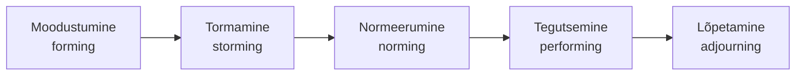
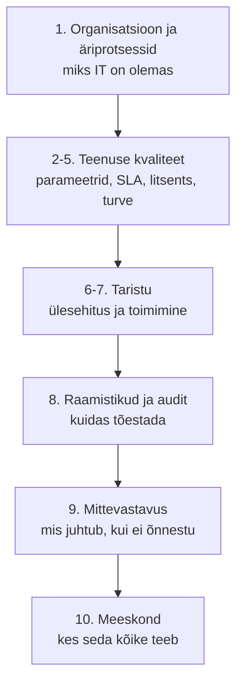

# 10. Meeskonna rollid ja kokkuvõte

::: info Õpiväljund
Pärast tundi oskad kirjeldada meeskonna kujunemise etappe, eristada meeskonnarolle ja IT-rolle ning jaotada vastutus RACI tabeliga (HK 1.6).
:::

Pärast reedeõhtust seisakut ütleb Tõnu: "Liis, see ei lähe nii. Sa oled üksi ja iga viga jõuab sinuni." Ta võtab tööle teise IT-inimese Marti ja otsustab, et Rasmus, Liis ja Mart on nüüd **IT-meeskond**. Esimesel nädalal läheb kõik halvasti. Mart küsib sama asja kolm korda, Rasmus ei teata, millal ta uuenduse avaldab, ja Liis teeb kõik ise ära, sest "nii on kiirem".

Kolmandal nädalal saabub hommikul kell 8:05 teade: e-pood ei vasta. Seekord teavad kõik, mida teha. Mart avab seire, Liis helistab hostimispakkujale, Rasmus kontrollib viimast uuendust. Kell 8:25 on teenus tagasi.

Mis muutus? **Meeskond kujunes.**

## Meeskonna kujunemise etapid

Psühholoog Bruce Tuckman kirjeldas 1960. aastatel, et enamik meeskondi läbib neli etappi (hiljem lisati viies). Need aitavad mõista, miks algus on tihti kehv.

| Etapp | Mis toimub | Liisi meeskonnas |
| --- | --- | --- |
| **Moodustumine** | Tutvutakse, rollid on ebaselged, ollakse viisakad | Mart küsib, kes mille eest vastutab |
| **Tormamine** | Tekivad vaidlused, rollid ja töövoog lähevad kokku | Rasmus ja Liis vaidlevad uuenduste aja üle |
| **Normeerumine** | Reeglid ja harjumused kujunevad | Kokkulepe: uuendused teisipäeviti, teade kanalis |
| **Tegutsemine** | Töö sujub, vastutus on selge | Hommikune intsident lahendatud 20 minutiga |
| **Lõpetamine** | Töö või meeskond laiali | Projekti lõpp, inimene lahkub |

Tähtis: **tormamine ei ole viga.** See on osa kujunemisest. Meeskond, kus keegi kunagi ei vaidle, ei ole tihti ühtne, vaid vaikne. Etapp läheb mööda, kui rollid ja reeglid on selged.

## Meeskonnaliikmete rollid

Meeskonnas ei ole kõik ühesugused. Meredith Belbin kirjeldas üheksa **meeskonnarolli**, mis tekivad meeskonnatöös ja mis täiendavad üksteist. Iga inimene kaldub mõne rolli poole.

| Rolli rühm | Roll | Mida teeb | Liisi meeskonnas |
| --- | --- | --- | --- |
| Tegevusrollid | **Kujundaja** | Surub edasi, tahab tulemust | Liis intsidendi ajal |
| | **Teostaja** | Muudab plaani tegudeks, kindel ja süsteemne | Mart: täidab juhendid täpselt |
| | **Viimistleja** | Märkab vigu ja detaile | Mart: kontrollib kontrollnimekirja |
| Inimrollid | **Koordinaator** | Jaotab ülesanded, juhib arutelu | Tõnu |
| | **Meeskonnatöötaja** | Hoiab meeskonnavaimu, lepitab | Kadri, kes seob IT ja äri |
| | **Ressursside otsija** | Leiab väliseid kontakte ja võimalusi | Liis, kes tunneb hostimispakkujat |
| Mõtterollid | **Idee looja** | Pakub uusi lahendusi | Rasmus |
| | **Hindaja** | Kaalub kriitiliselt valikuid | Tõnu, kui ostetakse uus server |
| | **Spetsialist** | Süvateadmised kitsal alal | Rasmus e-poe koodis |

Meeskond, kus on ainult ideeloojad, ei saa midagi valmis. Meeskond, kus on ainult teostajad, ei leiuta midagi uut. **Rollide mitmekesisus teeb meeskonna tugevaks.**

::: tip Kasutamine
Belbini rolle ei kasutata inimeste "sildistamiseks", vaid selleks, et saada aru, mis meeskonnas **puudu on**. Kui keegi ei ole viimistleja, hakkavad vead läbi minema.
:::

## IT-rollid teenuse osutamisel

Lisaks isikuomadustele on **ametirollid**. Väikeses ettevõttes teeb üks inimene mitut rolli, suures on need eri inimesed.

| Roll | Mida teeb | Pihlakas |
| --- | --- | --- |
| **Teenuse omanik** | Vastutab teenuse väärtuse ja kvaliteedi eest | Kadri (e-pood) |
| **Süsteemiadministraator** | Hooldab servereid ja võrku | Liis |
| **Arendaja** | Kirjutab ja avaldab rakenduse koodi | Rasmus |
| **IT-tugi** | Aitab kasutajaid | Mart |
| **Turbespetsialist** | Hindab riske ja jälgib turvameetmeid | Liis (lisaülesanne) |
| **Intsidendi juht** | Koordineerib intsidendi lahendust | Valvekorra järgi |
| **Juhtkond** | Seab eesmärgid, annab ressursid | Tõnu |

Märka, et Kadri on **teenuse omanik**, mitte IT inimene. Teenuse eest vastutab see, kes selle väärtust ärilises mõttes kannab. IT osutab teenust, aga äri omab seda. See seob meid [esimese kohtumisega](./kohtumine-01-organisatsioon-ja-it).

## RACI: kes mille eest vastutab

Kui kõik vastutavad, ei vastuta keegi. **RACI tabel** selgitab iga tegevuse kohta:

- **R** (*Responsible*): teeb tööd;
- **A** (*Accountable*): vastutab tulemuse eest, **ainult üks inimene** igal tegevusel;
- **C** (*Consulted*): küsitakse nõu;
- **I** (*Informed*): teavitatakse.

Pihlaka tegevuste RACI:

| Tegevus | Tõnu | Kadri | Liis | Rasmus | Mart |
| --- | --- | --- | --- | --- | --- |
| E-poe uue funktsiooni avaldamine | I | **A** | C | R | I |
| Serveri uuendus | I | I | **A** | C | R |
| Intsidendi lahendamine (kriitiline) | I | I | **A** | R | R |
| Kliendi teavitamine seisakust | I | **A**, R | C | I | I |
| Varukoopia taastamise katse | I | I | **A** | I | R |
| Litsentside uuendamine | **A** | C | R | I | I |

Iga rea kohta on **täpselt üks A**. Kui kahel inimesel on A, vaidlevad nad, kes vastutab. Kui keegi ei ole A, ei tee keegi midagi.

## Meeskond intsidendi ajal

Intsidendi ajal on meeskonna väärtus kõige selgem. Kolm head tava:

| Tava | Miks |
| --- | --- |
| **Üks juht** | Üks inimene koordineerib, teised teevad. Ei räägi kõik korraga |
| **Selge suhtlus** | Üks kanal, lühikesed teated: mis tehti, mis on järgmine |
| **Süüdlast ei otsita** | Hirm teha vigu paneb vigu varjama. Meeskond õpib ainult siis, kui julgeb rääkida |

Viimane seostub kohtumisega 7: tagantjärele analüüs küsib "miks süsteem seda lubas", mitte "kes eksis".

## Kokkuvõte kogu teemast

Kümne kohtumise jooksul oleme Liisiga liikunud:

| Küsimus | Vastus |
| --- | --- |
| Miks IT organisatsioonis on? | Toetab äriprotsesse (kohtumine 1) |
| Kuidas kvaliteeti mõõta? | Parameetrid: kättesaadavus, RTO, RPO (2) |
| Kuidas lubadust anda? | SLA, SLO, OLA, UC (3) |
| Mida õiguslikult jälgida? | Litsentsid ja autoriõigus (4) |
| Kuidas turvalisust hinnata? | Etalonturve ja kontrollnimekiri (5) |
| Millest teenus koosneb? | Taristu kihid, SPOF, redundantsus (6) |
| Kuidas see töötab? | Pilv, seire, intsident, muudatused (7) |
| Millega seda kirjeldada ja kontrollida? | Standardid, raamistikud ja audit (8) |
| Mida kaotame, kui ei õnnestu? | Otsene, lepinguline, kaudne kahju (9) |
| Kes seda teeb? | Meeskond ja rollid (10) |

Üks lause, mis kõik kokku võtab: **IT-töötaja töö ei ole serveri töös hoidmine, vaid äriprotsessi töös hoidmine, ja seda ei tee keegi üksi.**

## Lõpuülesanne: IT-teenuse kaart

Viimase kohtumise järel on sul valmis kõik osad. Koosta need **ühtseks dokumendiks** ja lisa viimane osa:

1. **Rollid:** tee oma teenuse jaoks RACI tabel vähemalt 5 tegevusele (iga rea kohta täpselt üks A).
2. **Meeskond:** kirjelda, mis etapis sinu (väljamõeldud) meeskond on, ja millist Belbini rolli sa ise tahaksid täita ning miks.
3. **Kokkuvõte:** kirjuta ühe lehekülje kokkuvõte, mis seob kõik kümme osa: **millist äriprotsessi teenus toetab, kui hea see peab olema, kuidas seda tõestatakse, mis juhtub rikke korral ja kes vastutab.**

Esitatava töö kontrollloend on [ülesannete lehel](./assignments#10).

## Allikad

- Tuckmani etapid (1965, lisaks 1977 viies etapp) ja Belbini üheksa meeskonnarolli on laialt tuntud meeskonnatöö teooriad. [Belbin (ametlik leht)](https://www.belbin.com/). Kontrollitud: Tuckmani neli etappi (1965) ja viies, lõpetamine (1977, koos Mary Ann Jensenga); Belbini üheksa rolli ja nende jaotus tegevus-, inimese- ja mõtterollideks.
- RACI on standardne vastutuse jaotamise tööriist projektijuhtimises.
- Süüdlast otsimata analüüs: [Google SRE raamat, Postmortem Culture](https://sre.google/sre-book/postmortem-culture/).
- Pihlaka meeskond on väljamõeldud.
