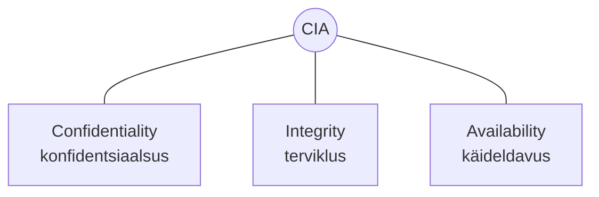
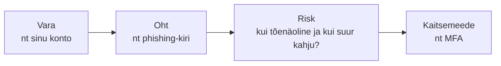

# Küberturvalisuse alused: CIA, risk, vara, oht

::: info Õpiväljund
Pärast õppetundi oskad selgitada CIA-mudelit ning kasutada mõisteid vara, oht ja risk.
:::

## Mis on küberturvalisus?

Küberturvalisus tähendab seadmete, võrkude ja andmete kaitsmist ligipääsu, kahjustamise või väärkasutuse eest. Selle alusmudel on nn **CIA-mudel** ([NIST-i](https://csrc.nist.gov/glossary/term/confidentiality_integrity_availability) ametlik definitsioon) — kolm eesmärki, mida turvameetmed püüavad tagada:

| Mõiste | Tähendus | Näide rikkumisest |
| --- | --- | --- |
| **Confidentiality** (konfidentsiaalsus) | Info on kättesaadav ainult neile, kellel on selleks õigus | Keegi loeb sinu e-kirju ilma loata |
| **Integrity** (terviklus) | Info on usaldusväärne ega ole loata muudetud | Keegi muudab sinu pangaülekande summat |
| **Availability** (käideldavus) | Info ja teenused on vajadusel kättesaadavad | Veebileht on ülekoormatud ega tööta |

## Vara, oht ja risk

Kolm mõistet, mida turvalisusest rääkides pidevalt kasutatakse:

- **Vara** (*asset*) — miski, mida kaitsta tasub: seade, konto, andmed.
- **Oht** (*threat*) — miski, mis võib varale kahju teha: pahavara, häkker, seadme kadumine.
- **Risk** — tõenäosus, et oht vara tegelikult tabab, korrutatud sellega, kui suur oleks kahju.

Näide: sinu Google'i konto on **vara**. Phishing-kiri, mis üritab su parooli välja meelitada, on **oht**. Kui sul pole MFA-d sisse lülitatud, on **risk** suurem — kui on, väheneb see.

## Kokkuvõte

| Mõiste | Tähendus |
| --- | --- |
| Confidentiality | Ainult õigustatud isikud pääsevad infole ligi |
| Integrity | Info pole loata muudetud |
| Availability | Teenus/info on vajadusel kättesaadav |
| Vara | Miski, mida kaitsta tasub |
| Oht | Miski, mis võib varale kahju teha |
| Risk | Tõenäosus × võimalik kahju |

## Allikad

- [NIST SP 800-12 — Confidentiality, Integrity, Availability](https://csrc.nist.gov/glossary/term/confidentiality_integrity_availability)
- [CISA — Secure Our World](https://www.cisa.gov/secure-our-world)
