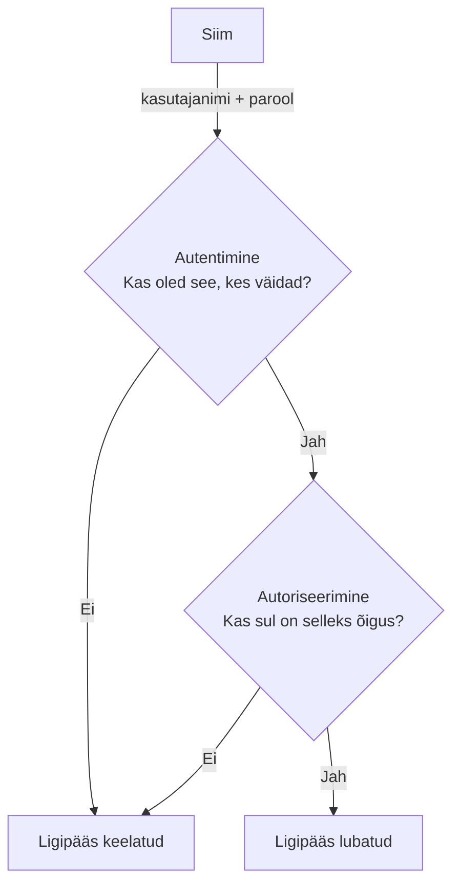

# Kontod, paroolid ja ligipääsuõigused

::: info Õpiväljund
Pärast peatüki lugemist oskad eristada autentimist ja autoriseerimist, rakendada paroolipoliitikat ja õiguste piiramist ning dokumenteerida tulemuse (HK 4.2).
:::

Siim alustab esmaspäeval. Tema arvutit valmistad ette sina. Esimene küsimus: **kuidas Siim sisse logib ja mida ta pärast sisselogimist tohib teha?**

## Kaks eri küsimust: kes sa oled ja mida tohid

Siim tuleb hommikul kontorisse. Uksel ootab turvamees.

1. Turvamees küsib: "Kes te olete?" Siim näitab ID-kaarti. See on **autentimine**.
2. Turvamees avab uksed ainult neile ruumidele, kuhu Siimul on luba: tööruum ja köök, aga mitte serveriruum. See on **autoriseerimine**.

| Mõiste | Küsimus | Siimu näide |
| --- | --- | --- |
| **Autentimine** (*authentication*) | Kes sa oled? | Sisestab kasutajanime ja parooli |
| **Autoriseerimine** (*authorization*) | Mida sul on lubatud teha? | Tohib lugeda müügi kausta, aga mitte kustutada |

Need kaks sammu käivad alati järjest. Esmalt tuleb tõestada, kes sa oled. Alles siis saab otsustada, mida tohid.

## Siimu parool: mida valida?

Siim mõtleb parooli välja. Ta tahab midagi, mida on kerge meeles pidada, ja valib `Siim2026!`. Ta arvab, et see on tugev, sest seal on suur täht, number ja sümbol.

Küsimus: kui kiiresti ründaja selle ära arvab? **Väga kiiresti.** Ründajad proovivad kõigepealt inimeste tavalisi variante: nime, aastat, sümbolit lõppu. `Siim2026!` on täpselt see muster.

Verizoni 2025. aasta andmelekete uuringu ([DBIR](https://www.verizon.com/business/resources/reports/dbir/)) järgi olid varastatud või nõrgad paroolid kõige levinum esimene sisenemistee andmelekete puhul. See ei ole teoreetiline oht, vaid üks sagedasemaid põhjusi, miks kontosid rünnatakse.

### Paroolipoliitika

**Paroolipoliitika** on organisatsiooni reeglid selle kohta, millised paroolid on lubatud. Sinu ülesanne IT-inimesena on need Siimu arvutis paika panna. Tänapäevased soovitused (NIST SP 800-63B-4) on osalt üllatavad:

| Soovitus | Põhjus Siimu näitel |
| --- | --- |
| **Pikkus** on olulisem kui keerukus | Fraas `kollane-kass-sööb-hommikul-kalja` on pikk, meeldejääv ja raskesti äraarvatav. `Siim2026!` on lühike ja ennustatav |
| Ära nõua kohustuslikku tähtede, numbrite ja sümbolite segu | See sunnib inimesi tegema ennustatavaid asendusi (`Parool1!`) |
| Ära nõua parooli perioodilist vahetamist ilma põhjuseta | Sagedane sundvahetus viib selleni, et Siim lisab lõppu `1`, `2`, `3`. Vaheta, kui on lekke kahtlus |
| Keela tuntud ja lekkinud paroolid | `parool123` on esimene, mida ründaja proovib |
| Luba kleepimine ja paroolihalduri kasutamine | Toetab pikki ja unikaalseid paroole |

Organisatsiooni seadistatavad reeglid on tavaliselt: minimaalne pikkus, lukustus mitme ebaõnnestunud sisselogimise järel, mitu viimast parooli on keelatud. Täpne seadistus sõltub süsteemist.

## Siim ei jaksa kümmet parooli meeles pidada: paroolihaldur

Siimul on tööl konto e-posti, arvutisse, raamatupidamisprogrammi ja veel kümnesse. Kui ta kasutab kõigis sama parooli, on tulemus: ühest teenusest lekib parool ja ründaja proovib seda automaatselt kõigil teistel.

Lahendus on **paroolihaldur**. See on programm, mis:

- genereerib iga konto jaoks oma, pika ja juhusliku parooli;
- mäletab neid kõiki sinu eest;
- täidab parooli ainult õigel veebilehel (see aitab ka andmepüügi vastu: võltsleht pole õige aadress, seega haldur ei täida).

Siim peab meeles pidama ainult **ühte peaparooli**, soovitatavalt pikka fraasi. Õppetöös kasutatakse paroolihaldurit **ainult testandmetega**. Päris paroole ei sisestata.

## Siimu parool on ikkagi kaotsi läinud: MFA

Oletame, et Siim sai siiski petetud ja kirjutas oma parooli andmepüügilehele. Ründaja tahab nüüd sisse logida. Kas ta saab?

Kui konto on kaitstud pelgalt parooliga, jah. Kui sisselogimine nõuab ka **teist tõendit**, siis ei.

**MFA** (*Multi-Factor Authentication*, mitmeteguriline autentimine) nõuab vähemalt kahte erinevat liiki tõendit.

| Tegur | Mis see on | Näide |
| --- | --- | --- |
| **Midagi, mida tead** | Saladus | Parool, PIN |
| **Midagi, mis sul on** | Füüsiline asi | Telefon, turvavõti, ID-kaart |
| **Midagi, mis sa oled** | Keha tunnus | Sõrmejälg, näotuvastus |

Ründaja on Siimu parooli saanud, kuid tal pole Siimu telefoni. Sisse ta ei pääse. MFA on üks lihtsamaid ja tõhusamaid samme, mida konto kaitseks teha.

MFA tugevus on erinev. Autentimisrakenduse kood ja riistvaraline turvavõti on tugevamad kui SMS. CISA soovitab kasutada tugevaimat saadaolevat varianti. Eestis on tuntud MFA-lahendused **ID-kaart** ja **Mobiil-ID**, kus üks tegur on füüsiline kaart (või SIM) ja teine PIN-kood.

## Siim tohib ainult seda, mida ta vajab: vähimad õigused

Siim on müügiosakonnas. Mari on raamatupidaja. Kes tohib mida?

| Kaust | Siim (müük) | Mari (raamatupidaja) |
| --- | --- | --- |
| Müügi pakkumised | Lugemine ja muutmine | Lugemine |
| Arved ja palgad | **Ligipääsu pole** | Lugemine ja muutmine |
| Serveri seadistus | **Ligipääsu pole** | **Ligipääsu pole** |

See on **vähimate õiguste põhimõte** (*least privilege*): igal kasutajal ja programmil on ainult need õigused, mida tema töö jaoks tingimata vaja on.

Miks? Kui Siimu konto satub ründaja kätte (andmepüük, nõrk parool), saab ta teha ainult seda, milleks Siimu kontol õigus oli. Mida väiksem õigus, seda väiksem kahju. Kui Siimul oleks täisõigus kõigele, saaks ründaja kustutada ka arved.

| Õigus | Tähendus |
| --- | --- |
| Lugemine | Saab faili avada ja vaadata |
| Muutmine | Saab faili sisu muuta |
| Kustutamine | Saab faili eemaldada |
| Haldus (admin) | Saab muuta teiste õigusi ja süsteemi seadistust |

Tavakasutaja töötab argipäeval **tavakonto** all, mitte administraatorina.

## Ülesanne: Siimu kasutaja

Sina oled firma IT-inimene ja valmistad Siimu konto ette. Siin on kolm analüüsiülesannet.

**A. Paroolipoliitika.** Firma poliitika on pikkus vähemalt 12 märki, ei nõuta sümbolite segu, lekkinud ja tuntud paroolid on keelatud. Otsusta iga parooli kohta, kas poliitika seda lubaks, ja põhjenda:

| Parool | Lubatud? | Põhjus |
| --- | --- | --- |
| `Siim2026!` | | |
| `kollane-kass-sööb-hommikul-kalja` | | |
| `parool123` | | |
| `Qw3!` | | |
| `JaanAastad1990` | | |

**B. Paroolihaldur ja MFA.** Siimu parool on lekkinud. Selgita oma sõnadega:

1. Mis on kaks tegurit, mida MFA nõuab?
2. Miks MFA kaitseb olukorras, kus ründaja teab Siimu parooli, aga tema telefoni ei ole?
3. Üks olukord, kus MFA üksi ei aita (nt kui Siim sisestab kinnituskoodi võltslehele). Mida ta peaks lisaks tegema?

**C. Õiguste piiramine.** Firmas on neli töötajat ja neli kausta. Vali igale töötajale iga kausta kohta **ligipääsuõigus**: ei ole ligipääsu, ainult lugemine või lugemine ja muutmine. Põhjenda, miks nii (vähimate õiguste põhimõte).

| Töötaja | `Lepingud` | `Palgad` | `Müügiaruanded` | `Üldinfo` |
| --- | --- | --- | --- | --- |
| Siim (müügiesindaja) | | | | |
| Jaan (raamatupidaja) | | | | |
| Mari (kontoriadministraator) | | | | |
| Juhataja | | | | |

**Kaitsmiseks:** ole valmis suuliselt selgitama oma vastuseid ja põhjendama, miks ühele töötajale piiratud õigused on ohutumad kui täisõigused.

## Kokkuvõte

| Mõiste | Tähendus |
| --- | --- |
| Autentimine | Kes sa oled? |
| Autoriseerimine | Mida tohid teha? |
| Paroolipoliitika | Organisatsiooni reeglid paroolide kohta |
| Paroolihaldur | Genereerib ja hoiab unikaalseid paroole |
| MFA | Sisselogimine nõuab vähemalt kahte erinevat tegurit |
| Vähimad õigused | Ainult need õigused, mida töö nõuab |

## Allikad

- [NIST SP 800-63B-4: Digital Identity Guidelines, Authentication](https://pages.nist.gov/800-63-4/sp800-63b.html)
- [CISA: Secure Our World, More than a password](https://www.cisa.gov/secure-our-world/turn-mfa)
- [Verizon 2025 Data Breach Investigations Report](https://www.verizon.com/business/resources/reports/dbir/)
