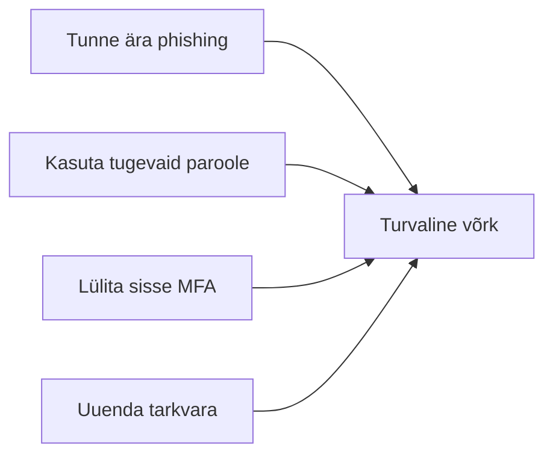

# Mini-capstone: turvaline väikevõrk

::: info Õpiväljund
Rakendad lihtsat turvakontrolli nimekirja kodu-, kooli- või väikese veebirakenduse stsenaariumile.
:::

See on aine viimane, kokkuvõttev tund. Ehitad edasi [tund 2](/arvutivorgud/vorguseadmed-ja-koduvork) koduvõrgu joonisele ja lisad sellele turvakihi.

## CISA nelja-osaline turvakontroll

USA küberturvalisuse agentuur CISA soovitab neli lihtsat, kõikjal rakendatavat sammu ([Secure Our World](https://www.cisa.gov/secure-our-world)):

1. **Tunne ära ja teavita phishingut** — vt [tund 8](/kuberturvalisus/phishing).
2. **Kasuta tugevaid, unikaalseid paroole** — vt [tund 7](/kuberturvalisus/paroolid-ja-mfa).
3. **Lülita sisse MFA** kõikjal, kus võimalik.
4. **Uuenda tarkvara** kohe, kui uuendus saadaval — vt [tund 9](/kuberturvalisus/pahavara-ja-uuendused).

## Projekt: rühmatöö

Rühmades (3–4 õpilast) koostage **plakat või slaid** "Turvaline kodu-/koolivõrk", mis sisaldab:

1. Lihtsat võrguskeemi (seadmed, ruuter, Wi-Fi — [tund 2](/arvutivorgud/vorguseadmed-ja-koduvork) stiilis, ilma päris paroolide/IP-de detailideta).
2. Vähemalt kolme konkreetset turvariski, mis seda võrku ohustavad ([tund 6](/kuberturvalisus/alused-cia-risk-oht)–[9](/kuberturvalisus/pahavara-ja-uuendused)).
3. Iga riski juurde vastavat kaitsemeedet.
4. Lühikest, 2–3-minutilist esitlust klassile.

::: tip Simulatsioon
Kui klassil on ligipääs [Cisco Packet Tracerile](https://www.cisco.com/site/us/en/learn/training-certifications/training/netacad/index.html), võib võrguskeemi asemel ehitada simuleeritud võrgu Packet Tracer'is.
:::

## Hindamiskriteeriumid

Disainireview toimub paarides (rühmad vaatavad üksteise plakateid üle ja annavad tagasisidet) — sarnaselt koodireview'le, aga disaini kohta.

| Kriteerium | Mida vaadatakse |
| --- | --- |
| **Teadmised** | Kas võrgu komponendid ja turvariskid on õigesti nimetatud? |
| **Oskused** | Kas skeem ja turvaplaan on selged ja loogilised? |
| **Hoiakud** | Kas lahendus arvestab digieetikat ja vastutustunnet? |

## Allikad

- [CISA — Secure Our World](https://www.cisa.gov/secure-our-world)
