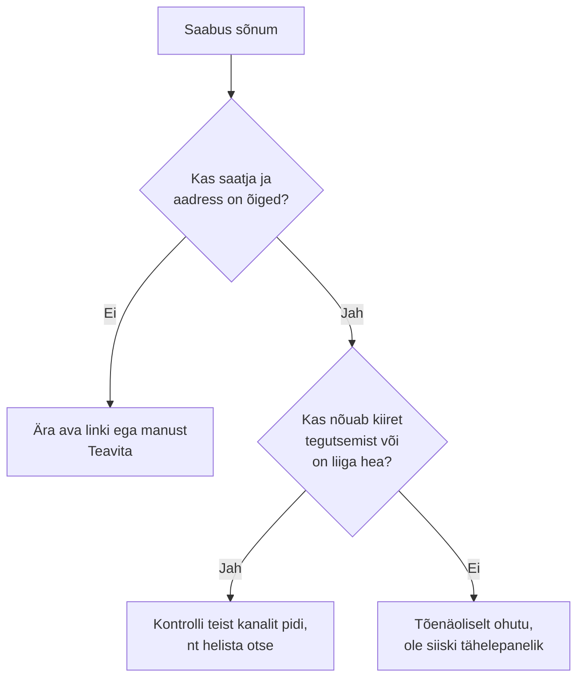
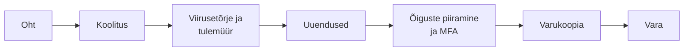

# Küberohud ja kaitsemeetmete valimine

::: info Õpiväljund
Pärast tundi oskad selgitada peamisi küberohte ja nende mõju organisatsioonile, seostada ohu, ebaturvalise seadistuse, tagajärje ja sobiva kaitsemeetme ning põhjendada, miks ühest meetmest ei piisa (HK 4.1).
:::

[Eelmises tunnis](./pohimoisted) õppisid mõisteid. Nüüd vaatame, kuidas ohud päriselt välja näevad. Kujutle halba nädalat Mari kontoris. Iga päev juhtub üks asi ja iga asi on üks küberoht.

## Esmaspäev: andmepüük

Mari saab e-kirja pealkirjaga "Teie arve on tasumata, tasuge täna". Saatja näib olevat tuttav tarnija. Kiri on kirjutatud viisakalt ja tal on lingi nupp "Vaata arvet". Mari klõpsab, lehel küsitakse e-posti parooli. Mari sisestab selle.

See on **andmepüük** (*phishing*). Ründaja teeskleb usaldusväärset saatjat (pank, kolleeg, tarnija), et sa ise annaksid talle parooli, makseandmed või installiksid pahavara. Probleem ei ole tehnikas, vaid **inimeses**: ründaja kasutab ära usaldust ja kiirustamist.

Hoiatusmärgid, mida Mari oleks pidanud märkama:

- saatja aadress on "peaaegu õige", kuid mitte päris;
- sõnum loob kiirustamise tunde ("tasuge täna");
- palve sisestada parool lingi kaudu;
- liiga hea pakkumine.

::: details Reaalne juhtum: üle 100 miljoni dollari võltsarvetega
Aastatel 2013–2015 saatis Leedu kodanik Evaldas Rimasauskas Google'ile ja Facebookile võltsitud arveid, esinedes nende tegeliku riistvaratarnija (Quanta Computer) nimel, koos võltsitud lepingute ja allkirjadega. Facebook maksis välja umbes **99 miljonit dollarit** ja Google umbes **23 miljonit dollarit**. Rimasauskas mõisteti 2019. aastal süüdi ja sai 5 aastat vangistust.

See näitab, et andmepüük ei ole ainult kohmakas "klõpsa siia" kiri. Ta võib olla hoolikalt ette valmistatud pettus, mis kasutab ära usaldust tuttava tarnija vastu.

*Allikad: [NPR](https://www.npr.org/2019/03/25/706715377/man-pleads-guilty-to-phishing-scheme-that-fleeced-facebook-google-of-100-million), [CNBC](https://www.cnbc.com/2019/03/27/phishing-email-scam-stole-100-million-from-facebook-and-google.html)*
:::

## Teisipäev: pahavara

Jaan laeb internetist tasuta PDF-redaktori. Programm töötab, kuid taustal installeerus ka midagi muud, mis jälgib klahvivajutusi ja saadab neid kuhugi. Jaan ei märka midagi.

See on **pahavara** (*malware*): tarkvara, mis on loodud seadet kahjustama, andmeid varastama või seadme üle kontrolli võtma, ilma et kasutaja sellest teaks. Liike on mitu:

| Liik | Mida teeb | Jaani juhtumis |
| --- | --- | --- |
| **Viirus** | Kleebib end teiste failide külge ja levib, kui fail avatakse | Nakatatud dokument |
| **Uss** (*worm*) | Levib ise võrgu kaudu, ilma kasutaja tegevuseta | Jaani arvutist teistesse kontori arvutitesse |
| **Troojalane** | Näeb välja kasuliku programmina, kuid teeb ka midagi muud | **See PDF-redaktor** |
| **Nuhkvara** (*spyware*) | Jälgib kasutajat ja saadab andmeid ründajale | Klahvivajutuste salvestaja |

## Kolmapäev: lunavara

Mari kaasa arvuti Windows on kaks aastat uuendamata, sest "uuendus võtab liiga kaua". Keskpäeval ilmub ekraanile teade: "Teie failid on krüpteeritud. Maksa 500 eurot, et saada võti."

See on **lunavara** (*ransomware*). Krüpteerib failid (vt [võtmed](./pohimoisted)) ja nõuab vabastamise eest raha. Ilma võtmeta andmeid tagasi ei saa. Kahju: tööseisak, kaotatud failid, sageli ka maksmise surve.

::: details Reaalne juhtum: WannaCry (2017)
12. mail 2017 levis lunavara **WannaCry** ühe nädalavahetusega üle 200 000 arvutisse enam kui 100 riigis. Ühendkuningriigi tervishoiusüsteem NHS sai tugevalt kannatada: mõjutatud oli 81 asutust 236-st, lisaks 603 muud organisatsiooni (sh 595 perearstikeskust), ja tühistati hinnanguliselt ~20 000 vastuvõttu ja operatsiooni.

Riigikontrolli (National Audit Office) analüüs tõi peapõhjusena välja, et mõjutatud organisatsioonid kasutasid **uuendamata või toetuseta jäänud Windowsi versioone**. Süsteeme, kuhu parandus oli juba paigaldatud, pahavara ei kahjustanud.

*Allikas: [UK National Audit Office](https://www.nao.org.uk/reports/investigation-wannacry-cyber-attack-and-the-nhs/)*
:::

Mari juhtumi õppetund on sama kui NHS-il: uuendus ei ole tüütus, vaid kaitse. Aga ka varukoopia on kaitse: kui failid on mujal alles, ei pea lunaraha maksma.

## Neljapäev: DDoS

Firma veebipood on Black Fridayl äkki kättesaamatu. Server ei jaksa vastata, sest sellele tuleb korraga tuhandeid päringuid. Päris kliendid ei pääse ligi.

See on **DDoS** (*Distributed Denial of Service*, hajutatud teenusetõkestusrünne). Ründaja saadab teenusele korraga nii palju päringuid, et see ei jaksa. Päringud tulevad tuhandetelt või miljonitelt nakatunud seadmetelt ehk **robotvõrgust** (*botnet*). Rikutakse CIA kolmnurgast **käideldavust**.

Kujutle poodi, kuhu astub korraga tuhat inimest, kes midagi ei osta, ja päris kliendid ei mahu sisse.

::: details Reaalne juhtum: Eesti 2007
27. aprillil 2007 algasid Eestis ulatuslikud DDoS-rünnakud, mis kestsid mitu nädalat. Löögi all olid valitsuse, parlamendi, ministeeriumide, pankade, telekomioperaatorite ja meediaväljaannete veebilehed. Rünnakuks kasutati väga suurt hulka nakatunud arvuteid. Juhtum tõi Eesti küberkaitse maailma tähelepanu keskmesse ja NATO küberkaitse kompetentsikeskus (CCDCOE) asutati Tallinnas 2008. aastal.

*Allikad: [CCDCOE](https://cyberlaw.ccdcoe.org/wiki/Cyber_attacks_against_Estonia_(2007)), [Wikipedia](https://en.wikipedia.org/wiki/2007_cyberattacks_on_Estonia)*
:::

## Reede: seadistusviga, mis kõike võimaldas

Reedel uurib IT-inimene (sina), kuidas ründajad sisse said. Selgub, et kõik algas **kontori ruuterist**: tema haldusparool oli `admin`, nagu tehasest tulnud. Ründaja logis sisse, muutis DNS-i seadistust ja suunas kontori töötajad võltslehtedele.

Paljud rünnakud ei vaja nutikat ründajat, vaid **ebaturvalist seadistust**. Need vead tekivad nii tarkvaras kui riistvaras.

| Seadistusviga | Näide | Võimalik tagajärg |
| --- | --- | --- |
| Tehaseparool jäetud muutmata | Ruuteri haldusparool `admin` | Võõras saab ruuteri üle kontrolli |
| Uuendamata tarkvara või püsivara | Vana Windows, vana ruuteri püsivara | Teadaolevat viga saab ära kasutada |
| Mittevajalikud teenused lahti | Kaughaldus avatud internetti | Rohkem sihtmärke ründajale |
| Liiga laiad õigused | Kõik töötajad näevad palgafaili | Andmeleke |
| Avatud, kaitsmata Wi-Fi | Külalistele ja töötajatele sama võrk | Pealtkuulamine, ligipääs sisevõrku |

::: details Reaalne juhtum: Mirai ja tehaseparoolid (2016)
Pahavara **Mirai** otsis internetist seadmeid (ruuterid, kaamerad), mis lubasid kaugsisselogimist, ja proovis sisse logida lühikese loendiga tehase kasutajanimesid ja paroole (teadlaste uurimuse järgi 62 paari, nagu `admin`/`12345`). Nakatunud seadmetest ehitati robotvõrk, millega korraldati 2016. aasta oktoobris suuri DDoS-rünnakuid, sealhulgas DNS-teenuse pakkuja Dyn vastu, mis tegi suure osa USA ja Euroopa populaarsetest teenustest ajutiselt kättesaamatuks. CISA soovitus oli muuta tehaseparoolid tugevateks.

Teisisõnu: DDoS-i põhjuseks oli riistvara seadistusviga, mida keegi polnud parandanud.

*Allikad: [CISA TA16-288A](https://www.cisa.gov/news-events/alerts/2016/10/14/heightened-ddos-threat-posed-mirai-and-other-botnets), [Antonakakis jt, USENIX Security 2017](https://faculty.cc.gatech.edu/~mbailey/publications/usesec17_mirai.pdf)*
:::

## Nädala kokkuvõte: ohust meetmeni

Mari nädal näitab, kuidas oht, nõrkus, tagajärg ja meede kokku käivad:

| Päev | Oht | Nõrkus | Mõju | Sobivad meetmed |
| --- | --- | --- | --- | --- |
| Esmaspäev | Andmepüük | Töötaja usaldus ja kiirustamine | Parool kaotatud | Koolitus, MFA, teise kanali kontroll |
| Teisipäev | Pahavara | Allalaadimine ebausaldusväärsest kohast | Andmete vargus | Viirusetõrje, uuendused, õiguste piiramine |
| Kolmapäev | Lunavara | Uuendamata süsteem | Failid krüpteeritud, tööseisak | Uuendused, varukoopia |
| Neljapäev | DDoS | Avatud teenus, ülekoormus | Teenus ei tööta | Tulemüür, teenusepakkuja kaitse |
| Reede | Seadistusviga | Tehaseparool ruuteril | Loata ligipääs | Seadistuse kontroll, uuendused, õigused |

## Miks ühest meetmest ei piisa?

Mari nädalas ei oleks ükski üksik meede kõike peatanud:

- viirusetõrje ei tunne uut pahavara;
- koolitus ei välista, et keegi siiski klõpsab;
- uuendus jõuab kohale hilinemisega.

Seepärast kasutatakse mitut **kaitsekihti** (*defense in depth*). Kui üks kiht ei pea, püüab järgmine. Näiteks kui Mari kirjutas parooli andmepüügilehele, aga kontol on MFA, ei pääse ründaja siiski sisse.

## Praktiline töö: juhtumianalüüs

Õpetaja annab lühikesed juhtumid tarkvara ja riistvara kohta (samas stiilis nagu Mari nädal). Igaühe kohta:

1. Nimeta **oht** ja **ebaturvaline seadistus**.
2. Kirjelda **tagajärg** organisatsioonile.
3. Vali **vähemalt kaks sobivat meedet** ja põhjenda, miks.
4. Selgita, miks **ühest meetmest ei piisa**.

Täienda eelmise tunni riskitabelit uute ridadega, nii et see hõlmaks nii tarkvara kui riistvara.

**Esitatav töö:** täiendatud riskitabel. **Seos: HK 4.1.**

## Kokkuvõte

| Oht | Lühidalt |
| --- | --- |
| Andmepüük | Petab kasutajat ise andmeid andma |
| Pahavara | Kahjulik tarkvara (viirus, uss, troojalane, nuhkvara) |
| Lunavara | Krüpteerib failid ja nõuab raha |
| DDoS | Ülekoormab teenuse, rikub käideldavust |
| Seadistusviga | Ebaturvaline vaikeseadistus, vana püsivara, laiad õigused |

## Allikad

- [UK National Audit Office: WannaCry cyber attack and the NHS](https://www.nao.org.uk/reports/investigation-wannacry-cyber-attack-and-the-nhs/)
- [CISA: Secure Our World](https://www.cisa.gov/secure-our-world)
- [Cloudflare Learning: What is a DDoS attack?](https://www.cloudflare.com/learning/ddos/what-is-a-ddos-attack/)
- [CCDCOE: Cyber attacks against Estonia (2007)](https://cyberlaw.ccdcoe.org/wiki/Cyber_attacks_against_Estonia_(2007))
