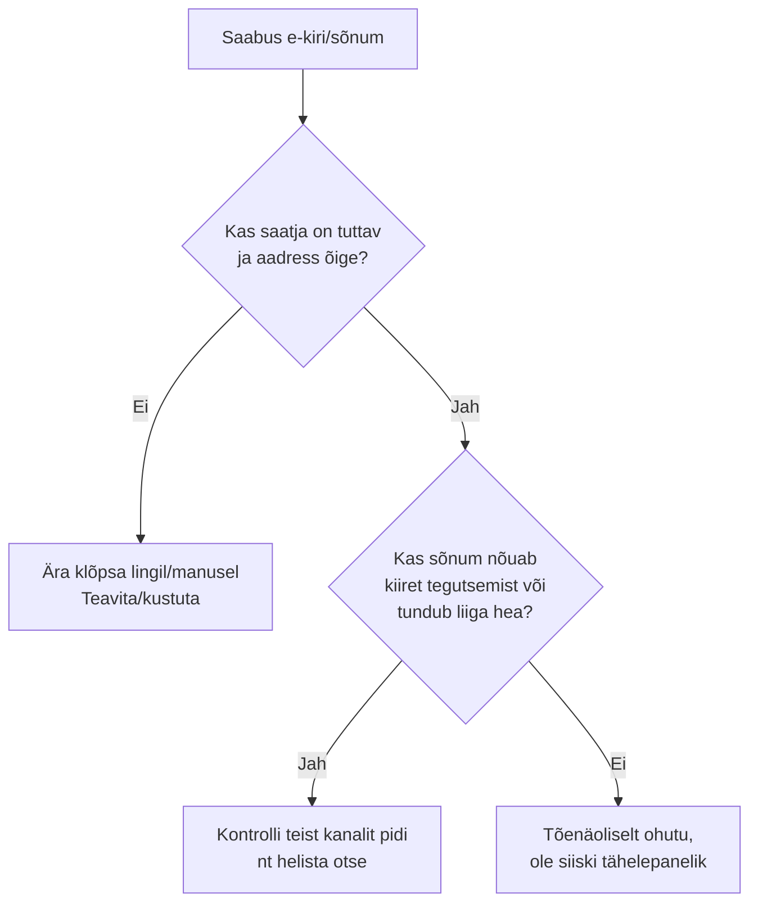

# Phishing ja sotsiaalne manipulatsioon

::: info Õpiväljund
Pärast õppetundi oskad ära tunda kahtlaseid sõnumeid ja selgitada, miks phishing töötab.
:::

## Mis on phishing?

**Phishing** (häälduses "fishing" — "õngitsemine") on katse petta sind avaldama isiklikku infot (paroole, pangaandmeid) või klõpsama kahjulikul lingil/manusel, teeseldes, et saatja on keegi usaldusväärne — pank, kolleeg, tuttav teenus.

Levinud hoiatusmärgid:

- saatja on tundmatu või aadress näeb "peaaegu õige" välja;
- sõnum loob kiireloomulisuse tunde ("tegutse kohe, muidu...");
- pakkumine tundub liiga hea, et olla tõsi;
- sind palutakse sisestada parool või muu tundlik info lingi kaudu.

## Phishing ei ole alati "ilmselge"

Levinud eeldus on, et phishing näeb alati välja nagu kohmakas kirjavigadega e-kiri. Tegelikkuses võib see olla väga professionaalselt ette valmistatud.

::: details Reaalne juhtum: 99 miljonit dollarit võltsarvete eest
Aastatel 2013–2015 saatis Leedu kodanik Evaldas Rimasauskas Google'ile ja Facebookile võltsitud arveid, esinedes nende reaalse riistvaratarnija (Quanta Computer) nimel — täiendatud võltsitud lepingute, allkirjade ja pitseritega. Ettevõtted maksid arved välja, kaotades kokku **99 miljonit dollarit (Facebook)** ja **23 miljonit dollarit (Google)**, enne kui pettus avastati. Rimasauskas mõisteti 2019. aastal süüdi ja sai 5-aastase vanglakaristuse.

See juhtum näitab, et phishing ei pea olema lihtne "klõpsa siia" kiri — see võib olla põhjalikult ette valmistatud äriline pettus, mis kasutab ära seda, et raamatupidamises usaldatakse tuttava tarnija nime.

*Allikad: [NPR (2019)](https://www.npr.org/2019/03/25/706604819/employee-of-facebook-and-google-scammer-pleads-guilty), [CNBC (2019)](https://www.cnbc.com/2019/03/25/man-who-stole-100-million-from-google-and-facebook-pleads-guilty.html)*
:::

## Kokkuvõte

| Hoiatusmärk | Miks kahtlane |
| --- | --- |
| Tundmatu või "peaaegu õige" saatja aadress | Petturid jäljendavad tuntud nimesid |
| Kiireloomulisus, surve kohe tegutseda | Loob paanika, mis takistab järelemõtlemist |
| Liiga hea, et tõsi olla | Petukiri kasutab ahnust/uudishimu ära |
| Palve sisestada parool lingi kaudu | Legitiimne teenus ei küsi seda tavaliselt e-kirja teel |

## Allikad

- [CISA — Secure Our World](https://www.cisa.gov/secure-our-world)
- [Google — Be Internet Awesome](https://beinternetawesome.withgoogle.com/)
