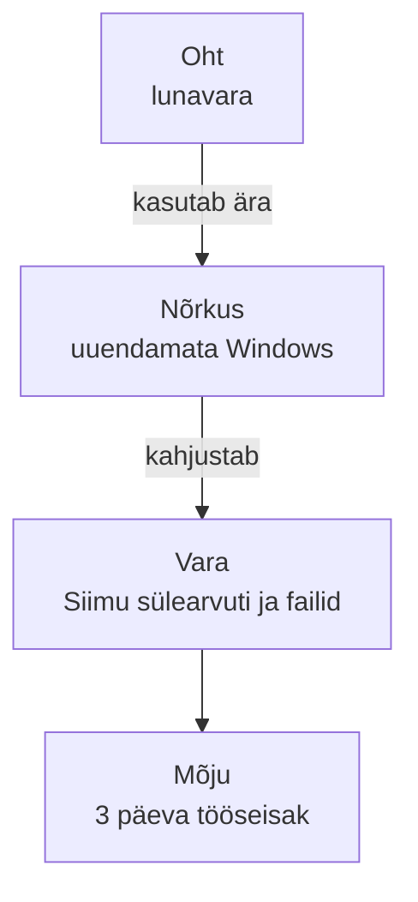
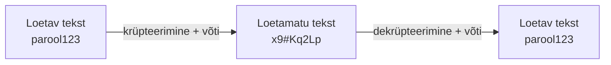

# Küberturvalisuse põhimõisted

::: info Õpiväljund
Pärast peatüki lugemist oskad kasutada küberturvalisuse põhimõisteid õigesti ja koostada lihtsa riskitabeli (HK 4.1).
:::

## Siim alustab esmaspäeval

Selle osa läbiv küsimus on: **kuidas arvutit ja kontorit kaitsta?** Läbiv lugu on järgmine.

Mari firmasse (20 töötajat, väike kontor) tuleb esmaspäeval uus töötaja Siim. Sinu ülesanne, kui oled firma IT-inimene, on **valmistada Siimu arvuti ja kontorivõrk ette nii, et seda oleks turvaline kasutada**. Selle osa lõpuks oled seda ka tegelikult teinud.

Alustada tuleb mõistetest. Neid on viis ja need käivad alati koos.

## Vara, oht, nõrkus, risk ja mõju

Kujutle Siimu esimest päeva ja küsi ennast: mis võib valesti minna?

| Mõiste | Tähendus | Siimu näites |
| --- | --- | --- |
| **Vara** (*asset*) | Miski, mida tasub kaitsta | Siimu sülearvuti, tema e-post, kliendiandmed, mida ta kasutama hakkab |
| **Oht** (*threat*) | Miski, mis võib varale kahju teha | Pahatahtlik e-kiri, lunavara, kadunud sülearvuti |
| **Nõrkus** (*vulnerability*) | Puudus, mida oht ära kasutab | Uuendamata Windows, nõrk parool, tehaseparooliga ruuter |
| **Risk** | Kui tõenäoline on, et oht nõrkust ära kasutab, ja kui suur oleks kahju | "Uuendamata Windows ja lunavara: tõenäoline ja kahju suur" |
| **Mõju** (*impact*) | Mida organisatsioon kaotab, kui see juhtub | Kolm päeva tööseisak, klientide andmete leke, trahv |

Mõiste "risk" tähendab alati **kahte asja korraga**: kui tõenäoline on, et see juhtub ja kui suur on mõju. Tavaline rämpspost juhtub iga päev, kuid ei tee kahju (väike mõju). Serveri kaotus ilma varukoopiata juhtub harva, aga laastaks firma (suur mõju). Mõlemad on risk, aga erineva suurusega.

### Riskitabel Siimu arvuti jaoks

Riskitabel paneb selle kõik ühte kohta. Annad tõenäosusele ja mõjule hinnangud 1 (madal) kuni 3 (kõrge) ja korrutad:

| Vara | Oht | Nõrkus | Tõenäosus | Mõju | Risk | Meede |
| --- | --- | --- | --- | --- | --- | --- |
| Siimu sülearvuti | Lunavara | Uuendamata Windows | 2 | 3 | **6** | Automaatsed uuendused, varukoopia |
| Kontori ruuter | Loata ligipääs | Tehaseparool | 3 | 3 | **9** | Muuda haldusparool |
| Siimu e-post | Andmepüük | Töötaja ei oska kahtlast kirja tuvastada | 3 | 2 | **6** | Koolitus, MFA |

Hinnangud on subjektiivsed, aga tabel sunnib mõtlema ja näitab, **millega alustada**. Tähtsaim risk (9) on ruuter, seega algab töö sealt.

## CIA: mida me tegelikult kaitseme?

Turvalisus tähendab kolme asja korraga. Kujutle kolme olukorda Mari kontoris:

| Olukord | Mis rikuti | CIA osa |
| --- | --- | --- |
| Praktikant avab kogemata raamatupidaja palgafaili ja loeb teiste palku | Infot nägi see, kellel pole õigust | **Konfidentsiaalsus** |
| Keegi muudab arvel pangakonto numbrit ja raha läheb valesse kohta | Info on muudetud loata | **Terviklikkus** |
| Firma veebipood ei avane, sest server on ülekoormatud | Teenus pole kättesaadav | **Käideldavus** |

Ingliskeelsetest nimedest tuleb lühend **CIA** (*Confidentiality, Integrity, Availability*). Definitsioon pärineb [NIST-i sõnastikust](https://csrc.nist.gov/glossary/term/confidentiality_integrity_availability). Iga turvameede kaitseb vähemalt üht neist kolmest.

## Krüptograafia ja võtmed: kuidas Siim kohvikus töötab

Siim töötab kord kohvikus avalikus Wi-Fi-s ja sisestab oma e-posti parooli. Keegi sama võrgu kasutaja kuulab liiklust pealt. Mida ta näeb?

Kui ühendus on **krüpteeritud**, näeb ta ainult loetamatut märgirodu. Parooli ei näe.

**Krüptograafia** on andmete kaitsmise viis. Loetav tekst (*plaintext*) muudetakse **krüpteerimisega** loetamatuks (*ciphertext*). Tagasi saab seda teha vaid see, kellel on õige **võti**.

**Krüptograafiline võti** on pikk salajane (või avalik) number, mis krüpteerimist juhib. Mõtle võtmest nagu lukk ja võti: lukk (algoritm) võib olla kõigile teada, kuid turvalisus sõltub sellest, et **võti on salajane**. Kui võti varastatakse, on kaitse kadunud.

| Tüüp | Võtmed | Mari kontoris |
| --- | --- | --- |
| **Sümmeetriline** | Üks ühine võti, sama sulgeb ja avab | Sülearvuti ketta krüpteerimine: ainult Siimu parool avab |
| **Asümmeetriline** | Avalik võti krüpteerib, salajane võti dekrüpteerib | HTTPS: brauser ja server leppivad kokku turvalise ühenduse |

Kui brauseri aadressiribal on `https://` ja lukk, on Siimu ja serveri vaheline liiklus krüpteeritud. Kohviku pealtkuulaja näeb ainult tähemärkide pudru. Matemaatikat me ei õpi. Oluline on mõista: **krüpteering kaitseb andmeid, kuid ainult nii hästi kui võtmeid hoitakse**.

## Parool

**Parool** on saladus, mis tõendab, et oled see, kes väidad end olevat. Parool on ka krüptograafia osa, sest paljud süsteemid kasutavad sinu parooli, et sinu andmeid krüpteerida. Tugevast paroolist räägime [kontode peatükis](./kontod-ja-oigused).

## Kolme mütsiga häkkerid

Kujutle, et kolm erinevat inimest märkab, et firma veebiserveri uks on valesti seadistatud ja jätab andmed ligipääsetavaks.

| Müts | Mida ta teeb | Hinnang |
| --- | --- | --- |
| **Valge** (*white hat*) | Teatab firmale: "Teil on siin auk, parandage." Või tegutseb firma eelneval kirjalikul loal | Lubatud |
| **Hall** (*grey hat*) | Kontrollib auku oma algatusel, **ilma loata**, ja teatab sellest hiljem. Hea kavatsusega, kuid ikka luba puudu | Ebaseaduslik |
| **Must** (*black hat*) | Võtab andmed ja müüb või kasutab neid enda kasuks | Kuritegu |

Sõna "häkker" ise tähendab inimest, kes süsteeme sügavalt mõistab. Mütsivärv kirjeldab, mida ta teeb ja kas tal on luba.

::: warning Hea kavatsus ei muuda lubamatut tegevust lubatuks
Süsteemi testimine ilma omaniku selge loata on ebaseaduslik, ka heade kavatsuste korral. Seepärast on selle materjali ülesanded analüüsiülesanded ja ära proovi kunagi võõrast süsteemi.
:::

## Nullpäeva haavatavus: kui parandust veel pole

Teisipäeva hommikul avalikustatakse tarkvaravea kohta, mida ründajad juba ära kasutavad. Tarkvara tootja kuuleb sellest samal päeval ja parandust veel ei ole.

Seda nimetatakse **nullpäeva haavatavuseks** (*zero-day*). Nimi tähendab, et tootjal oli vea parandamiseks "null päeva" aega, enne kui seda ära kasutama hakati.

Näide: detsembris 2021 avalikustati laialt kasutatud Java-teegis Apache Log4j haavatavus (**Log4Shell**, CVE-2021-44228). Ründajad hakkasid seda koheselt ära kasutama, enne kui kõik süsteemid jõudsid parandust saada.

Mida firma sellises olukorras teeb? Paigaldab uuenduse nii kiiresti kui võimalik. Kui parandust veel pole, rakendab ajutise leevenduse (nt keelab ohtliku funktsiooni). Sellepärast ei piisa ühest kaitsest. Sellest räägime [järgmises peatükis](./ohud).

## Läbistustestimine: kontrollitud rünnak

Mari ülemus mõtleb: "Kuidas me teame, et meie kaitse toimib?" Ta palkab firma, kes **proovib tema süsteemi sisse murda**, aga seadusliku loaga.

**Läbistustestimine** (*penetration testing*, "pentest") on kokkulepitud ja kontrollitud katse süsteemi nõrkusi leida, enne kui seda teeb päris ründaja. Valge mütsi töö. Ründest eristab seda kolm asja:

1. **Luba:** omanik on kirjalikult nõus.
2. **Ulatus:** on kokku lepitud, mida võib testida (nt ainult kindlad serverid, kindel ajavahemik).
3. **Aruanne:** leiud dokumenteeritakse, et neid saaks parandada.

Selles kursuses ründevahendeid ei kasutata. Mõiste tundmine aitab mõista, kuidas organisatsioonid oma kaitset kontrollivad.

## Ülesanne: kolm olukorda, üks riskitabel

Siin on kolm lühikest olukorda Mari firmast. Loe need ja vasta igaühe kohta ülaltoodud mõistetega.

**Olukord A.** Failiserveris on kaust `Palgad`. Seadistus on selline, et kõik 20 töötajat saavad kausta lugeda ja ka muuta.

**Olukord B.** Siim kasutab firma e-posti jaoks sama parooli, mis ühes väikeses internetipoes. Pood teatab andmelekkest ja lekkinud paroolid on avalikud.

**Olukord C.** Firma on kogunud kontori Wi-Fi paroolid ühte tabelisse, mida hoitakse kõigile avatud ühiskaustas.

Igaühe kohta vasta:

1. Mis on **kaitstav vara**?
2. Milles seisneb **nõrkus**?
3. Mis **oht** seda ära kasutaks?
4. Mis oleks **mõju** organisatsioonile?
5. Milline CIA osa rikutaks?

Seejärel otsusta kahe tegevuse kohta, kas see on **lubatud turvatestimine** või **loata tegevus**, ja põhjenda:

- **X.** Firma tellib turvafirmalt kirjaliku lepinguga kontori Wi-Fi turvalisuse kontrolli. Leping nimetab testitava võrgu ja ajavahemiku.
- **Y.** Jaan proovib õhtul omal algatusel firma serveri sisselogimisparoole, "et näha, kas need on tugevad". Kellelegi ta ei ütle.

**Kaitsmiseks:** koosta oma märkmetesse riskitabel olukordade A, B ja C kohta (vara, oht, nõrkus, tõenäosus, mõju, risk, meede). Ole valmis seda õpetajale suuliselt selgitama.

## Kokkuvõte

| Mõiste | Tähendus |
| --- | --- |
| CIA | Konfidentsiaalsus, terviklus, käideldavus |
| Vara, oht, nõrkus | Mida kaitsta, mis ähvardab, mis seda võimaldab |
| Risk | Tõenäosus ja mõju koos |
| Krüptograafia | Andmete muutmine võtmega loetamatuks |
| Võti | Salajane (või avalik) number, mis juhib krüpteerimist |
| Valge / hall / must müts | Luba ja kavatsus |
| Nullpäeva haavatavus | Parandamata viga, mida juba ära kasutatakse |
| Läbistustestimine | Lubatud ja piiritletud turvatest |

## Allikad

- [NIST Glossary: Confidentiality, Integrity, Availability](https://csrc.nist.gov/glossary/term/confidentiality_integrity_availability)
- [CISA: Secure Our World](https://www.cisa.gov/secure-our-world)
- [CISA: Apache Log4j Vulnerability Guidance](https://www.cisa.gov/news-events/news/apache-log4j-vulnerability-guidance)
- [NCSC: Penetration testing](https://www.ncsc.gov.uk/guidance/penetration-testing)
