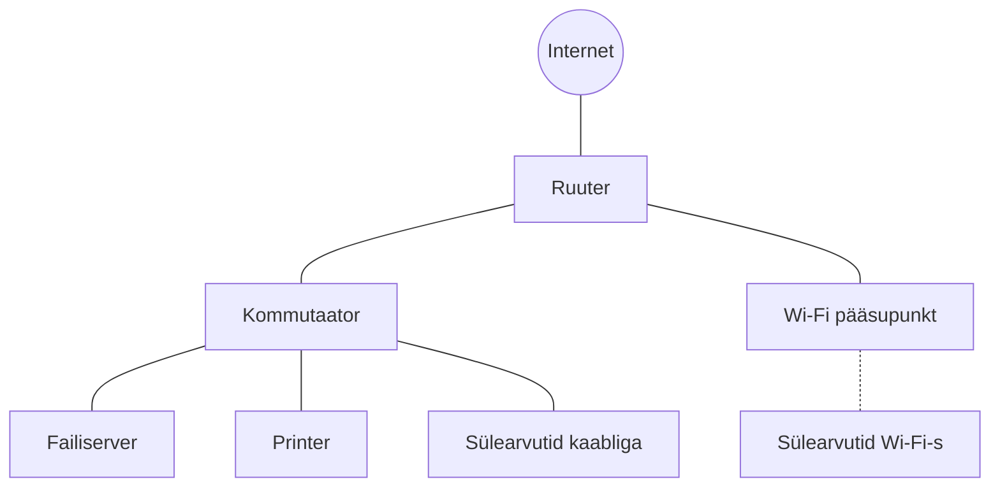

# Sissejuhatus küberturvalisusesse

::: info Õpiväljund
Selgitad küberturbe riske ja häid tavasid nii tarkvara kui riistvara konfigureerimisel.
:::

See on **eraldiseisev lugemismaterjal**, mida saad läbida iseseisvalt, ilma et peaksid enne läbima võrgutunde. Vajalikud võrgumõisted on tekstis lühidalt selgitatud. Kui tahad neist rohkem teada, vaata [Arvutivõrkude teemat](/arvutivorgud/sissejuhatus).

## Läbiv lugu: Mari kontor ja uus töötaja Siim

**Mari** töötab väikeses firmas, kus on 20 töötajat ja üks kontor. Kontoris on:

- 20 sülearvutit (osa kaabliga, osa Wi-Fi-s);
- üks printer;
- üks failiserver, kus hoitakse firma dokumente;
- kommutaator, mis ühendab kaabliga seadmed;
- Wi-Fi pääsupunkt;
- ruuter, mis ühendab kontori internetiga.

Esmaspäeval alustab firmas uus töötaja **Siim**. **Sina oled firma IT-inimene.** Sinu ülesanne on valmistada Siimu arvuti ja kontori võrk ette nii, et neid oleks turvaline kasutada. Selle käigus kohtud ka Mari halva nädalaga, kus iga päev juhtub üks küberoht.

Mari ja Siimu nimed, aadressid ja arvud on väljamõeldud.

## Peatükid

| Peatükk | Teema | Ülesanne | Seos |
| --- | --- | --- | --- |
| 1 | [Küberturvalisuse põhimõisted](./pohimoisted) | Riskitabel | HK 4.1 |
| 2 | [Küberohud ja kaitsemeetmete valimine](./ohud) | Täiendatud riskitabel | HK 4.1 |
| 3 | [Kontod, paroolid ja ligipääsuõigused](./kontod-ja-oigused) | Paroolipoliitika ja õiguste protokoll | HK 4.2 |
| 4 | [Tööarvuti turvaseadistused](./tooarvuti-turvaseadistused) | Tööprotokoll | HK 4.2 |
| 5 | [Riistvara turvaline seadistamine](./ruuteri-turvaline-seadistamine) | Ruuteri seadistusprotokoll | HK 4.1 ja 4.2 |
| 6 | [Kokkuvõttev praktiline hindamine](./lopphindamine) | Individuaalne tõendus | HK 4.1 ja 4.2 |

Ülesannete kokkuvõte on [ülesannete](./assignments) lehel. Ülesanded on analüüsiülesanded, mida kaitsed lõpuks suuliselt õpetajale.

Lugemise järjekord on oluline: iga peatükk toetub eelmisele.

## Kuidas turvameetmest mõelda?

Iga turvameetme juures küsi endalt kuus küsimust: mis on algseis, mis on risk ja mõju, mida muudaksid, kuidas kontrolliksid tulemust, mis on oodatav tulemus ja mis oleks tõend. Hea riskikirjeldus ei asenda tegemist ja tehtud töö ei asenda kontrolli. Neid küsimusi kasutad ka ülesannete kaitsmisel.

## Sügavuse piirid

| Teema | Piisav sügavus |
| --- | --- |
| Krüptograafia | Mõistad krüpteerimise ja võtme eesmärki. Algoritmide matemaatikat ei õpi |
| Nullpäeva haavatavus ja läbistustestimine | Selgitad mõisteid ning loa ja ulatuse tähtsust. Ründevahendeid ei kasutata |
| Turvameetmed | Rakendad lihtsad meetmed, kontrollid toimimist ja põhjendad tehtut |

## Seos teiste teemadega

Serveri tulemüüri ja kaugligipääsu kohta loe [Serverid ja võrgud](/serverid-ja-vorgud/sissejuhatus) teemast.
