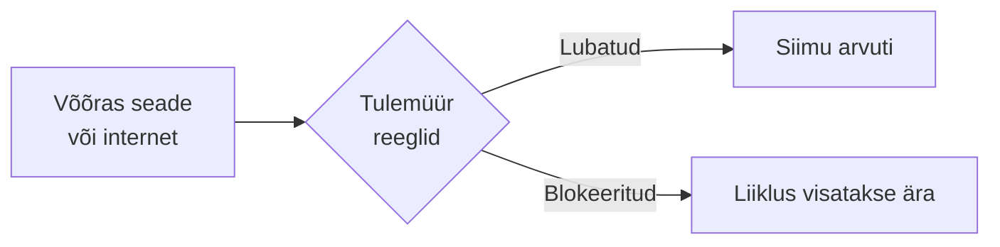

# Tööarvuti turvaseadistused

::: info Õpiväljund
Pärast tundi oskad kontrollida ja seadistada tööarvuti põhilisi turvameetmeid (uuendused, viirusetõrje, tulemüür, automaatne lukustus) ning koostada tööprotokolli (HK 4.2).
:::

Siimu konto on [eelmises tunnis](./kontod-ja-oigused) seadistatud. Nüüd on tema **arvuti** kord. Uue töötaja arvuti on valmis alles siis, kui sellel on põhilised turvameetmed sees ja need on **kontrollitud**. Seadistamine ilma kontrollimiseta ei tõesta midagi.

Mõtle neljale olukorrale, mis Siimu esimesel kuul juhtuvad. Iga olukord vajab oma meedet.

## Olukord 1: "Uuendus võtab liiga kaua, teen hiljem"

Siim töötab. Ekraani nurka ilmub teade: "Windowsi uuendus on saadaval." Ta vajutab "Hiljem". Järgmisel päeval samamoodi. Ja järgmisel.

Tarkvaras leitakse pidevalt vigu. Kui viga on turvaviga, saavad ründajad seda ära kasutada. **Turvauuendus** parandab selle. Kui uuendust ei paigalda, jääb auk lahti. Tuleta meelde [WannaCry](./ohud): süsteemid, kuhu parandus oli paigaldatud, pahavara ei kahjustanud.

Mida sina Siimu arvutis teed:

- lülitad **automaatsed uuendused** sisse, kui organisatsiooni poliitika seda lubab;
- kontrollid, et uuendatakse nii operatsioonisüsteemi kui rakendusi (brauser, kontoritarkvara, PDF-lugeja);
- veendud, et tarkvara tootja toetus ei ole lõppenud;
- suuremates organisatsioonides testitakse uuendusi enne kõigile paigaldamist, kuid see ei tohi venida nädalateks.

## Olukord 2: Siim laeb alla vigase programmi

Siim leiab internetist tasuta programmi ja laeb selle alla. Fail on tegelikult troojalane (vt [Jaani juhtum](./ohud)).

Seda aitab peatada **viirusetõrje** (*antivirus*). See skannib faile, võrdleb neid tuntud pahavaraga ja jälgib kahtlast käitumist.

- Windowsil on sisse ehitatud **Microsoft Defender**.
- Viirusetõrje peab olema **sees**, **uuendatud** (tunneb uusimaid ohte) ja **aktiivne**. Aegunud viirusetõrje ei näe uusi ohte.
- Viirusetõrje ei kaitse kõige eest. Uut pahavara ta ei pruugi tunda ja ta ei takista andmepüüki. See on üks kiht, mitte kogu kaitse.

## Olukord 3: keegi proovib Siimu arvutisse võrgust siseneda

Kontori Wi-Fi-s on lisaks Siimule veel kümneid seadmeid, sealhulgas külaliste nutitelefonid. Üks neist on nakatunud ja proovib samas võrgus avatud arvuteid leida.

**Tulemüür** (*firewall*) otsustab, milline võrguliiklus arvutisse sisse või välja tohib minna. Ta vaatab pordi, aadressi ja programmi ning lubab või blokeerib reeglite alusel. Tulemüür on nagu uksehoidja, kes kontrollib, kes tohib sisse.

- Windowsil on sisseehitatud **Windows Defenderi tulemüür**, macOS-il rakenduse tulemüür, Linuxil nt `ufw`.
- Tavakasutajal peaks tulemüür olema **sees** ja sissetulevad ühendused blokeeritud, välja arvatud need, mis on teadlikult lubatud.
- Lülita tulemüür välja ainult siis, kui see on tõesti vajalik ja ajutine.

Serveri tulemüürist ja `ufw`-st loe [Serverid ja võrgud](/serverid-ja-vorgud/tulemuur-ja-ufw) teemas.

## Olukord 4: Siim läheb kohvi järele

Siim lahkub arvuti juurest viieks minutiks. Ekraanil on avatud palgafail. Möödub külaline, näeb kõike ja võib hakata ka midagi klõpsima.

Seepärast seadistatakse **tegevusetuse korral automaatne lukustus**: kui arvutit ei ole teatud aja jooksul kasutatud, peidab see ekraani ja nõuab parooli.

Aga lukustus ei ole sama mis väljalogimine:

| | **Ekraanilukustus** | **Väljalogimine** |
| --- | --- | --- |
| Mis juhtub? | Ekraan on peidetud, vaja on parooli | Seanss lõpeb täielikult |
| Programmid | Jäävad avatuks ja jooksma | Suletakse |
| Avatud failid ja ühendused | Jäävad kehtima | Suletakse |
| Millal kasutada | Lühike paus (kohv) | Töö lõpp, jagatud arvuti |

::: warning Ekraanilukustus ei asenda väljalogimist
Lukustatud arvutis on Siimu seanss endiselt aktiivne. Jagatud arvuti või tundliku töö lõpus peab logima välja.
:::

### Seansi aegumine rakendustes

Sama põhimõte kehtib **veebirakenduse seansile**. Panga-, e-posti- ja töörakendused logivad kasutaja välja, kui ta teatud aja tegevusetult istub. Mida tundlikumad andmed, seda lühem aeg. Kui seanss aegub, peab Siim uuesti autentima. Sama kordub iga kord, kui Siim sisse logib (vt [autentimine](./kontod-ja-oigused)).

## Praktiline töö: Siimu arvuti valmis tööks

Töö tehakse õpetaja antud virtuaalmasinas. Dokumenteeri iga punkt [vormi](./dokumenteerimisvorm) järgi.

1. **Algseis.** Kontrolli ja pane kirja:
   - kas automaatsed uuendused on sees ja kas on ootel uuendusi;
   - kas viirusetõrje on aktiivne ja uuendatud;
   - kas tulemüür on sees;
   - mis on tegevusetuse lukustuse aeg (kui üldse).
2. **Uuendus.** Tee õpetaja ettevalmistatud tarkvarauuendus. Kontrolli, et uuendus tõesti paigaldus (versiooninumber muutus).
3. **Lukustus.** Seadista arvuti lukustuma tegevusetuse korral (nt 5 minuti pärast). Kontrolli, jättes arvuti puutumata.
4. **Seansi aegumine.** Õpperakenduses seadista või katseta seansi aegumist ja kirjuta, mis juhtus.
5. **Vahe.** Selgita ühe lausega lukustuse ja väljalogimise erinevust.

**Esitatav töö:** algseis, muudatused ja toimivuse kontroll. **Seos: HK 4.2.**

## Kokkuvõte

| Siimu olukord | Meede | Kontrollid |
| --- | --- | --- |
| Lükkab uuendused edasi | Turvauuendus | Versioon uus? Ootel uuendusi pole? |
| Laeb alla vigase programmi | Viirusetõrje | Sees, aktiivne, uuendatud |
| Võõras seade võrgus | Tulemüür | Sees, reeglid mõistlikud |
| Lahkub arvuti juurest | Automaatne lukustus | Lukustub seadistatud aja järel |
| Töö lõpp | Väljalogimine | Programmid suletud, parool nõutav |

## Allikad

- [CISA: Secure Our World, Update software](https://www.cisa.gov/secure-our-world/update-software)
- [UK National Audit Office: WannaCry cyber attack and the NHS](https://www.nao.org.uk/reports/investigation-wannacry-cyber-attack-and-the-nhs/)
- [OWASP: Session Management Cheat Sheet](https://cheatsheetseries.owasp.org/cheatsheets/Session_Management_Cheat_Sheet.html)
