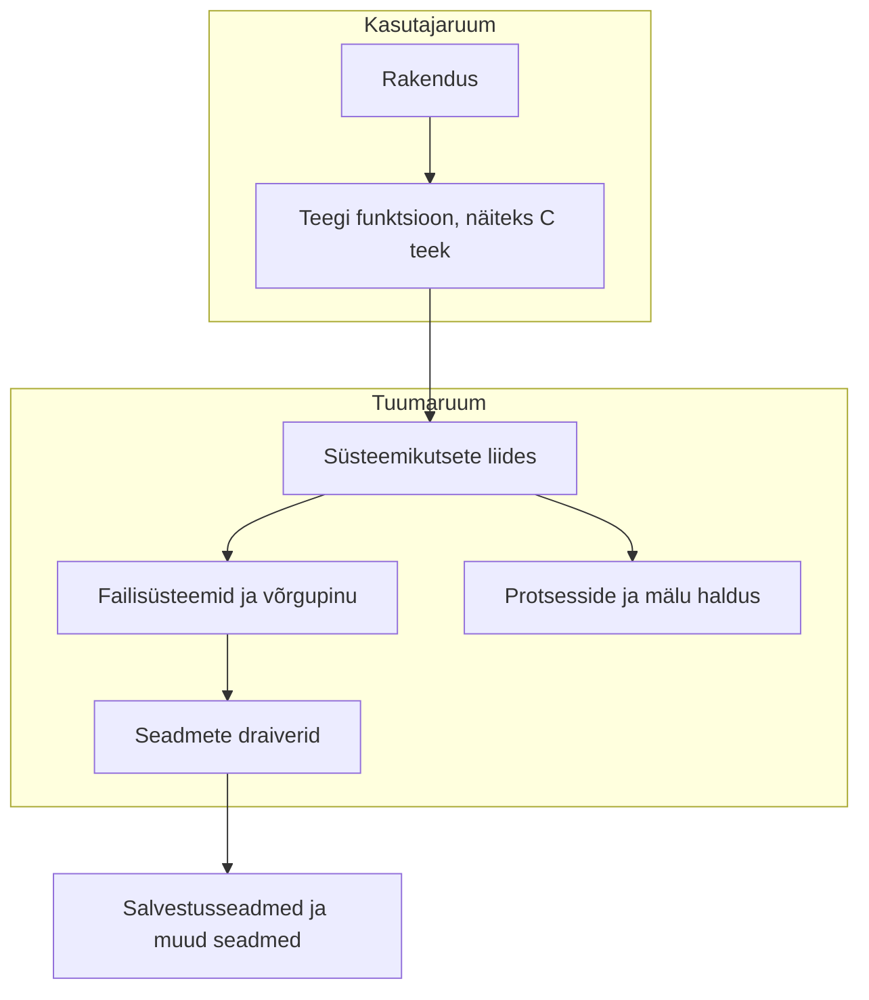

# Operatsioonisüsteemi alused: kernelist Bashini

Arvuti käivitamine, faili loomine ja terminalis käsu sisestamine kasutavad operatsioonisüsteemi eri osi. Vaatame, milline on nende osade ülesanne ning kuidas need omavahel seotud on.

## Kernel ehk tuum

**Kernel ehk tuum** on operatsioonisüsteemi keskne osa, mis korraldab rakenduste ja riistvara koostööd.

- **Riistvara** – arvuti füüsilised komponendid: protsessor, operatiivmälu, kõvaketas või SSD ning muud seadmed.
- **Tarkvara** – programmid, mida arvutis käivitame, näiteks veebibrauser, mängud või Microsoft Word.

Tuum pakub programmidele teenuseid ning haldab ühiseid ressursse.

- **Ressursside jagamine** – kui korraga töötavad veebibrauser ja tekstiredaktor, jagab tuum nende vahel protsessoriaega ning haldab nende mälukasutust. See ei taga, et mälu ei saa otsa või ükski programm ei jookse kokku.
- **Suhtlus seadmetega** – tavarakendustel on piiratud õigused seadmeid otse juhtida. Failide ja võrgu kasutamiseks küsivad nad tavaliselt tuumalt teenuseid **süsteemikutsete** kaudu.
- **Turvalisus ja korra hoidmine** – tuum ja riistvara aitavad hoida protsesside mäluruumid eraldi ning kontrollida ligipääsu failidele ja seadmetele. Üks programm ei saa tavaliselt teise programmi mälu vabalt muuta. Eraldi õiguste või ühismälu kaudu võivad programmid siiski koostööd teha.

Tuum on osa operatsioonisüsteemist. Terviklik süsteem sisaldab lisaks näiteks teeke, süsteemiteenuseid ja kasutajaprogramme.

::: tip Näide: muusika kuulamine ja teksti kirjutamine
Kuulad brauseris muusikat ja kirjutad samal ajal Wordis. Tuum jagab programmidele protsessoriaega ning haldab nende mälu, et mõlemad saaksid töötada. Nii saavad arvutis korraga edeneda eri tegevused.
:::

## Süsteemikutsete liides

**Süsteemikutse** (*system call*) on viis, kuidas rakendus küsib operatsioonisüsteemi tuumalt teenust.

Näiteks soovib tekstiredaktor faili avada või veebibrauser võrku andmeid saata.

1. **Rakenduse vajadus** – programm vajab tegevust, mida ta ei saa oma piiratud õigustega ise teha.
2. **Kutse tegemine** – programm küsib süsteemikutse kaudu tuumalt vajalikku teenust, näiteks faili avamist. Protsessor läheb selleks kasutajarežiimist tuumarežiimi.
3. **Täitmine tuumas** – tuum kontrollib vajaduse korral õigusi ja korraldab küsitud tegevuse.
4. **Tagasipöördumine** – täitmine jätkub kasutajarežiimis ning programm saab tulemuse või veateate.

Lihtsustatud skeem tuuma teenuse kasutamisest:



<p style="font-size: 0.9em;"><em>Loe joonist ülevalt alla. Rakendus vajab näiteks faili avamist. Selleks kasutab ta sageli teegi funktsiooni ehk valmis koodiga abifunktsiooni, mis teeb süsteemikutse. Kutse kaudu jõuab palve tuumani. Tuum korraldab vajaliku töö: haldab näiteks faile või mälu ning kasutab seadmega suhtlemiseks draiverit. Draiver on tarkvara, mille abil tuum seadet juhib. Kõik tegevused ei läbi kõiki joonise kaste: näiteks mälu haldamine ei vaja alati salvestusseadet.</em></p>

Skeem näitab tuuma teenuse kasutamist, mitte iga programmiinstruktsiooni teekonda. Süsteemikutse saab teha ka ilma teegi vahenduseta. **Nii rakenduse kui ka tuuma koodi täidab protsessor.**

## Kasutajarežiim ja tuumarežiim

Protsessor saab koodi täita eri õigustasemetel.

- **Kasutajarežiim** (*user mode*) – tavarakenduste piiratud õigustega täitmine.
- **Tuumarežiim** (*kernel mode*) – tuuma koodi täitmine kõrgemate õigustega, näiteks seadmete juhtimiseks ja mälu kaitse korraldamiseks.

**Kasutajaruum** (*user space*) ja **tuumaruum** (*kernel space*) kirjeldavad vastavaid mälu- ja täitmiskeskkondi. Režiim kirjeldab protsessori õigustaset.

Kui programm arvutab, siis liitmised, võrdlused ja tsüklid ise ei vaja süsteemikutseid:

```c
int x = 5;
for (int i = 0; i < 1000; i++) {
    x += i;
}
```

Selle arvutuse tulemus on `499505`.

- Protsessor täidab arvutamise instruktsioone kasutajarežiimis.
- Programmi andmeid hoitakse mälus; arvutamisel kasutab protsessor ka registreid ja vahemälu.
- Tuum korraldab endiselt programmi täitmisaega. Tuuma kood võib käivituda ka katkestuse või erindi tõttu, näiteks kui kasutatav mäluleht pole veel operatiivmälus.

Tuumalt küsitakse teenuseid näiteks:

- failide avamiseks, lugemiseks ja kirjutamiseks;
- võrguühenduste kasutamiseks;
- protsesside loomiseks;
- seadmete juhtimiseks;
- programmile täiendava mälu kasutamise võimaldamiseks.

Iga mälu eraldamine ei vaja uut süsteemikutset: teegi mäluhaldur võib kasutada juba varem saadud mälu.

Protsessor ei vali ise, mida programm soovib. Ta järgib instruktsioone ja riistvara reegleid. Süsteemikutse instruktsioon, katkestus või erind võib viia täitmise tuumarežiimi.

::: tip Näide: faili loomine Visual Studio Code'is
Kasutan Visual Studio Code'i programmeerimisülesannete tegemiseks. Soovin luua projekti faili `ylesanne2.py`.

Rakendus kasutab faili loomiseks operatsioonisüsteemi teenuseid. Tuum:

- kontrollib, kas kasutajal on õigus sellesse kausta kirjutada;
- loob failisüsteemi vajaliku kirje;
- korraldab faili sisu kirjutamise, kui faili salvestatakse;
- uuendab vajalikke failisüsteemi metaandmeid.

Faili loomine ja sisu kirjutamine võivad vajada mitut süsteemikutset. Tuum annab kontrolli tagasi rakendusele ning näeme faili VS Code'i failipuus.

Kirjutamise õnnestumine ei tähenda alati, et andmed on juba füüsiliselt kettale jõudnud: need võivad olla ajutiselt vahemälus.
:::

## UEFI ehk ühtne laiendatav püsivaraliides

**Püsivara** (*firmware*) on tarkvara, mis valmistab arvuti riistvara käivitamisel tööks ette. Arvuti püsivara paikneb tavaliselt emaplaadi välkmälus. Laienduskaartidel võib olla ka oma püsivara.

Vanemates arvutites kasutati traditsioonilist **BIOS-i**. Tänapäevastes arvutites kasutatakse enamasti **UEFI-põhist püsivara**. UEFI (*Unified Extensible Firmware Interface*) määratleb püsivara ja operatsioonisüsteemi vahelise liidese. UEFI ja BIOS ei ole sama mõiste, kuigi kõnekeeles nimetatakse ka UEFI seadistusmenüüd sageli BIOS-iks.

### BIOS-i ja UEFI seadistusmenüü näited


<p style="font-size: 0.9em;"><em>Award BIOS-i seadistusmenüü. Valikute vahel liigutakse klaviatuuriga; menüüst saab muuta näiteks süsteemi ja käivitamise seadeid. Pilt on tegeliku menüü põhjal taastatud kujutis.</em></p>

Allikas: [Wikimedia Commons](https://commons.wikimedia.org/wiki/File:Award_BIOS_setup_utility.png), kujutise taastaja Kephir. Commonsi järgi avalikus omandis (*public domain*).


<p style="font-size: 0.9em;"><em>ASUS-e UEFI seadistusmenüü. Siin saab vaadata protsessori ja mälu infot, temperatuure ning ventilaatorite näite. Käivitamise valikutest saab määrata, milliselt seadmelt arvuti käivitub.</em></p>

Allikas: [ASUS-e ametlik UEFI EZ Mode'i juhend](https://www.asus.com/ca-en/support/faq/1044236/). Pilt: ASUS.

Need on kahe konkreetse seadistusmenüü näited. Menüü välimus ja võimalused sõltuvad tootjast ning mudelist: ka UEFI menüü võib olla tekstipõhine. Graafiline kujundus üksi ei näita, kas arvuti kasutab BIOS-i või UEFI-t.

### Püsivara ülesanded

Püsivara peamised ülesanded käivitamisel:

- **Riistvara algseadistamine ja kontroll** – valmistab vajalikud komponendid ette, et operatsioonisüsteemi saaks laadida.
- **Häälestamine** – võimaldab muuta näiteks kellaaega, alglaadimisjärjekorda ja riistvara seadeid. Seadistusmenüü avamiseks kasutatakse käivitamisel sageli klahvi `Del` või `F2`; täpne klahv sõltub arvutist.
- **Alglaadimine** – UEFI alglaadimishaldur valib ja käivitab operatsioonisüsteemi laaduri. Tavapärasel kettalt käivitamisel paikneb see **EFI süsteemijaotises** (*EFI System Partition*, ESP).

**Alglaadimisjärjekord** määrab, milliseid käivitusvalikuid proovitakse esimesena. Käivitusmenüüst saab tavaliselt valida seadme ka ainult selleks käivituskorraks, ilma püsivat järjekorda muutmata.

::: tip Näide: Linuxi paigaldamine mälupulgalt
Ühendad arvutiga mälupulga, millele on loodud Linuxi paigaldusmeedia. Käivitusmenüüst valid USB-seadme ning UEFI käivitab sellelt laaduri. Nii saad käivitada paigaldusprogrammi ka enne, kui Linux on arvuti kettale paigaldatud.
:::

Traditsiooniline BIOS-i alglaadimine kasutab alglaadimissektoris olevat koodi. UEFI puhul käivitatakse laaduri fail. Hiirega juhitav graafiline seadistusmenüü on võimalik, kuid see pole UEFI peamine erinevus BIOS-ist.

### Secure Boot ehk turvaline alglaadimine

**Secure Boot** aitab kontrollida, kas käivitamisel laaditav tarkvara on usaldatud. Kui Secure Boot on sisse lülitatud, kontrollib püsivara näiteks operatsioonisüsteemi laaduri digitaalallkirja oma usaldusreeglite järgi. Digitaalallkiri aitab kontrollida, kes tarkvara allkirjastas ja kas seda on pärast allkirjastamist muudetud.

::: tip Näide: käivitamisel blokeeritud laadur
Valid käivitusmenüüst paigalduspulga, kuid ilmub turvateade ja paigaldus ei käivitu. Üks võimalik põhjus on see, et pulgal olev laadur ei vasta arvuti Secure Booti usaldusreeglitele. Püsivara blokeerib siis selle laaduri käivitamise.
:::

Secure Boot aitab kaitsta käivitusahelat enne operatsioonisüsteemi töölehakkamist. See ei asenda viirusetõrjet ega taga, et kogu arvutis kasutatav tarkvara on ohutu.

### Püsivarast operatsioonisüsteemini

Lihtsustatud käivitusahel:


Tuum võtab üle süsteemi ressursside haldamise. Seejärel käivitatakse teenused ja kasutajaprogrammid. Bash on üks võimalik kasutajaprogramm; kõigi süsteemide käivitamine ei nõua Bashi.

::: tip Näide: arvuti sisselülitamine
Vajutad arvuti toitenuppu. Enne Windowsi või Linuxi ilmumist valmistab püsivara riistvara tööks ette ja käivitab laaduri. Laadur käivitab operatsioonisüsteemi tuuma; seejärel käivituvad teenused ja kasutajaliides, mille kaudu saad arvutit kasutada.
:::

### Kuidas UEFI, GPT ja EFI süsteemijaotis kokku sobivad?

Need mõisted kirjeldavad eri ülesandeid:

- **UEFI-põhine püsivara** korraldab arvuti käivitamist ja laaduri valimist.
- **GPT** kirjeldab ketta jaotisi: kus need algavad ja lõpevad ning millist tüüpi need on.
- **EFI süsteemijaotis** on kettajaotis, kus hoitakse UEFI kaudu käivitamiseks vajalikke faile, näiteks operatsioonisüsteemi laadureid.

Tavapärases UEFI ja GPT-ga arvutis leiab püsivara EFI süsteemijaotisest laaduri ning käivitab selle. Järgmisena vaatame lähemalt, kuidas GPT ketta jaotisi kirjeldab.

## GPT ehk GUID Partition Table

**GPT** on kettajaotuste tabeli vorming. See kirjeldab, kus kettal jaotised paiknevad ja millist tüüpi need on. GPT ei ole failisüsteem.

GPT on uuem alternatiiv **MBR-ile** (*Master Boot Record*).

- **Suuremate ketaste tugi** – MBR-i tavapärane piir 512-baidiste loogiliste sektorite korral on umbes 2 TiB. GPT võimaldab kasutada sellest suuremaid kettaid.
- **Rohkem jaotisi** – MBR-i tabelis on neli kirjet. Laiendatud jaotise abil saab siiski luua rohkem loogilisi jaotisi. GPT ei vaja seda lahendust; Windows lubab GPT-kettale kuni 128 jaotist.
- **Töökindlam jaotustabel** – GPT säilitab jaotustabeli varukoopia ning kasutab kontrollsummasid selle struktuuri terviklikkuse kontrollimiseks.

### Mida tähendab 32- või 64-bitine süsteem?

**Bitt** on väikseim infoühik: selle väärtus on `0` või `1`. 32- ja 64-bitise süsteemi erinevus kirjeldab lihtsustatult seda, kui laiu andmeühikuid ja mäluaadresse protsessor ning operatsioonisüsteem kasutavad. See ei tähenda, et kõiki faile või andmeid töödeldakse alati just sellise suurusega tükkidena.

Õppija jaoks on kõige nähtavam erinevus **mälukasutuses**:

Mäluaadress on nagu asukohanumber, mille abil programm leiab mälust vajaliku koha. Pikema aadressiga saab tähistada rohkem erinevaid kohti.

- 32-bitise programmi mäluaadressidega saab tähistada kuni 4 GiB aadressiruumi. Kõik sellest ei pruugi olla programmi enda kasutada.
- 64-bitine süsteem võimaldab kasutada palju rohkem mälu. Tegelik piir sõltub protsessorist ja operatsioonisüsteemist.

::: tip Näide: arvutis on 8 GiB operatiivmälu
Arvutisse on paigaldatud 8 GiB RAM-i. Tavaline 32-bitine Windows ei saa sellest kõike kasutada; 64-bitine Windows võimaldab sobiva riistvara korral kasutada kogu seda mälu. See ei tähenda, et 64-bitine süsteem oleks alati kaks korda kiirem.
:::

64-bitise operatsioonisüsteemi jaoks on vaja seda toetavat protsessorit. Paljud 64-bitised süsteemid võimaldavad käivitada ka 32-bitiseid programme, kuid see sõltub süsteemi toest.

GPT tugi sõltub operatsioonisüsteemist, mitte ainult sellest, kas süsteem on 32- või 64-bitine. Andmeketta kasutamine ja sellelt operatsioonisüsteemi käivitamine võivad olla erinevate nõuetega.

UEFI ja GPT on tänapäevastes arvutites levinud koos, kuid kõik operatsioonisüsteemid ei nõua neid mõlemaid.

::: info Kontrollsumma ja varukoopia
GPT kontrollsummad ja tabeli varukoopia aitavad tuvastada või parandada jaotustabeli kahjustusi. Need ei kaitse kõigi failide sisu ega asenda andmete varundamist.
:::

## Partitsioon ehk kettajaotis

**Partitsioon ehk jaotis** on ketta eraldatud piirkond. Piltlikult võib ette kujutada maja, kus toad on vaheseintega eraldatud.


<p style="font-size: 0.9em;"><em>Üks ketas võib olla jagatud mitmeks jaotiseks. GPT kirjeldab nende asukohti ja tüüpe; jaotistes hoitakse näiteks käivitusfaile, Windowsi ja taastamistööriistu. Väikesed süsteemijaotised ei ilmu tavaliselt failihalduris eraldi kettatähtedena. Joonise jaotiste suurused ei ole mõõtkavas.</em></p>

Joonisel on Windowsi näidispaigutus, mitte kõigi GPT-ketaste kohustuslik ülesehitus:

- **System** – EFI süsteemijaotis, kus asuvad käivitamiseks vajalikud failid.
- **MSR** – Windowsi jaoks reserveeritud jaotis.
- **Windows** – operatsioonisüsteemi, programmide ja kasutaja failide jaotis.
- **Recovery** – taastamiskeskkonna jaotis.

Allikas: [Microsofti UEFI/GPT kettajaotuste juhend](https://learn.microsoft.com/en-us/windows-hardware/manufacture/desktop/configure-uefigpt-based-hard-drive-partitions?view=windows-11). Pilt: Microsoft.

Jaotisi kasutatakse näiteks:

- **Operatsioonisüsteemi ja andmete eraldamiseks** – Windowsis võib süsteem asuda köitel `C:\` ja osa andmeid köitel `D:\`. Kettatähed ei tähenda tingimata kaht füüsilist ketast.
- **Mitme operatsioonisüsteemi kasutamiseks** – näiteks Windowsi ja Linuxi paigaldamine samasse arvutisse. Käivitamisel valitakse, kumba kasutada (*dual boot*).
- **Eri otstarbeks** – näiteks EFI süsteemijaotis, süsteemi failid või taastamiseks vajalikud andmed.

Eraldi jaotis aitab andmeid korraldada, kuid **ei ole varukoopia ega kaitse pahavara eest**. Pahavara võib pääseda mitmele jaotisele ning sama füüsilise ketta rike võib kahjustada neid kõiki.

::: tip Näide: fotod teisel kettatähel
Salvestad fotod `D:`-kettale ja Windows asub `C:`-kettal. Kui mõlemad on sama füüsilise ketta jaotised, võib ketta rikke korral kaduda mõlema sisu. Fotode varukoopia peab seepärast asuma ka mujal, näiteks eraldi salvestusseadmel või varundusteenuses.
:::

## Failisüsteem

Tavaliste failide salvestamiseks vormindatakse jaotis **failisüsteemiga**. Failisüsteem korraldab failide, kaustade ja nende kohta käiva info hoidmise. Kõik jaotised ei sisalda tavalist failisüsteemi: Linuxis võib jaotist kasutada näiteks saalealana (*swap*).

Levinud failisüsteemid:

- **NTFS** – Windowsi tavapärane failisüsteem süsteemi- ja andmeköidetele.
- **FAT32** – paljude seadmetega ühilduv vanem failisüsteem. Ühe faili suurus peab jääma alla 4 GiB: täpne piir on 4 GiB miinus üks bait. See on faili, mitte kogu ketta suuruse piir.
- **exFAT** – levinud mälupulkadel ja välistel ketastel. Võimaldab ka üle 4 GiB faile, kuid pole piiranguteta. Ühilduvus sõltub seadmest.
- **ext4** – Linuxis levinud failisüsteem.

::: tip Näide: videofail ei mahu mälupulgale
Proovid kopeerida 6 GiB videofaili mälupulgale. Pulgal on 20 GiB vaba ruumi, kuid kopeerimine ebaõnnestub, sest pulk kasutab FAT32 failisüsteemi. Vaba ruumi on piisavalt, aga üks fail on selle failisüsteemi jaoks liiga suur.
:::

## Ühenduspunkt

**Ühenduspunkt** (*mount point*) on failipuus koht, mille kaudu ühendatud failisüsteemile ligi pääseb. Linuxis on see tavaliselt kaust.

Näiteks saab mälupulga failisüsteemi ühendada kausta `/mnt/usb` juurde.

- **Asukoht** – ühenduspunkt määrab, millise tee kaudu failidele ligi pääseb.
- **Ühendamine** – failisüsteemi sisu tehakse selle tee kaudu kättesaadavaks. Faile ei kopeerita ühendamisel arvuti kettale.
- **Kasutamine** – faile saab avada ja muuta nende asukoha kaudu, kuigi need paiknevad mälupulgal või näiteks võrguserveris.
- **Lahutamine** – ühendatud failisüsteem pole enam selle tee kaudu kättesaadav. Kui ühenduspunkti kaustas oli enne ühendamist faile, ilmuvad need uuesti nähtavale. Automaatne ühendaja võib loodud kausta ka eemaldada.

OneDrive'i või Dropboxi sünkroonimiskaust pole tavaliselt samas tähenduses ühenduspunkt. Sellised rakendused võivad faile sünkroonida või vajaduse korral alla laadida.

::: tip Näide: mälupulga avamine failihalduris
Ühendad mälupulga Linuxi arvutiga ja avad selle failihalduris. Süsteem on teinud pulga failid ühe kausta kaudu kättesaadavaks. Failid asuvad endiselt pulgal; nende nägemine ei tähenda, et need kopeeriti arvutisse.
:::

## Bash ehk käsuinterpretaator

**Bash** (*Bourne Again Shell*) on käsuinterpretaator ehk **shell** ning skriptimiskeel. Selle abil saab käivitada programme ja siduda käske suuremateks tegevusteks.

**Terminal** on kasutajaliides, kuhu sisestad käske ja kus näed väljundit. **Shell** tõlgendab sisestatud käske. Bash ja zsh on kaks shelli näidet.

Kui sisestad käsu `ls`:

1. Bash leiab ja käivitab programmi `ls`.
2. `ls` küsib tuumalt kataloogi kirjete infot.
3. `ls` kirjutab tulemuse standardväljundisse, mida näed tavaliselt terminalis.

`ls` näitab kataloogi sisu ehk failide ja kaustade nimesid; see ei kuva failide teksti.

Kõik käsud ei ole eraldi programmid. Näiteks `cd` on Bashi sisseehitatud käsk, mis muudab shelli töökausta. Bash kasutab ka ise tuuma teenuseid, näiteks faili avamisel väljundi ümbersuunamiseks.

::: tip Näide: failide nimed terminalis
Kirjutad Bashi käsureale `ls`. Bash käivitab programmi `ls`, mis küsib tuumalt kausta kirjete infot ja kuvab failide nimed. Terminalis näed selle programmi väljundit – käsu tõlgendamine, kausta info küsimine ja tulemuse näitamine on eri osade koostöö.
:::

### Käskude ühendamine toruga

Märk `|` ehk **toru** (*pipe*) ühendab esimese käsu standardväljundi järgmise käsu standardsisendiga.

```bash
printf 'kernel\nbash\nzsh\n' | grep bash
```

- `printf` väljastab kolm rida: `kernel`, `bash` ja `zsh`.
- `|` suunab need read `grep`-i sisendisse.
- `grep bash` kuvab read, mis sisaldavad teksti `bash`.

Tulemus:

```text
bash
```

Tavaline `|` suunab edasi standardväljundi. Veateated ehk veaväljund ei lähe selle kaudu automaatselt järgmisesse käsku.

### Millist shelli kasutan?

Kasutaja sisselogimisshelli saab tavaliselt vaadata käsuga:

```bash
echo "$SHELL"
```

Näiteks võib macOS-is tulemus olla `/bin/zsh`. See ei tõenda, et praegu töötab zsh: kui käivitad sealt Bashi, võib `$SHELL` jääda samaks.

Interaktiivses Bashis või zsh-s saab vaadata käivitatud shelli nime:

```bash
echo "$0"
```

Väljund võib olla näiteks `bash` või `-zsh`. Skriptis näitab `$0` aga skripti nime. Bashi versiooni vaatamiseks saab Bashis kasutada:

```bash
echo "$BASH_VERSION"
```

::: details Lisavõte: süsteemiinfo Linuxis ja macOS-is
Linuxis annab `lscpu` ülevaate protsessori arhitektuurist ja loogilistest protsessoritest:

```bash
lscpu
```

macOS-is pole `lscpu` vaikimisi olemas. Riistvara kohta saab küsida näiteks:

```bash
sysctl -n hw.ncpu
sysctl -n hw.memsize
```

Esimene käsk näitab loogiliste protsessorite arvu ja teine füüsilise mälu mahtu baitides. Väärtused sõltuvad arvutist ja ligipääsupiirangutest.

Algse torunäite saab macOS-is kirjutada nii:

```bash
sysctl -a | grep cpu
```

`sysctl -a` loetleb kättesaadavaid süsteemiparameetreid; `grep cpu` kuvab neist `cpu` sisaldavad read. See ei näita kogu süsteemiinfot ega tingimata kõiki tuuma parameetreid. Mõne väärtuse lugemine võib anda veateate.

macOS-i nimedes tähistab `hw` riistvarainfot, `kern` tuuma infot ja seadeid, `net` võrguga seotud parameetreid ning `vm` virtuaalse mäluga seotud infot. Linuxi `sysctl` kasutab teistsugust parameetrivalikut; macOS-i näiteid ei saa sinna muutmata üle kanda.
:::

## Aruteluks

- Miks ei vaja tavaline liitmiste tsükkel iga liitmise jaoks süsteemikutset?
- Mis vahe on UEFI-l, GPT-l ja failisüsteemil?
- Kas sama ketta teine jaotis kaitseb andmeid ketta rikke eest?
- Millise programmi ülesanne on `ls`-käsu puhul kataloogi sisu kuvada?
- Miks võivad `$SHELL` ja `$0` anda erineva tulemuse?

Käsurea kasutamist saad jätkata peatükis [Terminal ja shell](/arendusvahendid-i/terminal-ja-shell). Linuxi kontode, õiguste ja protsesside kohta loe [Linuxi moodulist](/linux/sissejuhatus).

## Allikad

- [Linuxi süsteemikutsete käsiraamat](https://man7.org/linux/man-pages/man2/syscalls.2.html) – rakenduse ja tuuma liides.
- [Linuxi mälu ja mälulehed](https://cdn.kernel.org/doc/html/latest/mm/page_tables.html) – kuidas tuum korraldab mälu kasutamist.
- [Linuxi `malloc`](https://man7.org/linux/man-pages/man3/malloc.3.html) ja [`write`](https://man7.org/linux/man-pages/man2/write.2.html) – mälu eraldamise ja faili kirjutamise täpsustused.
- [UEFI Forum FAQ](https://uefi.org/faq) ja [alglaadimishalduri kirjeldus](https://uefi.org/specs/UEFI/2.10/03_Boot_Manager.html) – UEFI ja operatsioonisüsteemi käivitamine.
- [UEFI Secure Booti kirjeldus](https://uefi.org/specs/UEFI/2.11/32_Secure_Boot_and_Driver_Signing.html) – käivitamisel laaditava tarkvara usaldusväärsuse kontroll.
- [Microsofti GPT ülevaade](https://learn.microsoft.com/en-us/windows-hardware/manufacture/desktop/windows-and-gpt-faq?view=windows-11) – jaotustabel ning Windowsi GPT tugi.
- [Microsofti failisüsteemide võrdlus](https://learn.microsoft.com/windows/win32/fileio/filesystem-functionality-comparison) – failisüsteemide võimalused ja piirangud.
- [Microsofti mälupiirangute ülevaade](https://learn.microsoft.com/en-us/windows/win32/memory/memory-limits-for-windows-releases) – 32- ja 64-bitise Windowsi mälukasutuse piirid.
- [Linuxi `mount`](https://man7.org/linux/man-pages/man2/mount.2.html) – failisüsteemi ühendamine.
- [GNU Bashi juhend](https://www.gnu.org/software/bash/manual/html_node/What-is-a-shell_003f.html) ja [torude kirjeldus](https://www.gnu.org/software/bash/manual/html_node/Pipelines) – shell ja käskude ühendamine.
