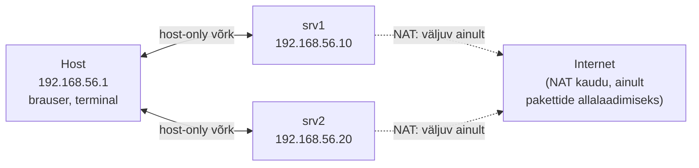

# Server ja tema oma aadress

::: info Õpiväljund
Pärast seda osa oskad selgitada, mis vahe on kliendil ja serveril, miks igal serveril peab olema oma aadress, ning millised aadressid tulevad kasutusele meie enda harjutusvõrgus.
:::

## Meeskonna esimene küsimus sinule

Sinu esimesel tööpäeval küsib tiimijuht: "Kas saad meile ehitada koha, kus rakendus reaalselt töötaks — mitte ainult sinu sülearvutis?" Enne kui saad sellele vastata, pead teadma kahte asja: mida see "koht" endast tehniliselt kujutab, ja kuidas keegi teine — brauser, kolleeg, testija — selle üldse üles leiab.

Nende kahe küsimuse vastused on "server" ja "aadress". Käime need mõlemad läbi.

## Mis on server?

**Server** ei tähenda tingimata suurt metallkappi serveriruumis. Server on **roll**, mida üks arvuti (või protsess selles arvutis) parasjagu täidab: ta *kuulab* mingit pidevalt ning ootab, millal keegi talle päringu saadab, ja siis vastab.

**Klient** on roll teisel pool — see, kes päringu *algatab*. Sinu brauser on klient, kui ta laeb veebilehte. Sama sülearvuti võib hetk hiljem ise olla server, kui sellel töötab näiteks sinu enda Node.js protsess, mida kolleeg oma brauserist testib.

::: tip Miks see vahe oluline on
Kui rakendus "ei tööta", ei tähenda see automaatselt, et kood on katki. Kood võib olla täiesti korrektne, aga protsess, mis pidi serverina kuulama, ei pruugi üldse töötada, või töötab hoopis teises kohas kui klient arvab. Nende kahe asja — kood ja töötav teenus — lahus hoidmine on kogu selle valikaine läbiv teema.
:::

## Kust tuleb serveri aadress?

Selleks, et klient saaks serverile üldse päringu saata, vajab server **aadressi** — täpselt nagu kiri vajab saaja aadressi, et kohale jõuda. Seda aadressi arvutivõrgus nimetatakse **IP-aadressiks**.

Kui IP-aadress, pakett ja ruuter on sulle täiesti uued sõnad, loe kõigepealt läbi [Mis on võrk ja internet?](/arvutivorgud/vork-ja-internet) ja [IP-aadressid ja marsruutimine](/arvutivorgud/ip-aadressid-ja-marsruutimine) — need selgitavad põhimõtte üldiselt, avalike näidete peal (nagu `8.8.8.8`). Siin läheme sammu edasi: kust tuleb **meie enda** serveri aadress, ja miks see erineb avalikest näidetest.

### Avalik ja privaatne aadress

Kui sinu server oleks kohe internetist kättesaadav, näeks seda kohe ka igaüks teine internetis — enne kui oled seda üldse jõudnud turvata. Sellepärast me ei õpi serverihaldust kohe internetis, vaid enda arvuti sees, eraldatud **harjutusvõrgus**, mida keegi väljastpoolt ei näe.

Selleks kasutame **virtuaalmasinaid** (VM) — tarkvaraliselt loodud "arvuteid" sinu enda arvuti sees. Igal virtuaalmasinal on oma IP-aadress, aga see aadress kehtib ainult sinu enda väikeses võrgus, mitte kogu internetis. Sellised "ainult minu enda võrgus kehtivad" aadressid on **privaatsed aadressid** — sama põhimõte, mis su kodu WiFi-ruuteri taga: sinu telefoni aadress `192.168.1.x` ei tähenda sinu naabri jaoks midagi, sest tema ruuteri taga on hoopis oma `192.168.1.x` vahemik.

### Kaks teed ühe virtuaalmasina jaoks

Igal meie loodaval virtuaalmasinal on kaks "võrgukaarti", millel on erinev eesmärk:

- **NAT** — tee väljapoole, internetti. Selle kaudu saab virtuaalmasin alla laadida tarkvarapakette. See ei ole tee, mille kaudu sinu server internetist kättesaadav on.
- **Host-only** — tee ainult sinu enda arvuti (host) ja sinu virtuaalmasinate vahel. Selle kaudu räägivad sinu host ja serverid omavahel, ja ainult see aadress on see, mida päriselt kasutame.

Mõtle sellest nagu kahest eraldi uksest: üks uks (NAT) viib tänavale, kust tarnitakse kaupa; teine uks (host-only) viib ainult sinu enda maja teistesse tubadesse. Need kaks ust ei tohi omavahel seguneda — muidu ei tea keegi enam, kumb kaugusega päring millisest uksest sisse peaks tulema.

## Meie harjutusvõrgu aadressiplaan

Kogu kursuse jooksul kasutame samu aadresse, et sa ei peaks iga kord uuesti pähe õppima, kus mis asub:

| Nimi | Aadress | Roll |
| --- | --- | --- |
| Host (sinu arvuti) | `192.168.56.1` | haldad siit kõike, brauser ja terminal |
| srv1 | `192.168.56.10` | esimene server — hiljem veeb, andmebaas |
| srv2 | `192.168.56.20` | teine server — hiljem e-post ja taastamise siht |

Nimede lihtsustamiseks anname neile lisaks inimloetava nime, mis lõpeb `.lab.test` — see on väljamõeldud domeen, mis eksisteerib ainult meie enda harjutusvõrgus (hiljem, kui ehitame ise DNS-i, õpime täpselt, kuidas nimi aadressiks muutub).

::: warning Kaks serverit näevad NAT-i taga ühesugused välja
VirtualBoxi NAT-i taga võib mõlemal virtuaalmasinal olla nähtav aadress `10.0.2.15` — see ei ole viga ega konflikt, iga masin lihtsalt näeb enda NAT-i eraldi, isoleeritud "tänavana". Päris suhtluseks serverite ja hosti vahel kasutame alati host-only aadresse (`.10`, `.20`), mitte kunagi seda NAT-i aadressi.
:::

## Kokkuvõte

| Mõiste | Tähendus meie kontekstis |
| --- | --- |
| Server (roll) | Protsess, mis kuulab päringuid ja vastab neile |
| Klient (roll) | Pool, kes päringu algatab |
| Privaatne aadress | Aadress, mis kehtib ainult meie enda harjutusvõrgus, mitte internetis |
| Host-only võrk | Tee ainult sinu hosti ja sinu virtuaalmasinate vahel — seda kasutame päris suhtluseks |
| NAT | Tee ainult väljapoole (allalaadimiseks) — mitte sissetulevaks päringuks |
| `.lab.test` | Väljamõeldud domeen, mis eksisteerib ainult meie harjutusvõrgus |

## Mõtteharjutus

Joonista paberile või tahvlile kolm kasti: brauser, veebiserver, andmebaas. Tõmba nool iga ühenduse juurde ja märgi, **kes selle ühenduse algatab** — kumb pool on klient ja kumb server. Seejärel mõtle kaks olukorda, kus rakenduse lähtekood on täiesti muutumatu ja korrektne, aga kasutaja ikkagi teenust kätte ei saa. Võrdle oma vastuseid paarilisega.

## Allikad

- [Cloudflare Learning — What is an IP address?](https://www.cloudflare.com/learning/dns/glossary/what-is-my-ip-address/)
- [Oracle VirtualBox User Manual — Network settings (NAT vs. Host-only)](https://docs.oracle.com/en/virtualization/virtualbox/7.2/user/networkingdetails.html)
