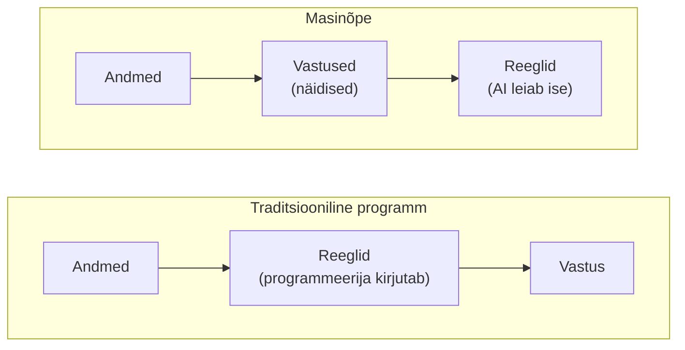
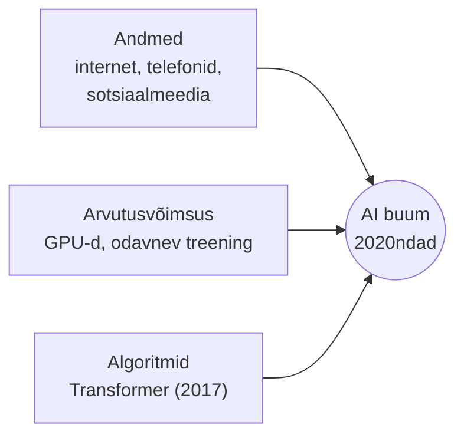
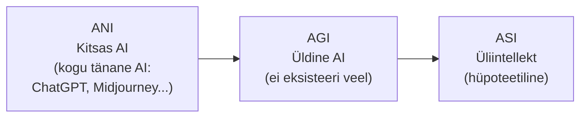

# 1.1 Mis on tehisintellekt?

::: tip Selle tunni järel...
- oskad selgitada oma sõnadega, mis on tehisintellekt ja mille poolest ta erineb tavalisest programmist;
- toed vähemalt viis näidet AI kasutamisest igapäevaelus;
- mõistad, miks AI just praegu kõikjal kasvab (andmed + arvutusvõimsus + algoritmid);
- eristad kitsast ja üldist AI-d.
:::

## Mis on tehisintellekt?

Tehisintellekt (AI, *Artificial Intelligence*) on arvutisüsteem, mis suudab täita ülesandeid, mis tavaliselt nõuavad inimintellekti — mustrite äratundmine, keele mõistmine, otsuste tegemine, õppimine kogemusest, loomingulise sisu tootmine.

Erinevalt tavalisest programmist, mis järgib täpseid samm-sammulisi juhiseid, õpib AI andmete pealt ja suudab lahendada ülesandeid, mille kohta programmeerija ei kirjutanud otsest reeglit:

Praktikas tähendab "AI leiab reeglid ise" enamasti seda, et andmed liiguvad läbi tehisnärvivõrgu — paljude lihtsate arvutusüksuste (tehisneuronite) kihtide kaudu, mis on paigutatud inimaju eeskujul, kuid töötavad matemaatiliselt väga erinevalt:

*Tehisnärvivõrgu (artificial neural network) lihtsustatud skeem: sisendkiht, üks või mitu varjatud kihti ning väljundkiht. Igal joonel on kaal, mida treenimise käigus kohandatakse. Autor: Phlsph7, põhineb Cburnetti joonisel, [Wikimedia Commons](https://commons.wikimedia.org/wiki/File:Artificial_neural_network_colored.svg) (CC BY-SA 3.0 / GFDL).*

## AI su igapäevas — 5 näidet

| Kus? | Mida AI teeb? |
|---|---|
| Telefon | Nägude tuvastamine, hääleassistent (Siri, Google Assistant), autofookus |
| YouTube, TikTok, Netflix | Soovitab järgmist videot sinu vaatamisajaloo põhjal |
| Google Maps | Ennustab liiklusummikuid ja arvutab kiireima tee |
| Meilid (Gmail) | Filtreerib rämpsposti, pakub lühivastuseid |
| Fotod (Google Photos) | Otsib "koer" või "sünnipäev" — ilma et sa oleks silte lisanud |

::: tip Huvitav fakt
Kui sa täna hommikul avasid telefoni, kasutasid tõenäoliselt AI-d juba enne hommikusööki — ekraani lukust avamisel (nägu), uudiste voos (soovitus), ilmateate hoiatuses (ennustus) ja kaardirakenduses (liiklus).
:::

## Miks just nüüd? Kolm samaaegselt küpsenud tegurit

- **Andmed** — internet, nutitelefonid ja sotsiaalmeedia toodavad iga päev tohutul hulgal andmeid, millega mudeleid treenida.
- **Arvutusvõimsus** — GPU-d (algselt videomängude jaoks) võimaldavad paralleelset arvutust massiivsel skaalal. Sama tulemuseni jõudmine on aastatega läinud järjest odavamaks: 2017. aastal maksis ImageNeti pilditeksti klassifitseerija treenimine 93% täpsuseni üle 1000 dollari, 2021. aastaks langes sama tulemuse hind umbes 5 dollarini ([Epoch AI](https://epoch.ai/blog/trends-in-the-dollar-training-cost-of-machine-learning-systems)).
- **Algoritmid** — 2017. aastal ilmus Transformer-arhitektuur (Google'i teadlaste artikkel "Attention Is All You Need"), millel põhinevad ChatGPT, Gemini, Claude ja teised ([Vaswani jt, 2017](https://arxiv.org/abs/1706.03762)).

::: info Info
Iga tegur eraldi oli olemas juba varem. Aga kolmiku kokkulangemine 2020. aastate alguses vallandas plahvatusliku arengu.
:::

## Kitsas vs üldine AI

- **Kitsas AI (ANI, Narrow AI)** — tehisintellekt, mis lahendab ühte konkreetset ülesannet väga hästi. Näide: male-arvuti, spamifilter, ChatGPT (jah, ChatGPT on kitsas AI — ta ei oska juhtida autot).
- **Üldine AI (AGI, Artificial General Intelligence)** — hüpoteetiline süsteem, mis oskab kõike, mida inimene oskab, sh õppida uusi valdkondi ilma ümberprogrammeerimiseta. Ei ole veel olemas.
- **Superintellekt (ASI)** — teoreetiline AI, mis ületab inimest kõiges. Ulmevaldkond.

::: warning Hoiatus
Meedia räägib sageli "AI-st" nagu see oleks üks asi. Tegelikult on iga tänane AI kitsas — spetsiaalseks ülesandeks ehitatud. Uuri alati, mida konkreetne süsteem tegelikult teeb.
:::

## Viited ja lisalugemine

- [Britannica — Artificial intelligence](https://www.britannica.com/technology/artificial-intelligence)
- Vaswani, A. jt (2017). ["Attention Is All You Need"](https://arxiv.org/abs/1706.03762)
- [Epoch AI — Trends in the dollar training cost of machine learning systems](https://epoch.ai/blog/trends-in-the-dollar-training-cost-of-machine-learning-systems)
- [Wikipedia — Artificial general intelligence](https://en.wikipedia.org/wiki/Artificial_general_intelligence)
