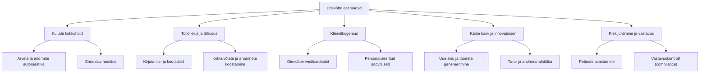

# 1.3 Kus AI-d igapäevaselt kasutatakse?

AI on jõudnud peaaegu igasse eluvaldkonda. Kui esimeses tunnis vaatasime üksikuid näiteid, siis nüüd süstematiseerime need valdkondade kaupa.

## 1. Suhtlus ja sisu
- **Kirjutamine** — ChatGPT, Claude, Gemini aitavad koostada e-kirju, esseesid, blogipostitusi.
- **Tõlkimine** — Google Translate, DeepL kasutavad närvivõrke, mis mõistavad konteksti (mitte lihtsalt sõna-sõnalt).
- **Grammatika ja stiil** — Grammarly, LanguageTool.
- **Kokkuvõtete tegemine** — pikast artiklist või videost põhipunktid.
- **Vestlusrobotid** — kliendiabi, pangateenused, tervisenõustamine.

## 2. Meelelahutus
- **Soovitused** — Netflix, Spotify, YouTube, TikTok.
- **Pildid ja kunst** — Midjourney, DALL-E, Stable Diffusion.
- **Muusika** — Suno, Udio genereerivad täislaule.
- **Mängud** — vastased ja NPC-d käituvad realistlikumalt tänu AI-le.
- **Video** — OpenAI Sora ja Google Veo genereerivad realistlikku videot.

## 3. Tervis ja meditsiin
- **Radioloogia** — AI leiab röntgenpildilt kasvajaid või murde, mida silm ei märka.
- **Diagnostika** — nahavähi tuvastamine fotolt nutitelefoni kaameraga.
- **Ravimite arendus** — DeepMindi AlphaFold ennustas peaaegu kõikide teadaolevate valkude 3D-struktuuri (üle 200 miljoni valgu), mis on ravimiteaduses revolutsioon ([DeepMind](https://deepmind.google/blog/alphafold-reveals-the-structure-of-the-protein-universe/)).
- **Personaalne meditsiin** — ravi kohandamine geneetilise info põhjal.

*AlphaFold 2 täpsus valkude 3D-struktuuri ennustamisel CASP14 võistlusel ning mudeli arhitektuuri ülesehitus. Allikas: Jumper jt (2021), Nature, [Wikimedia Commons](https://commons.wikimedia.org/wiki/File:AlphaFold_2.png) (CC BY 4.0).*

## 4. Transport ja logistika
- **Isesõitvad autod** — Waymo, Tesla FSD, Zoox.
- **Marsruudioptimeerimine** — Google Maps, Waze, kuller-teenused.
- **Autonoomsed droonid** — pakiveod, põllumajandus, päästeoperatsioonid.
- **Ennustav hooldus** — tehased kasutavad AI-d, et ennustada, millal masin läheb katki, enne kui see juhtub.

*Waymo isesõitev auto Mountain View'is, Californias — üks paljudest tänastest AI-põhistest autonoomsetest sõidukitest. Foto: Grendelkhan, [Wikimedia Commons](https://commons.wikimedia.org/wiki/File:Waymo_self-driving_car_front_view.gk.jpg) (CC BY-SA 4.0).*

## 5. Haridus
- **Personaalsed õpiabilised** — Khan Academy Khanmigo, Duolingo Max.
- **Automaatne hindamine** — esseede ja vastuste analüüs.
- **Sisu loomine** — õpetajad genereerivad tunniplaane, teste, näiteid.
- **Keeleõpe** — vestlusrobotid, kes räägivad õppekeeles kannatlikult.

## 6. Äri ja töö
- **Klienditugi** — vestlusrobotid vastavad esmalt, inimesele suunatakse keerulisemad juhtumid.
- **Analüütika** — müügiprognoosid, kliendisegmenteerimine, hinnastamine.
- **Värbamine** — CV-de esmane skriining (siin tekib ka kallutatuse probleeme, millest räägime moodulis 7).
- **Automaatika** — arvete töötlemine, andmete sisestamine, aruannete koostamine.

### AI ja ettevõtte eesmärgid

Eelnev loend näitab, **mida** AI ettevõttes teeb. Sama tähtis on mõista, **miks** — millise ärieesmärgini konkreetne rakendus viib. See aitab valida õige lahenduse õige probleemi jaoks, selle asemel et kasutada AI-d lihtsalt sellepärast, et see on populaarne.

| Ärieesmärk | Mida see tähendab | Näited |
|---|---|---|
| Kulude kokkuhoid | Vähem käsitsitööd sama tulemuse saavutamiseks | Arvete töötlemise automaatika, ennustav hooldus |
| Tootlikkus ja tõhusus | Sama inimene jõuab teha rohkem samas ajas | Kirjutamis- ja koodiabid, kokkuvõtted, aruanded |
| Kliendikogemus | Kiirem ja personaalsem teenindus | Vestlusrobotid, soovitussüsteemid |
| Käibe kasv ja innovatsioon | Uued tooted, teenused, turud | Sisu genereerimine, turuanalüüs, uued digitooted |
| Riskijuhtimine ja vastavus | Vigade ja rikkumiste varajane avastamine | Pettuste tuvastamine, regulatiivne kontroll |

::: info Eesti ettevõtete olukord
OSKA (Kutsekoja) 2025. aasta uuringu järgi kasutas tehisintellekti lahendusi 2024. aastal 14% Eesti ettevõtetest, 2025. aasta esimeseks pooleks oli see kasvanud 22%-ni. Kõige aktiivsemad on finants- ja kindlustussektor (58% ettevõtetest) ning info- ja sidesektor (56%). Suurim potentsiaal nähakse klienditeeninduses, turunduses, müügis ja tarkvaraarenduses. McKinsey hinnangul võib kiire generatiivse AI kasutuselevõtt tõsta Eesti SKT-d järgmise kümnendi jooksul kuni 8%, kuid viieaastane viivitus vähendab selle potentsiaali 2%-ni ([OSKA, 2025](https://oska.kutsekoda.ee/tehisintellekti-teadlik-kasutamine-vajab-eesti-ettevotetes-veel-arendamist/)).
:::

Sama uuring toob välja, et ettevõtete peamine takistus pole tehnoloogia ise, vaid **teadmiste puudus**: ei osata näha, millal ja milleks AI-d rakendada, ning puudub selge pilt investeeringu tasuvusest. Seetõttu tasub iga AI kasutusjuhtu hinnata läbi konkreetse ärieesmärgi, mitte tööriista enda.

## 7. Turvalisus
- **Pettuste avastamine** — pangad märkavad ebatavalisi tehinguid.
- **Küberturvalisus** — anomaaliate leidmine võrguliikluses.
- **Näotuvastus** — telefonide lukk, piirivalve, valveseadmed.
- **Sisu moderaator** — sotsiaalvõrgustikud leiavad vägivaldset sisu.

## 8. Teadus
- **Kliima modelleerimine** — täpsemad ilma- ja kliimaennustused.
- **Materjaliteadus** — uute akumaterjalide, päikesepaneelide avastamine.
- **Astronoomia** — teleskoobiandmetes eksoplaneetide otsimine.
- **Bioloogia** — geneetiliste andmete analüüs, ravimiuuringud.

## 9. Loominguline töö
- **Disain** — Figma AI, Canva Magic.
- **Video- ja fototöötlus** — Adobe Firefly, Runway, taust ja objektide eemaldamine ühe klikiga.
- **3D ja mänguarendus** — automaatne tekstuuride ja mudelite genereerimine.
- **Kirjutamine ja stsenaariumid** — abivahend, mitte asendaja.

## 10. Kodu ja isiklik kasutus
- **Nutikodud** — Alexa, Google Assistant, Siri.
- **Fototöötlus** — Google Photos leiab sinu koera pildid ilma sildistamiseta.
- **Tervis** — nutikellad märkavad südame rütmihäireid.
- **Kalender ja tootlikkus** — planeerimisrakendused, mis korraldavad su päeva.

## Kus AI-d ei kasutata (või ei tohiks kasutada) täna?

- Eluliselt tähtsad otsused ilma inimese kontrollita — kohtuotsused, ravi lõpetamine, koolist väljaviskamine.
- Valdkonnad, kus andmed on väga vähe või kallutatud — näiteks haruldased haigused, väikesed keeled ilma piisava tekstihulgata.
- Kohad, kus vajame 100% täpsust ja seletatavust — teatud tüüpi finantsauditid, ravimite lõplik heakskiit.

## Viited ja lisalugemine

- [DeepMind — AlphaFold reveals the structure of the protein universe](https://deepmind.google/blog/alphafold-reveals-the-structure-of-the-protein-universe/)
- [Wikipedia — AlphaFold](https://en.wikipedia.org/wiki/AlphaFold)
- [OSKA (Kutsekoda, 2025) — Tehisintellekti teadlik kasutamine vajab Eesti ettevõtetes veel arendamist](https://oska.kutsekoda.ee/tehisintellekti-teadlik-kasutamine-vajab-eesti-ettevotetes-veel-arendamist/)
- [OSKA uuringud — Tehisintellekti mõju tööjõu oskuste vajadusele ettevõtluses](https://uuringud.oska.kutsekoda.ee/uuringud/ai-uuring)
