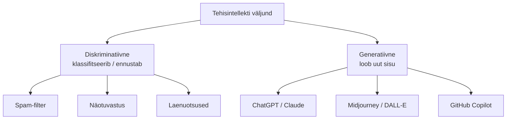
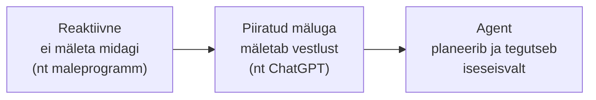

# 1.4 Erinevad AI tüübid

## Miks AI-d liigitada?

Kui ütleme "AI", võib mõelda väga erinevaid asju: kalkulaatorist kuni ChatGPT-ni, spam-filtrist kuni isesõitva autoni. AI ei ole üks asi — see on nimetus terve tehnoloogiate perekonna kohta. Selleks, et neist targemini rääkida, on hea teada peamisi liigitusi.

## 1. Võimekuse järgi: ANI, AGI, ASI

See on kõige populaarsem viis AI-d jagada.

**ANI — kitsas tehisintellekt** (*Artificial Narrow Intelligence*)

Süsteem, mis on väga hea ühes kindlas ülesandes. Kõik AI, mida sa täna kasutad, kuulub siia kategooriasse.

Näited: ChatGPT (vestlus), Midjourney (pildid), AlphaGo (go), Google Translate (tõlkimine), Tesla FSD (sõitmine).

Isegi ChatGPT, mis tundub väga universaalne, on tegelikult "kitsas" — ta oskab tekstiga töötada, aga ei oska iseseisvalt sõita, opereerida, kanda vastutust.

**AGI — üldine tehisintellekt** (*Artificial General Intelligence*)

Süsteem, mis on igas intellektuaalses ülesandes vähemalt sama hea kui keskmine inimene — suudab õppida uut valdkonda, üldistada kogemusi, luua uusi eesmärke.

AGI-d täna ei eksisteeri. Ekspertide arvamused, millal see tuleb, lahknevad drastiliselt — mõned prognoosid räägivad mõnest aastast, teised sajandi lõpust või mitte kunagi ([Stanford HAI — AI Index](https://aiindex.stanford.edu/report/) koondab igal aastal eksperdiprognooside ülevaateid).

**ASI — üliintellekt** (*Artificial Superintelligence*)

Hüpoteetiline süsteem, mis on inimesest igas intellektuaalses ülesandes märgatavalt parem. See on põhjus, miks AI ohutuse teadlased tegelevad "joondamise" (*alignment*) probleemiga — kuidas kindlustada, et selline süsteem, kui see kunagi tekiks, järgiks inimese huvisid.

## 2. Meetodi järgi: sümbolne vs närvivõrgul põhinev

**Sümbolne AI** (*symbolic / GOFAI*)

Süsteem, mis kasutab käsitsi kirjutatud reegleid ja loogikat. Nagu ekspertsüsteemid 1980. aastatel. Head, kui reeglid on selged (nt maleprogramm), aga halvad, kui maailm on segane.

Näide: meditsiiniline diagnostikasüsteem, mis küsib "kas patsiendil on palavik? kas köha?" ja järgib otsustuspuud.

**Statistiline / närvivõrgul põhinev AI**

Süsteem, mis õpib andmetest, mitte reeglitest. Peaaegu kogu tänane AI kuulub siia. Head müra ja mitmekesisusega hakkama saamises, aga raskesti seletatavad.

Näide: ChatGPT, mis ennustab järgmist sõna miljardite tekstinäidete põhjal.

## 3. Väljundi järgi: generatiivne vs diskriminatiivne

**Diskriminatiivne AI** — süsteem, mis klassifitseerib või ennustab — jaotab andmed kategooriatesse. See on olnud domineeriv AI vorm aastakümneid.

Näited: spam-filter (rämpspost või mitte), näotuvastus (kes sa oled), laenu-otsused (heakskiit või ei), meditsiinipiltide analüüs (kasvaja või ei).

**Generatiivne AI** — süsteem, mis loob uut sisu — teksti, pilte, videoid, koodi, heli. See on suur "buum" alates 2022. aastast.

Näited: ChatGPT, Claude, Midjourney, DALL-E, GitHub Copilot, Sora.

## 4. Multimodaalsus

Vanad süsteemid oskasid ühte asja — teksti või pilti. Uued süsteemid on multimodaalsed: nad võtavad sisendiks ja väljundiks mitut tüüpi andmeid korraga.

- GPT-4o, Claude, Gemini — mõistavad teksti + pilti + heli.
- Sora, Veo — teksti kirjeldusest video.
- NotebookLM — dokumendid + heli-podcast.

## 5. Reaktiivsed vs mäluga vs agentsed süsteemid

- **Reaktiivsed** — vastavad ainult praegusele sisendile, ei mäleta midagi (nt maleprogrammid).
- **Piiratud mäluga** — mäletavad hiljutist konteksti (nt ChatGPT vestluses).
- **Agendid** — süsteemid, mis planeerivad tegevust, kasutavad tööriistu, otsustavad iseseisvalt (nt agent-tüüpi arendusabid, mis oskavad iseseisvalt koodi kirjutada ja käske käivitada).

## Miks see kõik oluline on?

Kui keegi ütleb "AI teeb kohe kõik tööd ära", tasub küsida:

- Millisest AI-st ta räägib?
- Kas see on ANI või AGI?
- Kas see on generatiivne või diskriminatiivne?
- Kas see on agent või lihtsalt vastaja?

Nüansid on olulised. Sama sõna võib tähendada väga erinevaid asju.

## Viited ja lisalugemine

- [Wikipedia — Artificial general intelligence](https://en.wikipedia.org/wiki/Artificial_general_intelligence)
- [Wikipedia — Generative artificial intelligence](https://en.wikipedia.org/wiki/Generative_artificial_intelligence)
- [Stanford HAI — AI Index Report](https://aiindex.stanford.edu/report/)
