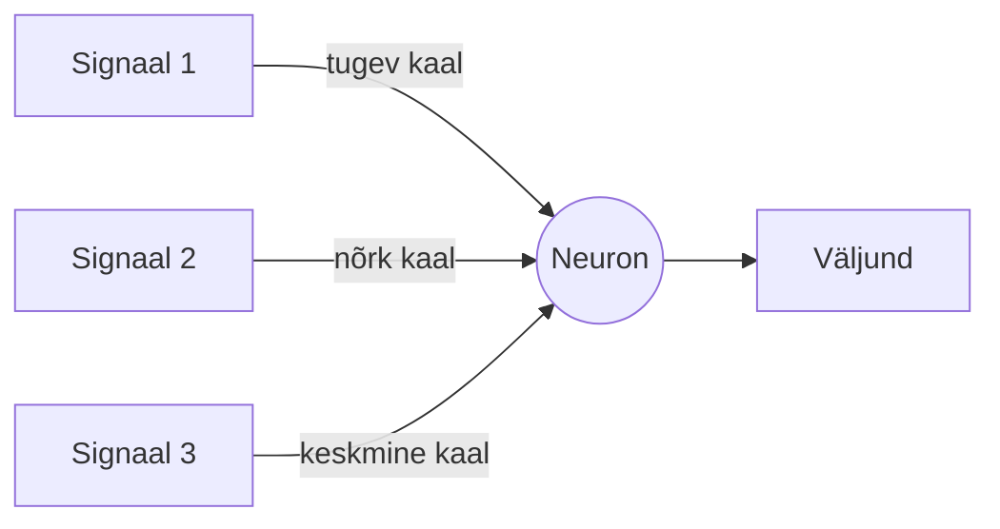
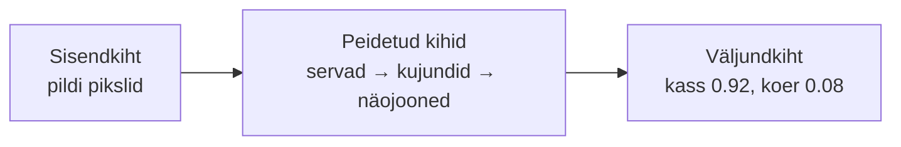
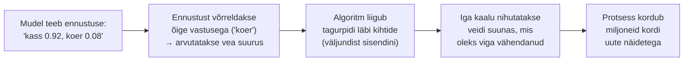

# 2.1 Tehisnärvivõrk

::: tip Selle tunni järel...
- oskad selgitada lihtsate sõnadega, mis on tehisnärvivõrk;
- tunned mõisteid kiht, neuron, kaal;
- oskad nimetada mitu reaalset asja, mille sees tehisnärvivõrk töötab;
- oskad kirjeldada üldjoontes, kuidas mudel oma kaale treenimisel parandab (tagasilevi).
:::

## Mis on tehisnärvivõrk?

Tehisnärvivõrk (*artificial neural network*) on masinõppe mudel, mis on ehitatud aju eeskujul. See koosneb kihtidest väikestest arvutusüksustest, mida nimetatakse **neuroniteks**. Iga neuron saab signaale eelmisest kihist, kaalub need üle ja saadab tulemuse edasi järgmisele kihile.

**Kaal** on lihtsalt arv, mis näitab, kui tugevalt üks signaal järgmist neuronit mõjutab — natuke nagu hääletuse tugevus. Mudeli "õppimine" tähendabki neid kaale järk-järgult paremaks kohandada, nii et lõpptulemus muutuks järjest täpsemaks.

*Tehisnärvivõrgu lihtsustatud skeem: sisendkiht, üks või mitu varjatud kihti ning väljundkiht. Igal joonel on kaal, mida treenimise käigus kohandatakse. Autor: Phlsph7, põhineb Cburnetti joonisel, [Wikimedia Commons](https://commons.wikimedia.org/wiki/File:Artificial_neural_network_colored.svg) (CC BY-SA 3.0 / GFDL).*

::: tip Huvitav fakt
Suurte keelemudelite (nagu GPT) täpset kaalude arvu tootjad tavaliselt ei avalikusta — see loetakse ärisaladuseks. Avalikest hinnangutest teame, et tänased suurimad mudelid sisaldavad tõenäoliselt sadu miljardeid kuni mitu triljonit kaalu ([Wikipedia — GPT-4](https://en.wikipedia.org/wiki/GPT-4)). Ükskõik kumb täpne arv on, tähendab see, et iga üksik vastus on tulemus miljarditest lihtsatest arvutustest.
:::

## Näide: pildil on kass või koer?

- **Sisendkiht** — pildi pikslid.
- **Peidetud kihid** — leiavad kõigepealt servad, siis kujundid, siis näojooned.
- **Väljundkiht** — annab lõpliku hinnangu: "kass 0.92, koer 0.08".

## Kuidas mudel õpib: tagasilevi (backpropagation)

Eelmises näites oletame, et mudel vastas "kass 0.92, koer 0.08", aga pildil oli tegelikult koer. Kust mudel teab, kuidas oma kaale parandada, et järgmine kord täpsem olla?

Selle eest vastutab algoritm nimega **tagasilevi** (*backpropagation*) — sama mehhanism, mis paneb tööle peaaegu kõik tänapäeva tehisnärvivõrgud, sealhulgas suured keelemudelid.

Mehhanism on põhimõtteliselt lihtne, ehkki selle taga on palju arvutusi:

1. **Ennustus** — mudel annab vastuse praeguste kaaludega (nii nagu eelmises näites).
2. **Vea arvutamine** — vastust võrreldakse õige vastusega ja mõõdetakse, kui suur oli viga.
3. **Tagurpidi liikumine** — algoritm liigub väljundkihist sisendkihi suunas ja arvutab iga kaalu jaoks, kui palju just see kaal vea tekkimisele kaasa aitas.
4. **Kaalude nihutamine** — iga kaalu muudetakse pisut suunas, mis oleks selle konkreetse näite peal viga vähendanud.

See tsükkel kordub miljoneid kordi tuhandete või miljardite näidete peal, kuni mudel õpib ennustama piisavalt täpselt. Ükski üksik korrigeerimine ei tee mudelit targaks — mudeli "teadmised" on lihtsalt tulemus tohutust hulgast järjestikustest väikestest kaalude nihutustest.

::: tip Kui tahad põhjalikumalt aru saada
See selgitus jätab teadlikult matemaatika välja. Kui tunned huvi, kuidas tagasilevi täpselt "teab", millises suunas iga kaalu nihutada, on 3Blue1Browni video ["What is backpropagation really doing?"](https://www.3blue1brown.com/lessons/backpropagation) selge ja visuaalne sissejuhatus, ning Michael Nielseni tasuta e-raamatu ["Neural Networks and Deep Learning"](http://neuralnetworksanddeeplearning.com/chap2.html) 2. peatükk läheb veel sammu võrra sügavamale.
:::

## Kus tehisnärvivõrgud igapäevaselt töötavad

Sama põhimõte — signaalid sisse, kihid vahel, otsus välja — töötab paljude tuttavate asjade sees:

| Asi, mida kasutad | Sisend | Väljund |
|---|---|---|
| Rämpsposti filter | e-kirja sõnad | rämpspost või mitte |
| Näotuvastus telefonis | pildi pikslid | "sina" või "mitte sina" |
| Kõnetuvastus (Siri, Google Assistant) | helilaine | tekst |
| Muusika- või videosoovitused | sinu kuulamis-/vaatamisajalugu | järgmine soovitus |

## Viited ja lisalugemine

- [Eesti Vikipeedia — Tehisnärvivõrk](https://et.wikipedia.org/wiki/Tehisn%C3%A4rviv%C3%B5rk)
- [3Blue1Brown — But what is a neural network?](https://www.youtube.com/watch?v=aircAruvnKk)
- [3Blue1Brown — What is backpropagation really doing?](https://www.3blue1brown.com/lessons/backpropagation)
- [Michael Nielsen — Neural Networks and Deep Learning, ptk 2 (How the backpropagation algorithm works)](http://neuralnetworksanddeeplearning.com/chap2.html)
- [Wikipedia — Artificial neural network](https://en.wikipedia.org/wiki/Artificial_neural_network)
- [Wikipedia — Backpropagation](https://en.wikipedia.org/wiki/Backpropagation)
