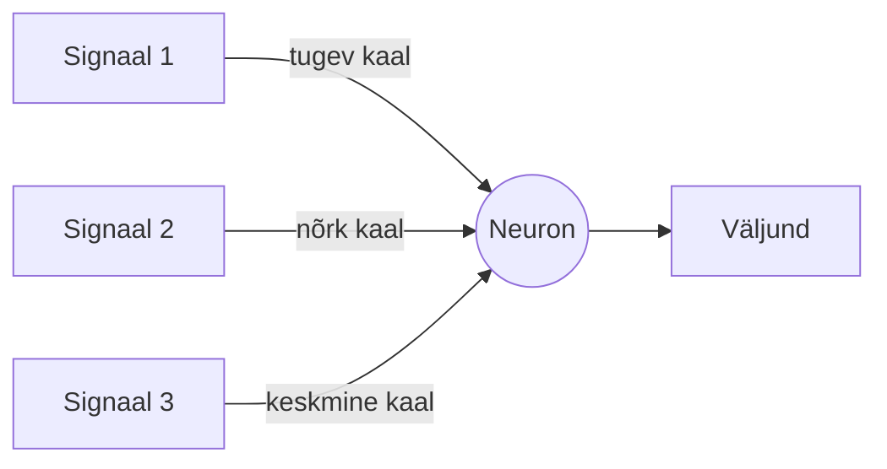
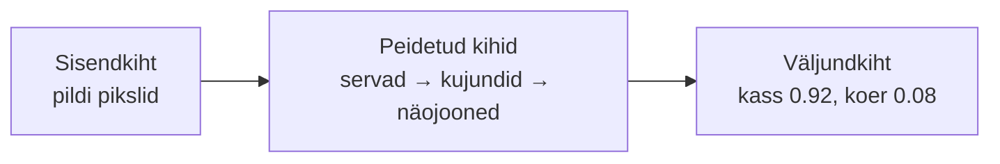

# 2.1 Tehisnärvivõrk

::: tip Selle tunni järel...
- oskad selgitada lihtsate sõnadega, mis on tehisnärvivõrk;
- tunned mõisteid kiht, neuron, kaal;
- oskad nimetada mitu reaalset asja, mille sees tehisnärvivõrk töötab.
:::

## Mis on tehisnärvivõrk?

Tehisnärvivõrk (*artificial neural network*) on masinõppe mudel, mis on ehitatud aju eeskujul. See koosneb kihtidest väikestest arvutusüksustest, mida nimetatakse **neuroniteks**. Iga neuron saab signaale eelmisest kihist, kaalub need üle ja saadab tulemuse edasi järgmisele kihile.

**Kaal** on lihtsalt arv, mis näitab, kui tugevalt üks signaal järgmist neuronit mõjutab — natuke nagu hääletuse tugevus. Mudeli "õppimine" tähendabki neid kaale järk-järgult paremaks kohandada, nii et lõpptulemus muutuks järjest täpsemaks.

*Tehisnärvivõrgu lihtsustatud skeem: sisendkiht, üks või mitu varjatud kihti ning väljundkiht. Igal joonel on kaal, mida treenimise käigus kohandatakse. Autor: Phlsph7, põhineb Cburnetti joonisel, [Wikimedia Commons](https://commons.wikimedia.org/wiki/File:Artificial_neural_network_colored.svg) (CC BY-SA 3.0 / GFDL).*

::: tip Huvitav fakt
Suurte keelemudelite (nagu GPT) täpset kaalude arvu tootjad tavaliselt ei avalikusta — see loetakse ärisaladuseks. Avalikest hinnangutest teame, et tänased suurimad mudelid sisaldavad tõenäoliselt sadu miljardeid kuni mitu triljonit kaalu ([Wikipedia — GPT-4](https://en.wikipedia.org/wiki/GPT-4)). Ükskõik kumb täpne arv on, tähendab see, et iga üksik vastus on tulemus miljarditest lihtsatest arvutustest.
:::

## Näide: pildil on kass või koer?

- **Sisendkiht** — pildi pikslid.
- **Peidetud kihid** — leiavad kõigepealt servad, siis kujundid, siis näojooned.
- **Väljundkiht** — annab lõpliku hinnangu: "kass 0.92, koer 0.08".

## Kus tehisnärvivõrgud igapäevaselt töötavad

Sama põhimõte — signaalid sisse, kihid vahel, otsus välja — töötab paljude tuttavate asjade sees:

| Asi, mida kasutad | Sisend | Väljund |
|---|---|---|
| Rämpsposti filter | e-kirja sõnad | rämpspost või mitte |
| Näotuvastus telefonis | pildi pikslid | "sina" või "mitte sina" |
| Kõnetuvastus (Siri, Google Assistant) | helilaine | tekst |
| Muusika- või videosoovitused | sinu kuulamis-/vaatamisajalugu | järgmine soovitus |

## Viited ja lisalugemine

- [Eesti Vikipeedia — Tehisnärvivõrk](https://et.wikipedia.org/wiki/Tehisn%C3%A4rviv%C3%B5rk)
- [3Blue1Brown — But what is a neural network?](https://www.youtube.com/watch?v=aircAruvnKk)
- [Wikipedia — Artificial neural network](https://en.wikipedia.org/wiki/Artificial_neural_network)
