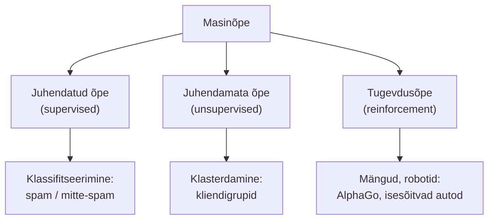
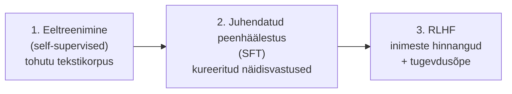

# 2.2 Masinõppe alused

::: tip Selle tunni järel...
- oskad selgitada oma sõnadega, mis on masinõpe (ML);
- tunned kolme peamist tüüpi: juhendatud, juhendamata, tugevdusõpe;
- toed elust näiteid, kus igat tüüpi kasutatakse;
- mõistad, kuidas suured keelemudelid kõiki kolme tüüpi oma treenimise eri etappides kasutavad.
:::

## Mis on masinõpe?

Masinõpe (ML) on tehisintellekti haru, kus arvuti õpib andmetest mustreid, ilma et talle iga reeglit eraldi öeldaks.

Klassikaline programm: sina kirjutad reeglid → arvuti annab vastuse. Masinõpe: sa annad andmed + vastused → arvuti leiab reeglid ise.

::: tip Huvitav fakt
Masinõppe termini võttis 1959. aastal kasutusele Arthur Samuel oma artiklis malemängu (kabe) mängiva programmi kohta, kuid alles ~2012. aastast muutis see valdkonda tegelikult tänu suurele arvutivõimsusele (GPU) ja tohutule andmehulgale ([Wikipedia — Arthur Samuel](https://en.wikipedia.org/wiki/Arthur_Samuel_(computer_scientist))).
:::

## Kolm peamist tüüpi

| Tüüp | Kuidas õpib | Näide elust |
|---|---|---|
| Juhendatud | Andmed + õiged vastused | E-posti filter (spam / mitte-spam) |
| Juhendamata | Ainult andmed, vastused puuduvad | Spotify soovitussüsteem, klientide segmenteerimine |
| Tugevdus | Katse ja eksitus + tasu | AlphaGo, isesõitvad autod, mängude AI |

*AlphaGo õppis go mängima tugevdusõppe abil — miljonite iseendaga mängitud partiide käigus, kus võit andis "tasu". 2016. aastal võitis see maailmameistri Lee Sedoli. Autor: Wesalius, [Wikimedia Commons](https://commons.wikimedia.org/wiki/File:Lee_Sedol_(B)_vs_AlphaGo_(W)_-_Game_1.svg) (CC BY-SA 4.0).*

## Kuidas suured keelemudelid neid kolme tüüpi tegelikult kasutavad

Suur keelemudel (LLM) nagu ChatGPT või Claude ei teki ühe õppimisviisi tulemusena — tema treenimine käib mitmes järjestikuses etapis ja kasutab tegelikult **kõiki kolme** eespool nähtud ML-tüüpi, ainult järjekorras:

1. **Eeltreenimine (pre-training)** — mudelile söödetakse tohutul hulgal internetitekste (veebilehed, raamatud, koodivaramud) ja ta õpib ennustama, milline sõna (täpsemalt: milline [token](./tund-04-tokenid)) peaks järgmisena tulema. Kuna keegi ei ole talle õigeid vastuseid käsitsi ette andnud — tekst ise sisaldab "õiget vastust" (järgmist sõna) —, nimetatakse seda **enesega juhendatud õppeks** (*self-supervised learning*): tehniliselt sarnaneb see juhendatud õppele (mudelil on alati "õige" sihtmärk, mille poole treenida), aga seda sihtmärki ei loonud inimene käsitsi, vaid see tuletatakse tekstist endast.
2. **Juhendatud peenhäälestus (Supervised Fine-Tuning, SFT)** — see on juba otseselt eelmises tabelis nähtud **juhendatud õpe**: mudelile näidatakse konkreetseid näiteid heast küsimusest ja heast vastusest, et ta õpiks vestlema ja juhiseid täitma, mitte ainult teksti jätkama.
3. **RLHF (Reinforcement Learning from Human Feedback)** — see on eespool nähtud **tugevdusõpe**, ainult et "tasu" andjaks pole mängureeglid nagu AlphaGo puhul, vaid inimhindajad: nad võrdlevad kaht mudeli vastust ja märgivad, kumb on parem (kasulikum, täpsem, ohutum). Nende hinnangute põhjal treenitakse "tasumudel", mis omakorda suunab keelemudelit tugevdusõppe abil paremate vastuste poole ([Ouyang jt, 2022](https://arxiv.org/abs/2203.02155); [Bai jt, 2022](https://arxiv.org/abs/2204.05862)).

::: info Miks see selgitab, miks ChatGPT "vestleb", aga vanad mudelid lihtsalt "jätkasid teksti"
Ilma sammudeta 2 ja 3 oskaks mudel ainult teksti ennustada-jätkata — küsimuse "Mis on fotosüntees?" peale võiks ta sama hästi jätkata uue küsimusega, mitte anda vastust. Just SFT ja RLHF õpetavad mudelile ära vestlusliku, abivalmis "isiku", mida me ChatGPT või Claude'iga suheldes kogeme.
:::

## Viited ja lisalugemine

- [Wikipedia — Arthur Samuel (computer scientist)](https://en.wikipedia.org/wiki/Arthur_Samuel_(computer_scientist))
- [Google — Machine Learning Crash Course](https://developers.google.com/machine-learning/crash-course)
- [3Blue1Brown — But what is a neural network?](https://www.youtube.com/watch?v=aircAruvnKk)
- Ouyang, L. jt (2022). ["Training language models to follow instructions with human feedback"](https://arxiv.org/abs/2203.02155) (InstructGPT / OpenAI)
- Bai, Y. jt (2022). ["Training a Helpful and Harmless Assistant with Reinforcement Learning from Human Feedback"](https://arxiv.org/abs/2204.05862) (Anthropic)
